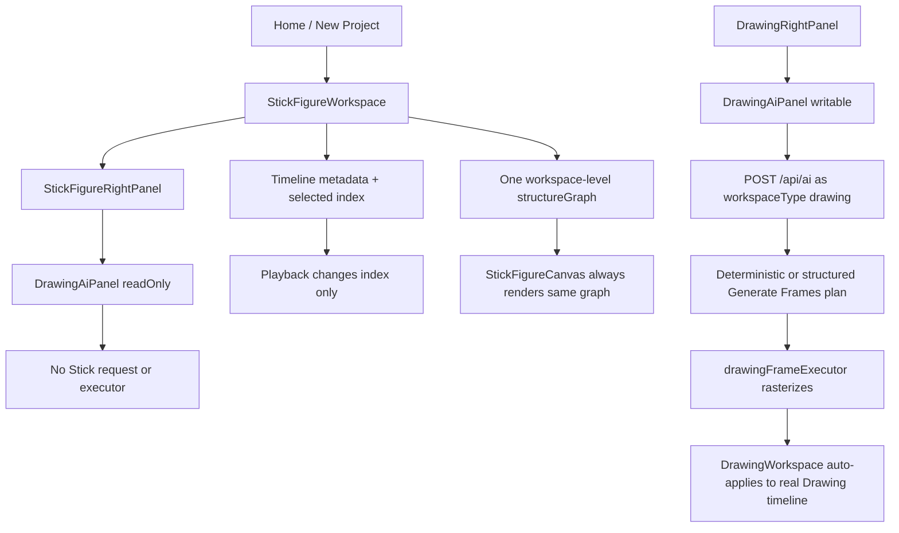
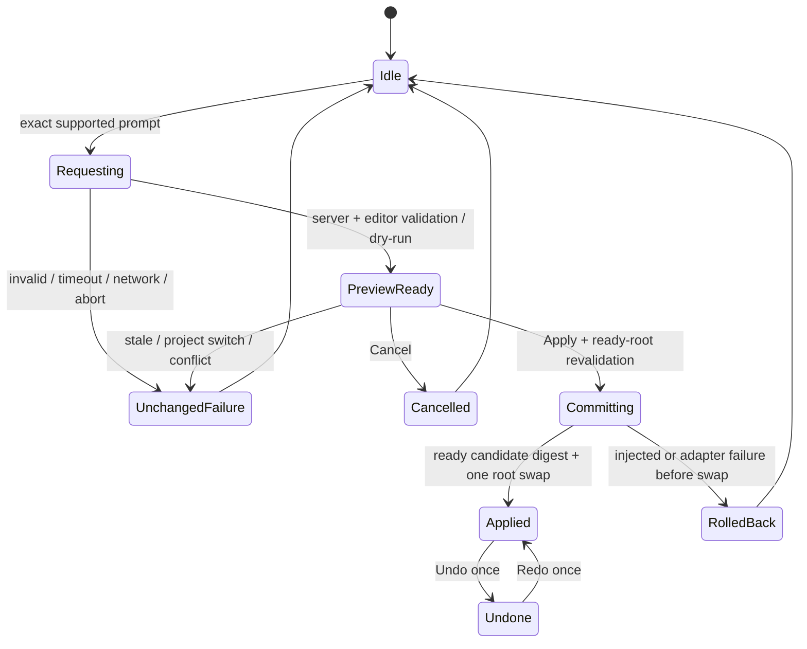
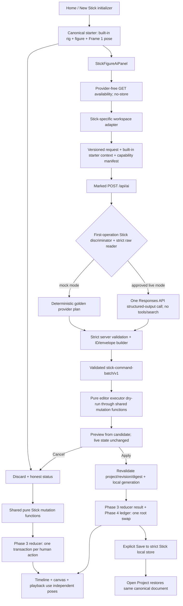

# SPEC-0001 — First Reversible AI-Created Stick Animation from Workspace Chat

Status: Approved
Owner: Arthur
Implementers: one Spec Executor per phase; one Control Plane Architect after accepted implementation
Created: 2026-08-10
Last updated: 2026-08-20
Decision links: accepted SPEC-0001 decision D-0009, permanent role-separation decision D-0010, Phase 1.5 approval decision D-0011, protected-Drawing correction decision D-0012, Phase 2-only authorization decision D-0015, Phase 1.5 compatibility-correction decision D-0016, Phase 2 visible-result correction decision D-0017, Phase 3 Stick onion-skin decision D-0018, Phase 3 authorization decision D-0019, accepted Phase 3 tester-registration/Creator-preservation correction D-0020, separate visible-review rule D-0021, Phase 4 authorization/tester-permission correction D-0022, accepted Phase 4 technical result D-0023, Phase 5 server/mock-boundary authorization D-0024, Phase 5 tester-permission correction D-0025, accepted Phase 5 technical result D-0026, and still-broader pending decisions P-0004, P-0005, P-0007, and P-0008 in `../DECISIONS.md`
TODO IDs: SPEC-001, AI-002, AI-003, AI-004, STICK-001, STICK-002, STICK-004, STICK-005, STICK-008, STICK-009, STICK-010, GIT-022, GIT-023, GIT-024, GIT-025; narrow partial coverage only; STICK-009, STICK-010, and GIT-022 through GIT-025 are complete
Historical runtime research basis: clean `main` at `87a9afb246d4daf33431e7152c03f46a04e166fb`
Proposal integration commit: docs-only `9a2cd373e268cc412cb0fcbea50af11513ef41c5`
Pre-approval revision basis: clean, synchronized `main` at `c6cb52a28090510bcf78767a5c0d9c4af953b477`
Last verified branch/commit: Phase 1 through Phase 4 retain their recorded published commits and proof. D-0024's Phase 5 activation was published at `245ac7e8bceeca76b522ff21c4327fa0219a3805`; D-0025's exact tester-permission correction was published at `a2b4f3e0fc492df9cd63bda32554e382a344cdb6`, which became the Phase 5 implementation parent. The corrected exact 22-path Phase 5 result plus eight reviewed records were published and integrated in commit `9bbcc1df2fe4c79c0947601d0ea6274a85732d85`, parent `a2b4f3e0fc492df9cd63bda32554e382a344cdb6`, message `Implement SPEC-0001 Phase 5 raw Stick dispatch`. Proof-manifest SHA-256 is `f9024a5d86cc1febbac7df3d4219348cd8289d17723406bac5d90929d4cf5c0f`; pre-publication closeout-manifest SHA-256 is `fd71afec8e637bb3736a63dbbe245c6616e14a4330b91f7e354297d96c2c24dd`.

Arthur approved this specification on 2026-08-11. OD-01 through OD-06 and OD-09 are accepted exactly as written; OD-07, OD-08, OD-10, and OD-11 are approved engineering rules/prerequisites; OD-12 through OD-14 remain deferred to the separate Phase 7 Policy Gate. Phase 1, historical Phase 1.5, §10.4A, §10.5A, Phase 3, Phase 4, and Phase 5 are Verified, published, and integrated. Phases 6 and 7, the Phase 7 Policy Gate, and every live/paid/external request remain unauthorized and not started.

On 2026-08-18 Arthur rejected Phase 2's published visible workspace result without rewriting its historical publication. D-0017 approved §10.5A as the sole focused correction, and its authorization was published/integrated in exact canonical-main commit `1f9746a6188e5e13aca1fbd62bea2e1e27bba627`, the correction executor's exact base. Arthur later accepted the visible §10.5A result; its accepted implementation, proof, and control-plane record were published/integrated in exact canonical-main commit `edfb3dea023119b91336e6e5da645d4982a9f068`.

D-0018 fixes real Stick onion skin as part of Phase 3 without changing Drawing onion behavior. D-0019 authorized Phase 3. D-0020 kept that authorization and D-0018 unchanged, added the required versioned tester registration ceiling, superseded the rejected Creator-lock requirements, and made the published §10.5A shell/manual timeline the exact Phase 3 baseline. Phase 3 is now **Verified, published, and integrated** at `3fe3a5487389647b67216e9466121e00f1a73856`. D-0022/D-0023 govern the published Phase 4 result at `71841e96499f7627139c53d87114bba65e19d29d`. D-0024/D-0025 authorized and bounded Phase 5; D-0026 accepted its exact 22-path technical result, now published and integrated at `9bbcc1df2fe4c79c0947601d0ea6274a85732d85`. Phases 6 and 7 remain **Unauthorized; Not started**.

## 1. Exact Goal

**Current Phase 3 interpretation:** the long-horizon AI comparison material below remains historical/future SPEC-0001 context, not a Phase 3 product initializer. The published §10.5A one-blank-cell/empty-canvas editor is authoritative for Phase 3. Phase 3 adds only Undo/Redo, local Save/Open, and D-0018 onion and may not create an automatic figure, wave, or twelve cells.

Recommend and bound the first AI-first Stick Figure Workspace vertical slice so a beginner can create the same simple wave either manually or with workspace chat. The human path obtains the built-in figure without AI, creates the three controlling body positions with visible timeline controls, moves any existing joint, and saves/reopens the real Stick project. The AI path is a faster Preview → Apply accelerator over that same document, mutation authority, timeline, history, renderer, and persistence path; it has no private representation or AI-only editing power.

The exact candidate outcome to approve is:

> In a fresh Stick Figure Workspace, the built-in `humanoid-11-v1` figure is already available on displayed Frame 1 without AI. A human can use visible bounded timeline actions to hold that pose through Frame 4, create and start independent body positions at Frames 5 and 9, hold them through Frames 8 and 12, move any of the figure's 11 joints on any controlling keyframe, and save/reopen the result. Or the user enters: “Create a simple three-pose wave animation with one stick figure at 12 FPS.” The app sends versioned Stick-project context through the server-side AI boundary, receives a validated structured command batch, previews the proposed change without mutating the project, and applies it only after explicit confirmation as one atomic and undoable transaction. Both paths produce equivalent animation content in the same canonical Stick project: three independent key poses at displayed Frames 1, 5, and 9, their held frames, one fixed line-head rule, 12 displayed frames at 12 FPS, normal manual editability, and local save/reopen.

The recommendation is **Preview → Apply**, never auto-apply, for this action. The AI and human tools must read and write one canonical Stick project/timeline/history state through the same mutation functions. Manual construction may create several normal history entries while AI Apply creates one atomic history entry. Their full project bytes are therefore not required to match; their exact animation-content projection must match. A second demo-only animation state or an AI-only figure/keyframe type is forbidden.

Success for SPEC-0001 means only this bounded action works. It does not mean that Diamond Animator can yet understand arbitrary animation prompts or control the whole application, and it does not claim professional-grade animation quality.

## 2. Current Behavior and Evidence

### 2.1 Research method and evidence limits

The original 2026-08-10 audit started from clean `main` at `87a9afb246d4daf33431e7152c03f46a04e166fb`. Before this pre-approval revision, the mandatory control plane and SPEC-0001 were reread in order and the relevant live Stick, Drawing AI, route, storage, gesture, history, project-browser, and OpenAI-helper code was re-inspected at clean, synchronized `main` `c6cb52a28090510bcf78767a5c0d9c4af953b477`. For this 2026-08-11 owner-outcome correction, the required control plane and full spec were reread from the existing nine-file unstaged worktree, the three PM-owned files were hash-protected, and only the current Stick timeline/canvas/joint/Creator/right-panel/rendering sources needed for the correction were freshly re-inspected at the same HEAD. Repository comparison confirms that the proposal integration commit `9a2cd373e268cc412cb0fcbea50af11513ef41c5` and PM publication commit `c6cb52a28090510bcf78767a5c0d9c4af953b477` changed no runtime, API, dependency, configuration, migration, or environment file. The historical runtime findings therefore remain relevant, and the fresh source read is the current evidence.

For the 2026-08-14 Phase 1.5 amendment, the task began on clean synchronized canonical `main` at `2029fd07e14b6f48feb6d04e02dbd52ec683d55d`. The full control plane/spec and only the relevant current routing, layout/font, package/test-tool, Stick/Creator, Drawing Generate Frames, API/provider/search, and memory/network boundaries were reread. D-0010 is therefore current published process, while the absence of a repository-owned browser tester and the remote-font/build-egress risk remain current code evidence.

For the 2026-08-14 protected-Drawing blocker amendment, the canonical checkout was clean synchronized `main`/`origin/main` at `a35a268764c21eedffcf3d82b59718699b62d4d0`. The stopped Phase 1.5 Executor worktree at `/Users/arthurcarlin/.codex/worktrees/feba/stick-animation-app` was inspected read-only. Its 26 authorized dirty implementation paths and ignored failure evidence were not edited. `failure.json` has SHA-256 `53d34094cff90d2864dd2e5bfdb09cb887bb60326806e8a048e13072a6d6422b` and records `Deterministic red-square pixels disappeared when the UI status settled.` No valid current `proof-manifest.json` exists. The current tester reached at least 100 deterministic red Canvas2D pixels before settlement, but stopped before the input-usability/final-settlement assertions; 33 of 37 negative cases had passed before the stop, so neither the golden run nor the four remaining post-success checks are accepted.

That blocker record is retained as history, not current state. After D-0012 was published in canonical `main` at `3768226fd3aa3668a6cf7260da8476ceea0a084e`, temporary diagnostics in the two authorized Drawing files uniquely identified `DrawingCanvas.tsx`'s authoring-canvas width assignment as the first writer clearing the already-applied generated pixels during settlement/resize. The permanent correction remains only in `DrawingCanvas.tsx`: redundant dimension assignments are skipped, and a real resize snapshots and recenters the editable bitmap. All temporary diagnostics were removed, including every temporary `DrawingWorkspace.tsx` byte. The accepted 27-path implementation binding aggregate is `5976fb700175a3cf5a381bd5a89f9fb0e6a2f124a35490a3e9027e0ad0e083a4`. The accepted historical technical proof remains bound to Phase 1.5 implementation base `a35a268764c21eedffcf3d82b59718699b62d4d0`; `output/spec-0001/phase-1.5/proof-manifest.json` has SHA-256 `da2dd8cff32367a548a2e7d2e4e789fcf1a4dd129e9dc6200e25650f586f9fc9` and independently validates.

Fresh canonical-source tracing followed `DrawingAiPanel.revealAssistantMessage` through `onApplyGeneratedFrame`, `DrawingWorkspace.applyGeneratedFrameToWorkspace`, `replaceLayerFrames`, the scheduled `renderWorkspaceCanvases`, `restoreBitmapToCanvas`, the paused-render synchronization effect, and `DrawingCanvas`'s authoring-canvas sizing/reset and committed-bitmap paths. The source proves the intended bitmap is installed in the real Drawing timeline and that the UI settlement occurs only after Apply returns. It also proves that later workspace restores and any canvas width/height assignment can overwrite or clear the visible editable surface. The existing failure evidence does **not** record the canonical frame-bitmap digest, render caller/resolution, canvas identity/dimensions, or first clearing write at the settlement boundary. Therefore one exact causal writer cannot be selected honestly from static evidence alone; Phase 1.5 must diagnose that boundary before patching.

No development server or new browser/app flow was run in this docs-only revision. The stopped Executor's failed browser artifacts are read-only observed evidence, not a new pass and not a valid proof bundle. All other current UI claims below are either **code observed**, explicitly inherited as **live verified on 2026-08-09** from [`CURRENT_STATE.md`](../CURRENT_STATE.md), or labeled unproven.

No OpenAI API request, external or application search, Supabase request, saved-project mutation, deployment, remote write, or new external lookup occurred during this revision. Phase 7 planning arithmetic uses only the official Luna pricing evidence Arthur supplied in the revision request; model availability, exact alias, provider retention, and current pricing still require a separately authorized same-day Phase 7 Policy Gate.

### 2.2 Observed / Intended / Gap / Proof

| Area | Observed current behavior | Intended behavior for this slice | Gap | Required proof |
| --- | --- | --- | --- | --- |
| Stick chat | `StickFigureRightPanel` mounts `DrawingAiPanel` with `readOnly`; it receives no Stick context or executor. | A writable panel visibly labeled and scoped to Stick Figure Workspace. | No writable Stick adapter or capability boundary. | Real-app assertion that the Stick input accepts the exact prompt and the request says `workspaceType: "stick-figure"`. |
| Workspace discriminator | `DrawingAiPanel` hardcodes `workspaceType: "drawing"`; `/api/ai` validates `workspaceType` but uses it only in development logging. | Exact discriminated Stick request and isolated Stick server handler. | The field is metadata, not an orchestration boundary. | Mocked route test proves Stick dispatch while Drawing dispatch remains byte-for-byte compatible. |
| Drawing AI | Generate Frames is the sole enabled Drawing task. Generate Plans, Generate Sounds, and Other are disabled; the default preference still selects disabled Generate Plans. | Leave this availability and its known inconsistency unchanged. | The current Drawing path cannot be reused as a safe Stick executor. | Existing control-preference validator plus Drawing Generate Frames mocked regression flow. |
| Drawing apply semantics | A successful generated-frame plan is rendered and sent to `onApplyGeneratedFrame` immediately; no Preview/Apply transaction exists. | Preview does not mutate; only explicit Apply commits. | Auto-apply and no pending transaction/revision binding. | Canonical project/history/storage bytes are identical before and after preview/cancel/failure. |
| Phase 1.5 protected Drawing settlement | The original corrected tester observed the deterministic bitmap and then its disappearance. D-0012 diagnostics later proved the first clearing writer was `DrawingCanvas.tsx` assigning authoring-canvas width during settlement/resize even though the canonical frame bitmap remained valid. | The generated bitmap remains in the real Drawing timeline and stays visibly rendered after final success, after the textarea and submit become usable, through the second viewport resize, and through stable final screenshots. | Resolved inside D-0012's two-file ceiling with a permanent diff only in `DrawingCanvas.tsx`; temporary `DrawingWorkspace.tsx`/Canvas diagnostics were removed. | The accepted golden proof uses exactly one mocked Drawing POST at `1440x900`, resizes the same isolated context to `1024x768`, and proves final success, usable input, settled pixels, Undo/Redo, Play/Pause, and zero real AI/provider/search/Supabase traffic. |
| Command support | `drawingAiContract.ts` exposes 16 broad action variants; `DrawingWorkspace` implements only save project, export current frame, and attach sound option in the broad executor. Generated frames use a separate callback. | One strict Stick action, fully supported end to end. | Contract breadth exceeds executor truth. | Capability matrix and strict rejection of every other action. |
| Current wave interpretation | The exact candidate prompt resolves through the current Drawing heuristic as a 10-frame `small-animation`, not three explicit poses. | Exactly three key poses at timeline indexes 0, 4, and 8, displayed as Frames 1, 5, and 9, with their held frames completing a 12-frame timeline at 12 FPS. | Drawing plan semantics cannot express or enforce the result. | Pure fixture validator and real playback of three visibly distinct body positions, not 12 independently authored positions. |
| Fresh Stick content | `StickFigureWorkspace` currently starts with one timeline metadata keyframe, an empty `structureGraph`, and no `figures`; the canvas therefore has no built-in editable humanoid. | Home → New → Stick starts with the fixed `humanoid-11-v1` rig/figure and one complete neutral pose on Frame 1, without AI or Creator. | The current proposal also made the starter empty and let only the AI command create the figure. | Real Home → New → Stick proof shows the built-in figure before any AI request and the same figure/rig content projection after manual or AI construction. |
| Current Stick insertion controls | The live context menu sends all three items to `addTimelineFrame`: on an empty slot, **Insert Frame** fills holds from the preceding authored state through the clicked slot; **Insert Keyframe** creates a keyframe metadata cell; **Insert Blank Keyframe** creates the same state-start metadata with `isBlank`. Because pose state is one workspace graph, neither keyframe item currently creates an independent pose, and a blank cell does not blank the rendered graph. On an authored slot, keyframe items splice after it and can change timeline length. | The narrow manual wave path keeps 12 pre-existing frame IDs, renames the required hold action to describe what it does, converts only exact empty Frames 5 and 9 to blank keyframes, and exposes **Start Pose from Previous** to create one complete independent pose before dragging joints. | Current names/state semantics cannot honestly prove manual creation of the same AI result. | Node fixtures plus normal visible browser actions prove the exact bounded state progression, no cell shifting, independent poses, and final content-equivalence digest. |
| Stick timeline | Timeline cells store IDs, cell metadata, `stateId`, blank state, and tween-endpoint metadata, but no pose/rig snapshot. | Each owner keyframe owns a complete independent pose; holds resolve that owner. | Frame selection/playback changes indexes only. | Select/play each pose and compare resolved pose bytes. |
| Stick canvas | `StickFigureWorkspace` owns one `structureGraph` outside timeline layers; `StickFigureCanvas` always renders that graph. | Canvas resolves the selected/playback cell to its owner pose in the canonical project. | Every frame currently displays the same graph. | Visible playback and resolver assertions. |
| Manual correction | Select-tool dragging can target any joint in the shared graph and changes that graph on every pointer move. | One completed drag may target any of the built-in 11 joint roles on a paused nonblank keyframe or held frame; it creates one history transaction against the controlling keyframe and changes only that pose. | No per-pose isolation, held-frame edit resolution, or gesture-coalesced history. | All-11-role fixture matrix plus representative browser edits prove the controlling pose changes, its holds resolve the update, and the other two poses/topology remain byte-identical. |
| Manual/AI equality | No current canonical Stick project exists, and the previous proposal reserved rig/figure/pose creation for the AI command while leaving all required timeline-authoring controls unavailable. | Human controls and AI Apply call the same canonical mutation primitives; AI only batches them. | The previous proposal proved “human can adjust AI output,” not “human can create the same output.” | Phase 1 deterministic manual-action and AI-command fixtures project to byte-identical `StickAnimationContentV1`; Phases 2/3 prove the human flow and Phase 6 compares the mocked AI result with it. |
| Stick head rendering | The Workspace is line-focused but has no canonical built-in pose renderer; its generic joints are circles, the placeholder figure glyph uses a circle head, and the separate Drawing `app/engine/stickRig.ts` helper draws a circle head. Creator shapes are separate and Creator Save is disabled. | The SPEC-0001 built-in figure derives one fixed horizontal 80-stage-unit line centered on the editable `head` joint, using normal body-line style; it stores no head shape. | The canonical pose has a head joint and head-to-neck segment but no exact V1 visible head rule. | Contract vectors plus bundled-browser rendering prove endpoints `head.x - 40` and `head.x + 40`, coherent head/neck movement, no stored shape field, and no circle head. |
| Canvas gesture boundary | Pointer movement currently calls the workspace graph mutator on every move; pointer-up only releases capture, and pointer-cancel follows the same completion path without restoring pre-drag bytes. | Pointer movement is transient; pointer-up emits one completed canonical edit/revision; pointer-cancel restores exact pre-drag bytes and emits no edit/history. | Phase 3 cannot safely wrap the current Canvas callback without Phase 2 first owning the final gesture contract. | Node and bundled-browser digests at pointer-down/move/up/cancel plus callback/revision/history counters. |
| Stick history | Shallow timeline history scaffolding exists, but top-bar undo/redo handlers are no-ops and always disabled; graph edits, FPS, and selection are absent. | AI batch and manual drag are atomic, exact, undoable, and redoable. | No canonical root transaction or complete snapshot. | One Undo removes the whole AI batch; one Redo reproduces exact candidate bytes. |
| Stick persistence | Only Drawing has local project storage. The Open Project Stick tab always shows an empty state; Stick Top Bar has no save callbacks. | Strict, separate, versioned local Stick save/open. | No Stick store, reader, writer, or page ownership. | Isolated-storage save/reopen preserves IDs, poses, FPS, timing, and selected frame. |
| Chat/memory | Chat is mounted-session React state. Drawing compact AI memory can store natural-language fields and auto-sync saved projects through an unauthenticated service-role Supabase route. | Stick transcript stays session-only; no natural-language Stick memory or Supabase in V1. | Reusing Drawing memory would enlarge privacy and security scope. | Storage/network tripwire proves no transcript, prompt, memory route, or Supabase write. |
| API security | `/api/ai` has no repository-level authentication or rate limiting. | Local/controlled feature flag only; public enablement forbidden. | Production exposure is unsafe and outside this slice. | Server flag defaults off; production-mode test rejects live Stick capability. |
| Availability | `/api/ai` exposes `POST` only; Stick uses a read-only Drawing panel, and the client has no safe way to know server-only mode/credential readiness before a submit. | A provider-free, same-origin availability response is presented before submission without exposing mode, environment names, or secrets. | Submit-then-discover-off is not beginner-facing and cannot satisfy pre-submit availability. | Mocked GET contract plus real UI states `checking | available | unavailable | error`; no provider call. |
| Provider policy | Current Drawing AI can search, make recovery/escalation calls, has no end-to-end provider timeout, and logs some raw prompt/output text. | No tools/search; one call; hard budgets; `store: false`; no persistent Stick AI logging. | Current defaults are too broad and retention is not approved. | Provider-injected offline test captures exact request options and redaction tripwires. |
| Verification | TypeScript and four focused offline scripts pass; lint has a known baseline of 6 errors/73 warnings; there is no conventional test/E2E framework. | Every phase has a deterministic validator and a focused real-app stop gate; default gates remain offline/mocked. | Several required failure and browser flows have no current proof. | Phase-specific scripts, isolated browser storage, network tripwire, and explicit pass/fail record. |
| Browser proof infrastructure | Phase 1.5 now supplies the permanent repository-owned `npm run test:spec0001-browser` runner with pinned `playwright-core`, installed local Chrome, isolated storage/profile, fail-closed browser/server/child egress guards, strict versioned plans/evidence, and tester-only hash-bound font responses. `app/layout.tsx` and product font/style bytes remain unchanged. | Keep this tester developer-only and non-routable, rerun all accepted earlier plans for later versioned SPEC-0001 extensions, and preserve the exact Home/New/Stick/Creator plus one-mock/two-viewport Drawing regression. | Temporary `app/__dev` routes remain forbidden; old screenshots alone are not repeatable proof; the runner rejects unlisted dirty paths, external requests, a second Drawing POST, and tester production leaks. | Accepted Phase 1.5 proof binds the schema-valid 49-artifact bundle, complete production scan, byte-identical temporary-setup cleanup, unchanged product source/style, and zero external-request ledger. The §10.4A correction is Verified/published/integrated at `e07268cc80751baba99ac6708a1e8a93d4fc4756`; Phase 2 now has separately accepted 86-action product proof and awaits publication/integration. |

### 2.3 Traced current execution path



Code anchors:

- AI panel and request: `src/components/workspace/ai/DrawingAiPanel.tsx`, `src/components/workspace/ai/WorkspaceAiPanelShell.tsx`, `src/components/workspace/DrawingRightPanel.tsx`, and `src/components/workspace/stickfigure/StickFigureRightPanel.tsx`.
- Drawing orchestration: `src/lib/ai/drawingAiContract.ts`, `drawingAiTaskAvailability.ts`, `drawingAiTaskPipeline.ts`, `drawingAiTaskExecution.ts`, `drawingAiPrompting.ts`, `generateFramesRuntime.ts`, `src/lib/openai/generateAiText.ts`, and `app/api/ai/route.ts`.
- Drawing mutation: `src/lib/ai/drawingFrameExecutor.ts`, `src/components/workspace/DrawingWorkspace.tsx`, and `DrawingCanvas.tsx`.
- Stick state: `src/components/workspace/stickfigure/StickFigureWorkspace.tsx`, `StickFigureTimelineRow.tsx`, `StickFigureCanvas.tsx`, `types.ts`, `StickFigureCreatorWorkspace.tsx`, and `app/engine/stickRig.ts`.
- Persistence/memory: `src/lib/drawingProjectStorage.ts`, `src/lib/ai/drawingAiProjectMemory.ts`, `drawingProjectAiMemorySync.ts`, and `app/api/drawing-project-ai-memory/route.ts`.

`app/engine/stickRig.ts` is not the Stick Workspace model: its fixed `Pose` is currently imported by the Drawing raster executor. SPEC-0001 must leave it unchanged to protect Drawing Generate Frames.

The material function-level trace is:

| Hop | Verified symbol/path | Current behavior |
| --- | --- | --- |
| Drawing panel state | `DrawingAiPanel.tsx:348-365` | `messages` is mounted-component React state; there is no persisted transcript. |
| Drawing submission | `DrawingAiPanel.tsx:1718-1761` | Builds the request and posts to `/api/ai` with `workspaceType: "drawing"`. |
| Drawing frame apply | `DrawingAiPanel.tsx:1413-1461` | `renderGeneratedFrame` resolves the plan and calls `onApplyGeneratedFrame` before the result reveal; there is no explicit transaction preview. |
| Drawing broad actions | `DrawingAiPanel.tsx:1545-1573` | Successful broad action plans are passed to the workspace executor path. |
| Task availability/default | `drawingAiTaskAvailability.ts:5-12`; `drawingAiControlPreferences.ts:15-18` | Only Generate Frames is enabled, while the default selection remains disabled Generate Plans. |
| Route entry/discriminator | `app/api/ai/route.ts:1161-1171,2044,6134-6150` | `workspaceType` is schema-validated and logged, but does not currently select a workspace-specific planner or executor. |
| Drawing planning branches | `app/api/ai/route.ts:4233-4462,4539-4759,5063-5414` | Search, deterministic/structured generation, and recovery are broader than this Stick slice allows. |
| Drawing mutation | `DrawingWorkspace.tsx:7841-8098` | Broad executor supports a small subset; generated frames use the real Drawing timeline callback. |
| Stick canonical gap | `StickFigureWorkspace.tsx:194-225,378-435`; `StickFigureCanvas.tsx:512-564`; `types.ts:4-21` | Timeline selection/playback changes indexes, while one workspace graph remains the rendered pose. |

Line anchors identify the audited starting commit and are evidence pointers, not durable API contracts.

## 3. Root Cause or Missing Foundation

The primary missing foundation is a canonical, versioned Stick editor state that unifies rig identity, independent key-pose snapshots, timeline timing, history, and persistence. Prompting cannot safely bridge this gap.

Six broken links are code verified:

1. **No per-frame content:** Stick timeline cells carry metadata only while one graph lives outside the timeline.
2. **No atomic editor root:** timeline, graph, FPS, selection, history, and IDs are split across React setters and refs, so an all-or-nothing multi-field transaction cannot be proven.
3. **No Stick project boundary:** there is no strict Stick schema or save/open path.
4. **No Stick AI adapter/executor:** the visible panel is a read-only Drawing panel with Drawing-specific context.
5. **No bounded provider policy:** the shared route has broad search/retry/logging behavior and no auth/rate limit; model output is not tied to a project revision or idempotent transaction.
6. **No human-equivalent creation path:** the live starter has no built-in figure, its insertion controls mutate timeline metadata rather than independent poses, and the prior Proposed contract reserved structure/pose creation for AI while disabling the human controls needed to reproduce it.
7. **No permanent automatic browser safety tool:** the repository has no browser-test runner, no server-process egress deny, no production-exclusion proof, and no repeatable evidence path for the visible flows Phase 2 must change.

The correct SPEC-0001 sequence is therefore shared manual/AI contracts → **Phase 1.5 permanent automatic browser tester** → independent pose state plus the minimum visible manual construction path → history/persistence → deterministic AI transaction over the same mutations → server raw/mock boundary → writable mocked chat/UI → feature-flagged provider. Phase 1.5 is an inserted safety phase inside this specification, not a second feature spec. The separate policy gate still lands before Phase 7. Starting with a prompt or writable textarea before a human can build the same content would create another disconnected AI-only demo path and is forbidden.

Pre-approval review found additional specification defects now corrected: wave beats had leaked into canonical pose identity; control copy was false for valid non-wave/empty documents; asynchronous digest generation lacked one coherent publication root/race contract; browser proof did not have a phase-independent exact-anchor exception; server raw dispatch and writable UI were too large for one phase; and post-response cost checks were described too much like preventive caps. The prior owner-outcome correction removed the accidental right-hand privilege and permanent halo, defined held-frame editing, and fixed the V1 head as a derived line rather than a stored or circular shape. This manual/AI-equality correction fixes the remaining product-level gap: the proposal previously let a human correct an AI-created wave but gave only AI the power to create its rig, figure, poses, and timeline. Sections 4, 6, 10–13, and 16 now require the accepted complete human-only construction path and exact content-equivalence proof while keeping the provider decisions OD-12–OD-14 deferred.

## 4. Scope

### 4.1 Authorized product capability

SPEC-0001 may introduce only:

- one permanent repository-owned Phase 1.5 automatic browser tester as development/test infrastructure only; it is never a user capability, route, page, asset, control, or production import;
- one `StickProjectDocumentV1` authored by the same manual and AI editor state;
- one fresh-project eligibility profile for the bounded wave command;
- one fixed humanoid rig, one figure, and one neutral starter pose created by the normal Home → New → Stick project initializer without AI;
- the exact bounded manual construction operations `hold-pose-through`, `insert-blank-keyframe`, `start-pose-from-previous`, and ordinary completed joint edits, all using the canonical editor mutation authority;
- one allowlisted `stick.pose-sequence.create/v1` action;
- exactly three complete independent key poses produced either by the bounded manual operation sequence or by that one AI command over the same starter;
- a wave fixture with three body positions at 12 FPS and exactly 12 timeline frames: keyframes at zero-based indexes 0, 4, and 8 (displayed Frames 1, 5, and 9), each followed by three held frames;
- one exact `StickAnimationContentV1` projection and digest that compare manual and AI animation content while excluding IDs/history/revision differences that do not affect the animation;
- a non-mutating preview with explicit Apply and Cancel;
- one atomic AI transaction with exact Undo/Redo;
- each selected-joint drag targets one existing role in the fixed 11-joint rig, from either a keyframe or a nonblank held frame, and becomes one manual history transaction against the controlling keyframe; repeated edits may target different roles;
- one derived, non-persisted horizontal line head centered on the editable head joint, with no shape controls or permanent joint highlight;
- explicit local Save and Open with strict V1 parsing;
- a session-only Stick chat transcript;
- an offline mocked server path and, only after separate owner approval, one bounded live provider path behind a disabled-by-default flag.

### 4.2 Recommended V1 document model, wave profile, and control disposition

This is a Stick-only schema recommendation. It does not settle the broader Drawing/project coordinate decisions in ARCH-001 or DATA-001. Most importantly, **document validity, bounded manual-wave progression, and AI-command eligibility are three different checks**: a valid V1 Stick document may use a non-wave stage, FPS, timeline length, pose count, blank keyframe, or corrected coordinates even though the manual fixture and one V1 AI action use one exact starter/profile. To keep this spec inside one built-in figure and bounded joint editing, V1 document validity itself is temporarily capped at one `humanoid-11-v1` rig/figure and one layer. Custom topology, additional figures/layers, tween metadata, and general timeline authoring move to later specs rather than being silently implemented here.

#### Canonical Stick document validity

| Concept | Required `StickProjectDocumentV1` fields/invariants | Wave-command constraint |
| --- | --- | --- |
| Document | `schemaVersion: 1`, `projectType: "stick-figure"`, UUID `projectId`, non-negative safe-integer `documentRevision`, title, coordinate space, FPS, ordered `rigs`, `figures`, and `layers` | Eligible input is the exact fresh starter profile below. |
| Coordinate space | Named top-left integer stage; width/height each `1..8192`, x right, y down; pose coordinates are safe integers satisfying `0 <= x < width` and `0 <= y < height` | Exactly `stick-stage-1920x1080-v1`, width 1920, height 1080. |
| FPS | Safe integer `1..55` | Exactly 12. |
| Rig | Zero or one stable `humanoid-11-v1` rig with the exact 11 roles and 10 connections below | Eligible starter already contains that sole rig; the command must preserve it byte-for-byte. |
| Figure | Zero or one stable figure with resolving rig reference and bounded label | Eligible starter already contains exactly one figure labeled `Stick Figure 1`; the command must preserve it. |
| Pose binding | A keyframe holds zero or one complete pose for the sole figure/rig; every rig joint occurs exactly once and every reference resolves. Every existing point is manually editable through the same canonical path regardless of AI, fixture, or reopened origin. | Command materializes the exact three-pose result while preserving the starter pose identity and deriving only the two new pose identities for Frames 5 and 9. |
| Timeline | Exactly one layer with 1..240 ordered cells, stable frame IDs/contiguous indexes, and strict `empty | keyframe | hold` variants; every nonblank hold resolves to an earlier controlling keyframe in that layer. A UI “blank keyframe” is canonically a `keyframe` with `poses: []`, not a fourth cell type. | Starter has one posed keyframe at index 0 and 11 empty cells. Manual controls or the command preserve all 12 frame IDs, then create keyframes at 4/8 and nine holds at 1–3/5–7/9–11. |
| Derived head | No stored head-shape object or style field. When a pose exists, rendering derives one horizontal segment from `(head.x - 40, head.y)` to `(head.x + 40, head.y)` in normal body-line style; the existing `head > neck` rig segment remains the connection | Command and manual edits cannot resize, rotate, restyle, or replace the line head. |
| View/reopen | Separate `StickEditorViewStateV1` with `activeLayerId`, `currentFrameIndex`, and `selectedTimelineIndex`; all references in bounds | Apply preserves current view; Save stores this view beside the document; reopen pauses playback. |
| Volatile/editor workspace | Phase 2 owns the corrected history-free editor state; Phase 3 adds the exact history root, `workspaceGeneration`, publication/digest state, and saved baseline needed for Undo/Redo and local Save/Open. Creator access is presentation/navigation state and is not a root, history, document, digest, storage, or checkpoint field. Phase 4 may wrap the final editor root with request/preview/ledger state without changing Creator availability. | Never sent as provider project data or persisted unless separately stated. |

The complete structural schema is normative; every object rejects unknown keys:

| Type | Exact fields and rules |
| --- | --- |
| `StickProjectDocumentV1` | `{schemaVersion: 1, projectType: "stick-figure", projectId, documentRevision, title, coordinateSpace, fps, rigs, figures, layers}`. `title` is NFC, 1–100 Unicode scalar values. |
| `StickCoordinateSpaceV1` | `{kind: "stick-integer-stage-v1", id, width, height, origin: "top-left", xAxis: "right", yAxis: "down"}`. `id` is NFC ASCII and 1–64 bytes/code units; dimensions are safe integers `1..8192`. |
| `StickRigV1` | `{rigId, templateId: "humanoid-11-v1", joints, segments}`. If present, `joints` and `segments` must equal the exact role order and connection order below; only their validated deterministic IDs vary. |
| `StickJointDefinitionV1` | `{jointId, role}`. `role` is exactly one of the 11 ordered humanoid roles below and occurs once. |
| `StickSegmentDefinitionV1` | `{segmentId, fromJointId, toJointId}`. Endpoints differ and resolve within the same rig; duplicate ordered or reversed endpoint pairs reject. |
| `StickFigureV1` | `{figureId, rigId, label}`. Rig resolves; label is NFC and 1–80 Unicode scalar values. V1 has no transform stack. |
| `StickPoseV1` | `{poseId, figureId, rigId, points}` only. Figure/rig resolve; points contain exactly one `{jointId,x,y}` for every rig joint in rig-joint order. A persisted pose has no wave beat, semantic role, or provider label. Its neutral identity is `poseId`; its presentation/order comes from its owner timeline cell and cell index. |
| `StickTimelineLayerV1` | `{layerId, name, cells}`. Exactly one layer exists; name is NFC and 1–80 Unicode scalar values; cells are ordered by ascending contiguous `index` starting at 0. |
| Empty cell | `{frameId, index, cellType: "empty"}` only. |
| Keyframe owner cell | `{frameId, index, cellType: "keyframe", poses}`; `poses` is empty or contains exactly one complete pose for the sole figure. Empty keyframes are valid documents but are not wave-authored. |
| Hold cell | `{frameId, index, cellType: "hold", ownerFrameId}`; owner resolves to an earlier non-empty keyframe in the same layer. |

`rigs` and `figures` are either both empty or both length one. When present, the sole figure references the sole rig, every posed keyframe references both, and at least one such pose exists. A keyframe with `poses: []` is the exact canonical blank-keyframe state and may have no hold pointing to it until `start-pose-from-previous` installs a complete pose. When rig/figure are absent, every keyframe has `poses: []` and no hold may exist. Layer IDs are unique across `layers` (which has length one); frame IDs are unique across all cells; rig, figure, pose, joint, and segment IDs are each unique across the complete document and cannot be reused by another entity kind. Array order is authoritative: rig joints use the role order below, segments use the connection order below, layers/cells use timeline order, and a keyframe's zero/one pose array needs no secondary sort.

The 11 point roles are ordinary editor joints whenever a pose exists: `head`, `neck`, `hip` (user-facing **body**), `leftElbow`, `leftHand`, `rightElbow`, `rightHand`, `leftKnee`, `leftFoot`, `rightKnee`, and `rightFoot`. Manual edit eligibility depends only on the mounted-ready/paused/cell/pose/gesture guards, never on whether the pose was initialized by New Project, cloned by a manual timeline action, materialized by AI Apply, mounted from a deterministic fixture, or strictly reopened. A fresh Home → New → Stick starter already contains the fixed rig, figure, and one complete neutral Frame 1 pose; no Creator, Add Limb, custom topology, or AI request is required to obtain it.

The normal fresh-project initializer creates `projectId`, `layerId`, all 12 `frameId` values, and the built-in rig/figure/joint/segment/starter-`poseId` values as lowercase RFC 4122 UUID v4 strings through one injected ID source. Manual `start-pose-from-previous` creates its new pose ID through the same injected source. AI Apply preserves every starter identity and deterministically derives only the two new pose IDs for Frames 5 and 9 so preview/idempotency bytes are stable. A reference field accepts only its declared entity's exact ID form. `documentRevision` is a non-negative safe integer; FPS is `1..55`; every coordinate is a finite safe integer in stage bounds.

The exact V1 engineering safety caps are 0..1 rig, 0..1 figure, exactly 1 layer, 1..240 cells, 0..1 pose per keyframe, the fixed 11 joints/10 segments when a rig exists, and 262,144 canonical document bytes. Across the complete document, project/rig/figure/layer/frame/pose/joint/segment IDs are each unique within their own entity kind; an ID reused by a different kind also rejects to avoid ambiguous evidence. These caps make the parser/store/history finite and deliberately exclude multi-character/topology/layer/tween authoring. They may be lowered within the accepted outcome when Phase 1 evidence identifies a safer bound; raising them or changing visible capability requires owner review. Unknown fields, unresolved/duplicate IDs, invalid topology/cells, sparse arrays, out-of-range counts/bytes, and non-canonical values reject without repair.

The V1 humanoid joint order is exactly `head`, `neck`, `hip`, `leftElbow`, `leftHand`, `rightElbow`, `rightHand`, `leftKnee`, `leftFoot`, `rightKnee`, and `rightFoot`. Every valid `humanoid-11-v1` rig—not only command output—must use that exact role order and the following exact ordered connections; the same strings are the derived-ID slot tokens:

1. `segment:head>neck`
2. `segment:neck>hip`
3. `segment:neck>leftElbow`
4. `segment:leftElbow>leftHand`
5. `segment:neck>rightElbow`
6. `segment:rightElbow>rightHand`
7. `segment:hip>leftKnee`
8. `segment:leftKnee>leftFoot`
9. `segment:hip>rightKnee`
10. `segment:rightKnee>rightFoot`

The line head is derived presentation, not an eleventh segment or a twelfth joint. For every rendered pose its exact stage endpoints are `(head.x - 40, head.y)` and `(head.x + 40, head.y)`, for a fixed length of 80 stage units, using the same stroke color, width, cap, opacity, and transform as the body segments. Moving `head` moves both endpoints and the `head > neck` connection in the same completed edit. The derived line has no ID and is excluded from canonical document bytes, hashes, identity derivation, provider output, command data, history deltas beyond the head coordinate, persistence fields, hit targets, resize controls, and shape/style authoring. A circle, square, triangle, pentagon, radius, rotation, selected head shape, or per-pose head-style field is invalid/unsupported in this slice.

The exact wave starter profile `StickWaveStarterV1` is a predicate over a valid document, not a document variant: revision 0; title `Untitled Stick Project`; 1920×1080 coordinate space; 12 FPS; one fixed `humanoid-11-v1` rig; one figure labeled `Stick Figure 1`; one layer; exactly 12 existing cells; one complete neutral pose on the keyframe at index 0; and empty cells at indexes 1–11. The neutral starter points are `head (960,240)`, `neck (960,340)`, `hip (960,620)`, `leftElbow (820,460)`, `leftHand (760,580)`, `rightElbow (1100,460)`, `rightHand (1160,580)`, `leftKnee (900,800)`, `leftFoot (840,980)`, `rightKnee (1020,800)`, and `rightFoot (1080,980)`. The starter is ordinary document content created by New Project; it carries no AI provenance or wave beat.

`StickManualWaveBuildV1` is a predicate over the exact safe manual progression from that starter. It allows ordinary completed joint edits to put Frame 1 into the first raised-arm position, then only these timeline transitions in order: hold the posed Frame 1 through displayed Frame 4; convert the existing empty Frame 5 cell to a canonical blank keyframe; start Frame 5 by deep-cloning the preceding controlling pose with a new pose ID; hold it through Frame 8; convert Frame 9 to a blank keyframe; start it from the preceding pose; and hold it through Frame 12. Ordinary completed joint edits may set any in-bounds point on each posed controlling keyframe between those timing actions. The golden manual sequence sets the right elbow and hand to the exact `ready`, `inward`, and `outward` provider-fixture coordinates while leaving the other nine points fixed. The actions never splice or shift a cell, never replace the fixed rig/figure, and never create a hold whose owner has no pose. A target outside the next allowed transition is unavailable, not silently repaired. This is the complete manual timeline-authoring scope of SPEC-0001; general insertion/removal/resize remains later work.

The exact applied fixture is also a predicate: it preserves the starter project/rig/figure/layer/frame identities and the Frame 1 pose identity; contains three complete neutral canonical key poses at zero-based indexes 0/4/8 (displayed Frames 1/5/9); and contains holds at 1–3/5–7/9–11 (displayed Frames 2–4/6–8/10–12). The wave command maps its command-only ordered beats `ready`, `inward`, and `outward` to those keyframe indexes, but strips that metadata when materializing the document. The 12 timeline frames display three body positions, not 12 independently authored positions. A document with a different valid stage, FPS, 1..240-cell timeline, key-pose count, blank keyframe, or manually corrected coordinates remains a valid `StickProjectDocumentV1` but may be outside both `StickManualWaveBuildV1` and `stick.pose-sequence.create/v1`. A custom limb, second figure/layer, or tween is not silently discarded or repaired; it is later-schema work.

Fresh project/rig/figure/layer/frame/joint/segment/starter-pose IDs use the one injected UUID source. Request/transaction IDs also use lowercase UUID v4. Manual cloned-pose IDs use the injected UUID source. Apply preserves every starter ID and derives only the two new AI pose IDs as `pose_[0-9a-f]{32}` from slots `pose:1` and `pose:2`; each is unique and resolves exactly once. Manual correction of any joint creates no ID. The derived head line has no ID or hash preimage.

`StickAnimationContentV1` is the exact human-versus-AI comparison projection. It contains only `{contentVersion: 1, coordinateSpace, fps, rigTemplate, jointRoleOrder, segmentRolePairs, figureLabel, lineHeadRule: "line-head-80-v1", timeline}`. Each timeline entry is either `{index, cellType: "keyframe", pointsByRole}` or `{index, cellType: "hold", ownerIndex}`; `pointsByRole` follows the 11-role order and stores only `{role,x,y}`. The projection normalizes every entity reference to its role/index and excludes project/title/document revision, every raw entity ID, view state, history entries/depth, workspace instance/generation/publication state, dirty/saved status, timestamps/storage envelope, request/transaction/ledger/chat/provider data, and provenance. `animationContentDigest` is `digestCanonical(StickAnimationContentV1)`.

Content equality means the manual and AI result projections have byte-identical canonical JSON and identical `animationContentDigest`; it does **not** mean their complete documents, revisions, pose IDs, histories, transaction counts, or storage records are byte-identical. Because both projections feed the same renderer and the same held-frame resolver, bundled-browser proof also compares the resolved render-input digest for displayed Frames 1, 5, and 9. This is the exact proof that AI is an accelerator over human-reachable content rather than the owner of a private result.

The authored-document digest covers only `StickProjectDocumentV1`. View state, `workspaceInstanceId`, `workspaceGeneration`, request/preview state, history stacks, transaction ledger, playback, and `lastSavedDocumentDigest` are excluded from its bytes. The ready digest, its status, generation, saved baseline, and history nevertheless live in one exact volatile/editor publication root defined in section 4.7. `dirty` is derived only from a ready current digest as `lastSavedDocumentDigest === null || currentDocumentDigest !== lastSavedDocumentDigest`; Save and every authored action are disabled while the digest state is not ready.

#### Canonical bytes, hashing, and derived identity

All trust-boundary data is parsed into JSON-compatible plain objects, arrays, strings, booleans, `null`, and finite numbers. Parsers reject prototypes other than `Object.prototype`/`null`, accessors, `undefined`, functions, symbols, `BigInt`, sparse arrays/holes, non-finite numbers, and numbers outside their field's domain. V1 schema numbers are safe integers. Canonical number rendering uses ECMAScript decimal JSON number rendering after normalizing negative zero to `0`; schema parsers may still reject `-0` where a field requires a positive or non-negative identity/count value. No value is clamped or repaired at a trust boundary.

Canonical serialization is exact:

1. Every string must be well-formed UTF-16 and NFC. Lone surrogates reject. Except for the explicitly normalized user prompt in section 4.3, trust-boundary strings that are not already NFC reject.
2. Object keys are sorted recursively by raw UTF-16 code-unit order using `<`/`>` comparisons, never locale-sensitive collation. All schema-defined keys are ASCII. Arrays retain their schema-declared order.
3. Keys and string values use the exact escaping produced by ECMAScript `JSON.stringify` for one validated well-formed string. `/` and non-ASCII characters are not additionally escaped. No whitespace, byte-order mark, or trailing newline is emitted.
4. The canonical text is encoded once with `TextEncoder` as UTF-8. Those exact bytes are the canonical bytes.
5. `digestCanonical(value)` awaits `globalThis.crypto.subtle.digest("SHA-256", bytes)` and returns `sha256:` plus 64 lowercase hexadecimal characters, two per digest byte. Client-shared code must not import `node:crypto`.

The derived-content-ID preimage is the exact byte concatenation:

```text
UTF8("diamond-animator/stick-ai-content-id/v1")
+ 0x00 + UTF8(projectId)
+ 0x00 + UTF8(transactionId)
+ 0x00 + UTF8(slot)
```

There is no trailing separator. `projectId`, `transactionId`, and `slot` are NFC ASCII, contain no NUL, and are validated before hashing. Slots are exactly `pose:1` and `pose:2`, corresponding to the two new owner poses at displayed Frames 5 and 9; they do not encode `inward` or `outward`. The result is `pose_` plus the first 32 lowercase hex characters of the raw SHA-256 digest. The existing starter rig, figure, joints, segments, Frame 1 pose, layer, and all 12 frame IDs are preserved and therefore have no AI-derived slot. The server builds the two new pose IDs and the editor recomputes both values.

Phase 1 checks in canonical text, UTF-8 byte-length/hex, full digest, both AI pose-ID preimage hex/full-digest/derived-ID vectors, both manual/AI content projections/digests, and standard empty-string, `abc`, Unicode/NFC, escaped-string, nested-key-order, array-order, and negative-zero vectors. Its Node-only validator independently cross-checks WebCrypto output with `node:crypto.createHash`, while the shared implementation remains WebCrypto-only. Phase 2 must run the same vectors through a bundled browser path and match every byte/digest/ID. Every proof records the exact Node/browser versions and confirms `TextEncoder` and `globalThis.crypto.subtle` availability because the repository does not pin a Node engine.

#### Current Stick control disposition

The document schema can strictly preserve bounded non-wave stage/FPS/timeline-length/pose/correction data without making all wave-command cardinalities permanent document-validity rules. SPEC-0001 does **not** undertake the much larger job of making current structural controls safely rewrite independent poses; those mutation controls remain visible but honestly unavailable from Phase 2 through this slice. No control may silently disappear, remain as an enabled no-op, or mutate outside the canonical document.

“Visible but unavailable” means the control remains visually recognizable, has `aria-disabled="true"` or an equivalent focusable unavailable pattern, cannot dispatch its prior mutation, and exposes the table's explanation through persistent nearby helper text or a keyboard-focusable/hover explanation linked by accessible description. A native disabled control with an unreachable tooltip alone does not pass. “Unchanged” means no new enablement, data write, or capability claim.

Unless a row explicitly says otherwise, its visible-control disposition begins only after a document root is mounted. The bootstrap branch is a status-only shell and renders no document canvas, timeline, sidebar tools, FPS, File actions, AI composer, or Creator entry; it shows only preparation/error text and Retry on digest failure.

| Current control | Disposition after relevant phase | User-visible explanation / rule |
| --- | --- | --- |
| Frame selection, horizontal timeline scroll, Play/Pause/wrap | Enabled whenever a mounted document publication is `ready`, except Play is unavailable while a mounted Open candidate is preparing; selection and playback controls remain visible but unavailable during mounted pending/failed | Ready and no Open candidate: uses the selected/playing pose. During mounted Open preparation the already-paused project remains visible, Play is unavailable, and its accessible explanation is “Finish opening this project before playback.” Otherwise: “Preparing this Stick project…” or the exact digest-failed Retry copy in section 8.7. Horizontal layout scrolling that cannot change selection may remain enabled while mounted. Bootstrap renders no timeline. |
| Timeline panel expand/collapse and panel-height resize | Enabled/unchanged after a document is mounted, including mounted pending/failed | Layout state only; it must not affect document/view bytes. Bootstrap is a status-only shell and renders no document timeline. |
| Layer-row selection | Enabled only for a mounted `ready` document; visible but unavailable during mounted pending/failed | Ready: view state only. Otherwise use the section 8.7 preparation/failure copy; a delayed authored publication must not overwrite a later selection. Bootstrap renders no document row. |
| FPS `1..55` | Visible but temporarily unavailable from Phase 2 through this slice; the wave fixture remains 12 while other valid V1 documents may carry another FPS | For any mounted ready/pending/failed root, read the last fully published document: “FPS editing isn’t available in this Stick project version. Current FPS: {fps}.” Bootstrap has no document/FPS and shows only the section 8.7 preparation/failure copy. |
| `+ Layer`, Remove, layer delete, span resize | Visible but temporarily unavailable from Phase 2 through this slice | “Adding layers, removing frames, and resizing timeline spans aren’t available in this Stick project version.” Undo/Redo becomes the correction path in Phase 3. |
| Current **Insert Frame** | Renamed **Hold Pose Through This Frame** and enabled in Phase 2 only for the next exact empty target in `StickManualWaveBuildV1`: displayed Frame 4, then 8, then 12 | “Keep the previous body position through Frame {target}.” It converts the intervening existing empty cells to holds of the preceding posed keyframe, never inserts/shifts a cell and never creates a pose. Other targets are focusably unavailable with the next-step explanation. |
| Current **Insert Blank Keyframe** | Enabled in Phase 2 only on the existing empty displayed Frame 5, then Frame 9, at the exact allowed build step | “Create an empty body position on Frame {target}.” It converts that existing cell in place to canonical `keyframe` with `poses: []`; the canvas honestly shows no figure until the user starts the pose. It never copies the shared live graph or shifts later cells. |
| Current **Insert Keyframe** | Visible but unavailable in this slice | “For this first wave, use Insert Blank Keyframe, then Start Pose from Previous.” The current metadata-only behavior is not reused or mislabeled as an independent pose. A general duplicate-keyframe shortcut is later work. |
| New **Start Pose from Previous** | Visible/enabled in Phase 2 only when selected displayed Frame 5 or 9 is the exact blank step and the preceding controlling keyframe has one complete pose | “Start this body position from the previous pose.” It deep-clones all 11 coordinates into one new independently editable pose with the same rig/figure references and a new pose ID, then leaves the user on that keyframe. It creates no hold and changes no topology. |
| Select tool, joint selection, one-joint drag | Enabled only for a mounted `ready`, paused document whose selected keyframe or nonblank held frame resolves one complete pose; visible but unavailable during mounted pending/failed or playback | During preparation/failure use section 8.7 copy. For a keyframe: “Drag any joint to adjust this body position.” For a held frame, show the exact 1-based controlling span, for example: “Editing the keyframe used by Frames 1–4.” A drag commits to that controlling keyframe; the held frame remains a real displayed frame and never gains an independent pose. Bootstrap renders no document tools. |
| Add Limb and Clear Canvas | Visible but temporarily unavailable from Phase 2 through this slice | Always: “Adding or removing limbs and clearing authored structure aren’t available in this Stick project version.” Only when the selected nonblank frame resolves a pose, append: “Use Select to move a joint on this body position.” They must never update only one topology copy or act as enabled no-ops. |
| Add Joint, Connect Limb, Remove Limb | Visible but unavailable, matching current incomplete controls | “Not available in this Stick project version.” |
| Lasso, Brush, Eraser, Fill, Text, Knife | Visible but unavailable, matching current scaffold | “Not available in this Stick project version.” |
| Onion toggle | Visible but unavailable until it actually affects Stick rendering | “Onion skin isn’t available in this Stick project version.” A decorative toggle must not imply rendered onion skin. |
| Stick Figure Tools/Properties/Library/Assets tab selectors | Enabled/unchanged after a document is mounted, including mounted pending/failed | They switch panel presentation only and cannot author, change selection, or navigate away. Bootstrap is status-only and renders no document panel. |
| Zoom input, Reset View, wheel zoom, pan mode, background color | Enabled/unchanged after a document is mounted, including mounted pending/failed | View/presentation controls remain outside authored document/history and cannot change frame/layer selection. Bootstrap renders no canvas controls. The current “Show Canvas” On/Off label actually toggles pan mode; renaming it is outside this slice and remains a watchout. |
| Properties faux Fill/Stroke/Opacity/Glow/Thickness/Rounded/Palette controls | Visible but unavailable/unchanged | “Appearance controls are a preview only and don’t edit this Stick project.” No Glow control may imply or create a permanent highlighted joint. |
| Library Stick/Drawing symbol cards | Visible but unavailable/unchanged | “Library items can’t be inserted in this Stick project version.” |
| Assets Import/Backgrounds/Images/Reference/cards | Visible but unavailable/unchanged | “Asset import isn’t available in this Stick project version.” |
| Undo/Redo | Visible but unavailable in Phase 2; enabled in Phase 3 | Phase 2: “Undo and Redo aren’t available in this Stick project version.” Phase 3+: real availability from the transaction stacks. |
| File → Save | Added/enabled in Phase 3 with dirty/saved status | “Unsaved changes” before save; “Saved on this browser” after success. |
| File → Save As | Hidden or visible but unavailable; never enabled | “Save As isn’t available in this Stick project version.” |
| Edit/View/Window/Help menu items that currently have no action | Visible but unavailable if rendered | “This menu action isn’t available in this Stick project version.” No newly enabled no-op. |
| Workspace AI composer and wave suggestion | Read-only/currently unavailable until Phase 6; then conditionally enabled by availability and project eligibility | Before Phase 6: “Stick AI editing isn’t available in this Stick project version.” Afterwards, precise availability copy in section 8.7. |
| Create New Stick Figure / Creator navigation | Preserve the corrected §10.5A control, placement, styling, and navigation behavior. It is present and usable before and after timeline/content edits, Undo, Redo, Save, Open, reload, fixture mount, and failed operations. A currently active atomic publication may temporarily disable unrelated navigation only for that operation's existing safety window; terminal success or failure restores the same Creator access. | No lock state, loss-prevention copy, replacement warning, or Save-before-Creator promise exists. Creator Save/library behavior remains unchanged and is not broadened by SPEC-0001. |
| Creator Back and Creator-local canvas/rig controls | Unchanged and enabled where currently functional | Creator remains separate; Back remounts a fresh Workspace. No continuity or shared-model claim. |
| Creator Save | Visible but unavailable, unchanged | Existing “Save functionality is not implemented yet” behavior remains. |

The rejected Creator lock no longer exists. No `creatorEntryLocked` or equivalent field may be added to canonical/editor/workspace roots, history versions, document/view data, persistence envelopes, fixture wrappers, digests, checkpoints, request state, or proof results. Creator availability is proved through its real visible control and current navigation flow, not inferred from a stored boolean. Atomic-operation guards may prevent an unsafe mid-operation unmount, but editing, Undo/Redo, Save, Open, reload, fixture mount, and every terminal failure leave the corrected §10.5A Creator entry present and usable.

Joint selection feedback is temporary interaction state only: after the user clicks a joint, the renderer may show the normal selected-joint affordance until selection changes, but no role receives an always-on halo, glow, badge, color, larger hit privilege, saved selection marker, or special edit permission. The `rightHand` is special only in the wave planner's generated coordinates, not in manual editing or persistence. Fixture, AI-applied, and reopened poses expose the same 11 joint hit targets and completed-edit path.

#### Accepted intermediate product consequence

The approved publication sequence has a meaningful temporary product cost, but manual/AI equality removes the former AI-only dead zone. Beginning with Phase 2, Add Limb, Clear Canvas, FPS changes, general Insert Keyframe, Remove, layer changes, and arbitrary structural/timing edits remain unavailable so they cannot corrupt the independent-pose model. Phase 2 instead delivers the narrow complete human wave path above: the starter already has the fixed figure, and the user can create exactly the Frames 1/5/9 poses and their holds without AI. The server boundary is not added until Phase 5 and writable Stick chat does not arrive until Phase 6, so Phases 2–5 are a small manual wave editor, not the finished AI-first product or a general Stick editor.

The corrected §10.5A editor is the Phase 3 product baseline: one small blank starting keyframe, empty canvas, compact manual timeline, restored controls, and persistent Creator access. Phase 3 adds only Stick Undo/Redo, local Save/Open, and D-0018 onion skin to that baseline. It does not add an automatic figure, automatic wave, automatic twelve-cell setup, new manual authoring operations, or a redesigned shell.

#### Coordinate alternatives and tradeoffs

| Alternative | Benefit | Cost/risk | Recommendation |
| --- | --- | --- | --- |
| Named integer Stick stages, with the wave fixture fixed at 1920×1080 | Stable canonical bytes and persistence while allowing later valid document sizes | A Stick-local choice that needs migration if global stage architecture differs | **Recommend for V1.** The wave capability alone fixes 1920×1080. |
| Normalized floating point 0–1 | Resolution neutral | Float drift, harder canonical equality, awkward manual coordinates | Reject for V1. |
| Current DOM/stage pixels | Smallest immediate code change | Resize/viewport dependent and unsafe for save/reopen | Reject. |

### 4.3 Exact approved prompt intent and output bounds

The canonical golden fixture remains this 74-byte UTF-8 sentence:

```text
Create a simple three-pose wave animation with one stick figure at 12 FPS.
```

The panel includes one beginner-facing suggestion chip labeled **Create a three-pose wave**. It inserts the canonical sentence into the composer and never submits automatically.

This is a tiny deterministic intent boundary, not broad natural-language support. Both client and server apply the same function:

1. reject ill-formed UTF-16/lone surrogates; `rawPromptBytes` is the UTF-8 byte length of this well-formed decoded string **before** NFC or any other normalization;
2. normalize the string to Unicode NFC;
3. remove leading/trailing runs containing only the exact ASCII set space, tab, carriage return, line feed, or form feed; do not use JavaScript's broader Unicode `trim()` semantics;
4. collapse each remaining run of that same exact ASCII set to one ASCII space;
5. convert only ASCII `A..Z` to lowercase;
6. remove zero or one final `.`, `!`, or `?` only when it is immediately adjacent to `fps`; a space before terminal punctuation, doubled terminal punctuation, or any other occurrence of `.`, `!`, or `?` rejects; the hyphen in `three-pose` is required and is not part of this punctuation set;
7. compare exactly with `create a simple three-pose wave animation with one stick figure at 12 fps`.

The normalized form is used only to decide intent. The server sends the canonical golden sentence—not user capitalization, spacing, or punctuation—to the mock/provider projection. The raw prompt limit remains 128 exact UTF-8 bytes before normalization. Any semantic addition, attachment, prior-turn dependency, different pose count, FPS, figure count, action, prop, background, or other expansion returns `unsupported_prompt` without a mock/provider call or mutation. Fixtures must accept capitalization, the exact ASCII-whitespace set, and one adjacent terminal-punctuation variant independently; they must reject changed words/numbers, space-before-punctuation, internal/doubled punctuation, NBSP and other non-ASCII whitespace at the start, end, or between words, and added clauses.

The sole action also requires a valid document satisfying `StickWaveStarterV1`. An otherwise valid document with a different stage, FPS, rig, figure, layer/cell structure, revision, or authored content returns `unsupported_project_state` before mock/provider invocation; it does not become an invalid Stick document. Undoing the one AI batch restores the exact eligible starter snapshot, but the old transaction remains consumed in the mounted-session ledger.

The provider plan and final command are bounded to:

- exactly one action;
- exactly one pre-existing figure and one pre-existing `humanoid-11-v1` rig, both preserved;
- exactly three complete pose snapshots with 11 coordinates each;
- exactly three owner keyframes and nine holds across indexes 0–11;
- exactly 12 FPS and one second of timeline duration;
- a derived 80-stage-unit horizontal line head centered on the canonical `head` point, with no stored head-shape or style field;
- no tween, interpolation, extra layer, style, arbitrary name, prose, tool call, permanent joint highlight, or unknown field;
- client request body at most 16 KiB, provider-plan JSON at most 8 KiB, and command-envelope JSON at most 32 KiB.

The provider does not invent a body. It returns only `rightElbow` and `rightHand` for three ordered beats. The server owns and injects these nine fixed points into every complete pose: `head (960,240)`, `neck (960,340)`, `hip (960,620)`, `leftElbow (820,460)`, `leftHand (760,580)`, `leftKnee (900,800)`, `leftFoot (840,980)`, `rightKnee (1020,800)`, and `rightFoot (1080,980)`.

The strict semantic validator requires all right-arm coordinates to be integers within x `100..1820` and y `100..980`; squared neck-to-elbow length within `100²..260²`; squared elbow-to-hand length within `80²..240²`; and every hand y within `200..420`. `ready` hand x is `1080..1240`; `inward` hand x is `980..1100` and y `200..380`; `outward` hand x is at least `inward.x + 120`, no greater than `1280`, and y `200..380`. Every pair of right-hand beats must be at least 80 project units apart. The deterministic golden fixture is the reference for visible quality; all nine fixed points must remain byte-identical across poses. Any semantic miss rejects the plan rather than repairing it.

Those wave/body/segment constraints apply only while validating and materializing `stick.pose-sequence.create/v1`. After Apply, canonical/manual pose validation requires resolving identities and complete finite integer coordinates within the document bounds, but does not reimpose the wave gesture, fixed-body, three-pose/12-cell timing, or arm-length constraints. This permits repeated one-joint manual edits through the bounded gesture transaction, including any of the 11 roles, and other bounded non-wave V1 documents without retroactively invalidating the accepted creation command. The derived line-head rule still applies whenever a pose is rendered because it is presentation derived from `head`, not wave semantics.

### 4.4 Versioned contracts and ownership

| Artifact | Version discriminator | Required ownership |
| --- | --- | --- |
| Availability response | `availabilityVersion: 1`, kind `stick-ai-availability` | Server reports only bounded capability readiness and a stable coarse reason; it never exposes credential names/values, exact mode, provider identity, environment names/values, or secrets. |
| Client request | `requestVersion: 1`, kind `stick-ai-request` | Browser creates `requestId`/`transactionId`, includes project ID/revision/digest, manifest, and bounded user prompt. Server re-normalizes it. The adapter separately binds session-only `workspaceInstanceId`/`workspaceGeneration`; neither is serialized. |
| Project context | `contextVersion: 1`, kind `stick-project-context` | Editor derives it from the canonical project; the server validates it but never treats it as authority to mutate. |
| Capability manifest | `manifestVersion: 1`, capability `stick.pose-sequence.create/v1` | Shared code defines the exact allowlist and bounds; client and server manifests must match exactly. |
| Live proof authorization/grant | authorization record v1 plus `grantVersion: 1`, kind `stick-ai-live-proof-grant` | One separately authorized root-invoker run creates one in-memory record and anonymous pipe; one launcher may issue one derived grant over a second anonymous pipe to one PID-bound final child. Invoker, issuer, and server counters are process-local/one-use; no reusable file, HTTP body/header, ordinary environment value, policy fixture, mode, argv, restart, or fork can arm/rearm them. |
| Provider plan | `planVersion: 1`, kind `stick-wave-plan` | OpenAI returns only right-elbow/right-hand coordinates for `ready`, `inward`, and `outward`, plus fixed timing. It chooses no IDs, body points, topology, project fields, or commands. |
| Command envelope | `envelopeVersion: 1`, `commandVersion: 1`, kind `stick-command-batch` | Server wraps a validated plan with browser-owned correlation fields, preserved starter identities, and only two deterministic new pose IDs. Exactly one command is present. |
| Preview result | `resultVersion: 1`, kind `stick-command-result`, status `previewed` | Editor executor dry-runs the envelope against a clone and owns `preStateDigest`, `candidateDigest`, and the bounded preview summary. |
| Apply result | Same result version; `applied | duplicate | rejected | failed | cancelled` | In the final Phase 4 path, the executor requests one transaction; the Phase 3 reducer creates history/authored state, and Phase 4 publishes it with the ledger as one root. |
| Saved project | root `storageVersion: 1`, document `schemaVersion: 1` | Strict local storage adapter owns encoding/decoding; no provider or chat state enters it. |

The capability manifest is exact; all fields are required and unknown fields reject:

```json
{
  "manifestVersion": 1,
  "capabilities": ["stick.pose-sequence.create/v1"],
  "promptIntentVersion": 1,
  "limits": {
    "maxActions": 1,
    "maxRigs": 1,
    "maxFigures": 1,
    "maxTargetLayers": 1,
    "maxKeyPoses": 3,
    "maxTimelineFrames": 12,
    "jointsPerPose": 11,
    "segmentsPerRig": 10,
    "allowedFps": [12],
    "promptBytes": 128,
    "requestBytes": 16384,
    "providerPlanBytes": 8192,
    "commandBytes": 32768,
    "coordinateSpace": "stick-stage-1920x1080-v1",
    "search": "disabled",
    "tools": "disabled"
  }
}
```

The client request is exact; placeholder IDs/digests below stand for values matching their validators:

```json
{
  "kind": "stick-ai-request",
  "requestVersion": 1,
  "requestId": "request-uuid",
  "transactionId": "transaction-uuid",
  "workspaceType": "stick-figure",
  "prompt": "Create a simple three-pose wave animation with one stick figure at 12 FPS.",
  "capabilityManifest": {
    "manifestVersion": 1,
    "capabilities": ["stick.pose-sequence.create/v1"],
    "promptIntentVersion": 1,
    "limits": {
      "maxActions": 1,
      "maxRigs": 1,
      "maxFigures": 1,
      "maxTargetLayers": 1,
      "maxKeyPoses": 3,
      "maxTimelineFrames": 12,
      "jointsPerPose": 11,
      "segmentsPerRig": 10,
      "allowedFps": [12],
      "promptBytes": 128,
      "requestBytes": 16384,
      "providerPlanBytes": 8192,
      "commandBytes": 32768,
      "coordinateSpace": "stick-stage-1920x1080-v1",
      "search": "disabled",
      "tools": "disabled"
    }
  },
  "projectContext": {
    "kind": "stick-project-context",
    "contextVersion": 1,
    "schemaVersion": 1,
    "projectId": "project-uuid",
    "documentRevision": 0,
    "baseDocumentDigest": "sha256:document-hex",
    "workspaceType": "stick-figure",
    "waveStarterEligible": true,
    "coordinateSpace": "stick-stage-1920x1080-v1",
    "fps": 12,
    "activeLayerId": "layer-uuid",
    "layerCount": 1,
    "targetRigId": "rig-uuid",
    "targetFigureId": "figure-uuid",
    "starterPoseId": "pose-uuid",
    "figureCount": 1,
    "authoredPoseCount": 1,
    "timelineFrameCount": 12,
    "emptyCellCount": 11
  }
}
```

The manifest limits are capability constraints for this command, not permanent document-validity limits. The separate V1 document safety caps in section 4.2 are intentionally absent from the provider capability manifest.

Every Stick POST also carries the non-secret transport discriminator `X-Diamond-AI-Workspace: stick-figure`. It is routing metadata, not authentication, and the body discriminator remains mandatory. Header/body disagreement stays in the Stick handler and rejects; it must never fall through to Drawing. The server independently normalizes and validates the request's raw `prompt` under `promptIntentVersion: 1`.

The provider-free availability request is `GET /api/ai` with `X-Diamond-AI-Workspace: stick-figure` and `Accept: application/json`. Its exact no-store response is:

```json
{
  "kind": "stick-ai-availability",
  "availabilityVersion": 1,
  "workspaceType": "stick-figure",
  "capability": "stick.pose-sequence.create/v1",
  "available": true,
  "reasonCode": "available"
}
```

`reasonCode` is exactly `available | capability_disabled | server_not_configured | production_forbidden | temporarily_unavailable`. The schema invariant is `available === true` if and only if `reasonCode === "available"`; every other reason requires `available: false`, and contradictory pairs reject. The HTTP status is `200` for a valid marked availability query even when unavailable, and headers include `Cache-Control: no-store`. An unmarked or differently marked GET returns `405` with no availability body, preserving the current route's absence of a public GET surface for Drawing callers. The client maps only this bounded response to readiness. The coarse `server_not_configured` reason intentionally says that this capability is not configured, but reveals no credential name/value, exact mode, provider identity, environment name/value, or secret. Unknown availability versions/fields fail closed in the client as `temporarily_unavailable`.

The internal server mapping is exact: production always returns `production_forbidden`; development `off` returns `capability_disabled`; development `mock` returns `available`; development `live` returns `available` only when the accepted policy and required server credential are ready **and** the process-local live-proof authority is `armed` with one matching unexpired, PID-bound grant. Missing policy/credential returns `server_not_configured`; absent, expired, mismatched, wrong-PID, or consumed authorization and other transient readiness guards return `temporarily_unavailable`. Process start/restart always initializes the authority as `absent`, even when a supervisor preserves `DIAMOND_STICK_AI_V1_MODE=live`, the key, and policy. Mode/configuration alone can never mint or rearm a grant. Per-project concurrency is not part of this project-free GET; the mounted panel disables its own active request. A same-project POST rejected by the ordinary slot returns `concurrency_conflict`; a POST that arrives after another request consumed the sole live grant returns `temporarily_unavailable`/503. An unknown/invalid configured mode returns `capability_disabled` and cannot fall back to Drawing or a provider. The response does not identify which internal check failed beyond its bounded reason.

`workspaceInstanceId` and `workspaceGeneration` are held only in the adapter binding `{requestId, transactionId, workspaceInstanceId, projectId, documentRevision, baseDocumentDigest, workspaceGeneration}`. Neither is sent to `/api/ai`, the provider, or returned in an envelope/result.

The deterministic golden provider plan is exactly below. A live plan has the identical strict shape/order and may vary only the four right-arm integers per beat within section 4.3 constraints:

```json
{
  "kind": "stick-wave-plan",
  "planVersion": 1,
  "fps": 12,
  "totalFrames": 12,
  "poses": [
    {"beat": "ready", "rightElbow": {"x": 1080, "y": 360}, "rightHand": {"x": 1160, "y": 260}},
    {"beat": "inward", "rightElbow": {"x": 1080, "y": 300}, "rightHand": {"x": 1020, "y": 220}},
    {"beat": "outward", "rightElbow": {"x": 1120, "y": 300}, "rightHand": {"x": 1280, "y": 220}}
  ]
}
```

After domain validation and deterministic ID/body materialization, the exact envelope fields are:

| Object | Required fields |
| --- | --- |
| Envelope | `kind`, `envelopeVersion`, `commandVersion`, `requestId`, `transactionId`, `workspaceType`, `projectId`, `baseDocumentRevision`, `baseDocumentDigest`, `capabilityManifestVersion`, `payloadDigest`, `commands` |
| Sole command | `type: "stick.pose-sequence.create"`, `actionVersion: 1`, `targetLayerId`, `targetRigId`, `targetFigureId`, `keyframeIndexes: [0,4,8]`, `holdFramesPerPose: 4`, the exact 12 preserved frame IDs, and exactly three ordered `poseEntries`; no rig/figure/topology object is accepted |
| Existing rig/figure binding | IDs must equal the eligible starter context and resolve to its exact `humanoid-11-v1` topology and `Stick Figure 1`; command materialization preserves their complete canonical bytes |
| `StickWaveCommandPoseV1` | `{sequenceIndex, beat, ownerFrameIndex, pose}`. The exact tuples are `(0, ready, 0)`, `(1, inward, 4)`, and `(2, outward, 8)` in that order. `beat` and `sequenceIndex` are command-only validation metadata. `pose` is the neutral canonical shape `{poseId,figureId,rigId,points}` with exactly 11 ordered points. Pose 0 must preserve the starter pose ID; poses 1/2 must equal the deterministic `pose:1`/`pose:2` IDs. Materialization writes only `pose` into the owner keyframe and persists no beat/role field. |

`payloadDigest` is `sha256:` plus lowercase SHA-256 of the canonical JSON for the sole command array, including command-only beat metadata. The editor computes `envelopeDigest` over the complete canonical envelope including `payloadDigest`. It recomputes the two new deterministic pose IDs, validates the preserved starter pose/rig/figure/layer/frame identities and exact sequence/beat/owner-index tuple, strips command-only beat metadata when building the candidate document through the same pure mutation functions used by the manual actions, and rejects every mismatch.

Every command result contains all of these fields (nullable where stated):

```json
{
  "kind": "stick-command-result",
  "resultVersion": 1,
  "requestId": "request-uuid",
  "transactionId": "transaction-uuid",
  "projectId": "project-uuid",
  "envelopeDigest": "sha256:envelope-hex",
  "status": "previewed",
  "previousDocumentRevision": 0,
  "resultingDocumentRevision": null,
  "mutationCount": 0,
  "preStateDigest": "sha256:document-hex",
  "candidateDigest": "sha256:candidate-hex",
  "previewSummary": {"figureCount": 1, "keyPoseCount": 3, "fps": 12, "timelineFrameCount": 12, "durationMs": 1000},
  "error": null
}
```

`status` is exactly `previewed | applied | duplicate | rejected | failed | cancelled`, with required nullability:

| Status | `candidateDigest` / `previewSummary` | `resultingDocumentRevision` | `mutationCount` | `error` |
| --- | --- | --- | --- | --- |
| `previewed` | candidate digest / exact bounded summary | `null` | `0` | `null` |
| `applied` | candidate digest / exact bounded summary | applied revision | `1` | `null` |
| `duplicate` | original applied candidate digest / summary | original applied revision | `0` | `null` |
| `rejected | failed | cancelled` | both `null` | `null` | `0` | required `{code,message}` |

`StickAiErrorCodeV1` is the exact enum: `capability_disabled | missing_credentials | temporarily_unavailable | unsupported_prompt | unsupported_project_state | invalid_request | request_too_large | unsupported_version | capability_mismatch | invalid_provider_output | provider_refusal | unsupported_command | timeout | network_failure | aborted | preview_cancelled | stale_document | project_switched | idempotency_conflict | concurrency_conflict | transaction_failed`. `preview_cancelled` is used only for the terminal local Preview → Cancel result; it is not a provider or transport failure. `temporarily_unavailable` is also the stable POST error when an availability check reported ready but the one-use live authority was absent, expired, mismatched, already claimed, or consumed before that POST could claim it. Safe static copy is mapped in section 8.7; raw errors never populate `message`.

Failures before a valid command result use the exact transport envelope `{kind: "stick-ai-error", errorVersion: 1, requestId: string | null, transactionId: string | null, code: StickAiTransportErrorCodeV1, message: string, noChangesMade: true}`, where `StickAiTransportErrorCodeV1` is `StickAiErrorCodeV1` excluding `preview_cancelled`. IDs are `null` when they could not be strictly parsed. HTTP mapping is `400` invalid/unsupported prompt/request/version/manifest, `409` stale/switch/idempotency/concurrency, `413` request too large, `422` invalid provider output/unsupported command, `503` disabled/missing-credential/temporarily-unavailable/network, and `504` server timeout; local user Stop may end client-side without an HTTP result. Unknown versions, fields, actions, IDs, digests, or capability values fail closed.

### 4.5 Adapter choice

| Option | Tradeoff | Decision recommendation |
| --- | --- | --- |
| Make `DrawingAiPanel` generic and rename Drawing contracts repo-wide | Superficially shared UI, but high regression risk across very large Drawing files and preserves Drawing-specific assumptions | Reject for SPEC-0001. |
| Add a narrow `StickFigureAiPanel` and `stickFigureAiWorkspaceAdapter`, reuse `WorkspaceAiPanelShell` presentation only | Small explicit boundary; some temporary duplication until more capabilities justify abstraction | **Recommend.** |
| Put a demo chat/executor beside the project state | Fastest demo, but violates shared timeline/history/persistence requirement | Forbidden. |

### 4.6 Preview, transaction, stale, cancellation, rollback, and idempotency semantics

Phase 2 first proves a single immutable pose update through the atomic document-publication mechanism in section 4.7, without history. Phase 3 then introduces `commitStickEditorTransaction` as the sole authored-state/history mutation reducer from that phase onward for both human edits and later AI commits. The Phase 4 AI executor is a pure validation/dry-run boundary that may submit exactly one fully built, already-digested transaction to that reducer; it is not a second state store or mutation mechanism.

The transaction flow is:

1. Strictly parse the entire envelope's intrinsic shape, versions, IDs, capability, counts, references, coordinates, timeline, and size without comparing its base revision/digest to the current document yet. A structurally invalid envelope rejects before any ledger lookup; no current-state freshness decision occurs in this step.
2. Compute the envelope digest and resolve in this universal order before current-revision checks: mounted-project terminal ledger → matching `committing` active transaction → matching `preview_ready` active transaction → matching `requesting`/unseen transaction. A terminal entry always wins if delivery races the Apply boundary. Matching committing redelivery returns `commit_in_progress`; exact redelivery while its still-active preview is displayed reuses that one `previewed` result/card. A known applied entry returns `duplicate` with the original candidate/resulting revision and mutation count 0 even though its original base is now stale. A known cancelled/rejected/failed entry returns that stored terminal result. Same project/transaction ID with a different digest returns `idempotency_conflict`.
3. Only for an unseen transaction, require a matching active adapter binding and mounted `ready` publication; capture one coherent `{workspaceInstanceId, projectId, documentRevision, currentDocumentDigest, workspaceGeneration}` tuple and validate the envelope's project, base revision/digest, capability, and freshness against it. An unseen envelope with no matching active request rejects and cannot create a preview.
4. Deep-clone/freeze the authored pre-document and build a complete candidate document without touching the published document, view state, history, request UI, or storage.
5. Strictly validate and canonically serialize the candidate, await its WebCrypto digest, and compare it with every supplied/derived digest. No PreviewReady state or preview card may exist until that candidate digest is ready. A rejected or failed digest produces no candidate publication.
6. On Apply, require the workspace publication to still be mounted `ready` and re-check active request/transaction, adapter-local workspace instance, project, base document revision, ready base document digest, adapter-local `workspaceGeneration`, envelope/candidate digests, and capability manifest. Frame selection may have changed; authored content may not.
7. Preserve the **current live** editor view state; use the Phase 3 reducer to build a complete `nextEditorHistoryRoot` whose current version already carries the verified candidate digest. Ordinary product Apply performs one functional composite compare-and-swap directly from the matching `preview_ready` active value to terminal `applied`. The gated proof variant first performs the transaction-state-only `preview_ready → committing` transition defined in section 4.7, then `completeApplyPublication` performs the same final composite swap only from that matching `committing` value. In either form, the final swap preserves the live `lastSavedDocumentDigest`, removes the matching active transaction, appends terminal `applied`, installs document/digest/history, and increments generation. That one final composite-root publication cannot expose the document, history, digest, generation, active state, or terminal ledger separately. No incremental React setter sequence or post-publication hashing is allowed.
8. If any validation, injected failure, abort, or adapter exception occurs before that swap, discard the candidate. If a side effect is ever introduced before the swap, restore the captured pre-snapshot and fail the test; persistence is not such a side effect because Apply never saves.

Transaction rules:

- Preview, rejection, timeout, abort, stale response, project switch, Cancel, conflicting duplicate, and injected failure leave canonical project bytes, history bytes, and localStorage bytes identical to pre-request values.
- Volatile UI/request/preview/ledger state may make its specified lifecycle transition so the app can show an honest message; it is excluded from canonical project/history/storage equality.
- AI availability, submission, preview, Apply, timeout, Stop, stale response, rejection, and cancellation do not create or change any Creator field. Failure fixtures prove the corrected Creator entry remains present and usable after terminal resolution while separately asserting the request/ledger state that legitimately changed.
- Every successful local authored mutation, Undo, Redo, load, or project switch publishes its document/revision, verified ready digest, and incremented session-only `workspaceGeneration` coherently through section 4.7 and invalidates outstanding requests/previews. A digest failure publishes no candidate document and does not increment generation.
- Exact redelivery during PreviewReady reuses the existing preview with no new card, history, or ledger entry. After Apply it returns `duplicate` even if the original base revision is now old. Consumed cancelled/rejected/failed entries return their stored result. Same project/transaction ID with a different digest is `idempotency_conflict` and cannot preview or apply.
- The Phase 4 proof adapter may nonblockingly hold one Apply after candidate/history construction but before the final synchronous compare-and-swap. While that named gate is pending, exact redelivery returns `commit_in_progress` and creates no second work. `completeApplyPublication` then performs the indivisible terminal-ledger/root publication; a queued or subsequent redelivery observes `duplicate`. Browser JavaScript cannot interleave inside that synchronous final swap, so no parallel/hidden scheduler or half-terminal outcome is claimed.
- The ledger stores `applied`, `cancelled`, `rejected`, and `failed` terminal results, holds at most 128 entries per mounted project, and evicts oldest-first after a new terminal entry. Active requests/previews live in the separate registry and cannot be evicted by ledger pruning. Both structures are volatile, never saved, and cleared on reload/unmount. Cross-session replay protection is a later security spec.
- Cancel marks the volatile request consumed and removes the preview. Repeated delivery cannot reopen it.
- One successful Apply increments `documentRevision` exactly once and produces exactly one undo entry. Undo restores the exact pre-Apply editor version and its verified digest; Redo restores the exact candidate version and digest. Each still increments `workspaceGeneration`. Request-generation invalidation prevents revision reuse after Undo from accepting a stale response.
- Editing, requesting, exposing a preview, and applying are disabled whenever the current publication is `pending` or `failed`, or whenever the ready digest's project/revision does not match the current document. Pointer-down and request submission use only the cached ready digest in the same published root; no effect computes a digest after showing a new document.
- Submit and Apply require `isPlaying === false`. Playing shows “Pause playback before requesting or applying an AI change” and makes no request/commit. Apply never silently changes the playback flag.
- A frame selection made while preview is open is permitted: it changes view state only, does not invalidate the document-bound preview, and is preserved by Apply. Any authored mutation invalidates the preview.



### 4.7 Explicit undo/rollback state boundary

Phase 2 owns `StickEditorSnapshotV1` exactly as `{document: StickProjectDocumentV1, viewState: StickEditorViewStateV1}`, `StickEditorVersionV1` exactly as `{snapshot, documentDigest}`, and the history-free `StickEditorCurrentRootV1` exactly as `{current: StickEditorVersionV1}`. A version is valid only when `documentDigest === await digestCanonical(snapshot.document)`. Phase 3 extends that current-root contract to `StickEditorHistoryRootV1` exactly as `{current: StickEditorVersionV1, undo: StickEditorVersionV1[], redo: StickEditorVersionV1[]}`; it does not redefine snapshot/version/digest ownership. The complete document includes:

- project/document schema version, project type, project ID, title, and document revision;
- coordinate-space identifier and dimensions;
- FPS;
- complete rig/template identity, joint identities, and segment identities;
- figure identity and rig reference;
- every layer and every cell ID/type/index/owner reference;
- every pose binding/ID and every joint coordinate.

The one `viewState` field contains active layer ID, current frame index, and selected timeline index; there are no duplicated top-level copies. There is no next-ID counter.

The exact bootstrap, Phase 2, and Phase 3+ volatile/editor roots are:

```ts
type StickBootstrapPublicationV1 =
  | {
      status: "pending";
      operationId: string;
      candidateProjectId: string;
      candidateDocumentRevision: number;
    }
  | {
      status: "failed";
      operationId: string;
      candidateProjectId: string;
      candidateDocumentRevision: number;
      errorCode: "document_digest_failed";
    };

type StickMountedDocumentPublicationV1 =
  | {
      status: "ready";
      operationId: null;
      projectId: string;
      documentRevision: number;
      currentDocumentDigest: string;
    }
  | {
      status: "pending";
      operationId: string;
      baseProjectId: string;
      baseDocumentRevision: number;
      baseDocumentDigest: string;
      baseWorkspaceGeneration: number;
      candidateProjectId: string;
      candidateDocumentRevision: number;
    }
  | {
      status: "failed";
      operationId: string;
      publishedProjectId: string;
      publishedDocumentRevision: number;
      errorCode: "document_digest_failed";
    };

type StickWorkspaceBootstrapRootV1 = {
  rootStatus: "bootstrapping";
  bootstrapSource: "new" | "fixture";
  bootstrapSavedBaseline: "none" | "candidate_document";
  workspaceInstanceId: string;
  editorRoot: null;
  workspaceGeneration: 0;
  documentPublication: StickBootstrapPublicationV1;
  lastSavedDocumentDigest: null;
};

type StickMountedWorkspaceRootV1<
  TEditorRoot extends StickEditorCurrentRootV1
> = {
  rootStatus: "mounted";
  workspaceInstanceId: string;
  editorRoot: TEditorRoot;
  workspaceGeneration: number;
  documentPublication: StickMountedDocumentPublicationV1;
  lastSavedDocumentDigest: string | null;
};

type StickWorkspaceRootPhase2V1 =
  | StickWorkspaceBootstrapRootV1
  | StickMountedWorkspaceRootV1<StickEditorCurrentRootV1>;

type StickWorkspaceRootV1 =
  | StickWorkspaceBootstrapRootV1
  | StickMountedWorkspaceRootV1<StickEditorHistoryRootV1>;
```

`workspaceInstanceId` is a session-only lowercase UUID v4 created for each New/fixture/Open/project-switch mount and is never persisted or sent to the server/provider. The bootstrapping branch has no mounted editor version and renders a status-only shell: preparation/error text and Retry when failed, but no document timeline, canvas, FPS value, authoring, playback, Save, AI, or Creator control. Its invariants are exact: `bootstrapSource: "new"` requires `bootstrapSavedBaseline: "none"`; a checked-in fixture explicitly chooses `none | candidate_document`. On a successful candidate hash, one publication constructs the valid phase-appropriate current/history root and replaces bootstrap with mounted `ready`, retaining the instance ID. New publishes at generation 0 with a null saved baseline; fixture load publishes at generation 1, and its saved baseline is the candidate digest only when `bootstrapSavedBaseline` is `candidate_document`. Bootstrap failure retains its exact source/baseline fields, remains status-only, and Retry reconstructs and hashes only that source candidate; no unverified `current` version ever exists. No bootstrap, fixture, mounted, or failed branch carries a Creator-availability field. Initial Home → Open follows the separate off-root token path below because no Stick workspace/root is mounted on the project browser.

In a mounted `ready` branch, `documentPublication.projectId`, revision, and `currentDocumentDigest` must equal `editorRoot.current.snapshot.document` and `editorRoot.current.documentDigest`. In mounted `pending` or `failed`, `editorRoot.current` remains the last fully published version; it may render for continuity, but every authoring control, Save, AI request, preview exposure, and Apply is unavailable. `dirty` is derived only in mounted `ready`; it is not stored independently. Mounted chat messages, right-panel tab, active tool, hovered joint, playback clock/playing flag, onion toggle, camera pan/zoom, current canvas background, Open-candidate preparation status, Drawing state, storage bytes, and Supabase state remain outside this root.

Phase 4 extends this boundary without moving editor authority:

```ts
type StickActiveTransactionV1 =
  | {
      phase: "requesting";
      requestId: string;
      transactionId: string;
      workspaceInstanceId: string;
      projectId: string;
      baseDocumentRevision: number;
      baseDocumentDigest: string;
      baseWorkspaceGeneration: number;
    }
  | {
      phase: "preview_ready";
      requestId: string;
      transactionId: string;
      workspaceInstanceId: string;
      projectId: string;
      baseDocumentRevision: number;
      baseDocumentDigest: string;
      baseWorkspaceGeneration: number;
      envelopeDigest: string;
      candidateDigest: string;
      previewResultDigest: string;
    }
  | {
      phase: "committing";
      operationId: string;
      requestId: string;
      transactionId: string;
      workspaceInstanceId: string;
      projectId: string;
      baseDocumentRevision: number;
      baseDocumentDigest: string;
      baseWorkspaceGeneration: number;
      envelopeDigest: string;
      candidateDigest: string;
      preparedTransactionPlanDigest: string;
    };

type StickAiWorkspaceRootV1 = {
  workspaceRoot: StickWorkspaceRootV1;
  transactionState: {
    active: StickActiveTransactionV1 | null;
    terminalLedger: StickTerminalLedgerV1;
  };
};
```

`beginApplyPublication` makes one transaction-state-only compare-and-swap from the matching `preview_ready` value to `committing`; the prepared candidate/history plan remains in one frozen operation closure keyed by `operationId`, and `preparedTransactionPlanDigest` binds its canonical descriptor. The operation returns immediately. Lookup order is terminal ledger → matching `committing` → matching `preview_ready` → requesting/unseen. Matching committing redelivery returns `commit_in_progress`; a different envelope digest returns `idempotency_conflict`. `completeApplyPublication` requires the same committing value, base tuple, plan digest, and frozen closure before the final composite compare-and-swap. Success atomically installs the complete workspace root, clears active, and appends terminal `applied`; failure/project switch/stale invalidation clears or replaces the matching active state and records the specified terminal result without publishing candidate/history. No side registry may carry an unbound committing state. A successful Apply publishes the complete workspace root and transaction state once, so the new document/history/digest/generation, removed active transaction, and terminal `applied` ledger entry cannot be observed separately. The ledger, active state, and frozen operation closure remain volatile and are never in editor history or persistence.

Every authored mutation, Undo, and Redo uses the mounted publication state machine:

1. Begin only from a matching mounted `ready` tuple and capture workspace instance ID, project ID, revision, ready digest, generation, plus a unique operation ID. Build and deep-freeze a candidate snapshot/history **plan** without a new `StickEditorVersionV1`; the version/root is not valid until its digest exists.
2. Atomically set only `documentPublication` to `pending`; the last published editor version remains current and all authoring/request/preview/apply entry points lock. The frozen candidate lives only in the operation closure keyed by operation ID.
3. Canonicalize the candidate document and await `globalThis.crypto.subtle` hashing. Only then construct the valid candidate `StickEditorVersionV1` and complete current/history root. For Undo/Redo, recompute and compare the carried history-version digest; do not trust a stored string without proof.
4. In one functional compare-and-swap, require the same operation ID and captured instance/project/revision/digest/generation tuple. On success install the complete candidate editor root, increment `workspaceGeneration` once, set `documentPublication` to matching `ready`, preserve the **live** `lastSavedDocumentDigest` (which an earlier Save may have updated while hashing), and apply request invalidation. A late completion whose token/base tuple no longer matches is a no-op.
5. On hash failure, discard the candidate, keep the last published editor/history/generation byte-identical, and set `documentPublication` to `failed`. A visible Retry recomputes the last published document and may return the same editor root to `ready` without a generation increment, preserving the live saved baseline and Creator navigation behavior. It cannot publish the failed candidate.

```mermaid
stateDiagram-v2
    [*] --> BootstrapPending: initial starter candidate
    BootstrapPending --> Ready: digest ready / New generation 0; fixture generation 1
    BootstrapPending --> BootstrapFailed: digest failure
    BootstrapFailed --> BootstrapPending: Retry rebuilt starter
    Ready --> Pending: authored / Undo / Redo candidate
    Pending --> Ready: matching operation + base tuple / publish atomically
    Pending --> Failed: digest failure / discard candidate
    Failed --> Pending: Retry last published document
    Pending --> Pending: late stale completion / no-op
```



Home → Open owns a separate page-level `StickHomeOpenTokenV1` because no Stick workspace root is mounted on `OpenProjectBrowser`. It captures exactly `{operationId, workspaceInstanceId, candidateProjectId, candidateDocumentRevision}` and remains outside canonical/editor state. The page strictly reads/parses the storage envelope, parses the record/document/view, computes and verifies the document digest, and constructs a complete `StickWorkspaceRootV1` with empty history, mounted `ready`, `workspaceGeneration: 1`, and saved baseline equal to that digest—all before mounting the Workspace. A page-level compare-and-swap requires the same token and Open-browser navigation state, then mounts that one complete root with playback paused and its persisted selection. From Phase 4 onward, the `StickFigureWorkspace` mount initializer wraps that incoming root with `transactionState: {active: null, terminalLedger: []}` in its first exposed composite value; `app/page.tsx` does not acquire Phase 4 transaction ownership. Back/Home, choosing New, unmount, or a newer Open token invalidates the older token; older/out-of-order completion is a no-op. Parse/read/hash failure preserves the exact Home/Open navigation state and storage bytes, mounts no Stick root, and shows the typed Open error. This is the mandatory reopen path in section 6; after success the corrected Creator control remains present and usable.

Open/project switch from an **already mounted** Workspace is prepared outside that mounted publication root under one serialized workspace-event dispatcher. It may begin only from a mounted `ready` root while `isTimelinePlayingRef.current === false`; beginning while playing returns `playback_must_be_paused`, creates no Open token, and changes no root. A valid begin captures the mounted workspace instance/project/revision/digest/generation tuple, installs one volatile `mountedOpenPreparation` token outside the authored/composite root, strictly parses the candidate, and computes/validates its digest. Open preparation itself makes no workspace-root mutation. Play checks the same token and remains unavailable until the active candidate fails, is superseded, is cancelled, or completes; Pause is already true, so no Open path silently pauses playback. Selection-only changes may continue and a successful Open intentionally replaces them with the loaded view; an authored edit may continue but changes revision/generation and therefore makes the final Open tuple stale. Neither path lets Play start.

The final mounted-Open action runs through that same serialized dispatcher and succeeds only when the active Open token, captured workspace instance/project/revision/digest/generation tuple, mounted `ready` publication, and `isTimelinePlayingRef.current === false` still match. Because Play cannot start while the token is active and browser event handlers do not interleave inside the synchronous final compare-and-swap, the successful root installation needs **no playback setter**: playback was already paused and remains paused. The one root swap installs the loaded document/view, a new `workspaceInstanceId`, empty history stacks, matching ready digest, saved baseline, and one generation increment. In Phase 4+, that same swap replaces the complete composite root and clears active request/preview and terminal-ledger state. While paused, rendering uses the newly installed selected index; the old volatile `playbackFrameIndex` is ignored, and the next explicit Play copies the new selected index before its first tick. Creator access is unchanged by the swap.

Parse/hash failure, explicit Open cancellation, or a stale base clears only the matching volatile Open token, leaves the complete **then-current** mounted root byte-identical across that terminal resolution, keeps playback paused, and shows an Open-specific error; no generic `failed` document-publication state is entered. Any earlier selection/authored transition remains exactly as independently published. A paused mounted Open may supersede another mounted-Open token while that candidate is pending; the older completion is a no-op. It cannot start while an authored `documentPublication: "pending"`. The driver/checkpoint proof must observe `playbackState: "paused"`, `playbackControlAvailable: false`, and the matching `mountedOpenOperationDigest` throughout preparation, then `mountedOpenStatus: "idle"` after terminal resolution. Home → Open remains the separate unmounted page-token path: the Workspace is created with playback already false, so it likewise requires no post-mount pause setter.

Selection-only/view-only changes retain document digest and generation. No `useEffect` or second state setter may publish a document before its digest or repair the pairing afterward.

Save captures one mounted ready `{workspaceInstanceId, projectId, document, documentDigest, viewState}` tuple, validates/serializes it, and awaits the exact Phase 3 `StickStorageCommitPortV1` from section 4.9. It creates no Creator or navigation state and leaves Creator usable after both success and failure. Save never changes document/revision/history/generation. The production port performs exactly one synchronous `localStorage.setItem` inside its async `commit` method; the proof port may wait at the frozen pre-commit gate **before** that call, which makes Save/edit and Save/project-switch races executable without pretending a Web Storage call itself is suspendable. After a successful commit, Save sets `lastSavedDocumentDigest` to the captured digest whenever the same workspace instance/project is still mounted, even if an intervening authored generation/current digest now differs; that newer state remains dirty, and Undo back to the actually saved digest becomes clean. A project switch changes `workspaceInstanceId`, so completion cannot modify the new root even though the old project's storage record may have been written. A final authored CAS must preserve a baseline update that completed while its digest was pending. Save failure changes neither prior raw storage bytes nor the saved baseline. Open follows the outside-root candidate/CAS path above.

Render authority is exact: `renderIndex = isPlaying ? playbackFrameIndex : selectedTimelineIndex`. `playbackFrameIndex` is volatile. Play is admitted only when no mounted Open candidate is active, copies `selectedTimelineIndex` into `playbackFrameIndex` before the first tick, and then advances modulo the active layer's validated cell count (12 in the wave fixture). Pause copies its last displayed value into both `currentFrameIndex` and `selectedTimelineIndex`, then sets `isPlaying = false`. Direct selection while paused sets the two view indexes together. Home → Open constructs the Workspace with `isPlaying = false`; mounted Open requires and preserves `isPlaying = false`. In either case paused rendering immediately uses the restored indexes, and the next Play reseeds `playbackFrameIndex`, so Open never needs a second setter to make playback state part of its atomic document claim. Apply preserves the current view indexes. Undo/Redo restore the view snapshot paired with their document snapshot, while session-only `workspaceGeneration` remains monotonic and is never restored.

Each undo and redo stack holds at most 128 editor versions **and** at most 16,777,216 canonical version bytes, where a version's byte size is the UTF-8 length of canonical JSON for its exact `{snapshot,documentDigest}` value. A successful new commit pushes the exact pre-commit version to undo, clears redo, then evicts the oldest undo entries until both limits hold. Undo pushes the current version to redo before preparing the newest undo version for verified publication and applies the same oldest-first pruning to redo; Redo performs the inverse. The current version is never counted in or evicted by a history-stack budget. Project creation/open/switch initializes both stacks empty. Fixtures cover lengths 0, 1, 128, and 129; byte totals just below/at/above 16,777,216; multi-eviction until both bounds hold; redo clearing after a divergent edit; tampered version digests; and exact view/document/digest restoration. This history bound is independent of the Phase 4 transaction-ledger bound.

### 4.8 Minimum manual correction and final gesture boundary

The beginner-facing instruction for any nonblank selected frame is: **“Drag any joint to adjust this body position.”** The timeline uses **keyframe** and **held frame**, not “important frame” and not 12 independent poses. Displayed Frame 1 is the first keyframe and controls held Frames 2–4; Frame 5 controls held Frames 6–8; Frame 9 controls held Frames 10–12. Internal indexes remain 0/4/8 with holds 1–3/5–7/9–11. When a held frame is selected, the visible copy identifies its exact controlling span, for example: **“Editing the keyframe used by Frames 1–4.”** The edit commits to that controlling keyframe; the selected held frame remains a real timeline frame that displays its controlling keyframe's pose and never receives a copied or independent pose.

All 11 existing roles are equally editable: `head`, `neck`, `hip` (shown to beginners as body), both elbows, both hands, both knees, and both feet. The same permission and callback apply in the fresh built-in Frame 1 pose, a manually started pose, after AI Apply, fixture mount, Undo/Redo, and strict local reopen. A selected canonical blank keyframe has no pose/joint until **Start Pose from Previous** succeeds. There is no permanent right-hand halo, glow, badge, or special hit target; only ordinary temporary selection feedback after a user selects a joint is allowed. The line head is not a separate hit target: selecting/moving the `head` joint moves its derived 80-unit line and the `head > neck` connection coherently through the same one-joint edit.

Phase 2 owns the final Canvas gesture contract because Phase 3 is not authorized to redesign `StickFigureCanvas.tsx`:

1. A drag may begin only for `event.isPrimary === true` and `event.button === 0`, with the Select tool active, pan mode off, playback paused, document publication `ready`, a selected keyframe or nonblank held frame resolving a complete pose, and one of that pose's 11 joints hit. Every failed guard is a no-op. A valid pointer-down resolves and captures the controlling keyframe/pose before any movement, reads the one cached ready root, and captures `workspaceInstanceId`, project ID, document revision, current document digest, `workspaceGeneration`, selected display-frame ID/index/cell type, controlling keyframe/frame ID/index, pose/joint IDs and joint role, original canonical joint point, pointer ID, and pointer-to-joint offset in project coordinates, then requests pointer capture. It never starts an asynchronous hash merely to discover the pre-state digest.
2. Client coordinates are converted through the inverse of the rendered stage letterbox: `pointerProject = ((clientX - stageLeft) / renderScale, (clientY - stageTop) / renderScale)`. The candidate joint is `Math.round(pointerProject + capturedOffset)` per axis—ECMAScript `Math.round`, ties toward positive infinity—then clamped inclusively to `[0,width - 1] × [0,height - 1]`. Pointer movement updates only this ephemeral drag-preview point. It creates no canonical document mutation, revision change, completed-edit callback, or history entry.
3. Pointer-up first revalidates that publication is still `ready` and that the captured pointer/workspace instance/project/revision/digest/generation/display-frame-to-controlling-keyframe resolution/pose/joint is still active. Any failed check transitions `active → cancelled`, clears preview, releases capture, preserves exact pre-drag canonical bytes, and emits no callback/revision/history. On success it marks the gesture `committed` before releasing pointer capture, so the resulting `lostpointercapture` is a no-op. It emits exactly one immutable `CompletedStickJointEditV1 {baseWorkspaceInstanceId, projectId, baseRevision, baseWorkspaceGeneration, selectedFrameId, selectedFrameIndex, controllingFrameId, controllingFrameIndex, poseId, jointId, jointRole, from, to, preStateDigest}`. If `from` equals `to`, it marks terminal and emits no edit. A valid changed edit updates only the controlling keyframe's matching pose point, builds a complete candidate, and enters section 4.7's pending digest state; the Phase 2 publisher and Phase 3 wrapper both require the same workspace-instance token and unchanged resolution, and only a successful ready digest causes one atomic canonical-root publication and one revision/generation increment.
4. Pointer-cancel, externally caused lost pointer capture, Escape, tool change, playback start, frame/project switch, or unmount first marks the gesture cancelled and clears the transient preview, then releases capture if held. Canonical state was never changed, so its bytes remain identical to the captured pre-drag state. The path emits no completed edit, commit, revision, or history entry; any later release/lost-capture event is a no-op.
5. Release/cancel completion is guarded by one explicit `active | committed | cancelled` gesture state, so duplicate or reordered browser events cannot emit twice. No React state-setter sequence may partially commit a gesture.
6. The completed-edit callback is directly wrappable by Phase 3's `commitStickEditorTransaction`; Phase 3 adds history around the already complete edit and must not reinterpret pointer movement, coordinates, or cancellation.

The completed Phase 3+ behavior is one completed drag equals one history transaction; Undo restores the prior snapshot/revision and Redo restores the corrected snapshot/revision. Only the controlling keyframe pose changes, every held frame owned by it immediately resolves the updated body position, and the other key poses, topology, identities, timing, FPS, and layer structure remain byte-identical. Editing different joints is allowed as separate transactions; this is direct coordinate editing, not inverse kinematics or a multi-joint transform. Adding/removing joints, changing topology, head-shape authoring, constraints, and multi-joint transforms are later work.

Deterministic gesture fixtures cover all 11 roles on both keyframe and held-frame selections; every pointer-down guard; display-frame/control-owner mismatch; publication pending/failed/mismatched-digest guards; non-zero stage offsets and letterbox scales; half-unit rounding; captured pointer-to-joint offset; movement with 0/1/many pointer-move events; same-point release; out-of-bounds pointer preview clamped before completion; pointer-up followed by lost capture; pointer-cancel followed by lost capture; externally caused lost capture; Escape; tool/play/frame/project/unmount invalidation; duplicate/reordered release; and stale workspace-instance/revision/digest/generation before release, including an old callback after remounting the same project/revision tuple. Head fixtures assert the derived line endpoints and head-to-neck connection before/transient/after/cancel. Highlight fixtures assert no role-specific always-on presentation and no persisted selection marker. Every case records pre-drag, transient, pending, and post-event canonical bytes/digests plus publication/gesture state, selected display/control frame IDs, preview point, completed-edit/revision/generation/history, ready-document-publication, and workspace-root-transition counters. Phase 2's browser stop gate must prove pointer movement leaves canonical bytes and digest equal to pre-drag, pointer-up exposes no new document before the candidate digest is ready and then publishes the golden corrected bytes/digest exactly once, a failed/stale digest publishes no new ready document, and every cancellation path finishes with the exact pre-drag bytes/digest and zero callback/revision/history change.

### 4.9 Local persistence, chat, and memory boundaries

Recommended storage key: `da_saved_stick_projects_v1`, separate from `da_saved_drawing_projects`. The exact strict storage envelope is:

```json
{
  "storageVersion": 1,
  "projects": [
    {
      "recordVersion": 1,
      "projectId": "project-uuid",
      "createdAt": "2026-08-10T00:00:00.000Z",
      "updatedAt": "2026-08-10T00:00:00.000Z",
      "document": {"schemaVersion": 1, "projectType": "stick-figure"},
      "reopenState": {"activeLayerId": "layer-uuid", "currentFrameIndex": 4, "selectedTimelineIndex": 4}
    }
  ]
}
```

The abbreviated `document` above stands for the complete strict `StickProjectDocumentV1`; no document field is optional. Each record project ID must match its document. UTC timestamps must be canonical ISO strings, are outside document/history/digests, and come from the injected clock. Records sort by `updatedAt` descending with `projectId` lexicographic as the tie-breaker; duplicate project IDs reject. The V1 envelope accepts at most 32 project records and its complete canonical UTF-8 serialization must be at most 4,194,304 bytes. A Save that would exceed either engineering cap returns `storage_limit_exceeded` before `setItem`, preserves the previous raw bytes, and leaves editor/saved status unchanged. Those caps are local-storage safety defaults, not product claims about future project limits.

- An absent storage key decodes in memory as the valid empty envelope `{storageVersion: 1, projects: []}` but is not written until explicit Save. An existing empty string, invalid JSON, or invalid envelope is corrupt—not equivalent to an absent key.
- Save is explicit; Apply does not autosave.
- First Save inserts one record. Later Save for the same project ID replaces that record, preserves `createdAt`, sets `updatedAt` from the injected clock, and never creates a duplicate. Save As is not in V1 and must be hidden or visibly unavailable, never an enabled no-op.
- Save/reopen preserves canonical document content, IDs, revision, FPS/timing, and reopen selection.
- Session metadata initializes a new unsaved project with `lastSavedDocumentDigest: null` and `dirty: true`. A successful Save sets it to the saved document digest and makes `dirty: false`; a failed Save changes neither it nor editor state. A successful initial Home → Open strictly parses and hashes the complete root/record under `StickHomeOpenTokenV1`, then mounts one already-ready root at generation 1 with `lastSavedDocumentDigest` equal to the loaded digest and `dirty: false`; a mounted Open/project switch uses section 4.7's other off-root candidate/compare-and-swap path.
- History stacks, chat, preview, request state, idempotency ledger, playback-running state, camera, tool, and panel state do not survive reopen.
- Unsupported/corrupt root or project data is reported and its prior raw storage bytes are preserved. It must not be treated as an empty collection and overwritten.
- Quota/write failure preserves both the current editor state and all prior storage bytes and shows an honest message.
- Save fully validates and canonical-serializes the next in-memory envelope, then passes exact immutable `{storageKey, previousRawBytes, nextRawBytes}` to `StickStorageCommitPortV1.commit(...): Promise<Result<void, StickStorageErrorCodeV1>>`. The production adapter has no delay/retry: its async method performs exactly one synchronous `localStorage.setItem(storageKey, nextRawBytes)` and resolves. The injected browser-proof adapter may await exactly one `stick_storage_before_commit` gate before delegating to that same one-call adapter; it cannot alter bytes, write directly, or delay after `setItem`. This explicit async seam—not a monkeypatch that suspends Web Storage—drives delayed Save/edit/project-switch proof. Raw-byte preservation on write failure relies on the Web Storage atomic-failure contract: injected tests model a conforming pre-commit throw with no mutation, plus independent synchronous `getItem`/read failures. A non-conforming storage implementation that mutates and then throws is outside this guarantee and must not be described as recoverable.
- No prompt, transcript, free-form project summary, compact semantic memory, remote memory, or Supabase sync is stored in SPEC-0001.
- No AI provenance is persisted in V1. A future provenance/audit spec may propose structured transaction/version/digest fields.

`StickStorageErrorCodeV1` is exactly `corrupt_storage | unsupported_storage_version | invalid_saved_project | project_not_found | storage_read_failed | storage_limit_exceeded | quota_exceeded | storage_write_failed`. `storage_read_failed` means `getItem` threw before a root could be inspected; `storage_limit_exceeded` is the deterministic record/byte cap; `quota_exceeded` is a conforming browser quota exception. Storage APIs return a typed `Result` with safe static copy and never reuse an AI/provider error.

The persistent status copy is exact:

- new or edited project: **Unsaved changes**;
- successful explicit Save/Open: **Saved on this browser**;
- failed Save: **Save failed — your changes are still unsaved.**;
- disclosure beside the successful status and Open Project entry: **Saved only in this browser. This version does not cloud-sync, appear on another device, or automatically recover after data is cleared or lost.**

### 4.10 Command capability and support matrix

| Capability/action | Current status | SPEC-0001 status | Preview | Apply/undo | Notes |
| --- | --- | --- | --- | --- | --- |
| New Stick project with built-in `humanoid-11-v1` | Current timeline starts with metadata only; graph/figure are empty | Required manual and AI starter | No preview; normal New Project action | Normal editor publication/history rules | Same rig/figure/line-head rule for both paths; no Creator or AI required. |
| Manual `hold-pose-through`, `insert-blank-keyframe`, `start-pose-from-previous`, and joint drag | Current insertion controls mutate metadata around one shared graph | Required only for the exact `StickManualWaveBuildV1` progression | Direct visible human actions | Each completed action is one normal transaction from Phase 3 | Produces Frames 1/5/9 poses and holds without AI; arbitrary insertion/removal/resize is not enabled. |
| `stick.pose-sequence.create/v1` | Absent | Sole approved Stick **AI** capability | Required | Required, atomic | Targets the same existing figure/starter and composes the same mutation functions into one transaction. |
| Stick revise pose via AI | Absent | Unsupported | No | No | Human may move any existing joint through the normal one-joint-per-drag editor path; AI revision remains unsupported. |
| Stick multi-character/props/background/camera/sound/tween/export | Absent | Unsupported | No | No | Later specs. |
| Drawing Generate Frames | Enabled, hybrid, auto-applies | Existing behavior protected and unchanged | Existing behavior unchanged | Existing behavior unchanged | No broad migration in this spec. |
| Drawing Generate Plans | Disabled, default preference selects it | Remains disabled | N/A | No | AI-001 later. |
| Drawing Generate Sounds | Disabled | Remains disabled | N/A | No | Later spec. |
| Drawing Other / broad action union | Disabled; only three broad executor actions implemented | Remains disabled/unmodified | N/A | No new support | AI-002 remains open beyond the narrow row above. |

## 5. Non-Goals

- General-purpose arbitrary AI application control.
- Any Stick AI action other than `stick.pose-sequence.create/v1` for the exact approved golden prompt boundary.
- Multi-character scenes.
- Twelve unique body positions, smoother hand motion, additional keyframes, automatic in-betweens, motion frames, interpolation, tweening, or general frame-by-frame authoring.
- Props, swords, symbols, fire, backgrounds, camera animation, sound, voice, or export.
- Long-form continuity or multi-turn planning.
- Full professional manual editor, keyframes/timing beyond the exact `StickManualWaveBuildV1` steps, arbitrary removal/resize, rigging suite, inverse kinematics, constraints, reusable poses, or topology editing.
- Broad Drawing Workspace redesign or changing Drawing Generate Frames apply semantics.
- Repo-wide renaming/generalization of Drawing AI types, panels, contracts, prompting, runtime, or executor.
- Enabling Generate Plans, Generate Sounds, or Other.
- External search, file search, web grounding, MCP, tools, retrieval, embeddings, or RAG.
- Remote Supabase memory, cloud persistence, cloud sync, collaboration, or autosave/recovery.
- Billing, credits, public deployment, authentication, ownership enforcement, or production rate limiting.
- Custom LLM, fine-tuning, embeddings, RAG, dataset creation, or training pipeline.
- Broad prompt/reference-library rewrite or reuse of the Drawing training/example libraries.
- Incidental cleanup or decomposition of large AI/editor files.
- Creator Save/library integration, Creator-authored figures in this flow, custom rigs/topology, or claiming the separate Creator and Workspace share a complete model.
- Circle or selectable/resizable/rotatable/restylable head shapes; the only V1 head presentation is the fixed derived line.
- Multiple Stick figures or layers.
- Solving the global Drawing/Stick coordinate, migration, export, or fidelity architecture.
- Claiming professional-grade animation quality from this infrastructure slice.
- Modifying or adopting `app/engine/stickRig.ts` as Stick Workspace state; it remains protected Drawing-renderer input.

## 6. Canonical User Flow

### Human path — no AI

1. Choose **Home → New Project → Stick Figure Animation**. The fixed built-in figure is already visible on displayed Frame 1; no Creator or AI request is needed.
2. On displayed Frame 1, use **Select** to drag the right elbow and hand into the first raised-arm position. The deterministic acceptance flow uses the exact golden `ready` coordinates. Then right-click displayed Frame 4 and choose **Hold Pose Through This Frame**. Frames 2–4 become holds of Frame 1.
3. Right-click displayed Frame 5 and choose **Insert Blank Keyframe**. The canvas is honestly empty on that frame. Choose **Start Pose from Previous** to clone Frame 1 into a new independent Frame 5 body position, then drag the right elbow and hand into the inward wave position.
4. Right-click displayed Frame 8 and choose **Hold Pose Through This Frame**. Frames 6–8 hold Frame 5.
5. Right-click displayed Frame 9 and choose **Insert Blank Keyframe**, choose **Start Pose from Previous**, then drag the right elbow and hand into the outward wave position.
6. Right-click displayed Frame 12 and choose **Hold Pose Through This Frame**. Frames 10–12 hold Frame 9. The user may also adjust any of the 11 joints on Frame 1, 5, or 9; a held-frame edit resolves its controlling keyframe.
7. Choose **Play**, confirm the three body positions, pause, choose **File → Save**, hard-reload to Home, then choose **Open Project → Stick Figure → the saved project** and play it again.

The deterministic golden manual fixture uses those exact visible actions and exact joint coordinates. The real browser flow proves the controls and independent body positions; the fixture proves the pixel-relevant coordinates exactly. No AI panel, route, mock, provider, search, or Supabase request participates.

### AI path — same editor, faster batch

1. Choose **Home → New Project → Stick Figure Animation**; the same built-in figure/starter is visible.
2. Choose **Create a three-pose wave** or enter the approved sentence, then submit.
3. Inspect the three-position/12-frame preview. Choose **Apply**; do not auto-apply.
4. Choose **Play**, pause, select any controlling keyframe or hold, and drag any joint to prove the AI-created positions are ordinary editable poses.
5. Choose **File → Save**, hard-reload to Home, choose **Open Project → Stick Figure → the saved project**, and play again.

### Deterministic manual/AI equality

Phase 1 runs `manual-wave-actions.json` and `wave-command-batch.json` from the same `fresh-stick-project.json`. Their complete documents may differ in revision count, pose IDs, and history shape because the human performs several actions while AI Apply is one transaction. Both results must project to byte-identical `StickAnimationContentV1`, the same `animationContentDigest`, and the same bundled-browser render-input digests for displayed Frames 1, 5, and 9. Any difference in rig template, figure label, line-head rule, joint coordinates, keyframe indexes, hold owner indexes, FPS, timeline length, or rendered pose input fails equality.

### Comprehensive mocked AI, failure, persistence, and regression flow

This is the mandatory end-to-end AI acceptance flow after the separate human path has passed. Steps 4–16 use the deterministic mocked provider in the default gate; Phase 7 may repeat one request live only after explicit cost/privacy authorization. Steps 17–18 are a composite failure requirement: user-reachable actions/messages use normal visible UI, exact raw-byte route cases use guarded HTTP, internal publication/transaction cases use the applicable versioned owning-phase tester extension, and exhaustive parser/reducer matrices remain Node-only as allocated in section 10.1. No channel may be claimed as another.

1. Start the app through the Verified Phase 1.5 permanent automatic browser tester with a new isolated browser context and empty storage for both `da_saved_stick_projects_v1` and the existing Drawing key. Its client and tested-process guard must fail any non-loopback request.
2. Choose Home → New Project → Stick Figure Animation.
3. Confirm the right sidebar is visibly labeled “Stick Figure Workspace,” shows the **Create a three-pose wave** suggestion, does not show Drawing task choices, and completes one provider-free no-store availability `GET /api/ai`. The composer and suggestion remain disabled while checking and whenever capability or project eligibility is unavailable; only the bounded readiness reason is exposed, never a credential name/value, exact mode, provider identity, environment name/value, or secret.
4. Choose the suggestion and confirm it fills the canonical golden sentence without submitting. Submit the canonical sentence; separately prove one allowed capitalization/exact-ASCII-whitespace/adjacent-terminal-punctuation variant maps to the same intent and does not widen semantics.
5. Assert exactly one `POST /api/ai` for the submission, with `X-Diamond-AI-Workspace: stick-figure`, body `workspaceType: "stick-figure"`, request/context/manifest version 1, the current project ID/revision, a request ID, a transaction ID, and search/tools disabled. The earlier availability GET is not a provider request. Assert no search, Supabase, provider, or other remote request in mock mode.
6. Return one mocked, strictly valid `stick-command-batch` and show a preview summarizing one figure, three key poses, 12 FPS, 12 frames/1 second, with Apply and Cancel.
7. Before Apply, compare canonical project, history, and storage bytes with their pre-request values; all must be identical. Switching timeline frames must still show the original built-in starter state.
8. Choose Apply once.
9. Assert the real Stick project/timeline still contains the same starter rig/figure/frame identities, now has three independent owner keyframes at 0/4/8 and nine valid holds, and revision incremented once. Assert exactly one undo entry.
10. Choose Play and visibly confirm three distinct body positions: displayed Frame 1 keyframe held through Frames 2–4, Frame 5 keyframe held through Frames 6–8, and Frame 9 keyframe held through Frames 10–12. Confirm the timeline wraps after Frame 12 at 12 FPS, and pause. This is three authored positions, not 12.
11. Choose Undo once and confirm the complete AI pose/timing batch disappears while the original built-in rig/figure/Frame 1 neutral pose and 11 empty cells are restored exactly.
12. Choose Redo once and confirm exact candidate digest, IDs, poses, FPS, timeline, and selection are restored.
13. On displayed Frame 5, select and drag one arm joint. During movement, assert the canonical digest/revision/history are unchanged; release once and assert exactly one completed edit/revision/history entry. Then select a held frame in that span (displayed Frame 6, 7, or 8), confirm the copy says **“Editing the keyframe used by Frames 5–8.”**, and drag a different kind of joint such as `head`, `neck`/body, knee, or foot. Assert that this second release is its own single completed edit/history entry. No joint has an always-on halo or glow; only ordinary temporary selected-joint feedback may appear after click.
14. Switch among all 12 displayed frames. Confirm both edits affect only the Frame 5 controlling keyframe and are visible on held Frames 6–8; keyframes at Frames 1 and 9 and their holds remain byte-identical to their pre-correction values. For a head edit, confirm the fixed 80-unit horizontal line head and the head-to-neck connection move coherently, with no circle or stored shape. Use Undo/Redo to prove each one-joint transaction reverses and restores exactly, then finish with both edits redone before Save.
15. Confirm **Unsaved changes**, choose File → Save, then confirm **Saved on this browser** and the local-only/no-cloud/no-cross-device/no-auto-recovery disclosure. Hard-reload `/` to remount at Home without entering Creator, then choose Open Project → Stick Figure → the saved project.
16. Confirm rig/figure/pose/frame identities, both corrected joint roles and coordinates, the derived line-head position through its `head` joint, 12 FPS, keyframe/held-frame ownership/timing, selected/current frame behavior, **Saved on this browser**, and visible playback survive reopen; playback begins paused and then renders the same three body positions.
17. In isolated reruns, inject prompt NBSP/space-before-punctuation/semantic expansions; captured invalid UTF-8, BOM, syntactically invalid JSON, and duplicate keys; valid JSON with each recognized Stick marker but an invalid Stick schema; marker-free Drawing JSON; whitespace-padded/multibyte oversized requests; extra fields, unsupported version/command, excessive counts, foreign IDs, invalid coordinates, timeout, network failure, abort, stale revision, duplicate identical/conflicting response, project switch, wrong/old workspace instance, Home-Open Back/newer-token/out-of-order completion, every gesture-cancel path, storage read/corruption/limit/quota failure, and failures after candidate/history construction but before root swap.
18. For every failure, assert an honest scoped message, zero partial content, byte-identical canonical project/history/storage pre-state, and no unhandled browser error. Exact redelivery while preview is open reuses one preview; after successful Apply it returns `duplicate` with the original candidate/revision and adds no mutation/history entry.
19. Protect the corrected §10.5A Home → New → Stick empty-canvas/manual-timeline flow, Stick → Creator → Back before and after edits and local operations, Home → Open Drawing project, and the existing Drawing Generate Frames request/render/apply path. No Creator lock or replacement copy may appear; the Creator Save button remains in its existing unimplemented state.
20. Run all default gates with OpenAI live mode off, search disabled, Supabase blocked, and every non-loopback request treated as test failure.

## 7. Execution Path

### 7.1 Approved execution path



In the completed Phase 3+ architecture there is one mutation authority: `commitStickEditorTransaction`, used by manual and AI-authored edits. The bounded timeline controls and AI executor also share the same pure document mutation functions. A human action commits one transaction at a time; the Phase 4 executor validates/dry-runs a composition of the same mutations and submits the finished batch as one transaction. The initializer, UI, route, mock provider, live provider, preview renderer, and persistence adapter cannot bypass that authority or create an AI-only rig, pose, frame, or renderer input.

### 7.2 Request/response lifecycle and stale protection

```mermaid
sequenceDiagram
    participant U as User
    participant P as StickFigureAiPanel
    participant A as Stick adapter
    participant R as /api/ai Stick boundary
    participant V as Provider or mock
    participant X as Stick transaction executor
    participant S as Canonical editor state

    P->>R: GET bounded Stick availability
    R-->>P: available / stable unavailable reason
    U->>P: Submit normalized bounded intent
    P->>A: capture workspace instance, projectId, revision, digest, local generation
    A->>R: marked POST request v1 + manifest v1
    R->>V: minimized structured-output input
    V-->>R: untrusted plan v1
    R-->>A: validated command envelope v1
    A->>X: dry-run immutable envelope
    X-->>P: preview + pre/candidate digests
    Note over S: No state/history/storage mutation
    U->>P: Apply
    P->>X: apply same envelope/digest
    X->>X: duplicate-first check; then revision/digest/local generation
    X->>S: swap one AI root containing Phase 3 reducer result
    S-->>P: applied result v1
```

### 7.3 Error/result ownership

| Layer | May decide | Must not do |
| --- | --- | --- |
| Panel | Display availability, accept the bounded normalized intent, request Apply/Cancel, show honest messages | Parse provider output as trusted, mutate project, persist transcript |
| Workspace adapter | Capture current identifiers/generation, abort/invalidate, call executor | Construct ad hoc project mutations or reuse Drawing context |
| `/api/ai` Stick dispatcher | Validate body/size/version/manifest, choose off/mock/live mode, enforce budget | Let Stick intent fall through to Drawing, enable search, mutate editor |
| Provider planner | Propose three bounded right-arm coordinate pairs under strict schema | Choose body coordinates, IDs, revisions, capabilities, storage, commands, or tools |
| Server command builder | Validate provider plan, preserve starter IDs, derive only two new pose IDs, and wrap correlation fields | Create/replace topology or treat structured-output conformance as domain validation |
| Phase 4 AI executor | Validate all invariants, dry-run, idempotency/stale checks, submit one transaction | Mutate React state directly, own manual history, call OpenAI/search/Supabase, or save |
| Phase 3 editor reducer | Commit all manual/AI authored changes and exact Undo/Redo as one composite root | Interpret prompts, parse provider output, call a remote or persist automatically |
| Storage adapter | Strictly encode/decode explicit saves | Repair unknown data, overwrite corrupt raw data, store chat/provider output |

### 7.4 Raw request ownership and fail-closed dispatch

The existing Drawing POST starts Drawing logging state before `req.json()` and later can classify/search/log a prompt. Therefore Stick detection must be the first operation inside `POST`, before any Drawing variable, log scope, classifier, search, or helper is initialized. It operates on `request.clone()` and leaves the original `Request` unread for marker-free Drawing fallthrough.

Every legitimate V1 Stick request has the exact non-secret header `X-Diamond-AI-Workspace: stick-figure`. The early classifier also recognizes only these decoded JSON paths: root `kind: "stick-ai-request"`; root `workspaceType: "stick-figure"`; `projectContext.kind: "stick-project-context"`; `projectContext.workspaceType: "stick-figure"`; or exact capability value `stick.pose-sequence.create/v1` in root `capabilityManifest.capabilities`. It never searches prompt/history strings or arbitrary nested values, and it never treats a generic `stick.` substring as intent.

The cloned-body reader preserves one transient discriminated result. `rawBytes` and `rawUtf8ByteLength` are always present after the clone is read; `rawText` is present only after fatal UTF-8 decode succeeds; `parsedValue` is present only after the entire strict JSON object parses successfully. A decode/parse failure therefore carries no invented `rawText`/`parsedValue`, while scanner evidence may separately record only the enum/path of a recognized marker—not the raw value:

1. `rawBytes` is the exact `Uint8Array` from the clone's complete `arrayBuffer`; `rawUtf8ByteLength` is `rawBytes.byteLength`.
2. Decode once with `new TextDecoder("utf-8", {fatal: true})`; invalid UTF-8 and a leading UTF-8 BOM are strict-reader failures. On success the exact decoded string is `rawText`; no trim or normalization occurs at envelope level.
3. A local dependency-free strict JSON scanner/parser tracks object paths, decoded keys, and any fully parsed recognized marker even if a later token makes the document invalid. It rejects duplicate decoded keys at every object depth (including escape-equivalent keys such as `workspaceType` and `\u0077orkspaceType`) and never chooses a first/last duplicate value. After detecting a duplicate it continues in non-materializing evidence-only mode through every subsequently well-formed token, so a recognized exact-path Stick marker in either duplicate value/order or later object member is captured; a later unrecoverable syntax error preserves only markers fully parsed before that error. Only a complete duplicate-free parse returns `parsedValue`. It rejects non-JSON lexical extensions, trailing data, sparse constructs, and non-object roots. `JSON.parse` alone or a reviver is insufficient because it cannot detect duplicates or retain this evidence.
4. Unknown fields are a later schema-strictness failure. Here “strict JSON” means both lexical/syntax strictness and duplicate-key rejection; “strict Stick schema” additionally means exact versions/fields/types/domain bounds.

The 16,384-byte request limit is explicitly a **post-read Stick-contract validation limit**, not a true allocation or denial-of-service bound: this V1 dispatcher clones and buffers the complete same-origin request before comparing `rawUtf8ByteLength`. A header-marked request applies the limit immediately after read. Without the header, the strict scanner first determines whether a valid exact body marker exists; the Stick limit then applies only to that captured request. Marker-free valid JSON remains subject only to the unchanged Drawing path's rules, so this change cannot impose a new Drawing body limit. `Content-Length` may reject an obviously oversized header-marked request early but is never trusted to accept one. Production live mode remains forbidden. A later endpoint-security spec must add a platform/proxy body cap or bounded stream before public exposure; SPEC-0001 must not claim this buffer eliminates allocation risk.

Dispatch outcomes are exact:

1. Syntactically invalid/invalid-UTF-8/BOM/duplicate-key JSON with the Stick header is a scoped Stick `invalid_request` (or `request_too_large` when exact bytes exceed the limit), bypasses Drawing entirely, and logs no raw content. An unheadered syntax/duplicate failure for which the evidence scanner proves one exact body-marker path is also captured and rejected as Stick. Header/body mismatch is a Stick rejection.
2. Syntactically valid JSON containing any recognized exact body marker is captured by the Stick handler even if its header is missing or its Stick schema/version is invalid. It fails closed; it never falls through.
3. Marker-free syntactically valid JSON leaves the original request unread and continues unchanged to the legacy Drawing path and its existing `req.json()` behavior.
4. Unheadered invalid UTF-8/BOM or syntactically invalid/duplicate JSON for which the evidence scanner proves no exact marker has no authoritative Stick intent and continues with the original unread Request into the unchanged Drawing `req.json()` path. SPEC-0001 makes no new promise about whether that legacy path accepts or rejects those bytes (including duplicate-key last-value behavior). Such a body is not a conforming Stick request; every Stick client/fixture must carry the header. The implementation must never guess intent with substring/regex matching. Fatal UTF-8/BOM/duplicate rejection is guaranteed only for captured Stick requests, not asserted as a new lexical rule for unmarked Drawing traffic.

Fixtures include exact-limit and +1 byte bodies, ASCII whitespace padding, multibyte padding whose character count is below but byte count exceeds 16, invalid UTF-8, BOM, root/nested duplicate keys, escape-equivalent duplicates with the Stick marker first and last, an unrelated duplicate before a later Stick marker, header/body mismatch, every exact body marker, an unheadered marker fully parsed before a later syntax error, syntax failure before any marker, marker-like strings inside `prompt`, marker-free valid Drawing JSON, unmarked duplicate JSON with no marker, and unmarked invalid JSON. For every captured failure, counters for Drawing logging/classification/search/provider work remain zero; unmarked no-marker cases assert only that the original Request reaches the legacy Drawing parser.

The raw tuple exists only for the synchronous Stick dispatch lifetime. It is not returned to the client, included in an error, logged, cached, persisted, placed in a proof bundle, or retained after the handler returns.

## 8. Data, AI, Cost, Security, and Privacy Impact

### 8.1 Schema/version/migration impact

- New Stick-only project/document, request/context/manifest, provider-plan, command-envelope, result, history, and storage V1 schemas are required.
- There is no persisted Stick schema to migrate. Existing ephemeral Stick state is not durable and may be initialized into the new V1 editor state at mount.
- Drawing project storage version/key and Drawing AI contracts remain unchanged.
- Unknown future versions return typed `unsupported_version`; no forward-compatible field stripping is allowed.
- A future schema requires an explicit migration function and a later spec. SPEC-0001 authorizes only V1-to-V1 round trips.

### 8.2 Exact client-to-server fields

The browser sends only the request shape in section 4.4: kind/version, request ID, transaction ID, exact workspace discriminator, bounded user prompt, capability manifest, and compact starter-eligibility context. It sends no transcript, project title, user identity, email, bitmap, image, audio, asset, free-form memory, Drawing context, camera, browser storage, or prior provider output. The server independently normalizes intent and sends only the canonical golden prompt to a provider.

### 8.3 Exact fields sent to OpenAI

Phases 1–6 do not select a model and do not depend on provider pricing or retention. In Phase 7, after a same-day owner-reviewed `StickAiProviderPolicyV1` fixture exists, the provider receives exactly this Responses API object. `STICK_WAVE_PLAN_V1_SCHEMA` is the strict schema for the exact provider-plan shape in section 4.4, with every property required and `additionalProperties: false` at every object level:

```ts
{
  model: approvedPolicy.model,
  input: canonicalJson({
    kind: "stick-wave-input",
    inputVersion: 1,
    prompt: "Create a simple three-pose wave animation with one stick figure at 12 FPS.",
    context: {
      contextVersion: 1,
      workspaceType: "stick-figure",
      waveStarterEligible: true,
      coordinateSpace: {
        id: "stick-stage-1920x1080-v1",
        width: 1920,
        height: 1080,
        origin: "top-left",
        xAxis: "right",
        yAxis: "down"
      },
      fps: 12,
      timelineFrameCount: 12,
      layerCount: 1,
      rigTemplate: "humanoid-11-v1",
      figureCount: 1,
      authoredPoseCount: 1,
      emptyCellCount: 11
    }
  }),
  instructions: STICK_WAVE_INSTRUCTIONS_V1,
  reasoning: approvedPolicy.reasoning,
  max_output_tokens: approvedPolicy.maxOutputTokens,
  text: {
    verbosity: "low",
    format: {
      type: "json_schema",
      name: "stick_wave_plan_v1",
      schema: STICK_WAVE_PLAN_V1_SCHEMA,
      strict: true
    }
  },
  store: false
}
```

The future policy fixture is strict, checked in only during an authorized Phase 7 at `scripts/fixtures/stick-ai/v1/phase7-provider-policy.json`, and validated by the exact schema `scripts/fixtures/stick-ai/v1/phase7-provider-policy.schema.json`. It contains exactly: `policyVersion`, `reviewedAt`, immutable `model`, `reasoning`, `maxProviderPayloadBytes`, `maxReportedInputTokens`, `maxOutputTokens`, `maxProviderPlanBytes`, `maxProviderCalls: 1`, `maxTransportAttempts: 1`, `maxRetries: 0`, `timeoutMs`, `latencyTargetMs`, `maxConcurrentPerProject: 1`, `searchCalls: 0`, `tools: []`, `costExposureDecision`, `postResponseAuditMaxUsd`, `pricingEvidence`, `providerRetentionDecision`, `liveAuthorizationMechanism: "anonymous-pipe-one-use-live-authorization-v1"`, and `liveProofTransport: "script" | "browser" | "none"`. The transport choice and policy are **not** authorization to arm or call. `costExposureDecision` is a strict discriminated union: either `{kind: "pre_call_bound", mechanism: "pinned_offline_tokenizer" | "accepted_conservative_byte_formula", mechanismVersion, maxEstimatedInputTokens, maxPreflightEstimatedUsd, contingencyBasis}` with every mechanism artifact/formula and price input named by `pricingEvidence`, or `{kind: "residual_overage_risk_accepted", planningExposureUsd, acceptanceDecisionId}` referring to Arthur's separately recorded acceptance. The second form does not claim a guaranteed cap. `reasoning` is the exact object `{effort: "none"}` in the provisional policy; if the chosen alias does not accept it, the same-day packet must propose one exact replacement and obtain Arthur's acceptance rather than silently changing/omitting it. This initial approval does not create or accept the Phase 7 policy fixture. Unknown/missing fields reject, and changing any later accepted field requires a new same-day owner review plus the same fixture/offline evaluation.

The Stick planner must create its own injected OpenAI client with `{apiKey, maxRetries: 0, timeout: approvedPolicy.timeoutMs}` rather than reuse the repository singleton, whose SDK retry and raw-content logging behavior is not bounded for this slice. It calls `responses.create(EXACT_PAYLOAD, {signal: deadlineSignal})` once. `deadlineSignal` uses only the remaining part of the same strict server deadline. “One provider call” means one planner invocation and one HTTP transport attempt; offline counters fail if either exceeds 1. No service tier/profile, fallback model, or escalation is permitted unless it is explicitly present in a later accepted policy/spec; none is recommended here.

Live execution additionally requires the exact ephemeral launcher authorization and server grant:

```ts
type StickAiLiveProofAuthorizationV1 = {
  kind: "stick-ai-live-proof-authorization";
  authorizationVersion: 1;
  nonce: string;
  authorizationDecisionDigest: string;
  policySha256: string;
  expectedProviderPayloadSha256: string;
  transport: "script" | "browser";
  maxGrantIssues: 1;
  maxProviderCalls: 1;
  maxTransportAttempts: 1;
  issuedAt: string;
  expiresAt: string;
};

type StickAiLiveProofGrantV1 = {
  kind: "stick-ai-live-proof-grant";
  grantVersion: 1;
  nonce: string;
  authorizationRecordDigest: string;
  authorizationDecisionDigest: string;
  policySha256: string;
  expectedProviderPayloadSha256: string;
  transport: "script" | "browser";
  maxProviderCalls: 1;
  maxTransportAttempts: 1;
  issuedAt: string;
  expiresAt: string;
};

type StickAiLiveProofAuthorityStateV1 =
  | {status: "absent"; attemptsRemaining: 0}
  | {
      status: "armed";
      grantDigest: string;
      armedProcessDigest: string;
      attemptsRemaining: 1;
    }
  | {
      status: "consumed";
      grantDigest: string;
      armedProcessDigest: string;
      attemptsRemaining: 0;
      outcome:
        | "claim_acquired"
        | "preflight_rejected"
        | "success"
        | "refusal"
        | "timeout"
        | "abort"
        | "network_failure"
        | "invalid_response"
        | "audit_overage"
        | "client_construction_failure"
        | "process_identity_mismatch"
        | "process_exit";
    };

type StickAiLiveProofIssuerStateV1 =
  | {status: "absent"; grantsRemaining: 0}
  | {status: "authorized"; authorizationRecordDigest: string; grantsRemaining: 1}
  | {status: "issued"; authorizationRecordDigest: string; grantDigest: string; grantsRemaining: 0}
  | {
      status: "invalidated";
      authorizationRecordDigest: string;
      grantsRemaining: 0;
      outcome:
        | "grant_construction_failed"
        | "child_spawn_failed"
        | "grant_pipe_write_failed"
        | "child_exit_before_issue"
        | "process_exit";
    };

type StickAiLiveProofInvokerStateV1 =
  | {status: "absent"; authorizationDeliveriesRemaining: 0}
  | {status: "authorized"; authorizationDecisionDigest: string; authorizationDeliveriesRemaining: 1}
  | {
      status: "delivered";
      authorizationDecisionDigest: string;
      authorizationRecordDigest: string;
      authorizationDeliveriesRemaining: 0;
    }
  | {
      status: "invalidated";
      authorizationDecisionDigest: string;
      authorizationDeliveriesRemaining: 0;
      outcome: "record_construction_failed" | "launcher_spawn_failed" | "authorization_pipe_write_failed" | "process_exit";
    };

type StickAiLiveProofManifestV1 = {
  kind: "stick-ai-live-proof-manifest";
  manifestVersion: 1;
  specId: "SPEC-0001";
  phase: 7;
  baseSha: string;
  headSha: string;
  transport: "script" | "browser";
  liveProofStatus: "completed" | "failed";
  authorizationDecisionDigest: string;
  policySha256: string;
  expectedProviderPayloadSha256: string;
  authorizationRecordDigest: string | null;
  grantDigest: string | null;
  eligibleProcessTreeDigest: string | null;
  invokerTerminal:
    | {status: "delivered"}
    | {status: "invalidated"; outcome: "record_construction_failed" | "launcher_spawn_failed" | "authorization_pipe_write_failed" | "process_exit"};
  issuerTerminal:
    | {status: "absent"}
    | {status: "issued"}
    | {status: "invalidated"; outcome: "grant_construction_failed" | "child_spawn_failed" | "grant_pipe_write_failed" | "child_exit_before_issue" | "process_exit"};
  serverTerminal:
    | {status: "absent"}
    | {
        status: "consumed";
        outcome:
          | "preflight_rejected"
          | "success"
          | "refusal"
          | "timeout"
          | "abort"
          | "network_failure"
          | "invalid_response"
          | "audit_overage"
          | "client_construction_failure"
          | "process_identity_mismatch"
          | "process_exit";
      };
  counts: {
    authorizationDeliveryCount: 0 | 1;
    grantIssueCount: 0 | 1;
    grantClaimCount: 0 | 1;
    plannerInvocationCount: 0 | 1;
    httpTransportAttemptCount: 0 | 1;
    eligibleProviderPidCount: 0 | 1;
  };
  closure: {
    authorizationPipeClosed: true;
    grantPipeClosed: true;
    invokerClosed: true;
    launcherClosed: true;
    childClosed: true;
    serverClosed: true;
  };
  result: {
    stableCode:
      | "success"
      | "record_construction_failed"
      | "launcher_spawn_failed"
      | "authorization_pipe_write_failed"
      | "grant_construction_failed"
      | "child_spawn_failed"
      | "grant_pipe_write_failed"
      | "child_exit_before_issue"
      | "preflight_rejected"
      | "provider_refusal"
      | "timeout"
      | "aborted"
      | "network_failure"
      | "invalid_response"
      | "audit_overage"
      | "client_construction_failure"
      | "process_identity_mismatch"
      | "process_exit";
    possibleCharge: boolean;
    providerModel: string | null;
    reportedInputTokens: number | null;
    reportedOutputTokens: number | null;
    auditedUsdMicros: number | null;
    durationMs: number;
    retentionEvidenceDigest: string | null;
  };
};
```

Both pipe records and the live-proof manifest use strict schema validation with every field required and unknown fields rejected. Each raw UTF-8 pipe record is at most 4,096 bytes, each `nonce` is a fresh 128-bit base64url value, timestamps are UTC RFC 3339 seconds, and `expiresAt` is later than `issuedAt` by at most 10 minutes. The grant's authorization-decision/policy/payload/transport/call/attempt fields must equal its authorization record exactly, and its `authorizationRecordDigest` is the lowercase SHA-256 canonical digest of that complete record. Every manifest digest is lowercase SHA-256; nullable evidence remains null when its source was never constructed/returned. Numeric evidence is a non-negative safe integer. `providerModel` is either null or byte-equal to the model in the validated policy whose digest is `policySha256`; any other string rejects. `possibleCharge` is exactly `httpTransportAttemptCount === 1`: that counter increments immediately before the counted transport is allowed to begin, so a zero count is false and a one count is true even when no usage is returned. When the transport count is zero, provider model/usage/cost/retention fields are all null. `completed` requires invoker `delivered`, issuer `issued`, server `consumed/success`, `stableCode: "success"`, and counts `1/1/1/1/1/1`; every other valid terminal combination is `failed`, uses the exact stable code corresponding to its terminal outcome, preserves its exact zero-or-one counts, and satisfies the charge invariant. `claim_acquired`, `authorized`, `armed`, open pipes/processes, arbitrary strings, raw prompt/output/coordinates/IDs, raw PID/nonce/authorization/grant, credentials, and environment values are invalid manifest content.

The exact supported root entry point is the separately opt-in `scripts/invokeStickFigureAiLiveProof.ts`. Arthur's separate instruction must identify a new authorization-decision digest, the accepted policy SHA, expected provider-payload SHA, and exactly one transport. Those CLI values are auditable assertions of that human authorization, not self-authorizing secrets. On one invocation the root invoker constructs one fresh authorization record only in memory, transitions only `absent → authorized → delivered | invalidated`, creates one anonymous authorization pipe, spawns the launcher once, writes/closes the pipe once, drops the raw record, and has no retry, respawn, or reissue loop. A second invocation is a new operator action and is forbidden without a new explicit Arthur authorization/decision digest; this process-local design does not claim a durable cross-process ledger against a malicious replacement or deliberate unauthorized rerun.

The authorization record is never a reusable file/path, ordinary environment value, HTTP value, or checked-in fixture. Direct launcher invocation without the invoker-created open descriptor starts `absent` and must fail unavailable. The launcher reads/closes it once, verifies its expected digest/policy/payload/transport/expiry, transitions its private issuer only `absent → authorized → issued | invalidated`, creates one second anonymous OS pipe, writes at most one derived strict grant to exactly one final provider-capable child process's inherited descriptor, closes both parent endpoints, drops both raw objects, and never automatically restarts or reissues the child/grant. Once the launcher has consumed a valid record, any construction/spawn/pipe-write/pre-issue-exit failure uses `invalidated`, never `absent` or `authorized`. A fresh launcher process is `absent`, even with the same mode/key/policy/digest arguments; only a newly and explicitly authorized root-invoker run may create a new authorization pipe.

The final child reads the bounded grant pipe exactly once at startup, fatally rejects malformed/oversized/expired/mismatched data, closes the descriptor, canonical-hashes the grant, and may transition its private module state only `absent → armed → consumed/claim_acquired → consumed/<terminal-outcome>` or `absent → armed → consumed/preflight_rejected`. When arming, the module privately captures the exact `process.pid`; evidence exposes only `armedProcessDigest = sha256(canonicalJson({pid, childStartNonce}))`, never the raw PID or nonce. Every availability-read, grant claim, live-client construction, planner invocation, and counted transport verifies the current PID against that private value. A forked/copied module or provider-capable worker therefore invalidates its own copy as `consumed/process_identity_mismatch` before client construction; the grant descriptor is delivered only to the one final provider-capable process, and proof must show exactly one eligible PID. No HTTP route, request/header, policy file, API key, `DIAMOND_STICK_AI_V1_MODE`, ordinary environment value, CLI `--max-requests`, process restart, fork, or reused launcher argv can arm/rearm it. Only authorization/grant/process digests and invoker/issuer/claim/planner/transport counts—not the raw authorization, PID, nonce, or grant—may enter sanitized proof evidence.

After **all** pure schema/policy/payload/cost/concurrency preflight passes, the planner atomically claims `armed → consumed/claim_acquired` at the provider-capable invocation boundary, immediately before live-client construction/call can cause the first transport attempt. The opaque claim lease is mandatory for client construction, planner invocation, and the counted transport wrapper. Terminal handling may update only the `outcome` of that already-consumed record; it can never restore an attempt. If construction fails or the deadline/abort signal is already set at that boundary, the authorization remains consumed and no provider bytes need leave. Success, refusal, timeout, later abort, network failure, invalid response, reported-usage/cost overage, PID mismatch, or process exit never restores `armed`. A concurrent or second claim, including a POST that raced an earlier readiness GET, fails before client construction with transport code `temporarily_unavailable`, HTTP `503`, and `noChangesMade: true`. The counted injected transport plus `maxRetries: 0` proves `grantIssueCount <= 1` and `grantClaimCount/plannerInvocationCount/httpTransportAttemptCount <= 1/1/1`; a completed live proof is issue `1`, then `1/1/1`. A pure preflight rejection is issue `1`, then `0/0/0`; before terminating the sole child it marks the armed grant terminal `consumed/preflight_rejected`, invalidating that delivered authorization without a provider attempt. A claimed pre-transport failure is issue `1`, then `1/0/0` and remains consumed.

Every new issuer/server process starts `absent` even if launched with unchanged live mode/key/policy/argv, so restart makes live **unavailable**, not reset-to-one. A later live request requires Arthur's new explicit authorization, a new authorization decision/record/nonce, and two newly created one-shot pipe deliveries; no invoker, issuer, or server rearm API exists. This process-local mechanism prevents the supported invoker/launcher/server path from automatic retry/restart/fork reuse; it does not claim to stop a malicious operator from replacing the reviewed scripts or inventing an out-of-scope durable authority. If the integrated tester cannot pass the one-shot descriptors to exactly one non-restarted, non-forked eligible server PID and prove that process tree, browser live proof remains `unperformed`; Phase 7 may propose a separately versioned Phase 7 tester extension under its existing owner gate, but cannot silently change Phase 1.5 or earlier accepted tester behavior.

The exact immutable `STICK_WAVE_INSTRUCTIONS_V1` text is checked in as `scripts/fixtures/stick-ai/v1/stick-wave-instructions-v1.txt` in Phase 7 and must equal:

```text
You are Diamond Animator's bounded Stick Wave Planner v1. Return only the strict stick_wave_plan_v1 object. Plan exactly three ordered beats: ready, inward, outward; fps 12; totalFrames 12. Output only integer rightElbow and rightHand coordinates. All coordinates use top-left 1920x1080 space and must stay within x 100..1820 and y 100..980. Neck is fixed at 960,340. Neck-to-elbow length must be 100..260; elbow-to-hand length 80..240; every hand y 200..420. Ready hand x must be 1080..1240. Inward hand x must be 980..1100 and y 200..380. Outward hand x must be at least inward x plus 120, at most 1280, and y 200..380. Every pair of hand positions must be at least 80 units apart. The editor owns all IDs, topology, body coordinates, commands, timing cells, history, and persistence. Do not add prose, fields, tools, search, references, or additional figures. If the request cannot be represented exactly, refuse instead of approximating.
```

The provider request omits `tools`, `previous_response_id`, `background`, service tier/profile, conversation identifiers, and every unlisted field. Its exact pre-call byte measure is the UTF-8 length of `canonicalJson(EXACT_PAYLOAD)` after substituting the accepted policy's model/reasoning/output limit and the complete strict schema/instructions/input. The injected client's API key, retry/timeout configuration, and the call's second-argument abort signal are not part of that first-argument payload measure. It never receives `projectId`, document revision/digest, request/transaction IDs, `workspaceInstanceId`, `workspaceGeneration`, generated content IDs, layer/frame IDs, title, selected frame, transcript, stored project, local memory, bitmap/audio/assets, browser data, search results, or user identity added by application code. A refusal is handled as an error result and never converted into a command. Provider schema conformance is never treated as domain trust; every value is independently validated.

### 8.4 Proposed live budget

The architecture fixes the non-negotiable limits and recommends the following **provisional** numeric starting policy. The exact model alias, price evidence, retention choice, and enforceable pre-call exposure treatment are intentionally deferred to the same-day Phase 7 owner packet, but the other numeric recommendations give Phase 7 a bounded fixture to evaluate rather than a blank check.

| Budget | Proposed invariant / provisional starting value | Phase 7 owner gate |
| --- | --- | --- |
| Provider model/profile | Exactly one approved immutable model; provisional reasoning `{effort: "none"}`; omit service tier/profile; no fallback, escalation, or silent alias substitution | Exact alias, reasoning support, and same-day availability/fixture result |
| Provider calls/transport | One planner call and one HTTP attempt | Confirm one-request live-proof transport, if any |
| Automatic retries | Zero at application and SDK layers | None; changing this requires a later spec |
| Search/tools | Zero search calls and no tools | None; changing this requires a later spec |
| Input/output | Complete canonical provider payload at most 16,384 UTF-8 bytes; provider-reported input at most 4,096 tokens; `max_output_tokens: 1500`; parsed provider-plan JSON at most 8,192 bytes; command envelope at most 32,768 bytes | Revalidate that the accepted alias/schema/fixture fit these values; lowering is safe, raising requires Arthur |
| Timeout/concurrency | 20,000 ms hard end-to-end deadline; one active request per project; later completion ignored | Accept/lower the deadline; raising or concurrency above 1 requires Arthur |
| Latency target | One recorded sample target at or below 10,000 ms under the 20,000 ms hard cutoff; no single sample or offline fake proves p95 | Decide any operational SLO in a later production spec |
| Content | One action, one figure, three poses, 11 points/pose, 12 FPS, 12 cells | None within this spec |
| Cost | Provisional supplied-price planning exposure `$0.01412` at the 4,096/1,500 ceilings; no current accepted or guaranteed billed-dollar cap | Same-day prices plus either an approved conservative pre-call bound/tokenizer mechanism or Arthur's explicit acceptance of residual post-call-overage risk |
| Provider retention | Live remains off until an explicit decision is recorded | Exact provider project/retention setting and accepted consequence |
| Live proof | Optional, paid, never implied by offline verification; invoker/issuer/server processes start unarmed | Arthur separately authorizes exactly one root-invoker run and script **or** browser request using one ephemeral authorization-pipe → grant-pipe chain and one eligible PID. Delivery/issue failure invalidates that chain; preflight rejects terminally; claim/success/refusal/timeout/abort/network/invalid/overage/PID-mismatch/crash stays consumed; restart/fork is absent, not rearmed. |

Arthur supplied official Luna pricing evidence for this revision: `$1.00` per million input tokens and `$6.00` per million output tokens. At the currently discussed ceilings, 4,096 input tokens cost `$0.004096`; 1,500 output tokens cost `$0.009`; subtotal is `$0.013096`; adding 25% of input cost (`$0.001024`) gives `$0.01412`. This replaces the previous stale estimate. It is planning evidence, not an approved cost cap, current-price revalidation, or confirmation of an exact model alias. Phase 7 must re-evaluate the fixture, availability, price, tokenizer/byte guard, retention, and total immediately before implementation; Arthur then accepts or rejects the resulting policy. Those choices do not block Phases 1–6.

No tokenizer dependency currently exists. A post-response usage/cost check happens **after** the request and cannot prevent or reverse the already incurred or potentially incurred provider charge; timeout, abort, refusal, invalid output, and audit overage may also be billed and consume the one authorized live request. Therefore the Phase 7 Policy Gate must do one of two things before live mode can exist: (a) approve a pinned model-matching offline tokenizer/complete-payload overhead rule or an explicitly validated conservative byte-derived upper-bound formula, machine-readable same-day unit prices, contingency, and a pre-call estimated-exposure ceiling that rejects before client creation; or (b) record Arthur's explicit acceptance of the residual post-call-overage risk. If Arthur requires a guaranteed actual billed-dollar cap and the provider/preflight mechanism cannot guarantee it, live mode remains forbidden. The 16 KiB byte guard alone is not called an exact token count, and 4,096 remains a provider-reported audit ceiling unless the approved mechanism proves otherwise.

After any call, reported usage/cost is an **audit**, not preventive enforcement. An overage rejects the response and records `audit_overage` on the already-consumed one-use authority; the record must say the first charge may already exist. The consumed state blocks another attempt in that process. A restart or fork does not restore a process-local counter or infer authorization from preserved live configuration/argv: fresh invoker/issuer/server processes are `absent` and unavailable until Arthur gives a new explicit authorization and a new one-shot root-invoker → authorization-pipe → grant-pipe chain is created. Handoff always leaves no authorized/armed process and returns mode to off. One live sample never proves p95 latency.

### 8.5 Provider retention and local logging

`store: false` is required in the proposed provider request, but this spec makes no current claim that it means zero provider retention. Exact endpoint/model retention, abuse-monitoring, caching, training-use, and eligible account/project controls are Phase 7 same-day owner gates. Live mode remains off until the evidence and Arthur's choice are recorded.

SPEC-0001 recommends **zero application-persistent Stick AI logs**. The early Stick dispatcher must bypass the current Drawing development prompt log and raw invalid-structured-output console paths. No prompt, instructions, context, output, coordinates, project/correlation IDs, usage, cost, duration, or provider error may enter localStorage, IndexedDB, `.local`, an application file, Supabase, analytics, or another application telemetry sink. Runtime console output is limited to a stable content-free error code with no identifier.

Controlled proof bundles are not application logging. Offline bundles may contain only public fixed-fixture identifiers/hashes, canonical checkpoint digests, counts, sanitized console/network ledgers, screenshot hashes/files, command/output hashes, and cleanup evidence—never real user input, credentials, random production IDs, or raw live/provider content. A separately authorized one-request verifier may hold bounded approved model/usage/cost/duration evidence in process only long enough to atomically produce the strict sanitized live-proof manifest; no operator reconstructs it from terminal text, and the application writes no telemetry sink. Product-wide observability remains a later spec.

### 8.6 Cost/security/privacy decision table

| Topic | Observed | Proposed SPEC-0001 policy | Tradeoff / unresolved approval |
| --- | --- | --- | --- |
| Model | Repo Drawing profiles are not an accepted Stick policy. | Phase 7 selects one immutable reviewed model; no fallback. | Exact alias is intentionally deferred and does not block Phases 1–6. |
| Tokens/cost | No input ceiling or hard per-request cost in current route. A post-response check cannot prevent an incurred charge. | One strict policy fixture; provisional 16 KiB payload, 4,096 reported-input, 1,500 output, and supplied-price planning estimate `$0.01412`; pre-call exposure mechanism or explicit residual-risk acceptance required. | Revalidate prices/model and choose the preflight/risk treatment in Phase 7; no guaranteed cap is claimed now. |
| Retry/timeout | Current shared SDK/helper behavior is broader and can retry/log raw content. | 0 retries, one call/attempt, provisional 20-second hard deadline; timeout/abort may still be billed. | Phase 7 may lower the timeout; raising it requires owner review. |
| Paid-call authority | Current route has no one-use live-proof authorization. | One non-reusable inherited authorization record may issue one pipe-delivered grant; one atomic claim precedes the first provider-capable invocation. Delivery/preflight invalidates the chain; every terminal post-claim outcome consumes it; fresh processes are absent. | Arthur separately chooses one script or browser proof. This process-local mechanism blocks supported retry/restart reuse, not deliberate replacement of the reviewed launcher. |
| Search | Current route can use DuckDuckGo grounding. | Search and every tool disabled in client, route, provider request, and tests. | No references for this simple motion; later reference-driven animation needs a separate spec. |
| Authentication/rate limits | Absent at repository level. | Flag off by default; mock/dev/local live only. | Public enablement remains blocked on SEC-001. |
| Provider storage | Current helper does not specify an approved slice policy. | `store: false`; live remains off pending current retention evidence. | Arthur must accept the exact provider retention/project setting in Phase 7. |
| Local logs | Current dev request log stores full prompts; some errors log raw output. | Stick path bypasses both; no persistent Stick log, transcript, or analytics. | Product-wide observability remains a later decision. |
| Transcript/memory | Drawing transcript session-only; compact Drawing memory can go local/remote. | Stick transcript session-only; no compact memory, Supabase, or raw prompt persistence. | Loses multi-turn continuity intentionally. |
| User data | Drawing can send broad context/history/search. | Exact prompt plus minimal built-in-starter facts/IDs needed to bind the command and fixed schema only; provider projection receives none of those IDs. | No arbitrary requests, transcript, or general existing-project content. |
| Failure UX | Current errors can expose raw messages; abort has no visible status. | Stable, user-facing error codes/messages and “No changes were made.” | Requires focused UI states in Phase 6. |

### 8.7 Honest UI behavior

| Condition | Required message/behavior | Mutation/provider rule |
| --- | --- | --- |
| Availability checking | “Checking Stick AI availability…”; composer and suggestion are disabled. | One provider-free no-store GET; no POST/provider call. |
| Capability off | “Stick AI wave creation is not enabled in this environment.” Composer and suggestion remain disabled. | Pre-submit availability response; no POST/provider call. |
| Missing credentials | “Stick AI is unavailable because the server is not configured.” Composer and suggestion remain disabled. | Pre-submit availability response; no POST/provider call or secret exposure. |
| Production forbidden | “Stick AI wave creation is not available in production.” Composer and suggestion remain disabled. | Pre-submit `production_forbidden`; no POST/provider call. |
| Temporarily unavailable | “Stick AI is temporarily unavailable. Check again.” Composer and suggestion remain disabled; Check again repeats only availability GET. If a previously available request loses the one-use-authority race, the same copy is shown with “No changes were made.” | Pre-submit `temporarily_unavailable` makes no POST. A losing POST returns stable `temporarily_unavailable`, HTTP 503, no provider call, preview, or mutation. |
| Availability check failure | “Stick AI availability could not be checked. Try again.” | Fail closed; no POST/provider call until a valid available response. |
| Document digest pending | “Preparing this Stick project…”; authoring, Save, request, preview exposure, and Apply remain unavailable. | Keep rendering only the last ready document; publish no candidate until its digest is ready. |
| Document digest failed | “This Stick project could not be prepared safely. Retry.” | Preserve the last ready document/history/generation; Retry hashes that published document only and never revives a discarded candidate. |
| Mounted Open while playing | “Pause playback before opening another Stick project.” | Reject before creating an Open token; current root and playback continue unchanged. |
| Mounted Open preparing | “Opening this Stick project…”; Play is unavailable with “Finish opening this project before playback.” | The already-paused project remains mounted; final CAS rechecks the same paused flag and root tuple. Failure/stale/cancel keeps it paused and unchanged. |
| Ineligible edited project | “Start a new empty 12 FPS Stick project to create this wave.” | Local project predicate; no availability POST/provider call. |
| Unsupported prompt | “This first AI capability only supports the three-pose, one-figure, 12 FPS wave prompt.” | Reject before provider. |
| Non-eligible project | “This AI shortcut works only before you change the built-in starter. You can still build the wave with the timeline controls. No changes were made.” | Reject before mock/provider; do not imply the project is empty or that manual creation is unavailable. |
| Invalid/malformed/excessive output | “The AI response was invalid and was not applied.” | No preview, no mutation, no raw output shown/logged. |
| Unsupported command/version | “That AI command is not supported by this editor version.” | No dry-run/commit. |
| Network failure | “The AI request could not be completed. No changes were made.” | No automatic retry. |
| Timeout | “The AI request timed out. No changes were made.” | Approved Phase 7 deadline; abort/invalidate; late response ignored. A separately authorized live timeout may still incur cost. |
| Requesting → Stop | A visible Stop control aborts the in-flight local request and shows “Request stopped. No changes were made.” | Request/transaction consumed; late response ignored. |
| Preview → Cancel | `preview_cancelled`: Cancel removes the preview and shows “Preview cancelled. No changes were made.” | No abort semantics; request/transaction consumed, project unchanged. |
| Stale revision | “The project changed while the AI was working. Request a new preview.” | Discard envelope/candidate. |
| Duplicate same digest | During preview, reuse the one preview. After Apply: “This change was already applied.” | Return `previewed` or `duplicate` as defined in section 4.6; no mutation/history. |
| Duplicate conflicting digest | “A conflicting duplicate response was rejected.” | No mutation. |
| Per-project concurrency conflict | “Another Stick AI request is already running for this project. No changes were made.” | POST returns `concurrency_conflict`; no provider call for the rejected request and no mutation. |
| Project switch/unmount | Active project shows a non-blocking notice if still mounted; old response is ignored unconditionally. | Abort/invalidate old request. |
| Injected/internal failure | “The change could not be applied and was rolled back. No project data changed.” | Canonical/history/storage bytes unchanged. |
| Save/quota/corrupt store | Specific save/open error; never claim success. | Preserve editor and prior raw storage bytes. |
| Browser storage read failure | “Saved projects could not be read in this browser. No project data changed.” | `storage_read_failed`; preserve mounted editor and do not write. |
| Local V1 record/byte limit | “This browser-local Stick project limit was reached. Your changes are still unsaved.” | `storage_limit_exceeded`; reject before `setItem`. |
| Unsaved/saved local state | “Unsaved changes” or “Saved on this browser,” plus the local-only/no-cloud/no-cross-device/no-auto-recovery disclosure. | Derived from document digest; no cloud/autosave claim. |

### 8.8 Narrow relationship to pending decisions

| Pending decision | What this spec recommends for the one slice | What remains unresolved |
| --- | --- | --- |
| P-0004 AI transaction semantics | Preview → explicit Apply, one atomic history transaction, exact rollback/idempotency for `stick.pose-sequence.create/v1`. | Rules for Drawing AI, destructive actions, broad Other commands, and future Stick actions. |
| P-0005 cost and latency | One call/attempt, zero retries/search/tools/fallback, strict policy fixture; exact model/numeric budget/pre-call exposure or residual-risk acceptance is a Phase 7 owner gate. | Product-wide budgets, credits, escalation, guaranteed billing caps, rate limits, pricing governance, and latency SLOs. |
| P-0007 data/search/privacy | Exact minimized fields, no search/memory/Supabase, `store: false`, and zero application-persistent Stick logs; current provider retention remains unapproved. | Legal approval, exact provider retention/project control, public-user identity, and all other AI tasks. |
| P-0008 AI-first Stick sequencing | The seven original numbered phases remain, with the proposed inserted Phase 1.5 permanent browser tester between Phases 1 and 2 and a separate Phase 7 Policy Gate before provider implementation. | Broader usable manual editor, creator/library, advanced rigging, tween, export, and subsequent AI capabilities. |

Decision D-0009 accepts the narrow SPEC-0001 recommendations in this table where stated: P-0004, P-0007, and P-0008 receive slice-specific resolutions, while their broader product questions remain pending. P-0005 and the exact Phase 7 provider/cost policy remain deferred.

## 9. Touch Matrix

This matrix is the total likely boundary across all future phases. Each phase narrows it further in section 10.

| System/file | Intended change | Why required | Protected behavior |
| --- | --- | --- | --- |
| New `scripts/runSpec0001BrowserProof.ts` and `scripts/spec0001-browser/**` | Phase 1.5 permanent offline browser runner, loopback-only client/server process guard, action/fixture registry, evidence recorder/validator/finalizer, cleanup, and production-exclusion scan | Make visible regression proof repeatable before Phase 2 without a product route or temporary page | Tester code remains repository-only and is absent from published bundles/routes/UI |
| New `scripts/fixtures/spec0001-browser/v1/**` | Phase 1.5 strict runner/plan/action/evidence schemas, initial smoke plan, mocked Drawing response, exact tester-only next/font responses/bytes, screenshots/checkpoints, and negative production-leak fixtures | Deterministic proof with no provider/search/Supabase/remote call and no product font/source change | Later phases add versioned registry entries without changing accepted Phase 1.5 fixtures; tester font bytes never ship as application assets |
| `package.json` and `package-lock.json` | Phase 1.5 adds one pinned browser-test dev dependency and one explicit local test script only if the implementation task has authorized/local package bytes | Permanent reproducible command rather than a machine-global tool | Production dependencies and application scripts remain unchanged; no implicit download fallback |
| `src/components/workspace/stickfigure/StickFigureWorkspace.tsx` | Phase 1.5 adds one inert exact test-anchor comment only; the verified runner may hash-check, temporarily replace, and byte-restore it during a test | Minimum non-routable connection for later Phase 2 frame/joint checkpoints | No permanent tester import, UI, route, state, or behavior |
| `src/components/workspace/DrawingWorkspace.tsx` | **D-0012-authorized Phase 1.5 correction only:** temporary diagnostic events for generated-frame publication/render resolution, then a permanent change only if those events prove the workspace restore/publication sequence is the first clearing writer | The stopped tester proves transient Apply pixels but not durable settled pixels | No Drawing contract, task, request, response, layer/timeline semantics, history semantics, playback behavior, or unrelated render path may change |
| `src/components/workspace/DrawingCanvas.tsx` | **D-0012-authorized Phase 1.5 correction only:** temporary diagnostic events for canvas identity/dimensions/pixels, then a permanent change only if those events prove the authoring-canvas reset lifecycle is the first clearing writer; both files may remain changed only if the diagnostic proves the minimal fix crosses their existing callback boundary | Canvas dimension assignment clears Canvas2D pixels, but current evidence does not prove that it occurs at settlement | Manual drawing, selection, resize, zoom/pan, playback, text/onion/overlay canvases, tools, and styling remain unchanged |
| New `src/lib/stickfigure/stickProjectContract.ts` | Bounded one-built-in-figure V1 document/parser, built-in wave-starter/manual-progression predicates, exact content-equivalence projection, canonical serializer/WebCrypto hashing, 11-role edit contract, and line-head vectors | Establish one human/AI canonical state and measurable equality while keeping general validity separate from the bounded wave | No Drawing schema import/change |
| New `src/lib/stickfigure/stickTimeline.ts` | Shared pure hold/blank/start-pose/joint mutations plus keyframe/held-frame pose resolution | Human construction and AI Apply reach the same document semantics without pretending holds own poses | Existing timeline indexing/wrap behavior; no general insertion/removal/resize |
| New `src/lib/stickfigure/stickProjectHistory.ts` | Sole transaction reducer, 128-entry atomic snapshots, undo/redo | Wrap Phase 2 completed edits and later AI commits | Canvas owns gesture completion; Drawing history untouched |
| New `src/lib/stickProjectStorage.ts` | Separate strict local Stick save/open store | Save/reopen and corruption safety | `drawingProjectStorage.ts` and its key unchanged |
| New `src/lib/ai/stickFigureAiContract.ts` | Versioned request/manifest/plan/envelope/result contracts | Narrow trust boundary | `drawingAiContract.ts` unchanged |
| New `src/lib/ai/stickFigureCommandExecutor.ts` | Pure preview, domain validation, idempotency/stale checks, and Phase 3 transaction construction | Safe AI command boundary | `drawingFrameExecutor.ts` unchanged |
| New `src/lib/ai/stickFigureAiWorkspaceAdapter.ts` | Phase 6 binds panel request to active canonical project/revision/ready digest/generation | Prevent disconnected/stale writes | Drawing adapter/panel unchanged |
| New `src/components/workspace/stickfigure/StickFigureAiPanel.tsx` | Phase 6 writable scoped chat, preview, Apply/Cancel, honest states | User-facing primary interface | No Drawing panel rename/redesign |
| `src/components/workspace/stickfigure/StickFigureWorkspace.tsx` | Initialize the built-in starter, own one canonical editor root, and expose shared manual/AI transaction/history/save adapters | Human obtains/creates the same content before AI arrives | Home/Creator mount flows |
| `src/components/workspace/stickfigure/StickFigureTimelineRow.tsx` | Carry/render canonical keyframe/held-frame ownership; expose truthful bounded Hold/Blank actions and exact 1-based span copy | Real human key-pose creation and editable held frames without general timeline authoring | Existing layout, selection, and playback navigation |
| `src/components/workspace/stickfigure/StickFigureCanvas.tsx` | Render resolved pose plus the derived 80-unit line head; transient any-joint move, one completed pointer-up edit, exact cancel, temporary selection only | Visible independent poses/correction and Phase 3-wrappable gesture without a permanent privileged joint | Pan/zoom and basic selection behavior |
| `src/components/workspace/stickfigure/StickFigureToolBar.tsx` | Add honest unavailable descriptions to existing placeholder tools only | Every disabled control explains itself | Select behavior/layout unchanged |
| `src/components/workspace/stickfigure/types.ts` | Align UI-facing Stick types with canonical contracts | Remove shared-graph-only assumption | No Drawing types |
| `src/components/workspace/stickfigure/StickFigureTopBar.tsx` | Wire Undo/Redo and explicit Save; hide the unavailable Save As item | Honest history/persistence UI | Existing menu layout |
| `src/components/workspace/stickfigure/StickFigureRightPanel.tsx` | Visible Start Pose from Previous plus honest structural/Creator disposition in Phase 2; mount Stick AI panel with explicit scope in Phase 6 | Complete the human blank-keyframe path, prevent loss, then provide writable chat | Properties/Tools tabs and fresh Creator entry |
| `src/components/workspace/ai/WorkspaceAiPanelShell.tsx` | Phase 6 optional title/subtitle/capability labels only if required | Reuse presentation | Drawing defaults remain identical |
| `app/page.tsx` | Own active Stick saved project/open callback | Stick project continuity | Drawing active-project logic and all home flows |
| `src/components/open-project/OpenProjectBrowser.tsx` | List/open strict Stick projects in existing Stick tab | Reopen flow | Drawing list/open/rename/duplicate/delete |
| `app/api/ai/route.ts` | Phase 5 provider-free availability GET and first-operation marked Stick off/mock dispatch; Phase 7 live extension guarded by the one-use authority | Existing server boundary | Original unread Request and legacy Drawing body remain in place |
| New `src/lib/ai/strictStickJson.ts` | Fatal UTF-8/strict lexical JSON/duplicate-key parser | Preserve exact raw evidence and fail closed before Drawing logs/search | No change to marker-free Drawing parsing |
| New `src/lib/ai/stickFigureAiServerDispatch.ts` | Phase 5 pure raw reader/classifier and Stick-only off/mock handler; Phase 7 live injection only | Testable exact route boundary without extracting legacy POST | Existing Drawing body remains in place |
| New `src/lib/ai/stickFigureAiAvailability.ts` | Phase 5 off/mock readiness; Phase 7 accepted live-policy/credential/one-use-authority mapping | Pre-submit bounded readiness without exposing mode/credentials | No `NEXT_PUBLIC_*` mode/secret; availability reads never claim a grant |
| New `src/lib/ai/stickFigureAiMockServer.ts` | Deterministic offline route response | Phase 5 real-app proof | No provider/search/Supabase |
| New `src/lib/ai/stickFigureAiServerPlanning.ts` and `stickFigureAiPrompting.ts` | One bounded Responses call and strict plan validation | Phase 7 integration | Drawing prompting/runtime/recovery |
| New `src/lib/ai/stickFigureAiLiveProofAuthorization.ts` | Private invoker/issuer one-use counters, PID-bound absent/armed/consumed server authority, and atomic claim lease | Prevent supported restart/retry/relaunch/fork paths from recreating paid-call authorization | No reusable file/CLI/HTTP/request/env arming; Drawing client unchanged |
| `.env.example` | Add empty off/mock/live mode key, never a credential/value | Explicit feature configuration | Existing key names/blank values |
| New `scripts/fixtures/stick-ai/v1/*.json` | Golden valid/invalid request/project/command/result fixtures | Deterministic proof | Existing fixtures unchanged |
| New focused `scripts/validateStick*.ts` validators plus `validateSpec0001ProofBundle.ts` and `finalizeSpec0001ProofBundle.ts` | One offline proof command per phase, evidence validation, and non-self-referential final-diff attestation | Repeatable/auditable gates without remote calls | Existing validators unchanged |
| New opt-in root `scripts/invokeStickFigureAiLiveProof.ts`, launcher `launchStickFigureAiLiveProof.ts`, child `verifyStickFigureAiLive.ts`, `validateStickFigureAiLiveProofManifest.ts`, and non-networking `cleanupStickFigureAiLiveProofPartial.ts` | Root one authorized invocation, consume one inherited authorization pipe, issue one inherited grant pipe, run one PID-bound non-restarted proof child, independently validate its sanitized manifest, and safely remove only a hash-matched invalid/partial artifact after a catastrophic evidence failure | Make the full live-proof entry/evidence path reproducible while preventing supported reuse by a saved record, mode, CLI count, restart, or fork | Default/offline commands never invoke the live root; launcher/child are unavailable directly; cleanup cannot arm/call; each later root invocation requires new explicit Arthur authorization |

Files explicitly outside the total boundary include `src/components/workspace/ai/DrawingAiPanel.tsx`, `src/lib/ai/drawingAiContract.ts`, `drawingAiTaskAvailability.ts`, `drawingAiTaskPipeline.ts`, `drawingAiTaskExecution.ts`, `drawingAiPrompting.ts`, `generateFramesRuntime.ts`, `drawingFrameExecutor.ts`, `src/lib/openai/generateAiText.ts`, `src/lib/drawingProjectStorage.ts`, every Drawing memory/Supabase file, `app/engine/stickRig.ts`, and `StickFigureCreatorWorkspace.tsx`. D-0012 makes `DrawingWorkspace.tsx` and `DrawingCanvas.tsx` the sole conditional exception for the Phase 1.5 protected-Drawing diagnostic/correction described above; the permanent diff must be the diagnostic-proven smallest subset. If implementation evidence makes any other runtime file necessary, the correction stops and returns to Arthur rather than expanding silently.

## 10. Implementation Plan

SPEC-0001 remains Approved and active. Phase 1, historical Phase 1.5, §10.4A, §10.5A, Phase 3, and Phase 4 are Verified, published, and integrated. D-0022's exact Phase 4 activation is published at `62f046adff7418d2e644365fc04bd5d6312dcca9`; D-0023 accepts the exact 22-path implementation; and its 30-path publication is `71841e96499f7627139c53d87114bba65e19d29d`. Phases 5–7, the Phase 7 Policy Gate, and paid/live requests remain unauthorized and not started.

### 10.1 Global phase authorization, evidence, and publication rules

D-0010 governs all future implementation and prerequisite tasks and was published/integrated at canonical-main commit `2029fd07e14b6f48feb6d04e02dbd52ec683d55d`. SPEC-0001 Phase 1 remains the completed historical exception under the former combined executor/control-plane workflow: it is already Verified, published, and integrated and must not be repeated, rewritten, or republished.

Every implementation phase uses this lifecycle:

```text
canonical main integration SHA
→ Spec Executor owns one dedicated worktree
→ exactly one phase implementation and technical proof
→ Spec Executor Implementation Review Packet
→ Spec Executor stops
→ Arthur and Project Manager accept or reject
→ after acceptance, Control Plane Architect takes exclusive worktree ownership
→ canonical control-plane propagation and final tracked-state proof
→ Control Plane Architect PM Review Packet
→ Control Plane Architect stops
→ separate explicit publication instruction
→ Control Plane Architect stages, commits, integrates, pushes, and verifies
→ only then may a new task/worktree begin the next phase
```

Both packets are review evidence. Neither authorizes staging, committing, pushing, merging, or publication. Git publication always requires a later explicit instruction after the Control Plane Architect packet. A later phase cannot begin in the same task, and cannot begin merely because technical checks passed; the preceding phase and its propagated control-plane record must be Verified, explicitly published, and durably integrated into canonical `main` first.

In that later publication task, the Control Plane Architect stages only the accepted implementation and reviewed control-plane paths, commits on the phase branch, fast-forwards a clean canonical `main`, pushes `origin/main`, and verifies clean `0/0` synchronization. If canonical `main` advanced or any path differs from the reviewed packet, the architect stops without pull, merge, rebase, force-push, history rewrite, or scope expansion.

Each phase's “Exact authorized systems/files” list is the Spec Executor's exclusive tracked implementation/fixture/script boundary. The Spec Executor has **no control-plane exception**: it must not edit `AGENTS.md`, any canonical file under `docs/`, or `project/project_structure.txt`; it must not stage, commit, merge, push, publish, or edit another worktree. It may create ignored technical proof artifacts under the exact phase proof root. It runs the evidence recorder and independent proof-manifest validator, returns the manifest SHA and exact implementation dirty-path allowlist in its Implementation Review Packet, and stops.

Arthur and the Project Manager then accept or reject the implementation. Rejection returns to a separately authorized Spec Executor correction task and causes no control-plane propagation or Git publication. Acceptance permits ownership transfer only after the executor has completely stopped. The Control Plane Architect takes exclusive ownership of that same worktree, verifies the accepted base/branch, empty index, implementation allowlist, technical-manifest SHA, proof-artifact inventory, and absence of concurrent editing, then preserves every accepted implementation/fixture/test byte. Any required implementation correction returns to a Spec Executor.

Only the Control Plane Architect may update the active SPEC-0001 implementation/verification/status record; `docs/specs/README.md`, `docs/CURRENT_STATE.md`, `docs/TODO.md`, `docs/SESSION_HANDOFF.md`, and `docs/changelog.md`; `docs/DECISIONS.md` when Arthur accepted a durable decision; `docs/PROJECT_MANAGER_CONTEXT.md` when Arthur changed durable PM process; and `project/project_structure.txt` through `bash scripts/update_memory.sh` when deterministic content changes.

The Control Plane Architect runs these exact **post-finalization read-only** checks, substituting the exact phase base SHA for `<phase-base-sha>`:

```bash
bash scripts/update_memory.sh --check-only
git diff --check
git diff --cached --check
git diff --name-only <phase-base-sha>
git status --short --branch
git rev-parse HEAD
git rev-parse --abbrev-ref --symbolic-full-name @{upstream}
git rev-list --left-right --count HEAD...@{upstream}
```

The final file list must equal the phase's implementation/fixture/script allowlist plus the Control Plane Architect's canonical control-plane list. Proof is deliberately split so no tracked document contains its own future hash:

1. The Spec Executor runs `recordSpec0001ProofBundle.ts` and the independent validator to produce the ignored technical `proof-manifest.json` plus command/browser receipts, returns their hashes, and stops.
2. After acceptance and exclusive transfer, the Control Plane Architect revalidates that unchanged technical manifest, updates sections 14–15 and the canonical control plane with its path/SHA and pass/fail matrix, then runs `bash scripts/update_memory.sh`. No tracked write is permitted after this point.
3. The Control Plane Architect runs `finalizeSpec0001ProofBundle.ts --proof=<proof-manifest> --base=<phase-base-sha> --output=<proof-closeout-manifest>` and validates it. This read-only finalizer binds the accepted technical-manifest SHA, any separately validated Phase 7 live-proof-manifest SHA, final tracked/Git-visible-non-ignored-untracked bytes/status, empty index, complete phase/control-plane allowlist, memory snapshot, and proof-anchor cleanup. Its own SHA is recorded only in the Control Plane Architect PM Review Packet.
4. The architect runs `bash scripts/update_memory.sh --check-only` plus the remaining read-only Git checks above, produces its PM Review Packet with both manifest SHAs, and stops before staging.

This order is non-self-referential. The closeout byte set is exactly: every tracked path plus every non-ignored untracked path reported by `git status --porcelain=v1 -z --untracked-files=all`, each with status and byte digest. The finalizer accepts exactly two ignored artifact-root forms: ordinary phase work uses `output/spec-0001/phase-N/`; a separately authorized post-publication live-only Phase 7 technical-proof task produces evidence under `output/spec-0001/phase-7-live/<64-lowercase-hex-authorization-decision-digest>/` for later Control Plane Architect closeout. For an ordinary root, the phase argument and proof/output paths must match it. For either Phase 7 root, the required `--authorization-decision-digest=none | <64-lowercase-hex>` is copied into the closeout as `authorizationDecisionDigest`; `none` is valid only when no live attempt occurred, while a digest must match every live-manifest/nested-directory decision segment or, after catastrophic manifest loss, the exact attempted decision recorded as status `failed` with evidence quality `catastrophic_unproven`. A sibling `phase-7-live` root always requires its path digest, including when `--live-proof=none`; it therefore never depends on a nonexistent manifest to establish its decision identity. Every mismatch or other ignored root rejects. Artifacts under the selected root—including the closeout output itself—are excluded from the worktree byte set; instead, the closeout binds the independently validated evidence-manifest SHA, optional live-manifest SHA, receipt/artifact inventory digests, and cleanup assertions. Before writing the closeout, the finalizer inventories the selected artifact root and rejects any ignored artifact not referenced by the evidence manifest, optional live manifest, or their schema-declared receipts/artifacts. The only additionally permitted path is the exact not-yet-written closeout output. The validator rejects a closeout that includes its own output in any byte/inventory digest, omits an expected artifact, tolerates an unexpected ignored artifact, or accepts a null live-manifest SHA after an attempted decision without the matching non-null decision digest and exact catastrophic evidence tuple below. The first manifest supplies the hash recorded in tracked evidence; the second attests the final tracked diff and is cited only outside that diff. Any tracked write after finalization invalidates closeout and requires rerunning step 3. Closeout records every code/app/browser/provider check not run as `not rerun` or `unproven`, never as passed, and confirms nothing is staged/committed/pushed by the Control Plane Architect propagation task.

After the Spec Executor's phase-specific evidence recorder/validator block and the Control Plane Architect's tracked evidence update plus `bash scripts/update_memory.sh`, the architect runs this exact read-only finalization pair with `N` and the base SHA substituted, followed by the read-only checks above:

```bash
node --experimental-strip-types scripts/finalizeSpec0001ProofBundle.ts --phase=N --base=<phase-base-sha> --proof=output/spec-0001/phase-N/proof-manifest.json --output=output/spec-0001/phase-N/proof-closeout-manifest.json
node --experimental-strip-types scripts/validateSpec0001ProofBundle.ts --closeout=output/spec-0001/phase-N/proof-closeout-manifest.json
```

For Phase 7 only, the finalizer rejects an omitted live-evidence or authorization-decision argument. After Arthur and the Project Manager accept the ordinary Phase 7 technical result, the Spec Executor stops, and exclusive worktree ownership transfers, the Control Plane Architect must use exactly one of these three mutually exclusive closeout forms:

```bash
node --experimental-strip-types scripts/finalizeSpec0001ProofBundle.ts --phase=7 --base=<phase-base-sha> --proof=output/spec-0001/phase-7/proof-manifest.json --live-proof=none --authorization-decision-digest=none --output=output/spec-0001/phase-7/proof-closeout-manifest.json
node --experimental-strip-types scripts/finalizeSpec0001ProofBundle.ts --phase=7 --base=<phase-base-sha> --proof=output/spec-0001/phase-7/proof-manifest.json --live-proof=output/spec-0001/phase-7/live/<authorization-decision-sha256>/live-proof-manifest.json --authorization-decision-digest=<authorization-decision-sha256> --output=output/spec-0001/phase-7/proof-closeout-manifest.json
node --experimental-strip-types scripts/finalizeSpec0001ProofBundle.ts --phase=7 --base=<phase-base-sha> --proof=output/spec-0001/phase-7/proof-manifest.json --live-proof=none --authorization-decision-digest=<authorization-decision-sha256> --output=output/spec-0001/phase-7/proof-closeout-manifest.json
```

The first form means no live attempt occurred. The second binds one independently validated strict live manifest and requires its decision digest/path to match tracked live status/SHA. The third is allowed only after the same catastrophic cleanup and `failed`/`catastrophic_unproven` evidence rules as the sibling form below. `--live-proof=none` records the exact null SHA sentinel; the separate decision argument distinguishes genuinely unperformed proof from a failed attempt that produced no valid manifest. These inputs change only evidence references and never cause a live command.

After an accepted later live-proof-only technical result and exclusive transfer from its stopped technical-proof executor, the Control Plane Architect uses the selected sibling artifact root and exactly one of these two closeout forms:

```bash
node --experimental-strip-types scripts/finalizeSpec0001ProofBundle.ts --phase=7 --base=<current-canonical-main-sha> --proof=output/spec-0001/phase-7-live/<authorization-decision-sha256>/offline-proof-manifest.json --live-proof=none --authorization-decision-digest=<authorization-decision-sha256> --output=output/spec-0001/phase-7-live/<authorization-decision-sha256>/proof-closeout-manifest.json
node --experimental-strip-types scripts/finalizeSpec0001ProofBundle.ts --phase=7 --base=<current-canonical-main-sha> --proof=output/spec-0001/phase-7-live/<authorization-decision-sha256>/offline-proof-manifest.json --live-proof=output/spec-0001/phase-7-live/<authorization-decision-sha256>/live/live-proof-manifest.json --authorization-decision-digest=<authorization-decision-sha256> --output=output/spec-0001/phase-7-live/<authorization-decision-sha256>/proof-closeout-manifest.json
```

The sibling `none` form is allowed only after an attempted live run failed to produce a valid manifest, the technical packet proves the required cleanup evidence, Arthur and the Project Manager accept that result, and the Control Plane Architect records status `failed`, evidence quality `catastrophic_unproven`, and possible charge `unknown`; it is not a way to relabel an attempted call as `unperformed`.

The tracked/closeout live-evidence tuple is exact and orthogonal to Phase 7's offline verification status:

| `Live provider proof` | `liveProofEvidenceQuality` | Decision / live-manifest SHA | Counts / possible charge |
| --- | --- | --- | --- |
| `unperformed` | `not_attempted` | both `null` | counts `null`; possible charge `null` |
| `completed` | `validated_manifest` | matching non-null decision and validated manifest SHA | exact manifest counts; exact boolean possible charge |
| `failed` | `validated_manifest` | matching non-null decision and validated manifest SHA | exact manifest zero-or-one counts; exact boolean possible charge |
| `failed` | `catastrophic_unproven` | matching non-null attempted decision and live-manifest SHA `null` | counts `unknown`; possible charge `unknown`; exact observed invalid/partial SHA-or-absent plus successful cleanup assertions required |

No other combination is valid. In particular, `failed/unproven` is not a status, `unperformed` cannot carry a decision, and `catastrophic_unproven` cannot report guessed counts or a guessed charge boolean.

The original **Phase 1.5 — Permanent Automatic Browser Tester** prerequisite is already Verified, published, and integrated. Its permanent source remains in the development repository, but it is never a product route, page, panel, button, public asset, API, or published-application import. No SPEC-0001 phase may add a temporary `app/__dev` route. Fresh tracing at `a85690d` proved the implemented runner did not realize the later-phase extension mechanics described below; the resulting §10.4A compatibility correction was subsequently Verified/published/integrated and enabled the accepted Phase 2 proof without changing the historical Phase 1.5 product/tester result.

Phase 1.5 publishes the stable non-routable CLI `scripts/runSpec0001BrowserProof.ts` and adds one inert, behavior-free `SPEC0001_BROWSER_DRIVER_ANCHOR_V1` comment inside `StickFigureWorkspace`. **Global proof-only anchor exception:** during Phase 1.5, any later SPEC-0001 phase that invokes browser proof—including server-only Phase 5 and provider-only Phase 7—and any separately authorized live-proof-only evidence task, the already Verified tester may temporarily replace only that exact anchor even when `StickFigureWorkspace.tsx` is not in the task's lasting runtime allowlist. Before replacement it verifies the complete file preimage SHA and checked-in instrumentation-profile SHA. The replacement exposes only an in-page, non-HTTP test connection to the isolated runner. It may call current-phase exports and read-only, hash-bound verification adapters already integrated by earlier phases when required for a protected regression, but may modify no previously integrated source. It may not change another byte, add a product import or route, or grant lasting authorization to modify Workspace behavior. The runner restores the target to byte-identical **pre-run phase-worktree** content in `finally` and signal handlers; the proof manifest binds preimage/replacement/restored hashes and asserts zero instrumentation-attributable diff. Legitimate unstaged phase changes remain and must equal the phase/task allowlist. Any cleanup/hash mismatch or unallowlisted residual diff fails the phase/task. This exception never authorizes a permanent product change to `StickFigureWorkspace.tsx`, and no normal product build or route contains the driver.

Phase 1.5 freezes only `Spec0001BrowserTesterCoreV1`: controlled local app start/stop, isolated contexts, strict visible click/fill/assert/screenshot steps, browser and tested-process non-loopback denial, exact tester-only next/font fixture fulfillment without DNS/socket access, sanitized console/network/action ledgers, byte-restored temporary setup, unchanged-product and production-exclusion proof, and a registry-driven non-HTTP adapter connection. Its initial registry contains only `tester.connection.ping/v1` and the minimum read-only `stick.phase2.checkpoint/v1` needed to prove that Phase 2 can later inspect frame selection/count and joint/limb counts without arbitrary evaluation or product routing. Phase 1.5 must not implement or predict Phase 3–7 transaction, storage, route, chat, or provider test actions.

After §10.4A is published/integrated, later phases may add new **versioned** action schemas, fixture kinds, checkpoint fields, and proof plans under their own exact file boundaries. An additive registry entry must name its owning phase, strict schema and digest, remain unavailable to earlier plans, and preserve every accepted Phase 1.5 v1 fixture/result meaning. Existing action names, versions, meanings, and accepted historical evidence are immutable. The accepted compatibility correction changed only the runner/shared proof files named in its exact allowlist while keeping the no-plan v1 suite and every historical v1 fixture/schema byte unchanged; later product phases invoke the integrated extension and may not modify it. Any later breaking change requires another explicit tester protocol version and review. The more detailed operation names below are later-phase requirements/allocations, not historical Phase 1.5 implementation scope and not a claim that product adapters already exist.

Every fixture-bound request is exactly `{driverVersion: 1, phaseUnderTest: 2 | 3 | 4 | 5 | 6 | 7, operation, scenarioId, operationId, fixture: {fixtureKind, fixtureId, expectedFixtureDigest}}`. `phaseUnderTest` is evidence identity only and cannot select behavior or bypass an operation's owning-phase binding. `scenarioId` only isolates state and has no behavioral meaning. `operationId` is a fixture-safe NFC ASCII handle unique within that scenario; begin/complete and target operations refer to it only through their strict fixture. Checkpoint reads are exactly `{driverVersion: 1, phaseUnderTest, operation: "readCheckpoint", scenarioId, operationId, checkpointId}`. Unknown, missing, or operation-inapplicable fields reject.

The two mount fixture kinds are strict wrappers rather than bare document/history values. `stick-workspace-document-mount-v1` is exactly `{kind, mountVersion: 1, document, viewState, expectedDocumentDigest, savedBaselineMode: "none" | "current_document", expectedWorkspaceGeneration: 1, workspaceInstancePolicy: "new_deterministic_uuid"}`. `stick-workspace-history-mount-v1` replaces `document,viewState,expectedDocumentDigest` with one strict `editorHistoryRoot` and has the same remaining fields. Neither wrapper permits a Creator field. Registry validation proves only wrapper schema/bytes/reference integrity. `mountDocument` must first install the exact fixture bootstrap root, then invoke the normal app-owned asynchronous WebCrypto publication path; `expectedDocumentDigest` is checked only against the eventual result and is never used as the product digest. A delayed/rejected environment digest therefore exposes real fixture bootstrap pending/failure/Retry. `mountEditorHistoryRoot` may verify every carried history digest before its direct ready mount. `current_document` sets the baseline to the verified current digest and `none` sets it null. These wrappers fully specify the enclosing workspace root and eliminate fixture-ID conventions. A normal Home → New bootstrap is never fabricated by either mount operation and remains visible-UI/environment proof.

The following `Spec0001BrowserDriverV1` operation/fixture names are the current **planned later-phase extension inventory**. They are not implemented or frozen by Phase 1.5. Each owning phase must add the smallest strict versioned subset it needs, prove backward compatibility with tester-core and all earlier accepted entries, and stop for review if its required operation changes product/proof risk:

| Operation | Exact fixture kind | Purpose and allowed outcome codes |
| --- | --- | --- |
| `mountDocument` | `stick-workspace-document-mount-v1` | Synchronously install a strictly parsed Phase 2 fixture-bootstrap wrapper, schedule the normal product WebCrypto publication, and return without awaiting it: `fixture_bootstrap_started | fixture_rejected`. Environment release plus checkpoints observe eventual ready/failed state. |
| `dispatchCompletedJointEdit` | `stick-completed-joint-edit-v1` | Deliver one immutable Phase 2 gesture result, including stale/remount cases: `joint_edit_published | stale_noop | joint_edit_rejected`. |
| `mountEditorHistoryRoot` | `stick-workspace-history-mount-v1` | Mount a verified Phase 3 workspace/history wrapper with explicit baseline/generation/instance policy and no Creator field: `mounted | fixture_rejected`. |
| `dispatchEditorTransaction` | `stick-editor-transaction-v1` | Submit one prepared editor transaction: `committed | stale_noop | transaction_rejected`. |
| `beginDocumentPublication` | `stick-document-publication-plan-v1` | Enter a deterministic authored/hash publication gate: `publication_pending | publication_rejected`. |
| `completeDocumentPublication` | `stick-document-publication-completion-v1` | Complete the named gate: `publication_ready | publication_failed | stale_noop | tamper_rejected`. |
| `beginMountedOpen` | `stick-mounted-open-candidate-v1` | Start one paused-only mounted Open candidate: `mounted_open_pending | mounted_open_rejected`; a playing start is `mounted_open_rejected` with `errorCode: "playback_must_be_paused"`. |
| `completeMountedOpen` | `stick-mounted-open-completion-v1` | Resolve the named Open candidate: `mounted_open_applied | mounted_open_failed | mounted_open_stale | mounted_open_superseded`. |
| `cancelMountedOpen` | `stick-mounted-open-cancel-v1` | Cancel only the named pending Open candidate: `mounted_open_cancelled | already_terminal`. |
| `beginStickRequest` | `stick-active-request-v1` | Install one deterministic active request without network: `request_started | request_rejected`. |
| `abortStickRequest` | `stick-request-abort-v1` | Abort/consume the named request: `request_aborted | already_terminal`. |
| `previewStickCommand` | `stick-command-envelope-v1` | Dry-run one envelope: `previewed | command_rejected`. |
| `cancelStickPreview` | `stick-preview-cancel-v1` | Cancel/consume the named active preview: `preview_cancelled | already_terminal`. |
| `applyStickCommand` | `stick-command-apply-v1` | Run the normal one-shot Apply path: `applied | duplicate | command_rejected | transaction_failed`. |
| `beginApplyPublication` | `stick-command-apply-publication-plan-v1` | Nonblockingly prepare/store one named Apply gate after candidate/history construction and before the final composite CAS, then return: `apply_publication_pending | command_rejected`. It never waits inside the operation. |
| `completeApplyPublication` | `stick-command-apply-publication-completion-v1` | Release the named Apply gate: `applied | transaction_failed | stale_noop`. |
| `redeliverStickCommand` | `stick-command-redelivery-v1` | Redeliver at an exact fixture-declared boundary: `preview_reused | commit_in_progress | duplicate | stored_terminal | idempotency_conflict`. While a named Apply gate is pending it returns `commit_in_progress` with no second candidate/history/CAS; after synchronous completion the same delivery returns terminal `duplicate`. |
| `executeInjectedTransactionFailure` | `stick-injected-transaction-failure-v1` | Exercise one exact Phase 4 failure point: `transaction_failed`; no success outcome exists. |
| `armNextVisibleApplyFailure` | `stick-next-visible-apply-failure-v1` | Arm one fixture-named Phase 4 executor failure for consumption by the next normal visible Apply click only: `apply_failure_armed | failure_arm_rejected`; it auto-clears on consumption, scenario cleanup, or unmount. |
| `readCheckpoint` | none | Read only: `checkpoint_read`. |

The strict result is `{driverVersion: 1, phaseUnderTest, operation, scenarioId, operationId, driverStatus: "ok" | "protocol_rejected", outcomeCode, errorCode, checkpoint}`. A domain rejection/stale/no-op is a successfully invoked driver operation with `driverStatus: "ok"` and its exact domain `outcomeCode`; `protocol_rejected` is reserved for an invalid driver request and requires a stable driver-protocol `errorCode`, `outcomeCode: null`, and `checkpoint: null`. `Spec0001DriverProtocolErrorCodeV1` is exactly `schema_invalid | unknown_operation | operation_unbound | fixture_kind_mismatch | fixture_digest_mismatch`. A strictly addressed but invalid mount wrapper is a domain `fixture_rejected` with `errorCode: "invalid_request"`, not a protocol failure. `StickMountedOpenErrorCodeV1` is exactly `playback_must_be_paused | invalid_open_candidate | document_digest_failed | stale_mounted_open | superseded_mounted_open`; every mounted-Open rejection/failure carries one of those values, while successful/cancelled/already-terminal outcomes carry `errorCode: null`. Other domain errors reuse the exact typed error enum owned by their contract. The driver must never blur an editor failure into a driver-protocol failure.

For the new Phase 3 port, `StickPhase3CheckpointV1` is a strict versioned object with exactly `{checkpointVersion: 1, rootStatus, documentDigestStatus, editorRootDigest, workspaceRootDigest, documentDigest, documentRevision, viewDigest, historyRootDigest, undoDepth, redoDepth, lastSavedDocumentDigest, dirty, workspaceInstanceDigest, workspaceGeneration, storageDigest, currentFrameIndex, selectedTimelineIndex, gestureState, dragPreviewPoint, completedEditCount, playbackState, playbackFrameIndex, playbackControlAvailable, mountedOpenStatus, mountedOpenOperationDigest, onionEnabled, previousOnionRenderInputDigest, nextOnionRenderInputDigest, readyDocumentPublicationCount, workspaceRootTransitionCount}`. Inapplicable fields are `null`; digests are lowercase `sha256:` values, booleans are literal, points are exact fixed-fixture `{x,y}` safe-integer pairs, and counters are non-negative safe integers. It contains no Creator field; Creator presence, enablement, navigation, and absence of rejected copy are visible-role/test-ID assertions. Later owning phases add their own versioned checkpoint type for request/transaction fields rather than mutating this Phase 3 type or either older checkpoint meaning.

Counters are scenario-relative deltas: `readyDocumentPublicationCount` increments only when a different verified current editor version is installed as mounted `ready`; `workspaceRootTransitionCount` counts every atomic workspace/composite-root replacement, including pending/failed/baseline/transaction transitions. `storageDigest` is supplied by the runner's side-effect-free raw-storage observer defined below: it hashes the exact UTF-8 bytes stored for `da_saved_stick_projects_v1`; absence hashes the exact ASCII sentinel `diamond-animator/absent-local-storage-value/v1`, so absent, empty, and corrupt bytes are distinguishable. The runner rejects unknown operations/fields/outcomes, a wrong operation-specific fixture kind, fixture SHA mismatch, product-build availability, or an operation not yet bound by the current phase. Each owning phase's extension self-test covers every outcome it adds and proves that `scenarioId` alone cannot select behavior.

`workspaceInstanceDigest` is exactly `digestCanonical(workspaceInstanceId)` whenever a workspace instance exists.

Pre-mount and platform faults cannot be smuggled through the Workspace anchor because `StickFigureWorkspace` does not exist on Home/Open Project. The owning later phase therefore adds a strict runner-owned, non-product environment-extension schema under its exact phase allowlist. Every request begins with exact common fields `{environmentVersion: 1, phaseUnderTest: 2 | 3 | 4 | 5 | 6 | 7, scenarioId, operationId}` and is one of that extension's closed variants, with no other field:

- `{..., operation: "installEnvironmentPlan", fixture: {fixtureKind: "stick-browser-environment-plan-v1", fixtureId, expectedFixtureDigest}}` returns `environment_installed | environment_rejected`;
- `{..., operation: "releaseEnvironmentGate", fixture: {fixtureKind: "stick-browser-environment-gate-release-v1", fixtureId, expectedFixtureDigest}}` returns `gate_released | gate_not_armed | already_terminal`;
- `{..., operation: "readEnvironmentCheckpoint", checkpointId}` returns `environment_checkpoint_read`;
- `{..., operation: "clearEnvironmentPlan"}` returns `environment_cleared | already_clear`.

The strict environment-plan fixture is exactly `{kind: "stick-browser-environment-plan-v1", planVersion: 1, storageSeed, storageFaultSchedule, uuidValues, clockValues, digestSchedule, httpSchedule}`. `storageSeed` is an ordered unique-key array of exact `{key, rawValue}` entries; it is the **only** source of initial browser-storage bytes. `storageFaultSchedule` is a closed discriminated union. A read fault is exactly `{scheduleEntryId, gateId, invocation, operation: "get_item", key, expectedCurrentRawDigest, action: "storage_read_failed"}`. A commit-port entry is exactly `{scheduleEntryId, gateId, invocation, operation: "before_commit", key, expectedPreviousRawDigest, expectedNextRawDigest, action: "commit" | "quota_exceeded" | "storage_write_failed" | "defer", deferredTerminalAction}`; `deferredTerminalAction` is exactly `commit | quota_exceeded | storage_write_failed` only when action is `defer` and otherwise null. The expected raw digests use the same exact-byte/absent-sentinel rule as checkpoints, and a mismatch rejects the environment operation rather than faulting a different Save. `uuidValues` is an ordered array of validated fixture UUIDs and `clockValues` an ordered array of canonical UTC timestamps. Each digest entry is exactly `{scheduleEntryId, gateId, invocation, expectedInputDigest, action: "resolve" | "reject" | "defer"}`. Each HTTP entry is exactly `{scheduleEntryId, gateId, sequence, method, path, expectedRequestBodyDigest, action: "passthrough_loopback" | "fulfill_fixture" | "abort" | "defer", responseFixture}`; `responseFixture` is an exact `{fixtureId, expectedFixtureDigest}` only for fulfill/deferred-fulfill and otherwise null. `gateId` is a required fixture-safe event identity on **every** immediate or deferred schedule entry; only deferred gates can later be released, but immediate entries use the same ID in their one terminal ledger entry. The release fixture is exactly `{kind: "stick-browser-environment-gate-release-v1", releaseVersion: 1, gateId, expectedGateKind, expectedTargetDigest, expectedScheduleEntryId, action}`, where `expectedScheduleEntryId` is null only for the deliberate missing-gate fixture. The allowed action matrix is closed: `webcrypto_digest` permits `resolve | reject`; `stick_storage_get` permits no deferred release; `stick_storage_before_commit` permits `commit | reject`; and `same_origin_http` permits `passthrough_loopback | fulfill_fixture | abort`. For a deferred storage gate, `commit` is required when `deferredTerminalAction` is `commit` and `reject` is required for either typed failure; the stored terminal action determines the product-facing error. All handles are bounded NFC ASCII; every array is ordered and duplicate invocation/sequence/entry/gate IDs reject.

Every environment result is exactly `{environmentVersion: 1, phaseUnderTest, scenarioId, operationId, operation, environmentStatus: "ok" | "protocol_rejected", outcomeCode, errorCode, checkpoint}`. Protocol rejection requires `outcomeCode: null`, `checkpoint: null`, and `errorCode` from exact `Spec0001EnvironmentProtocolErrorCodeV1 = schema_invalid | unknown_operation | fixture_kind_mismatch | fixture_digest_mismatch | operation_not_allowed`; an `ok` result carries the named operation outcome, with `errorCode: "environment_fixture_rejected"` only for `environment_rejected`, `"gate_not_armed"` only for that outcome, and otherwise `null`. Its non-null checkpoint is exactly `{environmentCheckpointVersion: 1, installedPlanDigest, installedPlanState, activeGateCount, lastGateDigest, gateLedgerDigest, gateInstalledCount, gateReleasedCount, gateRejectedCount, storageDigest, storageGetAttemptCount, storageGetFailureCount, storageSetAttemptCount, storageSetSuccessCount, storageSetFailureCount, storagePreCommitGateArmCount, storagePreCommitGateReleaseCount, digestInvocationCount, digestPendingCount, digestResolvedCount, digestRejectedCount, httpRequestCount, loopbackRequestCount, nonLoopbackAttemptCount, lastHttpRequestDigest, networkLedgerDigest, activeInterceptCount}`. `installedPlanDigest`, `lastGateDigest`, and `lastHttpRequestDigest` are nullable only when no such item has existed; `installedPlanState` is `none | installed | cleared`; all digests are lowercase `sha256:` values, all counts are non-negative safe integers, `digestPendingCount` and `activeInterceptCount` must be zero after clear/teardown, and `storageDigest` uses the same absent sentinel as the Workspace checkpoint. Both checkpoint storage digests come from a runner-owned side-effect-free raw-storage observer—browser-protocol storage inspection or an equivalently Verified native bypass captured before product intercept installation. It never calls the product-facing `Storage.getItem`, consumes a storage-fault schedule entry, releases a gate, or increments `storageGetAttemptCount`; the runner independently compares that observer digest with the driver/environment checkpoint. `gateLedgerDigest` hashes the exact ordered entries defined below. `networkLedgerDigest` hashes exact ordered `{sequence, method, path, requestBodyDigest, outcome, responseStatus, responseHeaderDigest, responseBodyDigest}` entries. `responseHeaderDigest` is the canonical digest of exactly `{"cache-control": string | null, "content-type": string | null}` after lowercasing names and trimming only leading/trailing ASCII space/tab from `Headers.get` values; unrelated platform headers are excluded. Response status/header/body fields are null for abort/deny, bodies and full headers are never stored raw, and non-loopback denial increments `nonLoopbackAttemptCount`. Unknown, unused, arbitrary-code, or wrong-kind fields reject.

The ledger enums and ordering are closed. `GateKindV1` is exactly `webcrypto_digest | stick_storage_get | stick_storage_before_commit | same_origin_http`. `GateLedgerOutcomeV1` is exactly `armed | completed_resolve | completed_reject | completed_commit | completed_passthrough_loopback | completed_fulfill_fixture | completed_abort | release_not_armed | release_already_terminal | cleared_unreleased`. `GateLedgerDetailCodeV1` is exactly `none | webcrypto_rejected | storage_read_failed | quota_exceeded | storage_write_failed | http_aborted | gate_not_armed | gate_already_terminal | gate_cleared`. Every canonical gate-ledger entry is exactly `{sequence, gateId, gateKind, targetDigest, scheduleEntryId, releaseOperationId, outcome, detailCode}`. `sequence` is a global non-negative safe integer; `gateId`, `gateKind`, and `targetDigest` are always non-null and come from the matched plan entry or the strictly validated release fixture; `scheduleEntryId` is non-null for a matched/terminal gate and null only for `release_not_armed`; `releaseOperationId` is null for an immediate completion or initial `armed` entry, the exact release request's operation ID for a deferred terminal or rejected release, and the clear request's operation ID for `cleared_unreleased`. `targetDigest` is the digest schedule's `expectedInputDigest` for WebCrypto; for storage it is the canonical digest of the complete discriminated schedule entry excluding only `scheduleEntryId` and `gateId`; for HTTP it is the canonical digest of `{method,path,expectedRequestBodyDigest}`. Detail mapping is exact: `armed` and every successful resolve/commit/passthrough/fulfill use `none`; WebCrypto reject uses `webcrypto_rejected`; storage read/quota/write faults all use `completed_reject` plus their matching typed detail; HTTP abort uses `completed_abort/http_aborted`; missing/terminal release and clear use their matching gate detail. An immediate action writes one completed entry. A deferred operation writes one `armed/none` entry when encountered and exactly one later completed entry when its named release is processed; entries are append-only by sequence and never overwritten. Releasing a missing or terminal gate appends the corresponding rejection outcome using the release fixture's expected kind/target/entry identity without changing the target. Clearing appends `cleared_unreleased/gate_cleared` for each still-armed gate in original gate-install order, cancels it, and causes that context's proof to fail; successful teardown therefore has zero such entries. `gateInstalledCount` counts matched immediate plus deferred schedule entries; `gateReleasedCount` counts successful deferred terminal releases only; `gateRejectedCount` counts `release_not_armed`, `release_already_terminal`, and `cleared_unreleased`; `activeGateCount` is armed minus successfully released/cleared. `lastGateDigest` is the canonical digest of the highest-sequence entry. `gateLedgerDigest` hashes the canonical ordered complete entry array.

`NetworkLedgerOutcomeV1` is exactly `passthrough_loopback | fulfilled_fixture | aborted | denied_non_loopback | schedule_mismatch | network_error`. Each HTTP request receives its immutable request `sequence` on arrival. A deferred request emits no partial network entry; its one final entry is appended on release but retains that original sequence, and canonical ledger order sorts by request sequence. `passthrough_loopback` and `fulfilled_fixture` require non-null status/header/body digests. `aborted`, `denied_non_loopback`, `schedule_mismatch`, and `network_error` require all three response fields null. `lastHttpRequestDigest` is the digest of the highest-sequence terminal network entry or null if none. A non-loopback request always becomes `denied_non_loopback` before transport regardless of the fixture plan. Method is uppercase ASCII and path is the exact local pathname plus query; fragments and host/userinfo never enter the ledger.

`Spec0001BrowserEnvironmentV1` is the accepted **Phase 2-owned versioned tester extension**, not a Phase 1.5 deliverable. Phase 2 added and self-tested only the strict environment operations it needs for bootstrap/digest/frame/joint proof. Phase 3 may add a new versioned storage/Open extension; Phase 4 may add transaction timing; later phases add only their own scoped versions. Every extension remains hash-bound, rejects arbitrary JavaScript/eval/remote fulfillment/product-visible APIs, and cannot change accepted tester-core or earlier extension bytes. The detailed environment behaviors below are requirements for their owning phases, not a Phase 1.5 implementation claim.

Phase 1.5 freezes only `scripts/fixtures/spec0001-browser/v1/tester-core.schema.json` and the initial Phase 1.5 plan. The core plan contains ordered isolated contexts, one of the two accepted viewports, strict visible actions/assertions/screenshots, guarded loopback fulfillment, exact hash-bound next/font fixture fulfillment, registry-bound adapter calls, unchanged-product/production-exclusion checks, and cleanup. Unknown fields/actions reject; browser/server non-loopback denial, exact font-request matching, source/style immutability, and credential/telemetry scrubbing are invariants rather than caller flags. Each Phase 2–7 allowlist may add a phase-owned versioned plan schema/registry module for new needs while importing tester-core read-only. No phase may change the core schema, Phase 1.5 plan/fixtures, or an earlier phase extension; a need for a breaking change returns to Spec Architect review instead of overloading a scenario name.

Proof allocation is normative; a phase must not claim a browser case through a Node fixture or an undefined runner scenario:

| Required case | Browser-driver proof | Normal visible UI proof | Deliberately Node-only proof |
| --- | --- | --- | --- |
| Bootstrap, pending/ready/failed/stale/tampered publication and delayed-hash races | Phase 2 `mountDocument`, `beginDocumentPublication`, `completeDocumentPublication`, and checkpoints | Preparation/failure copy, disabled controls, real selection/drag/play after ready | Parser/canonical-hash negative matrices are also rerun in Node, but do not replace browser publication proof. |
| Home → Open saved project, Back/New/competing/out-of-order completion, and pre-mount digest failure | Pre-navigation `Spec0001BrowserEnvironmentV1` digest gates/ledger; after successful mount, `readCheckpoint` verifies the mounted root. No Workspace-driver operation or internal page checkpoint is falsely claimed before mount. | Phase 3 Home/Open card selection, pending/error navigation, paused reopen, and playback | Storage record/byte-cap/parser matrices that have no safe visible interaction. |
| Delayed Save/edit, Save/project switch, read/quota/write failures | Runner environment storage gates/fault plans plus checkpoints | Phase 3 visible Save/status/error behavior | Exhaustive envelope ordering/cap/error-result matrices. |
| Mounted Open/project switch, delayed/competing candidates, cancellation, stale completion, and Play lock | Phase 3 `beginMountedOpen`, `completeMountedOpen`, `cancelMountedOpen`, and checkpoints | Any actual mounted-Open control introduced by Phase 3 must show paused-only/Play-unavailable behavior; otherwise no visible-control claim is made | Deep storage/parser cases remain Node; mounted Open CAS is not Node-only. |
| Preview Cancel | Phase 4 `previewStickCommand` + `cancelStickPreview`; Phase 6 repeats checkpoints through UI | Phase 6 visible Preview → Cancel and message | Pure result/nullability fixtures only. |
| Request Abort/Stop | Phase 4 `beginStickRequest` + `abortStickRequest`; Phase 6 repeats through UI | Phase 6 visible Request → Stop and late-response ignore | Transport-independent result fixtures only. |
| Injected transaction failures | Phase 4 `executeInjectedTransactionFailure` proves every declared point; Phase 6 may use the frozen one-use `armNextVisibleApplyFailure` only to make the next normal visible Apply consume the single UI-mapped fixture failure | Phase 6 clicks the real Apply control and shows the resulting safe error; the arm operation is proof-only, one-use, and absent from product builds | Pure reducer/executor failure matrix also runs in Node. |
| Active-preview redelivery and duplicate at final publication | Phase 4 `previewStickCommand`, `beginApplyPublication`, `redeliverStickCommand`, and `completeApplyPublication` | Phase 6 visible single preview/already-applied copy | Ledger bounds/digest-conflict matrix also runs in Node. |
| Raw route/parser/fallthrough | The Phase 5 runner sends exact HTTP bytes through the guarded real route; it does not use an in-page driver operation | No writable Stick UI exists in Phase 5 | Source-direct strict parser/classifier matrix. |
| Provider refusal/schema/timeout/cost/authorization gates | Phase 7 mocked UI regression only; optional separately authorized live browser transport is recorded distinctly | Phase 6/7 mock-visible safe messages | Phase 7 injected fake-provider/policy/live-authorization validator is authoritative for provider internals. |

The runner requires a dedicated phase worktree that was Git-clean at the recorded base SHA **before** phase work began. During Spec Executor proof it must have an empty index and may contain only unstaged/uncommitted files from that phase's exact runtime/fixture/script allowlist—no canonical control-plane modification, unrelated modification, or unlisted untracked file. It binds the exact pre-run dirty-state bytes/status, injects only checked-in fixtures, denies non-loopback access in browser/server/child processes, and requires instrumentation cleanup to restore that exact pre-run dirty state before evaluating the technical allowlist. Historical Phase 1 uses `scripts/fixtures/stick-ai/v1/proof-manifest.schema.json` and `proof-command-receipt.schema.json` exactly as published, with `proof-closeout-manifest.schema.json` for final state. New Phase 2–7 proof uses `proof-manifest-v2.schema.json` and `proof-command-receipt-v2.schema.json` for the measured lint tuple while retaining the same closeout schema unless an owning phase separately proves a versioned need. Every phase adds one exact `scripts/fixtures/stick-ai/v1/phase-N-proof-commands.json` containing ordered argv arrays, cwd, environment overrides, expected exit codes, and privacy classification—never shell source/redirection. `scripts/recordSpec0001ProofBundle.ts` is the sole **default/offline** evidence orchestrator: it executes that list and the checked-in browser proof plan where listed, captures exact stdout/stderr bytes plus hashes/exit/duration into ignored per-command receipts, refuses missing/extra/forged receipts, and writes the evidence manifest. `scripts/validateSpec0001ProofBundle.ts` independently validates the matching v1 or v2 schema, receipt/artifact hashes, lint comparison, and cleanup assertions. A separately authorized Phase 7 live call is deliberately not an offline command: its root invoker atomically writes a separate sanitized live-proof manifest under the same ignored phase directory, and the live-manifest validator verifies it as technical evidence before the executor returns its packet and stops. Only after Arthur and the Project Manager accept that result, the executor is stopped, and ownership transfers may the Control Plane Architect update tracked evidence and add canonical control-plane paths; `scripts/finalizeSpec0001ProofBundle.ts` then read-only binds the unchanged evidence SHA, optional live-manifest SHA, and the final implementation-plus-control-plane worktree byte/status set into the closeout manifest, and the validator checks it independently. Commands must not be run first and reconstructed after the fact.

### 10.2 Phase table and stop gates

| Phase | Status | Exact observable outcome | Dependencies | Stop gate |
| --- | --- | --- | --- | --- |
| 1 — Contracts, fixtures, focused proof harness | **Verified, published, and integrated into canonical `main`** | Shared starter/manual-action/AI-command fixtures round-trip, and the manual and AI result projections have byte-identical animation content/digests while intentional bookkeeping differences are excluded. | Approved SPEC-0001; approval recorded in D-0009; implementation base `832d1f93630d7093514af3e81399077ebed696b4`; corrected PM packet passed Arthur and Project Manager review | Phase 1 stopped with zero runtime/UI changes after the corrected contract rejection, complete invalid matrix, proof-contract, and manual/AI content-equivalence gates passed. At that historical stop, Phase 1.5 and Phases 2–7 were not started; D-0011 later authorized Phase 1.5 only. |
| 1.5 — Permanent Automatic Browser Tester | **Verified, published, and integrated into canonical `main`** | One permanent developer command opens the real app offline, proves Home → New → Stick, fresh Stick → Creator → Back, and mocked Drawing Generate Frames through final settled pixels/input usability, emits repeatable evidence, proves cleanup, and proves no tester UI/route/import/asset or visible source/style change ships in the production result. | Phase 1 Verified/published/integrated; D-0010 integrated at `2029fd07e14b6f48feb6d04e02dbd52ec683d55d`; D-0011 integrated at `a35a268764c21eedffcf3d82b59718699b62d4d0`; D-0012 integrated at `3768226fd3aa3668a6cf7260da8476ceea0a084e`; corrected Executor proof accepted; Control Plane Architect propagation/closeout accepted; exact 35-path publication commit `8df64552e29e4170df8000097fe857b7a31dff69` | Passed: diagnostics identified the first clearing writer inside the two-file ceiling; the permanent fix is confined to `DrawingCanvas.tsx`; exactly one mocked Drawing POST serves one context across both viewports; all 37 negatives, offline/cleanup/production/Phase-1 gates, and the strict 49-artifact proof validate; publication/integration is complete. |
| Phase 1.5 compatibility correction — versioned later-phase proof | **Verified, published, and integrated** | Preserves the exact no-plan Phase 1.5 suite while adding a fail-closed, hash-bound plan/registry/declarative-browser-adapter path, exact dirty/clean Git binding, truthful lint comparison, and synthetic compatibility proof. No product/UI behavior changes. | Historical Phase 1.5 Verified/published/integrated; D-0016 published/integrated; exact 23-path dirty proof and independent validation accepted; technical-manifest SHA-256 `53202d21ba7248e46a3e3423a623fbc785b5c3beedd6dd4d2a984b37614cffe8`; clean no-plan and byte-identical synthetic-plan gates passed; exact publication commit `e07268cc80751baba99ac6708a1e8a93d4fc4756` | Passed: exact accepted bytes were published/integrated after both clean committed gates passed; product Phase 2 and Drawing Save were not tested. |
| 2 — Independent per-frame Stick state | **Historically Verified/published/integrated; visible result owner-rejected** | Published result supplies the built-in figure and bounded three-pose/12-frame wave; it remains the immutable technical publication record, not the current visible acceptance target. | Exact activation base `68338d54542bbfd3fb1f0fab06548f0424871f80`; historical proof manifest `87a24054299da3037e6682bc50595fd8be3c7004222287c3433156264b322212`; publication `adbda9dd4f42a103c3c5af41ccc19b110b6825c0` | Historical technical gates passed, but Arthur rejected the workspace redesign. §10.5A must be accepted and durably integrated before Phase 3. |
| Phase 2 UI Restoration and Editable Timeline Correction (§10.5A) | **Verified, published, and integrated** | Restores the exact `68338d…` Stick shell, starts with one blank keyframe/no automatic content, and adds only applicable current-Drawing-style timeline/layer behavior with independent editable Stick keyframes and restored Creator/tools. | D-0017 accepted; exact 29-path publication commit `edfb3dea023119b91336e6e5da645d4982a9f068` | Passed: one Spec Executor technical packet, Arthur's visible desktop/compact review, independent closeout, and separate publication/integration completed. |
| 3 — Atomic history and minimal local persistence | **Verified, published, and integrated** | Every manual construction action and joint drag has exact Undo/Redo; explicit local save/reopen preserves user-authored content. One AI-sized three-pose batch remains representable as one undo entry for Phase 4 without exposing an AI path. The existing Onion control implements the exact D-0018 paused active-layer neighbor renderer. | Exact publication `3fe3a5487389647b67216e9466121e00f1a73856`; exact 30 technical plus eight record paths; technical-manifest SHA-256 `07bd09c413a28ffcc706be85d00d1d4466cde1e336daceab23d9a1617153b675`; Arthur visible acceptance | Complete. D-0022's later Phase 4 activation is published at `62f046adff7418d2e644365fc04bd5d6312dcca9`. |
| 4 — Validated editor command transaction | **Verified, published, and integrated** | Dry-run produces a preview without mutation; Apply composes the same pure mutations as the manual path into one all-or-nothing transaction; stale/duplicate/cancel/failure cases are exact no-ops. | Exact 22 technical paths from activation base `62f046adff7418d2e644365fc04bd5d6312dcca9`; technical-manifest SHA-256 `d34d589373713ac7930984aeb3ef0640539316c00e1f510cf8d798aee931bf46`; runner SHA-256 `353f4937972d30b1959f1c7aee3075f5ebafb308d04a778db69372969e7b906f`; Arthur visible acceptance under D-0023; exact 30-path publication `71841e96499f7627139c53d87114bba65e19d29d` | Complete. |
| 5 — Server raw-dispatch and mocked boundary | **Verified, published, and integrated** | Marked availability and mock POST work through a guarded real `/api/ai`; malformed/oversized Stick intent fails before Drawing, while marker-free Drawing reaches the original unread path; no editor/UI mutation is possible. | Exact publication commit `9bbcc1df2fe4c79c0947601d0ea6274a85732d85`, parent `a2b4f3e0fc492df9cd63bda32554e382a344cdb6`; corrected exact 22 technical paths plus eight records; proof SHA `f9024a5d86cc1febbac7df3d4219348cd8289d17723406bac5d90929d4cf5c0f`; closeout SHA `fd71afec8e637bb3736a63dbbe245c6616e14a4330b91f7e354297d96c2c24dd`; 362 source assertions; 31 real-route cases; Arthur visible acceptance under D-0026 | Complete. Phase 6 remains unauthorized and requires separate owner authorization. |
| 6 — Writable Stick chat and UI integration | **Unauthorized; Not started** | Exact prompt in real scoped Stick chat yields a visible mock preview; Apply uses Phase 4; its resulting animation-content digest and render inputs equal the already proven human-only result; the complete mocked acceptance flow passes through Phase 5 without non-loopback traffic. | Phase 5 Verified/published/integrated; separate owner authorization | Stop until all 20 requirements and the explicit manual-versus-mocked-AI comparison pass through their versioned visible-UI/driver/environment/HTTP/Node channels, including failure and Creator-preservation states, Drawing Generate Frames, and required shell/Creator flows. |
| 7 — Feature-flagged bounded OpenAI integration | **Unauthorized; Not started** | Offline provider capture proves the feature-flagged provider implementation plus one-use root-invoker/issuer delivery and PID-bound server `absent → armed → consumed/claim_acquired → terminal` authority against the separately approved same-day policy fixture. Optional paid proof is tracked separately. | Phase 6 Verified/published/integrated; separate Phase 7 Policy Gate published/integrated; separate owner authorization; no live call required for offline verification | Offline implementation may become Verified only after double-delivery/issue/claim, restart/fork/PID, and terminal-consumption proof passes. Record live-provider proof separately as `unperformed | failed | completed`; never imply it ran. |

### 10.3 Phase 1 — Contracts, fixtures, and focused proof harness

**Status:** **Verified, published, and integrated into canonical `main` on 2026-08-13 after corrected PM review.** D-0011 later authorized the original Phase 1.5 boundary, and D-0012 authorized its correction. Phase 1.5 is now also separately Verified/published/integrated. Phase 1 did not implement Phase 1.5 or any later phase. D-0015 later authorized Phase 2; Phase 2 is now Verified/published/integrated at `adbda9dd4f42a103c3c5af41ccc19b110b6825c0`. D-0019 later authorized Phase 3 as Not started; Phases 4–7 remain unauthorized and not started.

**Exact observable outcome:** The shared V1 starter/document/manual-action/AI-command goldens round-trip exactly and canonical serialization is byte-stable. Applying the deterministic manual action sequence and materializing the deterministic AI command from the same starter yields byte-identical `StickAnimationContentV1` and the same `animationContentDigest`, while their intentional revision/ID/history differences remain excluded. Unknown, malformed, excessive, non-finite, dangling, duplicated, foreign, stale, or unsupported input returns a typed error and cannot mutate a deep-frozen pre-state.

**Dependencies:** Arthur approved this outcome and Phase 1 in decision D-0009. The approval record was published and integrated into canonical `main` at `832d1f93630d7093514af3e81399077ebed696b4`, which was the clean Phase 1 base. Exact model, provider retention, cost, and paid-request choices were not Phase 1 dependencies.

**Exact authorized systems/files:**

- new `src/lib/stickfigure/stickProjectContract.ts`;
- new `src/lib/ai/stickFigureAiContract.ts`;
- exact new fixtures `scripts/fixtures/stick-ai/v1/fresh-stick-project.json`, `scripts/fixtures/stick-ai/v1/manual-wave-actions.json`, `scripts/fixtures/stick-ai/v1/manual-wave-applied-project.json`, `scripts/fixtures/stick-ai/v1/manual-ai-content-equivalence.json`, `scripts/fixtures/stick-ai/v1/wave-request.json`, `scripts/fixtures/stick-ai/v1/wave-provider-plan.json`, `scripts/fixtures/stick-ai/v1/wave-command-batch.json`, `scripts/fixtures/stick-ai/v1/wave-command-results.json`, `scripts/fixtures/stick-ai/v1/wave-applied-project.json`, `scripts/fixtures/stick-ai/v1/non-wave-document-cases.json`, `scripts/fixtures/stick-ai/v1/stick-manual-edit-capability-cases.json`, `scripts/fixtures/stick-ai/v1/stick-line-head-vectors.json`, `scripts/fixtures/stick-ai/v1/canonical-hash-vectors.json`, `scripts/fixtures/stick-ai/v1/derived-id-vectors.json`, `scripts/fixtures/stick-ai/v1/prompt-normalization-cases.json`, and `scripts/fixtures/stick-ai/v1/invalid-contract-cases.json`;
- new `scripts/validateStickFigureAiContracts.ts`;
- new `scripts/validateSpec0001ProofBundle.ts`, new `scripts/recordSpec0001ProofBundle.ts`, new read-only `scripts/finalizeSpec0001ProofBundle.ts`, exact schemas `scripts/fixtures/stick-ai/v1/proof-manifest.schema.json`, `scripts/fixtures/stick-ai/v1/proof-closeout-manifest.schema.json`, `scripts/fixtures/stick-ai/v1/proof-command-receipt.schema.json`, and `scripts/fixtures/stick-ai/v1/phase7-live-proof-manifest.schema.json`, and `scripts/fixtures/stick-ai/v1/phase-1-proof-commands.json`.

No other runtime/fixture/script file was authorized in Phase 1. Phase 1's control-plane updates were completed under the former combined process and are preserved only as historical evidence; D-0010 provides no such exception to any future Spec Executor. No package script/dependency change is needed; use the existing source-direct Node pattern.

**Explicit non-goals:** UI, React state, timeline rendering, history, persistence, API routes, mock server, OpenAI, search, logging, browser automation, and compatibility migrations.

**Implementation steps:**

1. Define the exact bounded authored-document/editor-view/humanoid-rig/figure/**neutral** pose/empty/keyframe/hold cell types, safety caps, and parse functions with an error code/path, no coercion, no unknown keys, and no defaults; define the exact built-in `StickWaveStarterV1`, `StickManualWaveBuildV1`, and `StickAnimationContentV1` projection. Canonical `StickPoseV1` accepts no wave beat/role, head-shape, highlight, or provenance field.
2. Implement the exact browser-safe canonical serialization/WebCrypto SHA-256/derived-ID contract and the pure derived line-head calculation in section 4.2; keep the independent `node:crypto` cross-check inside the validator only. The line-head result is assertion/presentation data and never enters canonical bytes or identity derivation.
3. Define the exact fixture-level manual actions `set-joint`, `hold-pose-through`, `insert-blank-keyframe`, and `start-pose-from-previous`, including their ordered target guards and shared pure document-mutation semantics; define strict request/context/manifest/provider-plan/command/result types and size/count/ID/reference validation over the same starter/result model.
4. Separate provider-owned coordinate planning fields from editor/server-owned identity fields.
5. Implement the exact SHA-256 derivation for only `pose:1`/`pose:2`; validate that AI preserves every starter rig/figure/joint/segment/layer/frame/Frame-1-pose identity. Manual fixture pose IDs come from the injected UUID fixture. No clock or counter is part of the AI derivation.
6. Deep-freeze all validator inputs and compare pre-state bytes after every invalid case.
7. Define the evidence/closeout/receipt/live-manifest schemas, command orchestrator, read-only closeout finalizer, and independent validator so later evidence binds exact ordered argv/env/cwd, stdout/stderr bytes and hashes, exit/duration, base SHA, fixture/harness hashes, state/storage/request/network checkpoints, screenshots, cleanup, and final diff allowlist without a manifest hashing a tracked copy of its own hash. Freeze the Phase 7-only finalizer inputs as exactly `--live-proof=none | <strict-live-manifest-path>` plus `--authorization-decision-digest=none | <64-lowercase-hex>`, the `liveProofManifestSha256` null-or-digest, `authorizationDecisionDigest` null-or-digest, `Live provider proof`, and `liveProofEvidenceQuality` closeout fields, and both allowed artifact roots (`phase-7` and `phase-7-live/<decision-digest>`). Enforce the exact four-row live-evidence tuple in section 10.1: `unperformed/not_attempted`; `completed/validated_manifest`; `failed/validated_manifest`; or `failed/catastrophic_unproven`. Self-tests must reject omitted/both/invalid live inputs, omitted/invalid/inconsistent decision inputs, a live path outside those roots, path/digest/decision mismatch, a sibling-root digest mismatch, every status/quality/SHA/count/charge combination outside that table, missing/extra/reordered/hash-mismatched/forged-exit/wrong-base receipts, post-finalization tracked writes, self-inclusion, unexpected ignored artifacts, and privacy-invalid evidence.

**Deterministic fixtures:**

- `fresh-stick-project.json`;
- `manual-wave-actions.json`, containing the exact ordered human actions from section 6 and exact golden joint coordinates;
- `manual-wave-applied-project.json`, produced by those actions with manual UUID pose IDs and multiple revisions;
- `manual-ai-content-equivalence.json`, containing both normalized projections, their exact canonical bytes/hex/length/digest, declared excluded fields, and the three resolved render-input digests;
- `wave-request.json`;
- `wave-provider-plan.json`;
- `wave-command-batch.json`, whose three command-only pose entries carry the exact ordered `ready | inward | outward` beats while their nested canonical poses carry no beat/role;
- `wave-command-results.json`, with one exact valid result for every status and `preview_cancelled` on the `cancelled` result;
- `wave-applied-project.json`, whose persisted owner poses are neutral, contain no command beat/role, preserve the complete built-in starter identity set, and use deterministic IDs only for the two new poses;
- `non-wave-document-cases.json`, containing valid parser-only cases for non-wave stage, FPS, timeline length/owner-pose count, canonical blank keyframe, and corrected coordinates; every case must round-trip while returning `waveStarterEligible: false`; custom topology, second figure/layer, and tween cases belong in the invalid set;
- `stick-manual-edit-capability-cases.json`, enumerating all 11 roles and proving the same role/pose eligibility in the fresh built-in pose, manually started, AI-applied, fixture-mounted, and locally reopened scenarios. Scenario labels live only in the test table and never enter canonical bytes or permission. A selected blank-keyframe/no-pose case exposes no editable joint until Start Pose succeeds;
- `stick-line-head-vectors.json`, with exact head coordinates, derived endpoints `x - 40`/`x + 40`, fixed 80-unit length, matching normal body-line style token, and head-to-neck connectivity; invalid stored circle/radius/shape/rotation/style/highlight fields reject through the strict document/command cases;
- canonical byte/digest vectors for empty string, `abc`, Unicode/NFC, escaped strings, recursive key ordering, array ordering, and negative zero;
- one checked-in preimage/full-digest/derived-ID vector for each new AI pose slot `pose:1` and `pose:2`, and UUID-form fixtures for all starter/manual identities;
- accepted and rejected prompt-normalization cases;
- valid evidence-manifest/closeout-manifest/receipt/ordered-command cases plus fixed fake sanitized live-manifest/finalizer cases for `unperformed/not_attempted` `none/none`, `completed/validated_manifest` and `failed/validated_manifest` Phase 7 implementation-root manifests with matching decisions/counts/possible-charge booleans, `failed/catastrophic_unproven` implementation-root `none/matching-decision/unknown`, the equivalent validated and catastrophic live-only sibling cases using its nested `live/` subroot; missing, extra, reordered, forged, hash-mismatched, wrong-base, post-finalization-write, self-reference, omitted/both/wrong-root/invalid-live-manifest, omitted/invalid/mismatched decision, invalid status/evidence-quality/count/possible-charge tuple, sibling-path decision mismatch, unexpected-ignored-artifact, and privacy-invalid cases;
- `invalid-contract-cases.json` containing unknown root/nested keys, a canonical pose with extra `poseRole`/`beat`, head shape/radius/rotation/style/highlight/provenance fields, missing/unsupported versions, wrong workspace/capability/action, wrong prompt, otherwise-valid non-wave request, oversized body/output, command output with more than one action/target layer or three poses, any command rig/figure/topology object, replacement starter identity, missing/duplicate/out-of-order command beat or sequence index, wrong wave-starter/manual-progression/applied-profile cardinality, wrong command FPS/timing, document safety-cap violations, duplicate/missing/dangling/foreign/derived IDs, non-finite/fractional/out-of-bounds coordinates, invalid arm geometry, changed fixed-body point, incomplete pose, hold owned by a blank keyframe, and digest mismatch.

JSON cannot encode NaN/Infinity, so the validator script must also construct those cases in memory.

**Acceptance criteria:**

- Every valid fixture parse → canonical serialize → parse cycle is deeply equal, and two serializations are byte-identical.
- Every valid project/envelope digest equals the checked-in expected digest.
- The exact manual action fixture and AI command fixture begin from the same built-in starter, preserve the same rig/figure/topology/12 frame identities, and produce byte-identical `StickAnimationContentV1`, identical `animationContentDigest`, and identical resolved render-input digests at displayed Frames 1/5/9. Their complete document bytes are intentionally different only in the fixture-declared pose IDs/revisions, and the validator rejects an undeclared exclusion or any content mismatch.
- The applied wave has exactly three authored body positions: keyframes at zero-based 0/4/8 and holds at 1–3/5–7/9–11; no fixture or result represents 12 independent pose snapshots.
- Every one of the 11 roles passes the same contract-level manual-edit eligibility in the fresh built-in pose, manually started, AI-applied, fixture-mounted, and reopened scenarios; only a canonical blank keyframe has none until Start Pose. No provenance field changes permission, and no persisted role is highlighted or privileged.
- Every line-head vector returns exact 80-unit endpoints centered on `head`, and moving only `head` changes those derived endpoints and the head-to-neck segment endpoint without adding an ID or canonical field.
- Valid bounded non-wave documents, including a canonical blank keyframe, round-trip and independently fail the wave-starter predicate; custom topology/multiple figures or layers/tween reject under the approved V1 document cap, while the manual/command exact 12 FPS/1920×1080/12-cell/three-pose profile never masquerades as general document validity.
- Every canonical pose is neutral. The command validates exact `(sequenceIndex, beat, ownerFrameIndex)` tuples, then materializes only nested `pose`; canonical extra `poseRole`/`beat` and missing, duplicated, or reordered command beats reject. All fresh/manual/AI-applied/candidate/corrected/saved/history/payload/envelope fixture bytes, digests, and deterministic ID vectors are generated from the final built-in starter contract; no pre-correction empty-starter digest or derived rig/figure identity remains normative.
- Every command-result status fixture round-trips exactly and satisfies the status-specific nullability table; `cancelled` uses `preview_cancelled`, never `aborted`.
- The canonical prompt plus allowed capitalization, the exact ASCII-whitespace set, and one adjacent terminal-punctuation variant normalize to one intent; semantic/numeric/action/prop additions, space-before-punctuation, and disallowed punctuation/Unicode whitespace reject.
- Checked-in canonical text, UTF-8 byte hex/length, full lowercase digest, both derived-pose-ID preimages/digests/IDs, both content projections/digests, and independent Node WebCrypto/`node:crypto` outputs are exact.
- Every invalid case returns its expected stable error code/path and leaves frozen input/pre-state unchanged.
- The recorder executes (rather than retrospectively infers) every declared offline command; the read-only finalizer binds the completed offline evidence SHA, exact final worktree state, exact Phase 7 decision/null semantics, and either the Phase 7 null live-manifest sentinel or one independently schema-valid live-manifest SHA from an allowed root. The independent validator rejects every invalid receipt/evidence/live/closeout case above, including omission or inconsistency of either Phase 7 live/decision argument and inclusion of the closeout's own output.
- No source import from Drawing contracts, Drawing executor, route, storage, OpenAI, or Supabase exists.

**Protected regression flows:** All application behavior is protected because no runtime component/API/persistence file is authorized. Run TypeScript and compare lint with the baseline; no real-app behavior needs modification.

**Exact verification commands and real-app flow:** `phase-1-proof-commands.json` contains exactly these argv-equivalent entries in this order; they are executed by the recorder, not run first and reconstructed later:

```bash
node --experimental-strip-types scripts/validateStickFigureAiContracts.ts
node --experimental-strip-types scripts/validateSpec0001ProofBundle.ts --self-test
node --experimental-strip-types scripts/finalizeSpec0001ProofBundle.ts --self-test
./node_modules/.bin/tsc --noEmit --incremental false
npm run lint
git diff --check
git status --short --branch
```

The operator runs only the orchestrator and then the independent validator:

```bash
node --experimental-strip-types scripts/recordSpec0001ProofBundle.ts --phase=1 --base=<phase-base-sha> --commands=scripts/fixtures/stick-ai/v1/phase-1-proof-commands.json --output=output/spec-0001/phase-1/proof-manifest.json
node --experimental-strip-types scripts/validateSpec0001ProofBundle.ts output/spec-0001/phase-1/proof-manifest.json
```

`npm run lint` currently has a known 6-error/73-warning baseline; Phase 1 passes only if no new finding is attributable to its files. Real-app flow: not applicable by design, and the verification record must say so rather than imply UI proof.

**Stop condition:** Stop after the pure proof and control-plane closeout pass, record Phase 1 as implemented with proof in its separate worktree, and await PM review plus a later separate Git-publication instruction. The phase does not pass unless the human action sequence and AI command produce equivalent animation content and neither path has an exclusive canonical figure/pose/frame representation. If strict contracts cannot be implemented without touching an existing runtime/API/persistence file, stop as blocked and propose a narrower contract follow-up; do not enter Phase 2.

**Handoff requirements:** Historical Phase 1 evidence remains unchanged. Its completed record must continue to say that Phase 1.5 and Phases 2–7 were not implemented by Phase 1. Phase 2 cannot start until Phase 1.5 separately passes the D-0010 lifecycle and is integrated.

#### Required Phase 1 PM Review Packet — Arthur Review

The Phase 1 PM Review Packet must include a plain-language section titled **Arthur Review** that says, without technical shorthand:

- what Phase 1 added;
- why nothing visible changed;
- which correct examples passed;
- that the manual button sequence and AI command produced the same animation content even though their bookkeeping differed;
- which broken examples were rejected;
- that no real project was changed;
- that no AI, paid, Supabase, or search request occurred;
- that no Drawing runtime file changed; and
- that no later phase was implemented.

**Future work forbidden during this phase:** Any Phase 2–7 file; UI wiring; pose playback; history; save/open; command execution; route changes; provider calls; dependency/toolchain setup.

**Systems intentionally unchanged:** Every component under `app/` and `src/components/`, all Drawing AI/runtime/storage/memory code, Stick runtime/Creator, package/lock files, environment config, Supabase, and Git history.

### 10.4 Phase 1.5 — Permanent Automatic Browser Tester

**Status:** **Verified, published, and integrated into canonical `main` at `8df64552e29e4170df8000097fe857b7a31dff69`.** D-0011 authorized the original tester boundary, and D-0012 authorized the conditional two-file Drawing diagnostic/correction expansion after the first corrected run failed closed. The correction Executor uniquely proved the first clearing writer, retained a permanent change only in `DrawingCanvas.tsx`, removed all temporary diagnostics, and completed the strict technical proof. The accepted proof-manifest SHA-256 is `da2dd8cff32367a548a2e7d2e4e789fcf1a4dd129e9dc6200e25650f586f9fc9`; tracked-state closeout SHA-256 is `d7d74d9a48e31f997ed772625cc75be53a7d408b96fe093023b50c793c421423`. D-0015 later authorized Phase 2, which is now Verified/published/integrated at `adbda9dd4f42a103c3c5af41ccc19b110b6825c0`; automatic dependency/browser/font downloading, external services, and every other product feature remain unauthorized.

**Exact observable outcome:** From one repository command, a developer can start the real Diamond Animator app under a fail-closed offline guard, automatically exercise Home → New → Stick, fresh Stick → Creator → Back, and the protected Drawing Generate Frames browser/render/apply path with a deterministic intercepted response. Drawing proof is complete only when the final success state is visible, none of `Analyzing message`, `Thinking`, `Planning animation`, `Drawing`, or `Generating frames` remains, textarea and submit are usable, and the deterministic generated pixels remain present through a stable final screenshot. The command returns a strict pass/fail evidence bundle containing action/click results, visible assertions, screenshots, console failures, blocked network attempts, production-exclusion results, and cleanup results. The permanent tester is development source only: no tester page, route, API, button, panel, label, asset, or import appears in the published application, and Diamond Animator's normal styling, font selection, and unrelated visible behavior remain unchanged. A hash-verified non-HTTP anchor handshake proves Phase 2 can add versioned frame/joint checkpoints later without a temporary route.

**Exact execution path:**

```text
npm run test:spec0001-browser
→ repository-owned runner validates clean inputs, fixtures, local browser, and loopback-only policy
→ runner starts guarded local Next child with scrubbed service/analytics credentials and fulfills only exact hash-bound next/font requests from tester-owned offline fixtures without changing application source or styling
→ diagnostic-only pass correlates the generated frame/timeline bitmap, every relevant workspace render/restore, editable-canvas identity/dimensions/pixels, and AI status settlement; it stops unless one first clearing writer is proven
→ only the narrow correction supported by that trace is applied inside `DrawingWorkspace.tsx`, `DrawingCanvas.tsx`, or both when the proven existing callback boundary requires both
→ isolated browser context opens the normal `/` application route
→ strict visible actions exercise Home/New/Stick/Creator/Back
→ separate isolated context exercises Drawing Generate Frames through one browser-fulfilled deterministic `/api/ai` response and proves pixels remain after final success and input re-enablement
→ optional Phase 1.5 registry handshake temporarily replaces only the hash-verified inert Workspace anchor and reads the minimum checkpoint
→ runner restores the anchor before guarded production build/smoke
→ production scan rejects every tester route/UI/asset/font fixture/import/marker and forbidden tester URL must return 404
→ independent recorder/validator binds actions, visible results, errors, blocked network attempts, font/source hashes, screenshots, unchanged-product proof, production exclusion, and cleanup
→ browser/server/processes/ports/profiles/build output close; source anchor and temporary font setup are byte-restored/removed; only declared ignored evidence remains
```

**Dependencies:** Phase 1 remains Verified/published/integrated at `21a88feb65cf1cc51138c9ad4879b962ee468569`; D-0010 is integrated at `2029fd07e14b6f48feb6d04e02dbd52ec683d55d`; D-0011 is integrated at `a35a268764c21eedffcf3d82b59718699b62d4d0`; the stopped Executor and its 26-path worktree remain read-only until Arthur/Project Manager accept or reject that result; Arthur/Project Manager explicitly approve the proposed conditional Drawing file expansion; and a separately authorized correction Spec Executor starts in Plan mode with exclusive ownership. No second dependency or external acquisition is required or authorized by this amendment. The tester never downloads a browser, package, or font as an automatic fallback.

**Exact authorized implementation files and systems:**

- `package.json` and `package-lock.json`, only for one exact pinned `playwright-core` dev dependency and the `test:spec0001-browser` script;
- `src/components/workspace/stickfigure/StickFigureWorkspace.tsx`, only to add the inert exact `SPEC0001_BROWSER_DRIVER_ANCHOR_V1` comment; no permanent import/state/UI/behavior;
- **D-0012 authorized:** `src/components/workspace/DrawingWorkspace.tsx`, first for removable diagnostic events around generated-frame publication, bitmap resolution, and render/restore callers; a permanent diff is allowed only when those events prove this file owns the first clearing write;
- **D-0012 authorized:** `src/components/workspace/DrawingCanvas.tsx`, first for removable diagnostic events around editable-canvas identity, size assignments, committed bitmap, and pixel state; a permanent diff is allowed only when those events prove this file owns the first clearing write. Both Drawing files may retain a permanent diff only if the diagnostic proves that the smallest correction crosses their existing callback boundary;
- new `scripts/runSpec0001BrowserProof.ts`;
- new `scripts/spec0001-browser/browserTesterContract.ts`;
- new `scripts/spec0001-browser/networkDeny.cjs`;
- new `scripts/spec0001-browser/validatePhase15.ts`;
- new `scripts/spec0001-browser/recordPhase15Proof.ts`;
- new `scripts/spec0001-browser/validatePhase15Proof.ts`;
- new `scripts/spec0001-browser/finalizePhase15Closeout.ts`;
- new `scripts/fixtures/spec0001-browser/v1/tester-core.schema.json`;
- new `scripts/fixtures/spec0001-browser/v1/tester-action-registry.schema.json`;
- new `scripts/fixtures/spec0001-browser/v1/tester-result.schema.json`;
- new `scripts/fixtures/spec0001-browser/v1/phase-1.5-browser-plan.json`;
- new `scripts/fixtures/spec0001-browser/v1/phase-1.5-proof-commands.json`;
- new `scripts/fixtures/spec0001-browser/v1/drawing-generate-frames-response.json`;
- new `scripts/fixtures/spec0001-browser/v1/next-font-google-response.json` and exact hash-bound tester-only font bytes under `scripts/fixtures/spec0001-browser/v1/fonts/`;
- new `scripts/fixtures/spec0001-browser/v1/phase-1.5-negative-cases.json`;
- new `scripts/fixtures/spec0001-browser/v1/phase-1.5-proof-manifest.schema.json`;
- new `scripts/fixtures/spec0001-browser/v1/phase-1.5-closeout.schema.json`;
- ignored evidence only under `output/spec-0001/phase-1.5/`.

No other file or system is authorized. In particular, `app/layout.tsx` is **not** a permanent implementation file and may not change; every stylesheet, application font/style asset, file under `app/api/**`, `app/**/page.tsx` or `route.ts`, `app/page.tsx`, `DrawingAiPanel.tsx`, Drawing contracts/executors/route code, every other Drawing or Stick product component, every provider/storage/memory file, every environment file, every migration, and every database remain outside scope. Tester-only offline font fulfillment may exist only in the runner's owned temporary process/setup, must restore byte-for-byte, and must prove the normally published application source, styling, fonts, and visible behavior unchanged. If offline test execution cannot satisfy that boundary, the executor stops and reports the blocker rather than changing the product.

**Explicit non-goals:** a general E2E platform; CI/cloud runners; tests for Phase 3–7 internals; a product test menu; a development page or URL; arbitrary browser evaluation; broad accessibility/performance/visual-regression coverage; changing any Drawing behavior except preserving the already-applied generated bitmap through final UI settlement; changing Stick state; adding provider mocks to application code; changing the application font/layout/style to make tests run offline; live API/search/Supabase/analytics/deployment calls; or solving QLT-001/002/003/005.

**Implementation steps:**

1. Add the pinned test-only dependency/script without a browser-download hook. Resolve the browser executable only from an explicit local allowlist; a missing executable is a typed failure, never permission to download. Record Node/npm/browser/test-library versions and executable digest in evidence.
2. Leave `app/layout.tsx`, every stylesheet, and every other visible product source byte unchanged. In the guarded test child only, intercept the exact allowlisted `next/font` CSS/font requests before DNS/socket creation and fulfill them from checked-in tester-only response metadata and hash-bound font bytes. Any unexpected font URL, request shape, fixture hash, attempted DNS/socket access, or inability to run dev/build this way is a typed stop—not permission to edit the application, substitute a different font, or relax egress denial. The runner removes any temporary font cache/setup in `finally` and signal cleanup and proves those bytes absent afterward.
3. Before changing behavior, add temporary deterministic diagnostics only inside the two proposed Drawing files. Bind a run ID and monotonic event sequence to: generated bitmap/frame/layer identity and pixel digest before/after `replaceLayerFrames`; every relevant `renderWorkspaceCanvases` caller and resolved bitmap digest; every editable-canvas identity/width/height assignment; red/opaque pixel counts immediately after each render/reset; and the tester-observed final-status transition. The diagnostic uses only the fixed mock, writes only ignored sanitized evidence, and is removed before phase closeout.
4. Stop unless the trace names one first clearing writer. If later workspace resolution/restore first supplies null/stale pixels, patch only `DrawingWorkspace.tsx`. If canvas sizing/reset first clears a still-valid canonical bitmap, patch only `DrawingCanvas.tsx`, adding a Workspace callback/change only when the trace proves that existing ownership boundary is required. If neither or both cannot be proven, stop and return the diagnostic packet; do not guess, refactor, or expand the allowlist. The correction must preserve the generated frame in the real Drawing timeline and render it after settlement without changing request, plan, task, layer, timing, history, or unrelated Canvas semantics.
5. Implement a loopback-only runner. It starts the direct local Next binary with scrubbed OpenAI/Supabase/analytics variables, `NEXT_TELEMETRY_DISABLED=1`, and inherited `networkDeny.cjs`; the guard denies non-loopback `fetch`, HTTP(S), socket/TLS, and DNS attempts in the tested server/child process and rejects unguarded child spawning. Browser request interception independently denies every non-loopback URL. Guard self-tests must attempt each supported escape path and prove denial before app assertions begin.
6. Use fresh temporary browser profiles and ports. Never attach to a user's normal browser profile or read/write real saved-project storage. Phase 1.5 plans use only visible role/name interactions and strict assertions; no arbitrary `evaluate`, CSS-selector scenario convention, or product-only debug route.
7. From a clean runner-owned proof-output directory, exercise the exact initial flows: dismiss/handle the first-run welcome deterministically; assert Home; click New; open Stick; open Creator and click Back in a fresh context; in a separate context open Drawing, explicitly select Generate Frames, submit a fixed benign prompt, fulfill exactly one `/api/ai` POST in the browser with `drawing-generate-frames-response.json`, assert `workspaceType: "drawing"`, and prove final success, usable textarea/submit, and at least 100 deterministic red pixels through the final stability checkpoint. The real route, provider, search, and Supabase are never contacted by that Drawing mock.
8. Implement only the Phase 1.5 tester-core registry entries `tester.connection.ping/v1` and read-only `stick.phase2.checkpoint/v1`. The runner verifies the exact Workspace preimage, temporarily replaces only the inert anchor to connect the registered adapter, proves the read-only scaffold frame-selection/count and joint/limb-count checkpoint shape, then restores the exact original bytes in `finally` and signal cleanup. There is no mutation operation in Phase 1.5.
9. Run a guarded production build only after anchor restoration, using the same tester-only exact font-response interception without changing product source or styling. Fail if route/build manifests, emitted JavaScript/CSS/assets, server trace/NFT manifests, or production DOM contain the tester marker/path/control or tester-fixture path; fail if any `app/**` or `src/**` import reaches `scripts/runSpec0001BrowserProof.ts`, `scripts/spec0001-browser/**`, or the tester font fixtures; assert known forbidden tester URLs return 404. Bind the phase-base and final hashes of `app/layout.tsx`, every stylesheet, and every visible product source path and require equality except the separately approved narrow Drawing correction and inert anchor comment. Prove the normal published font/layout/style behavior is unchanged. Source remains in the private development repository, but no secrecy claim is made if that repository later becomes public.
10. Before running, require an empty index and record the exact allowed unstaged phase diff. Refuse a pre-existing `.next`, tester font-cache/setup path, or tester-owned profile/output collision rather than deleting unknown data. Preserve the known failure SHA in the technical packet, then clear only the runner-owned prior proof output before the golden rerun. On success or failure, close the browser/server/process tree, release ports, remove the runner-owned `.next`, temporary font setup/cache, and temporary profiles, restore the anchor byte-for-byte, and leave only declared ignored evidence. Cleanup failure fails the phase.
11. Record one strict 49-artifact evidence manifest with base/HEAD, exact argv/env allowlist and exit codes, source/fixture/schema/browser hashes, exact font request/response/fixture hashes, action ledger, visible assertion results, screenshot hashes, console ledger, browser/server blocked-network ledger, mocked Drawing request/response digests, unchanged visible-product-source hashes, production-exclusion inventory, process/port/profile/font-cache/build cleanup, anchor hashes, final empty index, and exact allowed diff. The independent validator rejects missing, extra, forged, privacy-unsafe, product-source-changing, or cleanup-failed evidence.

**Deterministic fixtures:** the strict Phase 1.5 plan and action registry; the fixed Drawing request expectation and response digest; diagnostic event schema with expected generated-bitmap/render/canvas/status checkpoints; exact allowlisted next/font request metadata and hash-bound tester-only response/font bytes; two viewports `1440×900` and `1024×768`; empty isolated storage; welcome shown/hidden states; Home/New/Stick/Creator/Back visible expectations; Drawing task-selection/request/apply/final-settlement expectation; the complete frozen 37-case negative matrix, including all four post-success proof/cleanup cases; loopback allowed and non-loopback denied attempts for browser plus each server network primitive and WebSocket; unexpected/malformed font request, fixture-hash mismatch, and font-cache cleanup failures; console warning/error capture; anchor wrong-preimage/wrong-replacement/restoration failure; missing browser/dependency; pre-existing owned-output collision; production marker/import/route/UI/asset/test-font leak fixtures; server/build failure; browser crash; and cleanup on success, injected failure, `SIGINT`, and `SIGTERM`.

**Acceptance criteria:**

- `npm run test:spec0001-browser` is a permanent, documented, default-offline command and never invokes an installer or external service.
- The real app opens and the tester completes Home → New → Stick and fresh Stick → Creator → Back at both viewports with no unhandled browser error.
- Drawing Generate Frames uses exactly one browser-intercepted deterministic POST response, reaches the existing browser Canvas2D render/apply path, finishes in the fixture's final success state rather than `Planning animation`, leaves textarea and submit usable, retains at least 100 deterministic red pixels after settlement and through the stable final screenshot, and makes zero real route/provider/search/Supabase request.
- Every non-loopback browser or tested-server/child attempt is prevented and recorded as a failure; the successful golden run records zero unexpected attempts.
- `app/layout.tsx`, stylesheets, application font assets/configuration, and all unrelated visible product-source bytes remain equal to phase-base hashes. Offline font fulfillment exists only in tester-owned temporary setup, is restored byte-for-byte on every exit path, and creates no permanent source/style/font/visible-behavior change or shipped tester asset. The production build/DOM/screenshot comparison proves the normal published app is unchanged outside the separately approved narrow Drawing persistence correction and inert anchor comment; inability to prove that is a hard stop.
- Screenshots and action/assertion receipts show exactly what was clicked and what appeared; a screenshot alone is never sufficient proof.
- The test connection is non-HTTP, registry-bound, read-only in Phase 1.5, and proves the inert anchor can support Phase 2 frame/joint checkpoints without permanent application code.
- All 37 frozen negative cases pass exactly once. After success, injected failure, `SIGINT`, and `SIGTERM`, the anchor, every temporary diagnostic/test/font byte, process tree, ports, browser profiles, and build output are restored/removed exactly; only declared ignored evidence remains.
- A guarded production build and production smoke prove no tester route, page, UI control, asset, font fixture, marker, application import, or visible product-source/style change. Any discovery fails automatically.
- The final manifest contains the strict expected 49 artifacts and passes independent validation. Phase 1's 631-assertion contract proof remains valid; TypeScript passes; full lint reports the honest existing baseline and no Phase 1.5 correction file adds a finding.

**Protected regression flows:** Home → New; Home → New → Stick; fresh Stick → Creator → Back with Creator Save still disabled; Home → New → Drawing; Drawing project open/save/rename/duplicate/delete boundaries without remote memory traffic; Drawing layer/frame selection, frame switching, manual draw persistence, timeline insertion/removal, playback/pause, Undo/Redo, and canvas resize restoration representative flows; Drawing task selection and existing Generate Frames request/render/apply/final-settlement path; Generate Plans, Generate Sounds, and Other remain disabled; application routing manifest; published UI/font/layout/style; Phase 1 contracts/proof; repository cleanliness and recovery-branch isolation.

**Exact verification commands and real-app flow:** `phase-1.5-proof-commands.json` contains argv/env/cwd/expected-exit entries in this order, and `recordPhase15Proof.ts` executes them rather than reconstructing receipts:

```bash
node --experimental-strip-types scripts/spec0001-browser/validatePhase15.ts
node --experimental-strip-types scripts/validateStickFigureAiContracts.ts
./node_modules/.bin/tsc --noEmit --incremental false
npm run lint
git diff --check
npm run test:spec0001-browser
git status --short --branch
```

The Spec Executor runs only:

```bash
node --experimental-strip-types scripts/spec0001-browser/recordPhase15Proof.ts --base=<phase-base-sha> --commands=scripts/fixtures/spec0001-browser/v1/phase-1.5-proof-commands.json --output=output/spec-0001/phase-1.5/proof-manifest.json
node --experimental-strip-types scripts/spec0001-browser/validatePhase15Proof.ts --manifest=output/spec-0001/phase-1.5/proof-manifest.json
```

After accepted implementation, executor shutdown, and exclusive transfer, the Control Plane Architect revalidates the same manifest, updates only canonical records, runs `bash scripts/update_memory.sh`, and then runs:

```bash
node --experimental-strip-types scripts/spec0001-browser/finalizePhase15Closeout.ts --base=3768226fd3aa3668a6cf7260da8476ceea0a084e --proof=output/spec-0001/phase-1.5/proof-manifest.json --accepted-proof-sha256=<accepted-technical-proof-sha256> --output=output/spec-0001/phase-1.5/proof-closeout-manifest.json
node --experimental-strip-types scripts/spec0001-browser/validatePhase15Proof.ts --closeout=output/spec-0001/phase-1.5/proof-closeout-manifest.json
```

It follows with the global read-only memory/Git checks and stops before publication.

**Stop condition:** The correction stops before behavior changes unless the diagnostic evidence identifies the first clearing writer inside `DrawingWorkspace.tsx` and/or `DrawingCanvas.tsx`; ambiguity, a required third runtime file, or a broader Drawing redesign returns to Arthur/PM. Phase 1.5 also stops if offline dev/build proof cannot run through tester-only exact font-response interception without permanently changing `app/layout.tsx`, a stylesheet, font selection, or any other real product behavior/source; no fallback font or product edit is permitted. It stops if the tester needs a product route/page/API, a permanent application import, arbitrary evaluation, a remote asset, provider/search/Supabase/analytics access, unknown-data deletion, or any runtime behavior change beyond the approved narrow settled-pixel correction and inert anchor comment. A final status other than the exact success state, unusable textarea/submit, fewer than 100 settled red pixels, extra/missing mocked request, real route/service traffic, either viewport failure, fewer than 37 passing negatives, WebSocket/server denial failure, production leak, any success/failure/`SIGINT`/`SIGTERM` cleanup failure, artifact count other than 49, independent-manifest failure, Phase 1 regression, TypeScript failure, or lint regression stops the phase. No valid proof SHA may be recorded and Phase 2 remains forbidden.

**Implementation Review Packet requirements:** The Spec Executor reports the exact base/branch/worktree; the preserved known-failure SHA; diagnostic event artifact/hash and the uniquely identified first clearing writer; why the permanent Drawing diff is the smallest proven subset of the two-file ceiling; the final implementation allowlist; all clicks/visible results/screenshots; final status/input/pixel checkpoints; Drawing request/response digests; console and browser/server/WebSocket network ledgers; exact next/font request/response/fixture hashes; phase-base/final `app/layout.tsx`/stylesheet/font/visible-source hashes; production manifests/forbidden-URL results; anchor preimage/replacement/restoration hashes; all 37 negative results; success/failure/`SIGINT`/`SIGTERM` cleanup; Phase 1's 631 assertions; TypeScript/lint status; exact 49-artifact proof-manifest path/SHA and independent validation; empty index; skipped/unproven checks; and exact systems untouched. Temporary diagnostics must be absent unless a proven part is itself the minimal production correction. The packet then stops and never authorizes propagation or Git publication.

**Handoff result:** Arthur and the Project Manager accepted the stopped historical Phase 1.5 executor result; the Control Plane Architect preserved the accepted bytes, propagated and closed out the result, a separately authorized publication task integrated it in `8df64552e29e4170df8000097fe857b7a31dff69`, and its six-document control-plane record was published in `687cbeaf6acbf9625e0d940e78bc600251eb0604`. At that Phase 1.5 handoff, Phase 2 remained unauthorized. D-0015 and its activation record were later published; Phase 2 is now Verified/published/integrated at `adbda9dd4f42a103c3c5af41ccc19b110b6825c0`. The D-0016 correction below is Verified/published/integrated at `e07268cc80751baba99ac6708a1e8a93d4fc4756`; it does not change the historical Phase 1.5 result.

**Future work forbidden during this phase:** Phase 2 pose/timeline/gesture implementation; history/storage/open; AI command transaction; Stick route/chat/provider work; Phase 3–7 test actions; CI/deployment; broad test framework work.

**Systems intentionally unchanged:** `app/layout.tsx`, every stylesheet, application font selection/assets, and all visible website behavior outside retention of the already-applied deterministic Drawing frame after settlement; every product route and API; `app/page.tsx`; `DrawingAiPanel.tsx`; Drawing request/response contracts, AI route, planner, rasterizer/executor, task availability, layer/timeline/history/playback semantics, and storage/memory; every Stick state/timeline/canvas/right-panel/Creator behavior except the inert comment; Supabase; provider/search; migrations/database/environment values; deployment; Git history and recovery branch.

### 10.4A Phase 1.5 Compatibility Correction for Phase 2 Proof

**Status:** **Verified, published, and integrated at `e07268cc80751baba99ac6708a1e8a93d4fc4756`.** D-0016's approval is published/integrated at `6c2973caecb742334fb432bdda8fbc674bb7db42`. This is a named proof-infrastructure correction inside the already Approved SPEC-0001. It is not a new numbered product phase, does not reopen the historical Phase 1.5 user-visible result, did not implement or test a Phase 2 runtime byte, and does not change D-0015. Commit `e07268cc80751baba99ac6708a1e8a93d4fc4756` is the exact verified technical/publication prerequisite and tested runtime/proof foundation.

**Current basis and root cause:** D-0015's activation is already published in canonical-main commit `a85690de9396cf97e3063005cbb6da85f109ae1d`. The stopped Phase 2 worktree at that SHA is clean and changed no file. Fresh source tracing at the same SHA proves that the written later-phase proof protocol cannot execute:

- `scripts/runSpec0001BrowserProof.ts` hard-codes `scripts/fixtures/spec0001-browser/v1/phase-1.5-browser-plan.json`, never parses a caller-supplied `--plan`, and always executes the fixed Phase 1.5 welcome/Stick/Creator/Drawing suite;
- the runner never loads `scripts/spec0001-browser/actions/phase2.ts` or `scripts/fixtures/spec0001-browser/v1/phase-2-action-registry.json`, so no Phase 2 operation can reach the inert anchor;
- the current Stick app starts with one metadata keyframe, no figure, and one shared empty `structureGraph`; pointer move mutates that graph immediately and pointer-cancel only releases capture, so the existing flow cannot truthfully prove the manual wave, independent poses, pointer-up/cancel semantics, publication races, fixture mounts, or canonical checkpoints required by §10.5;
- `validateRunBaselinePolicy` in `browserTesterContract.ts` accepts only the historical Phase 1.5 bootstrap set or an empty integrated-current-head dirty set. The runner therefore rejects legitimate unstaged Phase 2 bytes before browser launch;
- the historical Phase 1/Phase 1.5 recorder and validator paths and their v1 manifest/receipt schemas require exactly 6 errors/73 warnings. The canonical `a85690d` base now measures 5 errors/73 warnings, so a real improvement is falsely rejected; and
- the files that must change to correct these proof mechanics are outside Phase 2's §10.5 allowlist. Phase 2 must not silently edit the accepted tester or shared proof contract.

The historical 6/73 receipts remain valid evidence for the exact commits and schemas that produced them. They are not current-baseline claims and must not be regenerated, rewritten, or relabeled.

**Exact accepted correction outcome:** The Verified/published/integrated implementation provides the following contract. Clauses that required clean committed or integrated state were publication gates and passed before `e07268cc80751baba99ac6708a1e8a93d4fc4756` was integrated:

1. `npm run test:spec0001-browser` with no `--plan` still executes the current exact Phase 1.5 suite and emits the current v1 result shape. Unknown or duplicate CLI arguments fail; the existing internal/historical `--run-base` behavior remains confined to the no-plan compatibility path and cannot be combined with a versioned plan.
2. Exactly one explicit `--plan=<repository-relative-path>` selects the version-2 extension path. The strict plan schema requires one immutable `authorizationId`, `baseCommit`, `dirtyExpectedPaths`, `cleanExpectedPaths`, and registry binding in addition to its closed action/evidence fields. Absolute paths, traversal, symlinks, an unregistered path, a second plan, any caller-supplied run-mode flag, unknown flags, missing/extra fields, duplicate identifiers/paths, unknown versions/actions/operations, or a hash mismatch fail before source installation, browser launch, or output creation. The correction synthetic plan path remains exactly `scripts/fixtures/spec0001-browser/v2/phase-1.5-compatibility-browser-plan.json`; one byte-identical plan is used in both dirty executor proof and clean committed publication proof.
3. The published `tester-extension-authorizations.json` is the later-phase path-and-authority trust root. It has exactly two entries at correction publication:
   - `phase-1.5-compatibility-synthetic/v1` is fully materialized in the correction itself. It names the exact synthetic plan, registry, and adapter paths and their schema/version expectations; exact 23-path implementation ceiling; output root; operation families; and, because all three files exist during correction implementation, their observed path/byte-length/SHA-256 bindings. During dirty correction proof the catalog candidate cannot expand its own authority: both the compatibility validator and compatibility finalizer carry the spec-frozen exact 23-path ceiling and reject any catalog/profile difference before the runner.
   - `phase-2/v1` is deliberately a deferred-materialization authorization. At correction publication it contains only the exact pre-authorized repository-relative plan path `scripts/fixtures/stick-ai/v1/phase-2-browser-proof-plan.json`, registry path `scripts/fixtures/spec0001-browser/v1/phase-2-action-registry.json`, adapter path `scripts/spec0001-browser/actions/phase2.ts`, their required schemas/versions, allowed operation families, exact output root, and exact §10.5 path ceiling. It contains no SHA-256 or byte-length field for any future Phase 2 file, because those bytes do not exist yet; any such premature field fails schema validation.

   During the future Phase 2 dirty run, the plan is itself one authorized new dirty byte at that one catalog path. Its observed bytes/length/hash are bound in the runner result and outer proof; the plan binds the exact pre-authorized registry path plus its then-observed byte length/SHA-256; the registry binds the exact pre-authorized adapter path plus its then-observed byte length/SHA-256. All three must match the catalog's path, schema/version, operation-family, output-root, and §10.5-ceiling restrictions. A caller cannot substitute another path, schema, operation authority, output root, or ceiling. Later catalog entries require their own approved phase boundary and cannot be introduced by plan data.
4. The Phase 2 browser-adapter module is never imported or executed in the Node runner. The extension contract parses its TypeScript source as a closed browser-adapter declaration and rejects imports, dynamic import, `require`, eval/`Function`, Node/process/module access, filesystem or child-process APIs, raw `page.evaluate` source, arbitrary selectors, product routes/UI, network/route declarations, browser storage/service-worker/cache/OPFS access, and unknown syntax. The core alone owns the exact inert-anchor preimage check, temporary installation, signal/`finally` restoration, Playwright objects, loopback routing, output writes, and process lifecycle.
5. The plan and registry can compose only closed core primitives: exact role/test-id visible UI actions and assertions; pointer down/move/up/cancel against an authorized canvas target; named workspace-driver calls; named runner-environment gate/release calls; fixture bindings; checkpoint reads; screenshots; and protected regression groups. Phase 2's adapter may expose only its authorized in-memory bootstrap/manual-action/joint-edit/document-publication/checkpoint ports. It cannot create a route, UI, source write, persistence write, generic evaluator, remote fulfillment, or new product mutation authority. The core's existing browser/server/child non-loopback denial, font interception, request ledger, source restoration, production scan, and cleanup rules remain mandatory and cannot be weakened by plan data.
6. The runner derives Git state; neither CLI nor plan data may select it. It first rejects any staged byte, then computes the exact sorted Git-visible non-ignored set from tracked working-tree differences plus non-ignored untracked files:
   - a nonempty observed set derives `dirty-executor`. `HEAD` must equal the plan's exact `baseCommit`; the observed set must equal `dirtyExpectedPaths` byte-for-byte after canonical sorting and be a duplicate-free subset of the selected catalog ceiling. The correction synthetic plan's `dirtyExpectedPaths` is exactly all 23 correction paths. A future Phase 2 plan's `dirtyExpectedPaths` is the exact actual Phase 2 implementation dirty set, must include its plan/registry/adapter, and may contain only §10.5-authorized paths. Both plans set `cleanExpectedPaths` to exactly `[]`;
   - an empty observed set derives `clean-committed`. `cleanExpectedPaths` must be exactly `[]`; `baseCommit` must be a strict ancestor of `HEAD`; the catalog, plan, registry, and adapter must all be tracked bytes at `HEAD`; and the `baseCommit..HEAD` diff projected onto the selected catalog ceiling must equal the same plan's `dirtyExpectedPaths`. The clean publication validator additionally requires every selected catalog/plan/registry/adapter and accepted implementation binding at `HEAD` to equal the accepted dirty technical manifest/closeout binding.

   Any partial observed set, nonempty `cleanExpectedPaths`, correction dirty list other than the exact 23, Phase 2 dirty path outside §10.5, staged byte, extra/missing/untracked byte, plan rewrite, base/HEAD mismatch, missing committed binding, accepted-dirty/clean hash drift, or stash/hide/remove/revert trick fails. This is one plan/schema pair, not two plans and not a pre-publication rewrite. The accepted Phase 2 proof followed this dirty/clean binding rule; its current hashes are recorded in §10.5.
7. Phase 2 creates only its already authorized `scripts/spec0001-browser/actions/phase2.ts`, `scripts/fixtures/spec0001-browser/v1/phase-2-action-registry.json`, `scripts/fixtures/stick-ai/v1/phase-2-browser-proof-plan.json`, and other §10.5 runtime/fixture/proof files. It invokes but does not modify the integrated runner, extension contract, authorization catalog, shared recorder/validator, v2 schemas, historical v1 fixtures/schemas, package files, network guard, or Phase 1.5 proof files.
8. A Phase 2 plan/action can drive the complete proof allocation already required by this spec: the visible manual-wave progression; representative head/body/arm/leg and held-frame drags; pointer down/move/up/cancel byte/revision checks; pending/ready/failed/stale/tampered and competing/out-of-order publication; exact fixture mounts; workspace/environment/storage/request/network/console checkpoints where applicable; screenshots; and the protected Home/New/Stick/Creator/Drawing regression groups. This capability is proof infrastructure only; the synthetic correction test below is not evidence that Phase 2 product behavior exists.
9. The version-2 result schema binds `derivedGitState: "dirty-executor" | "clean-committed"`, `baseCommit`, `headCommit`, the complete observed dirty set, both immutable plan expectation arrays, the selected expectation array, the selected authorization ID/materialization kind, and path/byte-length/SHA-256 bindings for the catalog, plan, registry, and adapter. The outer technical manifest binds that result and the same file bindings. The accepted correction proof must record `dirty-executor`; the pre-integration publication gate must record `clean-committed` from the same byte-identical catalog/plan/registry/adapter and independently compare them with the accepted dirty manifest/closeout. Future Phase 2 proof follows the same dirty-then-clean rule without requiring its unknown hashes at correction publication.

**Truthful lint protocol:** Historical command configs, receipts, manifests, and validators remain version 1 and continue to require their recorded 6/73/zero-phase-finding tuple. New correction and Phase 2 proof use version 2 only. `measureSpec0001LintRegression.ts` materializes the exact tracked base-commit blobs into an isolated `mkdtemp` tree without registering a Git worktree, checkout, stash, or index change; uses the installed dependency tree read-only with the exact base-bound ESLint/package/config bytes; measures that base and the current worktree separately with network disabled; and removes the temporary tree in `finally`. It records sanitized raw-output digests plus `{errors,warnings}` for `base` and `result`, and exact changed-line/new-file findings. Passing requires `result.errors <= base.errors`, `result.warnings <= base.warnings`, zero findings on every added/changed line and every new TypeScript/JavaScript file, and an exact base/HEAD/config/package/dependency binding. Counts may improve, including the current 5/73 base or a future zero exit; any worse count, new changed-line finding, parse failure, forged result, missing base measurement, config/package/dependency drift, temporary residue, or v1/v2 shape mixing rejects. The focused zero-finding gate remains mandatory and the repository-wide lint failure is never mislabeled as a pass.

**Exact accepted implementation allowlist:** The compatibility Spec Executor modified or created only these 23 tracked paths plus ignored proof output under `output/spec-0001/phase-1.5-compatibility/`:

- existing `scripts/runSpec0001BrowserProof.ts`;
- existing `scripts/recordSpec0001ProofBundle.ts`;
- existing `scripts/validateSpec0001ProofBundle.ts`;
- new `scripts/spec0001-browser/browserTesterExtensionContract.ts`;
- new `scripts/spec0001-proof/measureSpec0001LintRegression.ts`;
- new `scripts/spec0001-browser/actions/phase15CompatibilitySynthetic.ts`;
- new `scripts/spec0001-browser/validatePhase15Compatibility.ts`;
- new `scripts/spec0001-browser/recordPhase15CompatibilityProof.ts`;
- new `scripts/spec0001-browser/validatePhase15CompatibilityProof.ts`;
- new `scripts/spec0001-browser/finalizePhase15CompatibilityCloseout.ts`;
- new `scripts/fixtures/spec0001-browser/v2/tester-extension-authorization.schema.json`;
- new `scripts/fixtures/spec0001-browser/v2/tester-extension-plan.schema.json`;
- new `scripts/fixtures/spec0001-browser/v2/tester-extension-registry.schema.json`;
- new `scripts/fixtures/spec0001-browser/v2/tester-extension-result.schema.json`;
- new `scripts/fixtures/spec0001-browser/v2/tester-extension-authorizations.json`;
- new `scripts/fixtures/spec0001-browser/v2/phase-1.5-compatibility-browser-plan.json`;
- new `scripts/fixtures/spec0001-browser/v2/phase-1.5-compatibility-action-registry.json`;
- new `scripts/fixtures/spec0001-browser/v2/phase-1.5-compatibility-negative-cases.json`;
- new `scripts/fixtures/spec0001-browser/v2/phase-1.5-compatibility-proof-commands.json`;
- new `scripts/fixtures/spec0001-browser/v2/phase-1.5-compatibility-proof-manifest.schema.json`;
- new `scripts/fixtures/spec0001-browser/v2/phase-1.5-compatibility-closeout.schema.json`;
- new `scripts/fixtures/stick-ai/v1/proof-manifest-v2.schema.json`; and
- new `scripts/fixtures/stick-ai/v1/proof-command-receipt-v2.schema.json`.

The executor may not edit `AGENTS.md`, any `docs/**` file, `project/project_structure.txt`, `scripts/spec0001-browser/browserTesterContract.ts`, `scripts/spec0001-browser/networkDeny.cjs`, any Phase 1.5 v1 fixture/schema/recorder/validator/finalizer, `scripts/finalizeSpec0001ProofBundle.ts`, `package.json`, `package-lock.json`, `app/**`, `src/**`, configuration, environment, database/migration, recovery, or Git state. A need for any twenty-fourth tracked path stops and returns to Spec Architect review.

**Deterministic compatibility proof:** Before the first edit, the executor recorded a clean no-plan permanent-tester pass and exact result hash at its exact published base, removed only that preflight run's ignored output, and verified zero preflight residue. The dirty technical proof recorded exactly these nine ordered commands from `phase-1.5-compatibility-proof-commands.json`:

```bash
node --experimental-strip-types scripts/spec0001-browser/validatePhase15Compatibility.ts --self-test
node --experimental-strip-types scripts/validateSpec0001ProofBundle.ts --self-test
node --experimental-strip-types scripts/spec0001-browser/finalizePhase15CompatibilityCloseout.ts --self-test
node --experimental-strip-types scripts/validateStickFigureAiContracts.ts
./node_modules/.bin/tsc --noEmit --incremental false
node --experimental-strip-types scripts/spec0001-proof/measureSpec0001LintRegression.ts --base=<exact-correction-base-sha>
git diff --check
node --experimental-strip-types scripts/runSpec0001BrowserProof.ts --plan=scripts/fixtures/spec0001-browser/v2/phase-1.5-compatibility-browser-plan.json
git status --short --branch
```

The synthetic plan uses the real runner and inert anchor against isolated local app state. It drives one test-owned in-memory Phase-2-shaped adapter through manual-wave actions, drag/move/up/cancel, competing publication completions, fixture mount, checkpoints, screenshot, and protected-regression dispatch. It must leave product bytes, browser storage, source bytes, ports, processes, profiles, gates, intercepts, build output, and pre-run dirty state exact. It proves only the extension machinery. It may not assert that the current Stick scaffold implements Phase 2.

`validatePhase15Compatibility.ts --self-test` must accept one complete synthetic positive graph, emit the exact sanitized `synthetic/negative-ledger.json`, and reject independent mutations covering at least: no-plan drift; unknown/duplicate CLI flags including a caller mode flag; unsafe/unregistered plan path; plan missing/extra/wrong-version data; legacy single `expectedDirtyPaths` in place of the required pair; duplicate/missing expectation arrays; nonempty `cleanExpectedPaths`; correction dirty list not exactly 23; partial/extra dirty set; dirty `HEAD != baseCommit`; clean base not a strict ancestor; clean ceiling projection not equal to `dirtyExpectedPaths`; staged bytes; stash/hide/remove/revert simulation; missing/untracked committed extension byte; accepted dirty/clean catalog/plan/registry/adapter hash drift; future Phase 2 catalog entry carrying forbidden premature hash/length fields; Phase 2 plan/registry/adapter path substitution; registry path/hash tamper; adapter path/hash tamper; unknown action/operation/scope; operation/ceiling/output-root escalation; disallowed source syntax/import/eval/filesystem/process/network/storage/route/UI authority; unauthorized dirty path; missing required extension file; output collision/symlink/extra artifact; anchor preimage/restoration failure; weakened server/browser/child denial; cleanup residue; v1/v2 schema mixing; missing/forged lint base; worse lint counts; changed-line finding; derived-state/result-binding tamper; receipt reorder/argv/env/exit/privacy tamper; manifest artifact/hash tamper; and false `commandsPassed`. The synthetic browser command emits the other `synthetic/**` ledgers and screenshot; the recorder alone emits the nine receipts and outer manifest. These additions change neither the nine-receipt count nor the 21-file pre-closeout tree.

The ignored technical root is exactly `output/spec-0001/phase-1.5-compatibility/`. Before recording it must not exist. It contains exactly this pre-closeout tree:

- `receipts/01-compatibility-self-test.json`;
- `receipts/02-shared-proof-self-test.json`;
- `receipts/03-closeout-self-test.json`;
- `receipts/04-phase-1-contract-regression.json`;
- `receipts/05-typescript.json`;
- `receipts/06-lint-regression.json`;
- `receipts/07-diff-check.json`;
- `receipts/08-synthetic-browser.json`;
- `receipts/09-status.json`;
- `synthetic/runner-result.json`;
- `synthetic/action-ledger.json`;
- `synthetic/negative-ledger.json`;
- `synthetic/checkpoint-ledger.json`;
- `synthetic/storage-ledger.json`;
- `synthetic/request-ledger.json`;
- `synthetic/network-ledger.json`;
- `synthetic/console-ledger.json`;
- `synthetic/regression-ledger.json`;
- `synthetic/cleanup.json`;
- `synthetic/screenshots/phase-1.5-compatibility.png`; and
- `proof-manifest.json`.

The checked-in command config is a manifest-bound source, not copied into the output root. The manifest's artifact inventory must bind the 20 non-manifest output artifacts plus all 23 implementation paths by path/byte length/SHA-256, exclude itself and later closeout output, and reject every missing or extra file. After recording, the executor independently runs:

```bash
node --experimental-strip-types scripts/spec0001-browser/recordPhase15CompatibilityProof.ts --base=<exact-correction-base-sha> --commands=scripts/fixtures/spec0001-browser/v2/phase-1.5-compatibility-proof-commands.json --output=output/spec-0001/phase-1.5-compatibility/proof-manifest.json
node --experimental-strip-types scripts/spec0001-browser/validatePhase15CompatibilityProof.ts --manifest=output/spec-0001/phase-1.5-compatibility/proof-manifest.json
```

The accepted executor returned technical-manifest SHA-256 `53202d21ba7248e46a3e3423a623fbc785b5c3beedd6dd4d2a984b37614cffe8` (39,386 bytes), exact 23-path dirty allowlist, 9 receipts, 43 bound artifacts, the 21-file pre-closeout tree, pre-edit no-plan result binding, `derivedGitState: "dirty-executor"`, both immutable expectation arrays, catalog/plan/registry/adapter bindings, 37 negatives, 27 synthetic actions, 4 checkpoints, 1 screenshot, base/result lint at 5 errors/73 warnings with zero changed-line/new-file findings, network/cleanup evidence, an empty index, and exact systems untouched. Runner-result SHA-256 is `6ba03cb745ebdf248c93710b750ecd074d50acfe5b8bb34e6e8f2093c17844b9` (8,898 bytes). The executor stopped without updating docs, staging, committing, merging, pushing, or publishing.

Arthur and the Project Manager accepted that stopped result, and D-0010 then transferred exclusive ownership to one Control Plane Architect. The architect revalidated the unchanged manifest/hash/allowlist, updated only the authorized canonical records, ran memory/check-only/diff/status checks, finalized `output/spec-0001/phase-1.5-compatibility/proof-closeout-manifest.json`, returned the Control Plane Architect packet, and stopped with an empty index. A later explicit publication task committed the accepted 23 implementation paths plus reviewed control-plane paths and passed both required clean gates before canonical-main integration/push. The exact no-plan `npm run test:spec0001-browser` completed 40 ordered operations, 13 screenshots, 4 tester-driver messages, and exactly one deterministic mocked Drawing POST with zero real API/non-loopback violations. The byte-identical synthetic `--plan` invocation derived `clean-committed`, observed `[]`, selected `cleanExpectedPaths: []`, proved the exact 23-path base-to-HEAD ceiling projection, matched the accepted catalog/plan/registry/adapter bindings, and completed 27 closed actions, 4 checkpoints, and 1 screenshot with `productPhaseClaimed: false`. The accepted closeout SHA-256 is `8972c63420728183ad27454cb5484ab0859361b8fd92797f0531bdc79a773b30`; exact publication commit is `e07268cc80751baba99ac6708a1e8a93d4fc4756`.

**Non-goals and stop gate:** No runtime/UI/product behavior, Phase 2 implementation, historical evidence rewrite, package/dependency/configuration/environment/database change, new product/dev route, public asset, broad browser framework, external lookup, provider/search/Supabase request, paid service, or deployment is part of this correction. The accepted result contains no product byte, broader route/network/filesystem/storage/evaluation authority, weaker default suite/recovery/temporary-restoration/production-exclusion rule, unlisted path, v1 evidence rewrite, lint regression, or residual process/profile/port/build/anchor byte. This correction itself did not test product Phase 2 or Drawing Save. Its publication gate later passed, enabling the separately proven Phase 2 result recorded in §10.5.

### 10.5 Phase 2 — Independent per-frame Stick state

**Status:** **Verified, published, and integrated** in canonical-main commit `adbda9dd4f42a103c3c5af41ccc19b110b6825c0`. The stopped Spec Executor implemented Phase 2 from exact clean activation base/HEAD `68338d54542bbfd3fb1f0fab06548f0424871f80`. Arthur and the Project Manager accepted the technical result; the Control Plane Architect independently revalidated the 33,410-byte proof manifest at SHA-256 `87a24054299da3037e6682bc50595fd8be3c7004222287c3433156264b322212` and froze the exact 27 technical paths at prior-definition aggregate SHA-256 `d5526fcba1e0480a20164ab73d8391f49edf6fc66378d641e8b2c0c951fcabd2` over the 4,351-byte canonical binding input. The exact 36-path publication retains closeout-manifest SHA-256 `cfe9b5c4e695b8e4d77be3e22e94e75a9b4d264a5046a2dcbf3d4f924db125a1`. At that publication point, Phases 3–7 were unauthorized and not started; D-0019 later authorized Phase 3 only.

This paragraph is a historical publication record, not current visible acceptance. On 2026-08-18 Arthur explicitly rejected the published Phase 2 workspace result. The published bytes and evidence remain immutable history; D-0017 approves and authorizes §10.5A only, with implementation still blocked until the activation record is separately published.

**Exact observable outcome:** In a real Home → New → Stick flow with no AI request, the fixed built-in figure is visible on Frame 1 and the user completes the exact Human path in section 6 using **Hold Pose Through This Frame**, **Insert Blank Keyframe**, **Start Pose from Previous**, and normal joint drags. Selecting or playing any of the resulting 12 frames visibly resolves one of three distinct key poses: displayed Frames 1–4 use Frame 1, Frames 5–8 use Frame 5, and Frames 9–12 use Frame 9. The final `animationContentDigest` equals the Phase 1 manual golden. Any of the 11 joints remains independently editable; movement is transient, pointer-up is one canonical edit/revision, cancellation restores exact bytes, the line head follows `head`, and no permanent joint highlight exists.

**Dependencies:** Phase 1 Verified/integrated contracts/goldens; historical Phase 1.5 permanent automatic browser tester/server-egress/tester-only-offline-font guard Verified and integrated; D-0015 authorization; §10.4A compatibility correction and both clean gates Verified/published/integrated at `e07268cc80751baba99ac6708a1e8a93d4fc4756`; exact published Phase 2 activation base `68338d54542bbfd3fb1f0fab06548f0424871f80`; current timeline/playback/gesture behavior reproduced through the corrected tester before implementation.

**Exact authorized systems/files:**

- `src/components/workspace/stickfigure/types.ts`;
- `src/components/workspace/stickfigure/StickFigureWorkspace.tsx`;
- `src/components/workspace/stickfigure/StickFigureTimelineRow.tsx`;
- `src/components/workspace/stickfigure/StickFigureCanvas.tsx`;
- `src/components/workspace/stickfigure/StickFigureToolBar.tsx` only for honest unavailable copy/semantics on current placeholder tools;
- `src/components/workspace/stickfigure/StickFigureRightPanel.tsx` only for the exact **Start Pose from Previous** action/guidance, truthful state-aware structural helper copy, Add Limb/Clear unavailability, and the exact `creatorEntryLocked` Creator state/copy while preserving Properties/Tools/Creator layout;
- `src/components/workspace/stickfigure/StickFigureTopBar.tsx` only for Phase 2 disabled Undo/Redo explanations and unavailable menu honesty;
- new `src/lib/stickfigure/stickTimeline.ts`;
- Phase 1 `src/lib/stickfigure/stickProjectContract.ts` only to add section 4.7's exact editor snapshot/version/history-free/bootstrap/mounted publication types and corrections proven by Phase 2 tests;
- new `scripts/validateStickPoseTimeline.ts` and exact fixtures `scripts/fixtures/stick-ai/v1/stick-manual-wave-build-cases.json`, `scripts/fixtures/stick-ai/v1/wave-any-joint-corrections.json`, `scripts/fixtures/stick-ai/v1/wave-cell-resolution.json`, `scripts/fixtures/stick-ai/v1/stick-pose-aliasing-cases.json`, `scripts/fixtures/stick-ai/v1/stick-gesture-cases.json`, `scripts/fixtures/stick-ai/v1/stick-document-publication-race-cases.json`, `scripts/fixtures/stick-ai/v1/stick-correction-affordance-cases.json`, `scripts/fixtures/stick-ai/v1/stick-control-disposition-cases.json`, `scripts/fixtures/stick-ai/v1/phase-2-browser-proof-plan.json`, and `scripts/fixtures/stick-ai/v1/phase-2-proof-commands.json`.
- new `scripts/spec0001-browser/actions/phase2.ts` and `scripts/fixtures/spec0001-browser/v1/phase-2-action-registry.json`, only for the strict versioned frame/joint/bootstrap/checkpoint actions Phase 2 proves; tester-core and Phase 1.5 fixtures remain read-only.

The phase may invoke but not modify the already integrated Phase 1.5 tester core and may invoke the existing `scripts/validateSpec0001ProofBundle.ts`. It may add only the two named Phase 2 extension files above; no Next route, public/dev page, or production import is authorized.

**Explicit non-goals:** AI panel/request/API work, command envelopes/execution, history controls, persistence/open project, creator save/model unification, tween generation/interpolation, structural/timing editor behavior beyond the exact manual-wave progression, new topology tools, stored/selectable/resizable head shapes, and provider work.

**Implementation steps:**

1. Define section 4.7's `StickEditorSnapshotV1`, `StickEditorVersionV1`, history-free current root, bootstrap union, and `StickWorkspaceRootPhase2V1`; replace the split timeline-plus-global-graph content path with that one canonical root using Phase 1 document types. Keep volatile camera/tool/panel state outside it; do not implement undo/redo stacks yet.
2. Make the normal New Project initializer publish the exact built-in `StickWaveStarterV1`: fixed rig/figure/neutral Frame 1 pose and 11 empty cells. Store a deep independent complete pose on each posed keyframe and a strict controlling-keyframe reference on each hold. Keep all 12 timeline frames addressable; holds display rather than duplicate their controlling pose.
3. Implement the exact shared pure mutations from Phase 1: `hold-pose-through` converts only the intervening existing empty cells to holds; `insert-blank-keyframe` converts only the allowed existing Frame 5/9 cell to `keyframe` with no pose; `start-pose-from-previous` deep-clones the preceding controlling pose with a new UUID pose ID. Add pure cell-to-controlling-keyframe-to-pose resolution for selection, playback, and editing. A held-frame drag preserves selected-frame identity while emitting the controlling frame/pose in `CompletedStickJointEditV1` and shows the exact 1-based span copy.
4. Render the document's named integer coordinate space with letterboxing and pointer conversion independent of DOM dimensions; the golden wave remains 1920×1080. Derive the fixed horizontal line head from `head` exactly as section 4.2 specifies, using normal segment styling and no circle/shape object.
5. Implement the complete transient-move/pointer-up/pointer-cancel contract in section 4.8, including exact guards, inverse-letterbox conversion, captured workspace instance/ready digest/generation, rounding/clamping, terminal ordering, and digests. Pointer movement never touches canonical bytes; a valid pointer-up builds and hashes the candidate before one coherent document/digest/generation publication; every cancellation restores exact bytes with no callback/history.
6. Allow correction only from a paused nonblank frame resolving one complete pose, for any of the exact 11 roles. Keyframes show direct beginner guidance; held frames show “Editing the keyframe used by Frames {start}–{end}.” Use only temporary selected-joint feedback after click and remove every always-on role-specific halo/glow/privilege.
7. Implement section 4.7's pending/ready/failed asynchronous document-publication state machine. No candidate document is published before its digest; delayed or failed hashing cannot expose a new-document/old-digest pair; every authored publication increments generation exactly once; pointer-down reads only the cached ready tuple.
8. Preserve playback advance/wrap and the current timeline context-menu location, but make the bounded actions truthful: rename current **Insert Frame** to **Hold Pose Through This Frame**; enable it only at Frames 4/8/12 in the exact build state; enable **Insert Blank Keyframe** only at Frames 5/9; add visible **Start Pose from Previous** guidance/action for the selected blank; keep current **Insert Keyframe** and all broader structural/timing actions visibly unavailable with exact explanations. No enabled action may splice/shift cells or mutate a second state path. Implement the exact monotonic `creatorEntryLocked` rule: fresh Workspace → Creator → Back remains enabled before an edit, while a completed manual action, joint edit, or fixture mount locks Creator. Later Open/Save/request triggers are proven in their owning phases.

**Deterministic fixtures:** Phase 1 built-in starter/manual/applied projects plus `stick-manual-wave-build-cases.json`, covering the Frame 1 ready-position joint edits, every allowed intermediate state, exact target/copy/action label, no-shift frame IDs, blank-with-no-rendered-pose, clone alias isolation, invalid target/order/double-action rejection, and final manual content/render-input digests; `wave-any-joint-corrections.json`, containing one keyframe-selected and one held-frame-selected edit for every role with exact controlling-frame outcome; a sequence fixture resolving all 12 cells to the expected three canonical pose IDs and 1-based spans; aliasing fixtures that mutate a returned clone and prove source/other poses unchanged; every pointer case listed in section 4.8, including wrong-instance/remount delivery; line-head vectors and render assertions before/after/cancel; fresh/manual/AI/fixture/reopen-origin permission equivalence; no-permanent-highlight/temporary-selection accessibility cases; publication fixtures for all exact `new | fixture` bootstrap source/baseline/Creator-lock combinations, bootstrap pending/failure/retry, mounted pending/ready/failed, tampered current digest, delayed hash plus intervening mutation, out-of-order completions, hash failure/retry, and exact ready-document-publication/workspace-root-transition deltas; and control-disposition cases for status-only bootstrap, mounted pending/failed, built-in starter, blank Frame 5/9, bounded non-wave with a non-12 FPS value, manual-complete, and AI-applied documents. Phase 2 fixture registry entries use only `stick-workspace-document-mount-v1`, `stick-completed-joint-edit-v1`, `stick-document-publication-plan-v1`, and `stick-document-publication-completion-v1`; bootstrap/hash delays outside a mount use the frozen environment schema, not a hidden driver scenario.

**Acceptance criteria:**

- Real Home → New → Stick initializes an exact valid `StickWaveStarterV1`: revision 0, 1920×1080, 12 FPS, the fixed rig/figure/neutral Frame 1 pose, one layer, and 11 preserved empty cells after it. The built-in figure is visible/editable before any AI/Creator action and uses the exact line-head rule.
- New bootstrap publishes generation 0 with null saved baseline and unlocked Creator; fixture bootstrap publishes generation 1 with locked Creator and exactly the baseline mode declared by that fixture. Invalid source/baseline/lock combinations reject before a current editor version exists. Phase 3 owns the separate Home → Open token/integration.
- Node proof resolves indexes 0–3/4–7/8–11 to the three expected pose IDs and controlling keyframe IDs, with displayed spans Frames 1–4/5–8/9–12.
- Through normal visible controls and with zero AI/network request, the user executes every Human-path click in section 6, including the exact golden Frame 1 ready-position drag. **Hold Pose Through This Frame** converts only Frames 2–4/6–8/10–12 to holds; **Insert Blank Keyframe** converts only Frames 5/9 in place and visibly has no pose; **Start Pose from Previous** creates a deep independent pose before the exact inward/outward drags. The completed project has the exact Phase 1 manual `animationContentDigest` and render-input digests.
- Current **Insert Keyframe**, Add/Remove Layer, Remove Frame, and span resize stay unavailable; invalid/out-of-order/duplicate manual targets show the exact next-step copy and change no canonical bytes. All 12 starter frame IDs and the starter rig/figure/Frame-1-pose IDs survive the manual build.
- Every pose object and joint-position object has independent identity; modifying pose 2 cannot modify poses 1 or 3.
- Real frame selection and playback visibly show three distinct body positions at 12 FPS, each repeated through exactly three held frames; no test calls the 12 frames 12 independent poses.
- Pure fixtures prove keyframe- and held-frame-selected edits for all 11 roles use one shared rule. Representative real-browser drags cover `head`, `neck` or `hip`/body, one arm joint, and one leg joint, including at least one held-frame selection. Each changed edit updates only the controlling keyframe pose and its rendered holds, leaves the other two key poses byte-identical, and increments revision once; Phase 2 still has no Undo/Redo entry.
- Moving `head` moves the exact derived line endpoints and the head-to-neck connection coherently. No saved/canonical head shape is created, and no circle head is rendered for the built-in figure.
- During any number of pointer-move events, canonical document bytes/digest, revision, completed-edit count, and history depth equal the captured pre-drag values.
- Pointer-up emits exactly one completed edit, one canonical update, and one revision; same-point/duplicate release emits none/never twice.
- Pointer-cancel, lost capture, Escape, tool/play/frame/project switch, unmount, wrong workspace-instance token, and an old callback after same-project remount restore the exact pre-drag bytes/digest and emit no completed edit/revision/history.
- A valid pointer-up first exposes `pending` with the old published document, then one `ready` checkpoint containing the candidate document, its exact digest, incremented revision, and incremented generation. No checkpoint may pair a new document with an old digest or expose Preview/Save/edit controls while pending/failed.
- Frame selection, playback, and Creator entry are also unavailable during bootstrap/pending/failed, so no delayed publication overwrites a later view or unmounts the Workspace. PreviewReady remains a mounted `ready` state, so the allowed frame-selection-before-Apply behavior is preserved.
- A delayed hash completion after an intervening mutation/project switch is a CAS no-op; a hash failure preserves document/history/generation bytes, exposes the exact failed state, disables authoring/request entry points, and a successful Retry restores ready without publishing the discarded candidate.
- The completed-edit value can be passed unchanged to a test adapter with the Phase 3 reducer signature.
- A held-frame edit commits through its captured controlling keyframe and shows the exact “Editing the keyframe used by Frames {start}–{end}.” copy; a blank/empty frame or playback-time edit attempt does not mutate and shows beginner-facing instructions.
- Keyframes and held frames are visibly/accessibly identified with correct terminology. No joint has an always-on role-specific halo/glow or persisted privilege; temporary selected-joint feedback is allowed only after selection and clears normally.
- Controls match the full disposition table: status-only bootstrap renders no document controls or FPS; mounted pending/failed preserves only the explicitly allowed presentation controls; the four bounded manual-wave actions enable only in their exact ready states, while every broader structural/timing control remains visible but unavailable; FPS copy reports the last fully published document's actual value; selected blank copy never claims an existing pose; no non-wave case is called a three-pose/12 FPS project; future-promise copy is replaced by truthful V1 unavailability; fresh Creator/Back still works before the first edit, and `creatorEntryLocked === true` makes Creator unavailable afterward with the exact loss-prevention copy.
- Resize/zoom does not alter canonical coordinates or saved fixture digest.
- The bundled browser runs every Phase 1 canonical/hash/derived-ID vector and matches the Node golden exactly.

**Protected regression flows:** Home → New → Stick mounting with the built-in figure; the complete no-AI manual wave build; timeline selection/play/pause/wrap; exact enabled/conditional/unavailable control disposition and layout continuity; canvas pan/zoom; Properties/Tools/Library/Assets tabs; fresh Stick → Creator → Back; Drawing workspace/timeline/Generate Frames.

**Exact verification commands and real-app flow:** `phase-2-proof-commands.json` contains exactly these argv-equivalent entries in this order, including the browser runner:

```bash
node --experimental-strip-types scripts/validateStickPoseTimeline.ts
node --experimental-strip-types scripts/validateStickFigureAiContracts.ts
./node_modules/.bin/tsc --noEmit --incremental false
node --experimental-strip-types scripts/spec0001-proof/measureSpec0001LintRegression.ts --base=<phase-base-sha>
git diff --check
node --experimental-strip-types scripts/runSpec0001BrowserProof.ts --plan=scripts/fixtures/stick-ai/v1/phase-2-browser-proof-plan.json
```

```bash
node --experimental-strip-types scripts/recordSpec0001ProofBundle.ts --phase=2 --base=<phase-base-sha> --commands=scripts/fixtures/stick-ai/v1/phase-2-proof-commands.json --output=output/spec-0001/phase-2/proof-manifest.json
node --experimental-strip-types scripts/validateSpec0001ProofBundle.ts output/spec-0001/phase-2/proof-manifest.json
```

The harness first runs real Home → New → Stick with no fixture and uses the frozen pre-navigation environment digest schedule plus `readCheckpoint` to prove bootstrap pending/failure/retry/ready without an unverified current version, then proves the exact built-in `StickWaveStarterV1`, ready digest/generation 0, null baseline, unlocked Creator, and no AI/network call. Through normal visible pointer/context-menu/right-panel controls it executes the complete Human path: move Frame 1's right elbow/hand to the exact golden ready coordinates, hold through Frame 4, blank/start/pose Frame 5 at the exact inward coordinates, hold through Frame 8, blank/start/pose Frame 9 at the exact outward coordinates, and hold through Frame 12. It verifies no cell shifted, each blank was honestly empty before Start Pose, the final manual content/render digests match Phase 1, and Creator locks after the first edit. It then selects/plays all 12 frames, proves the Frame 1/5/9 keyframes and exact held spans, pauses, and uses real pointer events to edit representative head, neck/body, arm, and leg joints across keyframe and held-frame selections. It asserts exact controlling-keyframe copy, line-head/head-neck movement, movement/up/cancel/lost-capture semantics, and no permanent highlight. The pure validator covers all 11 roles and every allowed/invalid build transition. A separate applied fixture mount proves origin-equivalent permission, not the manual-construction acceptance itself. `dispatchCompletedJointEdit` alone delivers the old-instance/same-project-remount callback fixture; `beginDocumentPublication`/`completeDocumentPublication` alone control pending/ready/failed/stale/tampered completion. Every step records exact pre/transient/pending/ready/failed bytes, root/gesture/checkpoint/content digests, selected/control frame IDs, generations, locks, ready-document-publication counts, and total root-transition counts. The runner also proves status-only bootstrap, mounted pending/failed, selected blank, and non-wave/non-12-FPS copy. In a separate fresh unlocked project it repeats Stick → Creator → Back. Its inherited child-process guard proves zero non-loopback attempts; cleanup proves no fixture override, environment gate, or digest probe remains. Old screenshots alone do not pass.

**Stop condition:** Do not advance until the real no-AI Human path produces the Phase 1 manual content digest, and pure all-11-role/keyframe/hold isolation, browser hash-vector equivalence, representative edits, exact line-head rendering, no permanent highlight, three-position/12-frame playback, bounded-control behavior, and every section 4.8 gesture assertion pass with no new console error and a valid proof bundle. If the manual path needs AI/Creator/private state or Phase 1.5 is absent/unverified, stop before runtime changes; do not ship a backdoor or enter Phase 3.

**Handoff requirements:** The Spec Executor records the exact manual clicks, every intermediate/final content digest, harness/fixture hashes, proof-manifest hash, Node/browser canonical-vector result, pre/transient/up/cancel digests/counters, control-disposition matrix result, cleanup/network evidence, and exact preserved behavior in its Implementation Review Packet, then stops. After acceptance and exclusive transfer, the Control Plane Architect records the accepted result in canonical evidence, completes section 10.1 closeout, and keeps Phase 3 not started.

**Accepted Phase 2 evidence:** the exact 27 technical paths preserve the approved runtime/fixture/test boundary and include four bounded proof-checker corrections required before closeout: stable driver-key ordering in recorded proof; closeout-safe validation of the accepted technical manifest; one shared UTF-8 byte-wise canonical path order for observed/expected inventories while preserving strict order-sensitive equality and passing mixed-case proof; and internal `phase-2-closeout` context propagation through `validateV2Evidence → validateExtensionResult → loadTesterExtensionGraph`. The internal context observes exact live 36-path Git state while revalidating the archived runner as its original 27-path technical state; missing/extra/tampered/staged/hidden/wrong-base state rejects and no relaxed public CLI mode exists. The 33,410-byte proof manifest has SHA-256 `87a24054299da3037e6682bc50595fd8be3c7004222287c3433156264b322212` and passed independent validation. Its receipts record 277 Phase 2 assertions, all 631 Phase 1 regressions, TypeScript PASS, measured lint from 5 errors/73 warnings at base to 5 errors/72 warnings in the result with zero changed-line/new-file findings, `git diff --check` PASS, the mixed-case canonical-order self-test PASS, and the exact 86/86-action browser proof with 4 checkpoints, 1 screenshot, all five protected regression groups, zero non-loopback attempts, zero real API-route requests, and complete cleanup. The accepted prior-definition aggregate is `d5526fcba1e0480a20164ab73d8391f49edf6fc66378d641e8b2c0c951fcabd2` over 4,351 bytes; the executor addendum proved the alternative stable-JSON report beginning `1dd18` was the wrong reporting definition rather than byte drift. Drawing Save was not one of those 86 automated actions; Arthur separately manually verified Drawing Save, and that remains human evidence rather than tester proof.

**Historical publication boundary:** At Control Plane Architect closeout, Phase 2 was technically Verified and accepted but remained unstaged, uncommitted, unpublished, and unintegrated until a separate explicit publication instruction succeeded. That instruction later published and integrated the exact 36-path result at `adbda9dd4f42a103c3c5af41ccc19b110b6825c0`. Phase 3 remained Unauthorized/Not started at that publication point; D-0019 later authorized it.

**Future work forbidden during this phase:** History/Undo/Redo, storage, Open Project wiring, AI/chat/API/provider work, tweening, creator save, multi-figure/layer capability expansion.

**Systems intentionally unchanged:** All Drawing files; `DrawingAiPanel`; route/OpenAI/search; Drawing and remote memory; local project stores; top-bar save/undo wiring; `app/page.tsx` beyond the existing Workspace mount; Open Project; Creator implementation; `app/engine/stickRig.ts`.

### 10.5A Phase 2 UI Restoration and Editable Timeline Correction

**Status:** **Verified, published, and integrated** in exact canonical-main commit `edfb3dea023119b91336e6e5da645d4982a9f068`. D-0017's authorization was published/integrated in exact canonical-main commit `1f9746a6188e5e13aca1fbd62bea2e1e27bba627`, the correction executor's exact base. This remains one focused correction to the owner-rejected visible Phase 2 result. It is not Phase 3, does not reopen SPEC-0002, and does not activate SPEC-0003.

**Owner outcome:** Restore the pre-Phase-2 Stick workspace precisely and add only a functional, Drawing-style Stick timeline whose authored keyframes own independent editable Stick content. Phase 2 must not redesign the workspace.

#### Observed, intended, gap, and correction boundary

| Classification | Evidence/result |
| --- | --- |
| Observed historical baseline | Exact commit `68338d54542bbfd3fb1f0fab06548f0424871f80`, rendered through isolated Home → New → Stick, has the 44px top bar with File/Edit/View/Window/Help and the original typography, one compact 17px-wide starting timeline cell, 10px ruler, 38px layer row, 54px left rail, `+ Layer`/FPS/Onion/Play/Pause controls, a 420px/max-46vw right panel with tabs in order **Stick Figure Tools, Properties, Library, Assets**, the read-only Drawing AI panel below it, the original canvas and bottom toolbar, usable Select/Add Limb/canvas controls, and **Create New Stick Figure** in the Tools tab. The fresh canvas contains no built-in figure. |
| Observed published Phase 2 | Exact nine-runtime-file comparison from `68338d…` to current `d809f733a7fb90037627f3d9df359be95b9dac49` is 1,415 insertions and 4,095 deletions. The real current app shows a 150px timeline, twelve 62–70px blank-looking cells, an automatic built-in figure, a reduced/reordered right panel, changed top-bar presentation, disabled layer actions, a restricted menu, unavailable old tools, and Creator entry that locks. |
| Intended | Preserve the `68338d…` Stick shell byte-for-byte in appearance and prior usability wherever the correction does not require timeline/content behavior, while matching the current Drawing timeline's compact interaction semantics for applicable Stick frames and layers. |
| Gap | The published proof established a bounded three-pose wave and pose isolation, but it did not prove Arthur's required workspace continuity or general editable-frame workflow. Passing historical tests does not establish visible acceptance. |
| Required proof | Deterministic state/alias tests; real browser authoring at desktop and compact sizes; historical-baseline layout/pixel comparisons; current Drawing-timeline parity checks; permanent tester regressions; Creator/right-panel restoration; and zero external/provider traffic. No corrected behavior may be called implemented or verified before those gates pass and Arthur accepts the visible result. |

#### Exact restoration baseline

The visual and prior-usability authority is the following six files exactly as rendered at `68338d54542bbfd3fb1f0fab06548f0424871f80`:

- `src/components/workspace/stickfigure/StickFigureWorkspace.tsx`;
- `src/components/workspace/stickfigure/StickFigureCanvas.tsx`;
- `src/components/workspace/stickfigure/StickFigureTimelineRow.tsx`;
- `src/components/workspace/stickfigure/StickFigureRightPanel.tsx`;
- `src/components/workspace/stickfigure/StickFigureToolBar.tsx`; and
- `src/components/workspace/stickfigure/StickFigureTopBar.tsx`.

The executor must capture that commit in an isolated temporary tree with the same local browser, viewport, checked-in/tester font response, device scale, and controlled browser state used for the correction. Required viewports are `1440×900` and `1024×768`. For unchanged regions, computed box geometry, order, text, font family/size/weight, colors, borders, spacing, and screenshot pixels must equal the historical baseline. The only permitted visual differences are the contents/state markers of the functional timeline, its Drawing-current context-menu additions, and user-authored Stick content inside the canvas. No mask may hide top-bar, right-panel, toolbar, canvas chrome, Creator control, or overall timeline height/rail/ruler/cell geometry.

The current Drawing authority is `src/components/workspace/DrawingTimelineRow.tsx` and its live handlers in `src/components/workspace/DrawingWorkspace.tsx` at the correction's exact implementation base. Drawing source is read-only. Stick must match its compact cell/ruler/layer-row sizing, horizontal scrolling, active-layer targeting, context-menu order/presentation, selection, playback, held-span display/resize, and applicable layer semantics without importing Drawing bitmap, text, tween, sound, persistence, or history state.

#### Fresh state and canonical editable content

- Home → New → Stick creates exactly one layer and exactly one selected small **blank keyframe** at displayed Frame 1. Its Stick content is empty: no figure, rig, joint, limb, pose, shape, or automatic wave is rendered or stored. No other timeline cell is pre-created merely to fill the viewport.
- The pre-Phase-2 **Stick Figure Tools → Add Limb** path remains usable. The first completed limb on the blank keyframe becomes that keyframe's authored Stick content; connected-limb and joint edits remain available exactly where the historical UI allowed them.
- Each authored Stick keyframe owns one complete deep-independent content snapshot for its layer. Arrays, figures, rigs, joints, limbs, points, and pose/content containers may share semantic IDs where identity across animation frames requires it, but must share no mutable object identity with another keyframe or clipboard value.
- A held frame owns no content. It resolves its controlling keyframe for display and editing. Editing while a hold is selected truthfully edits that controlling keyframe and its held span; creating a different pose at that position first requires **Insert Keyframe** or **Insert Blank Keyframe**.
- **Insert Keyframe** deep-clones the resolved source content into a new independently editable keyframe. **Insert Blank Keyframe** creates empty content. Adding/moving/deleting Stick content on either keyframe must leave every other keyframe byte-for-byte unchanged.
- Playback and selection composite the resolved content of every visible layer. Only the active layer is edited; non-active layers remain visible and unchanged. No timeline operation may leave a dangling hold owner.

#### Exact Drawing-style action matrix and Stick exceptions

Right-click first activates the target layer and selects the target index, as Drawing does. Menu labels and order are:

| Action | Stick behavior | Enabled/disabled rule |
| --- | --- | --- |
| **Insert Frame** | Apply current Drawing insertion semantics. At an empty target, extend the preceding resolved authored state through the target as holds; with no preceding content, create an empty keyframe. At an authored target/span, insert one held frame after that state span and shift later cells. | Enabled when paused and the target layer is valid. |
| **Insert Keyframe** | At an empty target, author that slot; at an authored target, insert after it following current Drawing index/shift semantics. Initialize by a deep clone of the resolved source, with a new keyframe/state/pose identity and no mutable aliases. If no source exists, create blank content. | Enabled when paused and the target layer is valid. |
| **Insert Blank Keyframe** | Same index/shift semantics as Drawing Insert Keyframe, but content is exactly empty. | Enabled when paused and the target layer is valid. |
| **Copy Frame** | Copy the target keyframe or the controlling keyframe of a hold into a detached in-memory clipboard; no canonical mutation. | Enabled only for a non-empty authored/held target. |
| **Paste Frame** | Replace/author the target as a keyframe using a deep clone of the copied content, retaining semantic figure/rig identity only where required and allocating new state/pose identity; trailing holds are normalized exactly as Drawing normalizes pasted state. | Enabled only when a valid Stick clipboard exists and playback is stopped. |
| **Remove Frame** | Use Drawing removal/collapse semantics. Removing a keyframe or any of its holds removes that resolved state span, shifts later cells, repairs selection, and leaves at least one empty/blank starting cell if the layer would otherwise become empty. | Enabled only for non-empty authored/held content while paused. |
| **Delete Layer** | Target the context layer, use Drawing's confirmation and nearest-remaining-layer selection, and delete that layer only. | Visible for a valid layer; disabled when it is the sole layer. |

The visible **+ Layer** operation matches current Drawing ordering/naming and creates one blank starting keyframe with empty Stick content. Held-span resize uses Drawing's existing compact handle and extend/collapse semantics, changing only holds for that state. FPS remains editable from 1–55 and Onion/Play/Pause retain their pre-Phase-2 placement and current applicable behavior.

Stick exceptions are exact: no tween cells/actions/interpolation; no sound attachment/drop/removal; no Drawing bitmap/text objects; no Phase 3 Undo/Redo or history rebasing; and no save/open/persistence. Unavailable pre-Phase-2 placeholder tools remain placeholders with their historical appearance and availability; this correction restores previously usable controls but does not implement Lasso/Brush/Eraser/Fill/Text/Knife behavior that did not exist at `68338d…`.

#### Right panel, canvas, toolbar, menus, and Creator

- Restore tabs and order exactly to **Stick Figure Tools, Properties, Library, Assets**, with initial **Properties** selection, the historical 420px/max-46vw shell, historical section order/copy/control sizes, and the read-only Drawing AI panel in its historical lower region.
- Restore **Create New Stick Figure** as the first primary action under Tools → Create, followed by Structure Controls (**Add Limb**, then the historical Remove Limb/Connect Limb placeholders) and Rig Controls (**Add Joint** placeholder). Remove `creatorEntryLocked` behavior and all replacement lock copy. Creator entry remains usable after any timeline/content edit exactly as before Phase 2.
- Restore the historical canvas Select, Add Limb, connected-chain, joint move, camera pan/zoom/reset, canvas visibility/clear/background, selection, and bottom toolbar behavior/order. Content operations commit only to the resolved active-layer keyframe defined above.
- Restore top-bar height, menus/order, project-title typography, disabled history presentation, colors, and spacing exactly from `68338d…`. Do not add Save/Open/history behavior.
- Add no color, font, large cell, menu redesign, side-panel redesign, automatic figure, automatic wave, or automatic 12-frame setup.

#### Mount and compatibility boundary

There is still no Stick persistence or Open flow. A normal fresh mount must never reinterpret the published Phase 2 starter as user data and must always use the one-blank-keyframe state above. If an existing Phase-2-shaped document is supplied only by an authorized deterministic fixture/test mount, parse and normalize it without data loss, deep-clone every authored content snapshot, preserve valid cells/owners/semantic IDs, render it in the restored shell, and never write it to storage. Invalid/dangling/aliased fixture input fails closed and leaves the prior mounted document unchanged. No schema migration, storage key, autosave, recovery, or application Open integration may be invented.

#### Exact implementation and proof ceiling

The **runtime allowlist is exactly these nine files**; Drawing and every other runtime file are read-only:

- `src/components/workspace/stickfigure/StickFigureCanvas.tsx`;
- `src/components/workspace/stickfigure/StickFigureRightPanel.tsx`;
- `src/components/workspace/stickfigure/StickFigureTimelineRow.tsx`;
- `src/components/workspace/stickfigure/StickFigureToolBar.tsx`;
- `src/components/workspace/stickfigure/StickFigureTopBar.tsx`;
- `src/components/workspace/stickfigure/StickFigureWorkspace.tsx`;
- `src/components/workspace/stickfigure/types.ts`;
- `src/lib/stickfigure/stickProjectContract.ts`; and
- `src/lib/stickfigure/stickTimeline.ts`.

The proof ceiling is limited to the existing SPEC-0001 Phase 2 validator/plan/registry/adapter/command files, the existing v2 tester authorization catalog only if needed to bind this exact correction, existing shared proof recorder/validator/finalizer only if needed to name a distinct correction purpose/output root without weakening an older mode, and correction-specific deterministic fixture/reference files under `scripts/fixtures/stick-ai/v1/` or `scripts/fixtures/spec0001-browser/`. The executor must enumerate the exact final proof paths in its plan before the first edit; any product runtime outside the nine-file list, package/dependency change, Drawing edit, generic tester expansion, or unrelated fixture rewrite is a stop-and-return blocker. Ignored evidence belongs under `output/spec-0001/phase-2-ui-restoration-correction/`.

#### Deterministic and real-browser proof

The correction proof must establish all of the following:

1. Pure contract vectors for fresh one-layer/one-blank-keyframe state; insert frame/keyframe/blank; remove; copy/paste; span extend/collapse; add/delete layer; selection repair; playback resolution; fixture normalization/rejection; and all invalid/no-op cases.
2. An alias matrix that edits every mutable nested content category after keyframe clone and paste and proves source, sibling keyframe, clipboard, other layer, and original fixture bytes unchanged. It must also prove that editing a selected hold changes only its controlling keyframe and that inserting a keyframe first isolates the later edit.
3. A real fresh Home → New → Stick flow: verify one small blank cell and empty canvas; build connected Stick content through the restored Add Limb path; insert a cloned keyframe; move a joint and add content there; switch repeatedly between keyframes and prove visibly distinct editable results; insert/resize a hold and prove owner behavior; insert a blank; copy/paste; remove; add/delete a layer; edit FPS; play/pause; and verify no automatic figure/wave/12-cell state appears.
4. The complete context-menu matrix above, exact menu order/labels/enabled states, active-layer targeting, last-layer protection, and absence of tween/sound actions.
5. Creator proof before and after Stick edits: Tools tab/order and **Create New Stick Figure** are present, Creator opens, Back is safe, Save remains in its existing Creator state, and no lock/replacement copy appears.
6. Historical-baseline layout proof at `1440×900` and `1024×768`: same isolated browser profile and local font response, paired historical/current screenshots, exact unchanged-region pixel diff, and computed geometry/style/text-order assertions. Timeline dynamic marks/menu items are separately compared to current Drawing geometry and the matrix above.
7. The permanent `npm run test:spec0001-browser` no-plan suite plus the correction's registered `--plan` run, TypeScript, measured lint non-regression with zero changed-line/new-file findings, `git diff --check`, independent technical-manifest validation, and cleanup/source-restoration proof.
8. Protected Home, New, Back, Open with isolated fixtures, Drawing mount/timeline, deterministic mocked Drawing Generate Frames, Drawing Undo/Redo/Play/Pause, Stick mount, Stick Creator/Back, and all published SPEC-0002 Save/Open realistic-size proof commands applicable to the current base. No real user project or browser storage may be touched.
9. Zero browser/server/child non-loopback attempts, zero real API-route/provider/OpenAI/search/Supabase/analytics requests, zero credential use, zero external asset fetch, zero page/console errors, and complete process/profile/temporary-tree cleanup.

#### §10.5A protected-proof applicability and accepted closeout evidence

An older protected proof command is mandatory only when its frozen compatibility contract applies to the §10.5A base and dirty set. The exact SPEC-0002 protected comparison set is the union of every runtime path named by SPEC-0002's touch/implementation records, every `src/components/workspace/Drawing*.tsx` path, `src/components/open-project/OpenProjectBrowser.tsx`, every `src/lib/drawingProject*.ts` path, `app/page.tsx`, and any changed runtime dependency imported by those paths. Before closeout, the executor and later Control Plane Architect must enumerate the complete Git-visible §10.5A changed set, including untracked files, and prove an empty intersection and an empty binary diff for that protected set from the exact implementation base. A path-name-only assertion is insufficient.

When that audit proves **zero** Drawing, SPEC-0002, Open Project, `app/page.tsx`, storage, or relevant dependency runtime-byte changes, a historical SPEC-0002 command that rejects solely because it freezes an obsolete SPEC-0001 runner hash is **not applicable** to this correction and does not block closeout. It must be reported as `not-applicable`, never as passed. The complete replacement proof is all four of:

1. the exact zero-diff/hash audit above;
2. the previously published SPEC-0002 proof and publication record, without rerating or rewriting it;
3. Arthur's current human verification that Drawing Save works, labeled human evidence rather than automated proof; and
4. the registered §10.5A protected browser groups for Drawing Generate Frames, Drawing history/playback, Home/New Drawing/Stick, and Creator/Back, together with the correction's own Open/navigation isolation checks.

This exception is fail-closed. Any actual protected runtime diff, changed SPEC-0002 dependency, visible Drawing/Open/Save failure, page or console error, storage failure, digest mismatch, or protected-group failure requires fresh applicable real-browser proof and blocks §10.5A closeout. It cannot be waived by a historical record, human verification, or a hash-mismatch label. SPEC-0002 runtime and its accepted Drawing tint/storage behavior remain byte-for-byte protected.

For the stopped §10.5A executor result accepted visibly by Arthur on 2026-08-18, the registered correction plan reports 15/15 actions, two compact screenshots, and five protected groups, including Drawing Generate Frames, Drawing history/playback, Home/New Drawing/Stick, and Creator/Back. Its revalidated `output/spec-0001/phase-2/proof-manifest.json` SHA-256 is `edda3028b9fbe2759e31059455f16cc3ee02ac9b242149107454071dae62de90`. The obsolete SPEC-0002 command expected SPEC-0001 runner SHA-256 `b15c9024146fa3155d319f67864e618afa72d6567ec62091aa34bd12ea42560d`, while the current runner SHA-256 is `17056ea7b6bedcc297f57f3a7fc3f681a52ace23567921097ddf9bdf82ed97da`; it is recorded as not applicable, not passed. Two temporary alternative harness attempts are diagnostic only: one missed the default Drawing-tab route, and one used a timing-sensitive digest assertion. Neither is a product failure or accepted pass.

That supplied evidence is eligible for the later PM/Control Plane Architect closeout only after the exact zero-diff audit and all remaining §10.5A closeout checks pass in the executor worktree. This Spec Architect amendment does not inspect or alter the accepted 20 dirty paths, transfer worktree ownership, propagate implementation state, or mark §10.5A implemented, Verified, published, or integrated.

**Stop condition and human gate:** The Spec Executor implements and proves this correction only, returns the exact dirty-path allowlist, technical-manifest SHA, paired visual evidence, pass/fail/skipped/unproven matrix, and Implementation Review Packet, then stops completely before any control-plane edit or Git action. Arthur must review the visible desktop and compact result. Rejection returns to a separately authorized correction task. Acceptance alone permits a later explicit ownership transfer to a Control Plane Architect; that architect may propagate records but still stops before Git. Staging, commit, integration, push, and publication require a still-later explicit instruction. Phase 3 remained Unauthorized/Not started throughout that correction lifecycle.

**Forbidden:** Phase 3 history/Undo/Redo/persistence/Open; SPEC-0003; Stick AI/chat/command/provider/API work; search, Supabase, memory, credits, paid/live requests; Creator Save/library integration; tween/interpolation; new tools/styles/fonts/colors; Drawing changes; deployment; or any other product correction.

**Systems intentionally unchanged:** all Drawing runtime/contracts/storage and SPEC-0002 bytes; `app/page.tsx`, Open Project, Creator implementation, `app/engine/stickRig.ts`, packages/lock/config/environment/database/migrations, API/routes/OpenAI/search/Supabase, SPEC-0003's separate worktree, recovery branch/material, other worktrees, and Git history.

### 10.6 Phase 3 — Atomic history and minimal local persistence

**Status:** **Verified, published, and integrated.** The accepted Phase 3 implementation plus its canonical record paths were published in exact 38-path canonical-main commit `3fe3a5487389647b67216e9466121e00f1a73856`, parent `b8d8406ca6b51c3b83adb29fa20f20160c871c54`. Technical-manifest SHA-256 remains `07bd09c413a28ffcc706be85d00d1d4466cde1e336daceab23d9a1617153b675`. Phase 3 adds only Stick Undo/Redo, local Save/Open, and D-0018 onion skin to the published §10.5A editor. At that Phase 3 publication point, D-0022 later authorized Phase 4 and Phases 5–7 remained unauthorized; current later-phase status is governed by D-0024 and the phase table.

**Exact observable outcome:** Preserve the published §10.5A Stick shell and manual timeline exactly. Every existing canonical §10.5A content/timeline mutation becomes one reversible history transaction; selection, playback, copying, camera/tool presentation, and the Onion toggle remain transient and do not create history. The existing Undo/Redo controls become truthful, local Save/Open preserves the exact current Stick project and view, and the existing Onion control implements D-0018. Phase 3 adds no automatic figure, rig, limb, wave, pose sequence, twelve-cell setup, fat cell, new manual timeline operation, color, bright-green state, animation, glow, font, size, spacing, tab, menu, toolbar, panel, or Drawing side effect. Legacy fixture filenames containing `wave` are test-data identifiers only; they may never seed or alter Home → New → Stick.

**Dependencies and live feasibility finding:** §10.5A is Verified/published/integrated at `edfb3dea023119b91336e6e5da645d4982a9f068`; the exact clean Phase 3 implementation base is canonical `main` `54234b7c7b95201e274975a804859fa9c36806a1`; D-0018 remains exact; D-0019 authorizes Phase 3 only; and D-0020's tester/Creator boundary is integrated at that base. The earlier registration blocker was corrected inside the preserved Phase 3 tree. Fresh proof-blocker tracing now establishes a different baseline defect: `scripts/validateDrawingProjectAiMemory.ts` blob `ab3d483704cf3bdaee8e9d9d816980489011ac2d` invokes the Drawing persistence API synchronously and mocks only `localStorage`, while unchanged `src/lib/drawingProjectStorage.ts` blob `badbc5f8cf7188f758fa83acd97889a59b9ac637` exports an asynchronous IndexedDB-backed API. The exact command `node --experimental-strip-types scripts/validateDrawingProjectAiMemory.ts` fails identically at clean base and in the current Phase 3 tree with `TypeError: listStoredDrawingProjects(...).map is not a function`. Neither file was changed by the stopped executor. This is one bounded proof correction inside the existing authorized Phase 3, not another product phase, prerequisite phase, or product defect.

#### Exact Phase 3 implementation and proof ceiling

The existing Phase 3 product/fixture files remain exactly:

- new `src/lib/stickfigure/stickProjectHistory.ts`;
- new `src/lib/stickProjectStorage.ts`;
- `src/components/workspace/stickfigure/StickFigureWorkspace.tsx`;
- `src/components/workspace/stickfigure/StickFigureCanvas.tsx`, only for the D-0018 transient non-interactive onion renderer;
- `src/components/workspace/stickfigure/StickFigureTopBar.tsx`;
- `src/components/open-project/OpenProjectBrowser.tsx`;
- `app/page.tsx`;
- Phase 1 `src/lib/stickfigure/stickProjectContract.ts` only for strict storage parsing/integration corrections proven necessary by Phase 3 tests;
- new `scripts/validateStickHistoryPersistence.ts`;
- new `scripts/fixtures/stick-ai/v1/wave-editor-history-root.json`;
- new `scripts/fixtures/stick-ai/v1/stick-manual-action-history-cases.json`;
- new `scripts/fixtures/stick-ai/v1/stick-history-cases.json`;
- new `scripts/fixtures/stick-ai/v1/stick-history-publication-race-cases.json`;
- new `scripts/fixtures/stick-ai/v1/stick-storage-cases.json`;
- new `scripts/fixtures/stick-ai/v1/stick-saved-projects.json`;
- new `scripts/fixtures/stick-ai/v1/manual-wave-saved-project.json`;
- new `scripts/fixtures/stick-ai/v1/non-wave-saved-project.json`;
- new `scripts/fixtures/stick-ai/v1/phase-3-browser-proof-plan.json`;
- new `scripts/fixtures/stick-ai/v1/phase-3-proof-commands.json`;
- new `scripts/spec0001-browser/actions/phase3.ts`; and
- new `scripts/fixtures/spec0001-browser/v1/phase-3-action-registry.json`.

The exact narrow shared tester correction ceiling is these nine repository paths, and no other shared tester/proof file:

1. `scripts/fixtures/spec0001-browser/v2/tester-extension-authorizations.json` — add the one ordered `phase-3/v1` authorization and its exact path ceiling; this is the only existing catalog byte that changes.
2. new `scripts/fixtures/spec0001-browser/v3/tester-extension-authorization.schema.json` — validate the three-entry current catalog while keeping the two older entries structurally exact.
3. new `scripts/fixtures/spec0001-browser/v3/tester-extension-plan.schema.json` — define only the Phase 3 plan/result identity and closed action references.
4. new `scripts/fixtures/spec0001-browser/v3/tester-extension-registry.schema.json` — define only the closed Phase 3 fixture/action/operation variants below.
5. new `scripts/fixtures/spec0001-browser/v3/tester-extension-result.schema.json` — define only the Phase 3 result identity and cleanup/network contract.
6. `scripts/spec0001-browser/browserTesterExtensionContract.ts` — add discriminated Phase 3 catalog/plan/registry/adapter/result types, path/hash gates, fixture bindings, Git derivation, and compatibility self-tests without changing either older branch.
7. `scripts/runSpec0001BrowserProof.ts` — add only the Phase 3 execution profile, exact Workspace-port instrumentation/dispatch, registered older-suite regression execution, and exact self-test mode below.
8. `scripts/recordSpec0001ProofBundle.ts` — accept `phase-3/v1`/result v3 only when `--phase=3`, bind its exact result, and preserve every Phase 2 command/result rule.
9. `scripts/validateSpec0001ProofBundle.ts` — independently validate the Phase 3 graph/result/manifest and its exact negative/compatibility evidence while leaving Phase 2 closeout/finalizer behavior unchanged.

The Phase 3 catalog `pathCeiling` is the sorted union of every path in the two lists above plus the proof-only amendment below and no other path. `package.json`, lockfiles, the no-plan v1 tester contract, both older plan/registry/adapter files, the four v2 schemas, `scripts/finalizeSpec0001ProofBundle.ts`, all Drawing runtime, Next routes, production assets, configuration, APIs, databases, and environment files remain read-only. A required path outside this ceiling is a stop-and-return blocker.

#### Authorized Phase 3 Drawing-memory proof-blocker correction

The sole newly authorized and newly dirty proof path is:

- `scripts/validateDrawingProjectAiMemory.ts` — correct the stale validator in place. It must install an in-process deterministic IndexedDB contract before importing Drawing storage; retain a localStorage mock only for the current legacy-maintenance boundary; await every current async storage call; consume the current Save result shape, catalog-entry Delete input, and typed results; validate auxiliary AI-memory isolation/save/update/list/get/delete behavior in the IndexedDB-backed path; close the storage runtime; and fail closed on an unhandled request, store, transaction, event, or residual database state. No package or lockfile may change, and no second validator or fixture path is authorized.

Exactly three already-dirty Phase 3 proof-control paths may receive only the mechanical additions needed to bind that one path:

1. `scripts/fixtures/spec0001-browser/v2/tester-extension-authorizations.json` — add only `scripts/validateDrawingProjectAiMemory.ts` to `phase-3/v1.pathCeiling`.
2. `scripts/fixtures/stick-ai/v1/phase-3-browser-proof-plan.json` — add only `scripts/validateDrawingProjectAiMemory.ts` to the sorted Phase 3 `dirtyExpectedPaths`.
3. `scripts/spec0001-browser/browserTesterExtensionContract.ts` — add only `scripts/validateDrawingProjectAiMemory.ts` to the Phase 3 path constant so its derived dirty set and existing missing/extra/unsorted-path negatives enforce the amended ceiling.

The existing `scripts/fixtures/stick-ai/v1/phase-3-proof-commands.json` already hash-binds the validator as a harness input and invokes its exact command; it remains byte-for-byte unchanged. Every other stopped-executor runtime, test, fixture, action, schema, runner, recorder, validator, and configuration byte remains frozen. The current exact 29-path Git-visible dirty set may become exactly 30 paths by adding only `scripts/validateDrawingProjectAiMemory.ts`; no existing path may disappear or be replaced. The three mechanical binding edits above remain within that existing 29-path set and may change no operation, action, checkpoint, screenshot, viewport, product assertion, command order, network rule, or cleanup rule.

The corrected validator must include direct self-tests in its normal exact command. One negative case must execute or equivalently assert the former unawaited `listStoredDrawingProjects().map(...)` call shape and prove it fails because the current return is a Promise, never an array. Positive cases must await the current async contract and prove deterministic Save/list/get/AI-memory update/delete behavior through the mocked IndexedDB stores, including that the canonical V2 record and auxiliary memory are not supplied by localStorage. A catch-all that suppresses the old failure, a skipped Drawing assertion, a synchronous wrapper around stale behavior, an in-memory repository that bypasses the current storage module, or weaker count-only evidence is forbidden.

`src/lib/drawingProjectStorage.ts`, every module in its runtime/persistence dependency closure, every Drawing component/route/storage/schema byte, and every stored-data contract are read-only regression authorities. The correction may adapt the validator to the current contract; it may not adapt the contract to the validator. If the one validator plus the three mechanical bindings is insufficient, the correction executor must stop and return to the Spec Architect before editing any additional path.

#### Versioned additive Phase 3 tester registration

- The current catalog becomes `catalogVersion: 2` with exactly three ordered authorizations: the two existing entries byte-for-byte in meaning and fields, followed by `authorizationId: "phase-3/v1"`, `proofPurpose: "phase-3"`, `materializationKind: "deferred"`, plan/registry/result version `3`, and output root `output/spec-0001/phase-3`.
- The Phase 1.5 materialized plan/registry/adapter paths, byte lengths, SHA-256 values, actions, outcomes, product-claim flag, and source meanings remain unchanged. The Phase 2 plan/registry/adapter paths, versions, actions, operations, output meaning, dirty/clean rules, and bytes remain unchanged. Historical proof hashes remain historical facts. Only the necessarily changed current catalog binding and new Phase 3/shared-source bindings receive new hashes.
- The Phase 3 adapter declaration is exactly `adapterKind: "phase-3-product-ports/v1"`, `executionProfile: "phase3-workspace-ports/v1"`, `workspacePortBinding: "spec0001Phase3BrowserPortsV1"`, and `productPhaseClaimed: true`. Phase 1.5 synthetic and Phase 2 adapter kinds/profiles/port bindings remain separate branches; no fallback or profile coercion is allowed.
- `spec0001Phase3BrowserPortsV1` exposes exactly eight operations: `mountEditorHistoryRoot(stick-workspace-history-mount-v1)`, `dispatchEditorTransaction(stick-editor-transaction-v1)`, `beginDocumentPublication(stick-document-publication-plan-v1)`, `completeDocumentPublication(stick-document-publication-completion-v1)`, `beginMountedOpen(stick-mounted-open-candidate-v1)`, `completeMountedOpen(stick-mounted-open-completion-v1)`, `cancelMountedOpen(stick-mounted-open-cancel-v1)`, and `readCheckpoint(null)` returning `StickPhase3CheckpointV1`. Their domain outcomes/error codes remain exactly those already allocated in the shared operation table; no generic call/invoke/evaluate operation exists.
- The runner-environment port remains a separate closed family with exactly `installEnvironmentPlan(stick-browser-environment-plan-v1)`, `releaseEnvironmentGate(stick-browser-environment-gate-release-v1)`, `readEnvironmentCheckpoint(null)`, and `clearEnvironmentPlan(null)`. It can seed only isolated test-owned storage and the exact digest/storage gates already specified; it cannot read or mutate real browser/user storage.
- Phase 3 visible actions use only a registry-listed role plus exact accessible name or a registry-listed test ID; pointer actions use only a declared `authorized-canvas` target and bounded integer points. Screenshots and protected groups use exact registered handles. Plan, registry, adapter, schema, repository fixture, and output paths are repository-relative, catalog-listed, symlink-free, hash-bound, and below the exact ceiling.
- The extension grants no arbitrary module import, `eval`/`Function`, JavaScript expression, CSS/XPath selector, URL/route, HTTP request, network host, local/session-storage key, process command, environment variable, filesystem path, or product source-write authority. It adds no product route/page/API/button/panel/asset/import. The only temporary source replacement remains the existing exact hash-bound Workspace anchor; it restores the complete pre-run Phase 3 worktree bytes in `finally`, `SIGINT`, `SIGTERM`, injected failure, and normal success.
- Unknown/missing/extra fields, unknown catalog/plan/registry/result versions, mixed authorization/version pairs, unknown action/operation/outcome/fixture kind, fixture digest mismatch, path substitution, noncanonical order, an action bound to the wrong owning phase, undeclared repository JSON, or a port/profile mismatch fails closed before product dispatch.

#### Phase 3 product behavior

1. Add one history reducer over the current §10.5A editable timeline/content root. Every successful existing canonical mutation—Insert Frame/Keyframe/Blank, Paste, Remove, held-span resize, add/delete layer, FPS change, content add/clear/edit, and one completed joint/limb edit—creates exactly one entry and clears redo. Copy, selection, active tab/layer selection without content change, camera/tool changes, playback, and Onion never create history. Invalid/no-op/cancelled actions add none.
2. Wire the existing top-bar Undo/Redo controls without changing their size, position, icon, colors, hover treatment, or surrounding menu/layout. Undo/Redo restore the exact paired document/timeline/view version, verify its digest before publication, obey the 128-entry/16,777,216-byte oldest-first bounds, and never synthesize a frame, figure, wave, or cell.
3. Implement only explicit local Stick Save and Stick Open using `da_saved_stick_projects_v1`, strict parsing, injected clock/storage commit port, deterministic ordering, typed capacity/corrupt/unsupported/quota/read/write failures, exact saved-baseline/dirty derivation, and the paused-only atomic Open rules already defined. No autosave, Save As, rename, duplicate, export, migration, cloud, Creator library, or Creator Save is added.
4. Preserve `Create New Stick Figure` in its corrected §10.5A location and style. It remains present, enabled, and usable before and after content/timeline edits, Undo, Redo, Save success/failure, Open success/failure, hard reload, fixture mount, stale/cancelled operations, and later request failures. No Creator availability field or replacement copy exists. This does not change Creator Save/library behavior or promise preservation beyond the current Creator navigation contract.
5. Implement D-0018 through one transient renderer in the already authorized Workspace/Canvas files. Onion state and pixels remain outside document, editable snapshot, history, digest, storage, AI projection, hit testing, and tool dispatch. Drawing bytes remain unchanged.

**Explicit non-goals:** AI/chat/API/OpenAI/provider/search, any automatic content/timeline initialization, Save As/rename/duplicate/export, autosave/crash recovery, cloud/Supabase, schema migration beyond the strict local format, Creator Save/library, new timeline/content controls, tween/in-between/easing/motion frames, Drawing storage/runtime changes, or any shell redesign.

**Exact Stick onion-skin contract:**

- Onion is evaluated only while playback is paused and the toggle is ON. The normal current composite remains fully opaque, selected, hit-testable, and editable. Non-active visible layers render only their current resolved content; onion lookup and overlays belong to the active layer, matching Drawing's active-timeline ownership. A hidden or unavailable active layer yields no overlay.
- Resolve the current active-layer visible render-input projection at the selected timeline index. Search backward and forward independently, beginning at the adjacent cell. Skip holds and other cells that resolve to the same owner or to a render-input projection equal to the current visible state. The first different non-empty authored projection in each direction is the neighbor. Equality is over deterministic visible Stick render input, not frame/state IDs, revisions, history, selection, or other bookkeeping.
- An encountered empty cell or blank keyframe is a hard boundary in that direction; do not search through it. A selected blank keyframe may still show an immediately adjacent authored neighbor on either side because each search begins outside the selected anchor, exactly as Drawing does. First/last positions naturally have no unavailable side. A held selected cell skips the rest of its owner span before finding a distinct state.
- Draw at most one previous overlay with exact Drawing previous tint `rgba(92, 63, 158, 0.58)` and at most one next overlay with exact Drawing next tint `rgba(44, 122, 91, 0.56)`. Apply no additional opacity multiplier: source-mask alpha is tinted by the alpha embedded in those exact values. If both sides resolve to the same visible render-input projection, retain the previous overlay and suppress the duplicate next overlay, matching Drawing.
- Each overlay renders the complete resolved active-layer Stick content for that neighbor, including every visible figure, joint, limb, and derived head/shape presentation supported by the Phase 2 renderer. It never renders content from another layer as an active-layer neighbor. Switching active layer recomputes both searches; non-active layers remain normal at the current selected/playback position.
- Overlay pixels live in a dedicated presentation-only plane beneath the current editable Stick content. They have `pointer-events: none` or an equivalent proven event exclusion, never participate in joint/limb hit testing, selection, hover, drag, lasso, canvas clearing, or tool dispatch, and cannot become the current pose. They are never serialized, saved, reopened as overlay bytes, added to history, included in project/document/content digests, copied into frame content, or included in AI context/provider data.
- Onion OFF clears both overlay planes in the same committed UI turn. Playback hides/clears them for every playing frame, matching Drawing. Reopened projects use the same resolver/renderer but mount with the transient Onion toggle OFF; turning it ON recomputes from reopened canonical frame content. No separate human, AI, fixture, or reopen renderer is permitted.
- Drawing's resolver, renderer, exact tint strings, opacity behavior, timeline bytes, and persistence bytes are read-only regression authorities. Phase 3 may compare/import no mutable Drawing state and may not edit Drawing to share this implementation.

**Deterministic fixtures:** Exact current §10.5A editable-timeline roots and mutations; history at 0/1/128/129 and byte totals below/at/above 16,777,216; divergent-edit redo clearing; saved/dirty/baseline races; strict Save/Open success/error/order/capacity vectors; and the existing named wave/non-wave files only as bounded deterministic documents supplied through registered proof fixtures. No fixture is a product initializer, and Home → New → Stick must remain one blank cell/empty canvas. `stick-workspace-history-mount-v1` contains only `{kind, mountVersion, editorHistoryRoot, savedBaselineMode, expectedWorkspaceGeneration, workspaceInstancePolicy}` and has no lock/Creator field. Add pure onion vectors for first/last/blank anchors, empty boundaries, same-owner holds, same-visible-content distinct IDs, nearest distinct neighbors, duplicate collapse, multi-layer active/non-active behavior, hidden/empty active layer, ON/OFF, paused/playing, and fresh/human/fixture/reopened origins. Each vector binds overlay count, side, render-input digest, exact tint/effective alpha, and unchanged editor/history/storage/AI projection digests.

**Acceptance criteria:**

- Every successful existing §10.5A canonical mutation adds exactly one undo entry and clears redo; invalid/no-op/cancelled actions add none. Undo/Redo traverses exact pre/post bytes without changing unrelated cells, layers, IDs, selection, or content aliases.
- A deterministic multi-mutation fixture may prove the reducer can commit one already-prepared batch as one entry for later Phase 4, but Phase 3 exposes no AI path and creates no product wave/figure/frames automatically.
- History capacity/oldest-first eviction is exact at 128/129 and at the 16,777,216-byte boundary for both stacks; project create/open/switch clears both.
- Undo/Redo produce exact expected canonical bytes, IDs, selection, FPS, and timeline; no partial state.
- Every initial/commit/manual/Undo/Redo/Open history version carries the exact digest for its document. A tampered carried digest rejects before publication; each successful authored/history/load operation adds exactly one ready-document publication and one generation increment, while its total workspace-root transition delta separately includes pending/baseline states. No checkpoint has a new document/old digest pair.
- For every joint role, one keyframe- or held-frame-selected drag increments revision once and adds exactly one entry; Undo restores the prior snapshot/revision, Redo restores the corrected snapshot/revision, and pointer cancel adds none and restores exact bytes. History behavior does not branch on AI/fixture/reopened origin.
- A completed-edit callback whose `baseWorkspaceInstanceId` differs from the mounted root rejects before candidate/history construction even when project/revision/digest/generation happen to match; remounting the same project cannot rebind an old gesture.
- Save writes only the Stick key after explicit action. It does not change document, revision, history, or generation; the production async commit port delegates to exactly one synchronous `setItem`, and the proof-only port can pause only before that call. After successful commit it changes `lastSavedDocumentDigest` to the captured written digest only for the same workspace instance/project. Preview/rejection do not exist yet and no automatic write occurs.
- First Save inserts once; later Save preserves `createdAt`, advances `updatedAt`, replaces by project ID without duplication, and emits deterministic record order under an injected clock.
- The 32-record/4,194,304-byte envelope caps reject before `setItem`; the bounded `non-wave-saved-project.json` saves/reopens byte-exactly without becoming wave eligible or enabling structural editing.
- Save/reopen preserves the exact user-authored §10.5A timeline/layers/content, IDs, revision, FPS, held ownership, active layer, current/selected frame, and visible playback result for both simple and bounded fixture documents. It must not normalize the project into a wave, add a figure, or expand it to twelve cells.
- Save → edit → Undo to the captured saved digest derives `dirty: false`; Undo away and Redo back toggle dirty solely by digest equality. Save failure changes neither raw store nor saved baseline. A delayed successful Save updates the baseline for the same workspace instance/project even after an edit, leaving the newer current digest dirty; a changed workspace-instance/project prevents any baseline update in the new root.
- Home → Open strictly parses/hashes under the page-level token before mounting one ready root at generation 1 with a new workspace instance, empty stacks, saved baseline, `isPlaying: false`, and persisted selection. Back/Home/New/newer-Open invalidates an older token; failure or out-of-order completion leaves Home/Open navigation and storage unchanged and mounts no root. Mounted Open remains paused-only and atomic. Creator is present and usable after success and after every terminal failure/stale/cancel path; no root/fixture/checkpoint/storage field represents that assertion.
- Before and after an edit, Undo, Redo, Save, Open, hard reload, and each failed operation, the real Tools-tab Creator control remains present, enabled, styled exactly as §10.5A, opens the existing Creator, and Back follows the current navigation contract. No lock copy appears; Creator Save/library behavior is unchanged.
- Dirty/saved copy is exact, successful Save/Open says “Saved on this browser,” and the UI explicitly says the project is browser-local, not cloud-synced/cross-device/automatically recovered.
- Corrupt/unsupported/quota cases show typed failure, do not replace the active project/view, preserve current editor, and preserve all prior raw storage bytes.
- Paused Onion ON renders zero, one, or two overlays exactly as the neighbor contract requires: nearest distinct active-layer authored states only, same-owner holds skipped, empty/blank traversal boundaries honored, equal-current states skipped, and equal previous/next overlays collapsed by retaining previous and suppressing next.
- Browser pixel sampling and computed canvas/style evidence prove the exact previous `rgba(92, 63, 158, 0.58)` and next `rgba(44, 122, 91, 0.56)` tint strings and their embedded alpha behavior, with no additional overlay-opacity multiplier. The normal current pose remains visually normal and editable.
- First, last, selected-blank, held-span, empty-boundary, multi-layer active-layer switch, human-authored, later-AI-shaped fixture, and reopened-project cases all use one resolver/renderer path. Onion OFF and playback clear both overlays immediately; pause restores them only if the transient toggle is still ON.
- Pointer/hit-test instrumentation proves overlay joints/limbs can never be selected, hovered, dragged, cleared, or dispatched to a tool. Toggling, rendering, playback suppression, active-layer switching, Save, reload, and Open leave canonical project bytes, history entries, document/content digests, saved records, and AI/provider projection bytes unchanged.
- Drawing key bytes and Drawing Open Project behavior remain unchanged.

#### Exact visual non-regression acceptance

- At both `1440×900` and `1024×768`, compare Phase 3 against the published §10.5A runtime at `edfb3dea023119b91336e6e5da645d4982a9f068` using the same isolated Chrome, checked-in font fulfillment, device scale, storage seed, route, and viewport. Exact Phase 3 base `54234b7c7b95201e274975a804859fa9c36806a1` changes control-plane records only relative to the accepted shell and is the clean starting tree.
- The top bar, project title, File/Edit/View/Window/Help order, Undo/Redo button boxes/icons, timeline height/ruler/rail/layer rows/cell width, canvas chrome, right panel width/max-width/tab order, Creator/Add Limb/tools, bottom toolbar, fonts, font sizes/weights, line heights, spacing, colors, borders, radii, shadows, and menus retain the accepted geometry/style/text order. Allowed visible differences are only truthful Undo/Redo availability, the existing-style File → Save item/status copy, the populated Stick Open tab, user-authored content, and D-0018 overlay pixels while Onion is ON.
- Fresh Home → New → Stick still shows exactly one compact blank starting cell and an empty canvas. No fat cells, second cell, automatic rig/figure/limb/pose/wave/twelve-cell setup, removed control, reordered tab/menu/toolbar/panel, or changed shell dimension may appear.
- No new button/control color exists, including bright green. No CSS animation, transition, keyframes, pulse, glow, halo, extra opacity animation, or new box/text shadow is added. Onion uses only the two exact D-0018 overlay tints in canvas pixels and does not recolor the Onion button or current Stick content.
- Evidence includes paired screenshots, screenshot hashes/diffs, computed bounding boxes, computed font/style values, DOM text/order, and explicit absence searches for new animation/transition/glow/green declarations in changed runtime. No mask may hide a changed shell/control region; only dynamic user content and D-0018 overlay pixels may be classified as expected differences.

**Protected regression flows:** Drawing save/open/rename/duplicate/delete and exact Drawing onion neighbor/tint/playback behavior; Home/New Drawing; Home/New Stick with the §10.5A one-blank-cell/empty-canvas state; the complete applicable manual frame/layer/content flow; Stick/Creator/Back before and after edit/Undo/Redo/Save/Open/failure; Stick timeline/playback/manual edit from corrected Phase 2; opening a malformed Stick project must not evict the current project. No Drawing runtime edit is authorized.

#### Tester-extension non-regression proof

The Phase 3 self-test mode is exactly `node --experimental-strip-types scripts/runSpec0001BrowserProof.ts --self-test=phase-3-registration`. It performs no product run and accepts no other argument. It validates the new v3 schemas/catalog, every registered source binding, the exact Phase 3 operation/fixture matrix, and fixed in-memory Git observation vectors. It must reject at least: wrong/mixed version or identity; duplicate/misordered/missing catalog entry; path substitution/escape/symlink; unlisted repository JSON; wrong byte length/hash; adapter profile/port mismatch; unknown/extra field; unknown operation/outcome/fixture; wrong fixture kind/digest; arbitrary import/eval/selector/route/network/storage/process/filesystem request; action re-bound across phases; staged or hidden-index path; missing/extra/unsorted dirty path; dirty HEAD/base mismatch; false clean ancestry/projection; source-restoration mismatch; and any nonzero external-network or cleanup residue.

Backward compatibility is mandatory and has three layers:

1. The stopped Phase 3 executor's clean-base receipts remain rooted at exact `54234b7c7b95201e274975a804859fa9c36806a1`. Before the proof-only correction executor's first edit, it verifies that base/HEAD, an empty index, the exact preserved 29-path dirty set, both protected Drawing blob hashes, and exclusive ownership of the preserved dirty worktree. It must not reconstruct or modify clean-base evidence.
2. The dirty Phase 3 proof revalidates the unchanged v1/v2 schema and plan/registry/adapter hashes, exercises the frozen Phase 1.5 synthetic and Phase 2 action suites as source-bound inherited regression suites inside the `phase-3/v1` run, and proves the actual older `--plan` modes still reject Phase 3 dirty paths. This inherited execution may bypass only the older plan's Git-state selection because Phase 3's own graph already derived the exact dirty set; it cannot publish a Phase 1.5/Phase 2 result, alter an old action/outcome, or accept any path other than the exact catalog-listed older plan/registry/adapter paths.
3. After technical acceptance and reviewed control-plane closeout, but before any later fast-forward/push, the separately authorized publication task must run the actual clean-committed legacy no-plan suite, actual Phase 1.5 synthetic plan, actual Phase 2 plan, and actual Phase 3 plan from the final committed candidate. All four must pass with unchanged older action/outcome meanings, source restoration, zero external network, and clean Git derivation. Failure stops publication; it does not authorize rewriting an older contract.

For dirty proof, `HEAD === phase base`, the index and hidden flags are empty, and the sorted Git-visible changed set equals the Phase 3 plan's exact `dirtyExpectedPaths` and catalog ceiling projection. For clean proof, observed dirty paths and selected expectations are empty, the phase base is a strict ancestor, and the committed ceiling projection equals the same recorded Phase 3 path set. Extra, missing, staged, hidden, ignored-but-referenced, or symlinked technical bytes fail. Every run binds preimage/replacement/restored Workspace hashes and records zero browser/server/child non-loopback attempts.

**Exact verification commands and real-app flow:** `phase-3-proof-commands.json` contains exactly these argv-equivalent entries in this order:

```bash
node --experimental-strip-types scripts/validateStickHistoryPersistence.ts
node --experimental-strip-types scripts/validateStickPoseTimeline.ts
node --experimental-strip-types scripts/validateStickFigureAiContracts.ts
node --experimental-strip-types scripts/validateDrawingProjectAiMemory.ts
node --experimental-strip-types scripts/validateDrawingProjectAiMemoryRouteSafety.ts
./node_modules/.bin/tsc --noEmit --incremental false
node --experimental-strip-types scripts/spec0001-proof/measureSpec0001LintRegression.ts --base=<phase-base-sha>
git diff --check
node --experimental-strip-types scripts/runSpec0001BrowserProof.ts --self-test=phase-3-registration
node --experimental-strip-types scripts/runSpec0001BrowserProof.ts
node --experimental-strip-types scripts/runSpec0001BrowserProof.ts --plan=scripts/fixtures/stick-ai/v1/phase-3-browser-proof-plan.json
```

```bash
node --experimental-strip-types scripts/recordSpec0001ProofBundle.ts --phase=3 --base=<phase-base-sha> --commands=scripts/fixtures/stick-ai/v1/phase-3-proof-commands.json --output=output/spec-0001/phase-3/proof-manifest.json
node --experimental-strip-types scripts/validateSpec0001ProofBundle.ts output/spec-0001/phase-3/proof-manifest.json
```

After the proof-only edit, the executor must run the exact recorder command above from the preserved Phase 3 worktree and then run the independent technical-manifest validator. The recorder must freshly execute every ordered command, including the corrected Drawing-memory validator, the exact history/persistence/onion validators, TypeScript, the measured base/result lint comparison, `git diff --check`, Phase 3 registration self-test, the inherited no-plan run, and the complete Phase 3 browser plan. The resulting browser evidence must again contain exactly 71 closed actions, 7 checkpoints, 4 screenshots across `1440×900` and `1024×768`, all five protected regression groups, zero non-loopback/external/provider attempts, and complete source/environment/process cleanup. Prior standalone output is corroborating evidence only and cannot be copied into or substituted for fresh recorder receipts. Failure of any command, manifest binding, 30-path dirty projection, protected Drawing hash, action/checkpoint/screenshot count, TypeScript result, zero-lint-regression comparison, or protected group blocks acceptance and leaves Phase 3 In progress/proof-blocked.

With isolated storage, the durable harness starts from the real §10.5A Home → New → Stick one-blank-cell/empty-canvas state and uses only normal visible controls to create bounded manual content and timeline changes. It Undo/Redoes representative content, Insert Keyframe/Blank, hold/resize, layer, FPS, and completed joint/limb edits; saves; edits across the saved baseline; hard-reloads; navigates Home → Open Project → Stick; reopens; and compares exact document/history/storage/baseline/dirty/generation/playback/content checkpoints. It proves Creator visible/enabled/open/Back before and after each required operation without any lock field. A registered history fixture proves one prepared batch is one Undo/Redo entry without claiming a product AI path or automatic wave. The frozen environment controls only exact Home-Open digest gates, ordering, typed storage failures, and async Save pre-commit gates. A separate context runs Drawing protected flows with browser-fulfilled test-owned memory requests and server-egress denial. Cleanup leaves no adapter, gate, environment plan, source replacement, context, process, port, or output collision active.

The same durable browser plan adds one focused onion scenario: it builds distinct active-layer states separated by holds and blank boundaries; checks first/last/blank/held/two-sided-duplicate cases; adds a second layer and switches active layers; samples the exact previous/next tint and alpha behavior; proves at most two overlays; attempts overlay-joint hit tests; toggles OFF; plays/pauses; saves/reopens; and proves project/history/storage/digest/AI projection bytes unchanged. A strict AI-shaped fixture and the human/reopened project repeat the same Stick renderer checkpoints. A read-only Drawing context proves its exact onion tints, neighbor selection, playback suppression, and Save/Open regression without changing Drawing bytes.

**Stop condition:** Stop until every existing §10.5A canonical mutation has exact Undo/Redo, user-authored Stick projects save/reopen byte-exactly, D-0018 and both visual baselines pass, Creator remains usable, the tester compatibility matrix passes, and Drawing is byte-for-byte protected. If Stick projects require refactoring Drawing storage/Open beyond the isolated Stick tab adapter or any path outside the exact ceiling, stop and return to the Spec Architect. Do not enter Phase 4.

**Handoff requirements:** After this proof-blocker amendment is reviewed, separately published, and integrated, one newly authorized proof-only Phase 3 Spec Executor may take exclusive ownership of the preserved stopped-executor worktree. It starts in Plan mode, verifies exact base/HEAD `54234b7c7b95201e274975a804859fa9c36806a1`, empty index, exact original 29-path dirty set, protected Drawing hashes, and no concurrent writer, then changes only the one validator and three mechanical binding files above. It creates and independently validates the fresh technical manifest, reports its SHA and exact 30-path dirty allowlist plus product/tester/visual/Creator/Drawing/network/cleanup evidence, and stops completely. It does not edit canonical control-plane files or stage/commit/merge/push/publish. Arthur and the Project Manager accept or reject. Only after acceptance and explicit sequential ownership transfer may a Control Plane Architect verify the accepted bytes and update canonical control-plane records without changing implementation. It stops with an empty index. A still-later explicit publication instruction is required for staging, committing, integrating, pushing, and the clean four-suite gate. None of these packets authorizes Git publication or Phase 4.

**Future work forbidden during this phase:** Tweening, automatic in-betweens, easing, motion frames, command executor, preview, chat, route/provider, autosave/recovery, Supabase/cloud, creator library, export, schema migrations, broad project-browser redesign.

**Systems intentionally unchanged:** the published §10.5A shell/manual-authoring outcome except the three named Phase 3 capabilities; Drawing onion resolver/renderer/tint strings and every Drawing storage/data/memory/Supabase/UI/AI/history byte; Creator implementation, Save, schema, and library; APIs/routes/OpenAI/search; package/dependencies/lockfiles; database/environment/configuration; deployment/security; external/paid services; phases 4–7.

### 10.7 Phase 4 — Validated editor command transaction

**Status:** **Verified, published, and integrated.** D-0022's activation was published in `62f046adff7418d2e644365fc04bd5d6312dcca9`. The stopped Spec Executor completed exactly the 22 authorized technical paths, Arthur accepted the exact worktree result under D-0023, and the exact 22 technical plus eight reviewed record paths were published in `71841e96499f7627139c53d87114bba65e19d29d`. At that publication point Phase 5 was unauthorized and not started; D-0024/D-0025 later changed only Phase 5's current authorization/proof-feasibility state.

**Exact observable outcome:** The valid command batch dry-runs to the expected preview/candidate digest with zero mutation. Apply uses the Phase 3 reducer result inside one Phase 4 composite-root swap and adds one history entry. Every invalid, partial, stale, cancelled, aborted, project-switched, conflicting-duplicate, or injected-failure case leaves canonical project/history/storage bytes exactly unchanged; exact redelivery reuses the preview before Apply and returns `duplicate` after Apply.

**Dependencies:** Phases 1–3 Verified; accepted transaction/revision/idempotency semantics; deterministic hash/ID inputs.

**Exact authorized systems/files — strict 22-path technical ceiling:**

1. new `src/lib/ai/stickFigureCommandExecutor.ts`;
2. Phase 1 `src/lib/ai/stickFigureAiContract.ts`;
3. Phase 1 `src/lib/stickfigure/stickProjectContract.ts`;
4. Phase 3 `src/lib/stickfigure/stickProjectHistory.ts`;
5. `src/components/workspace/stickfigure/StickFigureWorkspace.tsx` only for the deterministic executor adapter;
6. new `scripts/validateStickFigureCommandTransaction.ts`;
7. new `scripts/fixtures/stick-ai/v1/stick-command-transaction-cases.json`;
8. new `scripts/fixtures/stick-ai/v1/stick-command-publication-race-cases.json`;
9. new `scripts/fixtures/stick-ai/v1/phase-4-browser-proof-plan.json`;
10. new `scripts/fixtures/stick-ai/v1/phase-4-proof-commands.json`;
11. new `scripts/spec0001-browser/actions/phase4.ts`;
12. new `scripts/fixtures/spec0001-browser/v1/phase-4-action-registry.json`;
13. `scripts/fixtures/spec0001-browser/v2/tester-extension-authorizations.json` only to append one strict `phase-4/v1` authorization while preserving every older entry byte-for-byte and in existing order;
14. new `scripts/fixtures/spec0001-browser/v4/tester-extension-authorization.schema.json`;
15. new `scripts/fixtures/spec0001-browser/v4/tester-extension-plan.schema.json`;
16. new `scripts/fixtures/spec0001-browser/v4/tester-extension-registry.schema.json`;
17. new `scripts/fixtures/spec0001-browser/v4/tester-extension-result.schema.json`;
18. `scripts/recordSpec0001ProofBundle.ts` only for strict Phase 4 recording;
19. `scripts/runSpec0001BrowserProof.ts` only for strict Phase 4 plan/registration dispatch;
20. `scripts/spec0001-browser/browserTesterExtensionContract.ts` only for additive Phase 4 types, validation, and driver ports;
21. `scripts/validateSpec0001ProofBundle.ts` only for strict Phase 4 manifest validation and negative self-tests;
22. `scripts/finalizeSpec0001ProofBundle.ts` only for a strict Phase 4 closeout context that binds these 22 technical paths plus the later canonical record paths.

Phase 2 `src/lib/stickfigure/stickTimeline.ts` is a required read-only dependency: the executor must compose its already integrated hold/blank/start-pose/joint mutation functions and may not modify or fork them in Phase 4. The additive tester correction is restricted to authorization ID `phase-4/v1`; the new `v4` schemas leave accepted `v2`/`v3` schemas byte-for-byte unchanged. The catalog may only append the hash-bound Phase 4 entry; existing Phase 1.5 synthetic, Phase 2, and Phase 3 meanings, entries, modes, hashes, registered paths, source-restoration rules, network denial, and cleanup rules remain exact. The runner, recorder, validator, and finalizer must reject missing/extra Phase 4 paths, unknown authorization/plan/registry/result versions, mismatched hashes, changed older entries, and any relaxed fallback. Their older no-plan, Phase 1.5 synthetic, Phase 2, and Phase 3 commands must rerun unchanged. No chat, API route, temporary Next page, public development surface, product tester import, visible tester control, production route, or shipped tester asset is authorized.

This corrected ceiling resolves proof feasibility only. It does not change the Phase 4 product result, command, editor, history, persistence, UI, or provider scope. The Spec Executor may create only ignored Phase 4 proof artifacts in addition to the 22 tracked paths. After Arthur/Project Manager acceptance and executor shutdown, the Control Plane Architect may add only the canonical record paths allowed by section 10.1, revalidate the unchanged technical manifest, and run the strict Phase 4 closeout. Git publication remains a later explicit task.

**Explicit non-goals:** Chat/UI preview card, API route, mock/live provider, OpenAI/search, persistence changes, new actions, multi-command partial success, generic executor abstraction, or Drawing executor migration.

**Implementation steps:**

1. Implement one pure `previewStickCommandBatch(preState,envelope,context)` returning typed candidate/digests or rejection. It must compose the already integrated Phase 2 pure `set-joint`/hold/blank/start-pose document mutations; it may not own a second figure/pose/timeline builder.
2. Validate the whole envelope and eligible built-in starter before applying the sole allowlisted action to a clone through those mutations; validate the full candidate again.
3. Implement `applyStickCommandBatch` with terminal-ledger/active-preview lookup first, then active project/revision/ready-document-digest/adapter-generation/request/transaction/envelope checks, and build/hash one Phase 3 transaction result while preserving current live view state.
4. Add the exact 128-terminal-entry, per-mounted-project FIFO ledger semantics for exact duplicate/no-op and conflicting duplicate/rejection.
5. Add explicit Cancel/Abort/project-switch invalidation without canonical mutation.
6. Inject failure points after envelope validation, after action application to clone, after candidate validation, during delayed candidate hashing, and after history construction but before the single `StickAiWorkspaceRootV1` swap. Keep the product executor dependency-injectable so proof-anchor instrumentation can arm exactly one next visible Apply failure without a permanent test hook or product-build surface.
7. Return stable versioned result/error codes; never throw raw provider/editor data to the UI.
8. Preserve the existing canonical `humanoid-11-v1` rig/figure/topology/frame identities from the starter, update the Frame 1 pose through the same point-mutation rule, create only the two new independent poses, and construct the same holds/keyframe layout as the manual progression. The command may batch coordinates/timing but may not add an AI-origin flag, immutable point, private keyframe type, separate figure store, role privilege, stored head shape, or alternate manual-edit path.

**Deterministic fixtures:** valid command with exact command-only beat order and neutral nested poses; the Phase 1 manual/AI content-equivalence golden; starter-identity preservation; shared-mutation trace equality; unknown envelope/command/action/capability versions; unknown fields; canonical pose carrying a beat/role; command rig/figure/topology replacement; missing/duplicate/out-of-order command beat; zero/two commands; excessive payload; malformed/incomplete poses; foreign project/rig/figure/frame references; stale/future revision; pending/failed/tampered current digest; document-digest mismatch; wrong adapter-local workspace instance or generation; cancelled/aborted request; same transaction/same digest before and after Apply; duplicate arriving at the Apply publication boundary; same transaction/different digest; 129-entry eviction order; selection change during preview; authored change during delayed candidate hash/preview; project switch; each injected failure point; one proof-only next-visible-Apply failure arm/consume/auto-clear case; deep-frozen pre-state/history/storage/ledger inputs. Phase 4 registry entries use only `stick-active-request-v1`, `stick-request-abort-v1`, `stick-command-envelope-v1`, `stick-preview-cancel-v1`, `stick-command-apply-v1`, `stick-command-apply-publication-plan-v1`, `stick-command-apply-publication-completion-v1`, `stick-command-redelivery-v1`, `stick-injected-transaction-failure-v1`, and `stick-next-visible-apply-failure-v1`; earlier document-publication and mounted-Open candidate/completion/cancel fixtures are consumed byte-identically for pending/failed/tampered/stale/project-switch setup.

**Acceptance criteria:**

- Preview result matches the checked-in candidate digest and does not change canonical project/history/storage.
- Exact redelivery while PreviewReady returns the same preview result and creates no second preview card or ledger/history entry.
- Apply returns `applied`, strips command-only beat metadata, preserves every applicable base identity, increments revision and generation once, swaps one complete AI workspace root, adds one undo entry, leaves Creator available, and matches Phase 3's prepared-batch fixture and ready candidate digest.
- The AI-applied `StickAnimationContentV1`, `animationContentDigest`, and Frame 1/5/9 render-input digests equal the Phase 1/3 human-built result exactly. Revision/history/new-pose-ID differences remain outside the projection and are asserted rather than hidden.
- The applied built-in figure exposes the same 11 ordinary joint points and derived line-head rule as the Phase 2/3 fixtures. After Apply, every joint is manually editable through `CompletedStickJointEditV1`/`commitStickEditorTransaction`; no AI-only or read-only authored state exists.
- An identical duplicate after Apply returns `duplicate` with mutation count 0 and no history change.
- A conflicting duplicate rejects.
- Duplicate resolution occurs before stale-revision rejection; selection-only change is preserved by Apply, while authored-document change rejects.
- Preview/Apply cannot begin while the document publication is pending/failed. A delayed candidate hash followed by an authored publication fails the final ready digest/generation CAS. The gated Apply proof must show this exact ordered sequence: `preview_ready` → `beginApplyPublication` returns `apply_publication_pending` with one `committing` active-state digest and no canonical/history/storage change → exact redelivery returns `commit_in_progress` with unchanged publication/root/history counters → `completeApplyPublication` performs one final composite publication and creates terminal `applied` → exact redelivery returns `duplicate`. Conflict, stale, project switch, or injected failure while committing produces its specified single terminal result, clears the matching closure/state, and never exposes a half-applied root.
- All-or-nothing validation rejects the entire batch; partial pose/action state is impossible.
- Every stale/cancel/abort/switch/failure fixture has expected error code and byte-identical canonical project/history/storage pre-state.
- Undo/Redo through Phase 3 history remain exact after command Apply.

**Protected regression flows:** Phase 2 complete manual wave build/edit/playback; Phase 3 manual action history and human-built save/open; current bounded Stick timeline controls; all Drawing AI contracts/executor/Generate Frames; no request route.

**Exact verification commands and real-app flow:** `phase-4-proof-commands.json` contains exactly these argv-equivalent entries in this order:

```bash
node --experimental-strip-types scripts/validateStickFigureCommandTransaction.ts
node --experimental-strip-types scripts/validateStickHistoryPersistence.ts
node --experimental-strip-types scripts/validateStickPoseTimeline.ts
node --experimental-strip-types scripts/validateStickFigureAiContracts.ts
node --experimental-strip-types scripts/validateDrawingAiControlPreferences.ts
node --experimental-strip-types scripts/validateDrawingProjectAiMemory.ts
node --experimental-strip-types scripts/validateDrawingProjectAiMemoryRouteSafety.ts
node --experimental-strip-types scripts/validateTimelinePlaybackSmoothing.ts
./node_modules/.bin/tsc --noEmit --incremental false
node --experimental-strip-types scripts/spec0001-proof/measureSpec0001LintRegression.ts --base=<phase-base-sha>
git diff --check
node --experimental-strip-types scripts/runSpec0001BrowserProof.ts --plan=scripts/fixtures/stick-ai/v1/phase-4-browser-proof-plan.json
```

```bash
node --experimental-strip-types scripts/recordSpec0001ProofBundle.ts --phase=4 --base=<phase-base-sha> --commands=scripts/fixtures/stick-ai/v1/phase-4-proof-commands.json --output=output/spec-0001/phase-4/proof-manifest.json
node --experimental-strip-types scripts/validateSpec0001ProofBundle.ts output/spec-0001/phase-4/proof-manifest.json
```

In isolated local app state, Phase 4 deliberately has no product chat UI, so its transaction lifecycle is browser-driver proof plus normal protected UI smoke—not a false visible-chat claim. `previewStickCommand` proves dry-run/non-mutation; `cancelStickPreview` proves terminal Cancel; `beginStickRequest`/`abortStickRequest` prove request consumption; `applyStickCommand` proves the ordinary Apply; `beginApplyPublication` pauses after candidate/history construction; `redeliverStickCommand` proves active-preview reuse and duplicate/terminal/idempotency outcomes before, during, and after publication; `completeApplyPublication` proves the one final CAS; and `executeInjectedTransactionFailure` runs every named failure point. Earlier `beginDocumentPublication`/`completeDocumentPublication`, `dispatchEditorTransaction`, and `beginMountedOpen`/`completeMountedOpen`/`cancelMountedOpen` operations establish pending/failed/tampered/authored-race/project-switch states without redefining those interfaces. Each step uses its owning versioned checkpoint to bind canonical/editor/workspace/AI-root, history, storage, transaction/ledger, publication, generation, and playback fields. Creator remains visible-UI regression evidence and never becomes a checkpoint field. Normal UI proof is limited to playback, Undo, Redo, Creator availability, and Home → New → Stick protected regressions. Phase 6 later proves Preview/Cancel/Request/Stop/Apply through the visible panel. The client/server egress guard and cleanup assertions are mandatory; old screenshots, an undefined scenario name, or a deleted temporary route are not proof.

**Stop condition:** Stop only when every failure row is an exact project/history/storage no-op, Apply/Undo/Redo are exact, the AI path uses the shared mutations, and its content projection equals the manual golden. If one root swap cannot cover all canonical/history fields or the command needs AI-only mutation authority, stop and fix the Phase 2/3 boundary; do not add compensating UI setters or enter Phase 5.

**Handoff requirements:** The Spec Executor records the fixture/error/digest matrix, root-swap evidence, ledger bounds, repeatable browser proof, zero-storage-write proof, proof-manifest hash, and egress/cleanup results in its Implementation Review Packet, then stops. After acceptance and exclusive transfer, the Control Plane Architect records the accepted result in canonical evidence, completes section 10.1 closeout, and keeps Phase 5 not started.

**Future work forbidden during this phase:** Chat panel, route, mock/live provider, OpenAI/search, new commands/capabilities, generic workspace adapter, persistence schema changes, Drawing executor refactor.

**Systems intentionally unchanged:** Every Drawing UI/contract/runtime/executor, AI route/OpenAI utility, Stick right panel/shell, storage format, Open Project, Creator, Supabase, packages/config.

### 10.8 Phase 5 — Server raw-dispatch and mocked boundary

**Status:** **Verified, published, and integrated** under D-0026 in exact canonical-main commit `9bbcc1df2fe4c79c0947601d0ea6274a85732d85`, parent `a2b4f3e0fc492df9cd63bda32554e382a344cdb6`, message `Implement SPEC-0001 Phase 5 raw Stick dispatch`. The publication contains exactly the 22 mandatory Phase 5 technical paths plus eight reviewed records. Arthur reviewed the exact unpublished app copy before publication and reported that everything looked normal. This status does not authorize Phase 6.

**Accepted technical evidence:** Publication preflight exposed one extra terminal LF in each of four new v5 schemas, `stick-ai-availability-cases.json`, and `stickFigureAiMockServer.ts`. The stopped correction executor removed exactly those six bytes without changing logic, kept the other 16 technical paths byte-identical, and reran the complete isolated proof including explicit EOF/UTF-8/whitespace gates. The corrected exact 22-path projection has executor-reported aggregate `sha256:78e00dd35e1be1bc97ea2498abad6b09042216d57765ff6bbaec0a7e19e7d55c`; `output/spec-0001/phase-5/proof-manifest.json` binds it at SHA-256 `f9024a5d86cc1febbac7df3d4219348cd8289d17723406bac5d90929d4cf5c0f` with 12 successful receipts and 53 bound artifacts. Source-direct proof passed 362 assertions over 31 exact raw cases; the registered v5 runner sent 31 exact requests through guarded loopback HTTP to the real route. Inherited Phase 1–4 and Drawing regressions, TypeScript, measured lint non-regression, diff, Phase 5 registration, zero-egress, source/anchor/process/port/profile cleanup, and independent manifest validation passed. Browser/server/child/runner non-loopback attempts and provider/editor/history/storage calls were zero. A production build attempt was not a Phase 5 gate and did not pass: it stopped on the pre-existing untouched AI-cost dashboard `PageProps` type error.

**Exact observable outcome:** In guarded development `off`/`mock` modes, a marked availability GET and one marked strict Stick POST are handled by the first-operation Stick boundary in the real `/api/ai` route. Mock returns the deterministic validated envelope; malformed, duplicate-key, oversized, or unsupported captured Stick input fails before Drawing logging/classification/search; a marker-free valid Drawing request reaches the original unread Drawing path. This phase has no writable Stick chat and cannot mutate editor, history, or storage.

**Dependencies:** Phase 4 Verified/published/integrated; Phase 1.5 permanent tester/server-egress/tester-only-offline-font boundary Verified/published/integrated; current route entry, Drawing fallthrough, logging, and search paths freshly traced.

**Exact authorized systems/files:**

- new `src/lib/ai/stickFigureAiServerDispatch.ts`;
- new `src/lib/ai/strictStickJson.ts` for the bounded lexical parser/duplicate-key detector;
- new `src/lib/ai/stickFigureAiMockServer.ts`;
- new `src/lib/ai/stickFigureAiAvailability.ts` for production/off/mock/unknown-mode readiness only; live readiness is Phase 7;
- Phase 1 `src/lib/ai/stickFigureAiContract.ts` and `src/lib/stickfigure/stickProjectContract.ts` only for strict server validation corrections proven by Phase 5 fixtures;
- `app/api/ai/route.ts` only for the provider-free marked availability GET and exact first-operation marked Stick POST branch before untouched Drawing initialization;
- `.env.example` only for a blank `DIAMOND_STICK_AI_V1_MODE` off/mock/live key description, never a value or secret;
- new `scripts/validateStickFigureAiMockRoute.ts`;
- exact new fixtures `scripts/fixtures/stick-ai/v1/stick-ai-availability-cases.json`, `scripts/fixtures/stick-ai/v1/stick-ai-raw-route-cases.json`, `scripts/fixtures/stick-ai/v1/stick-ai-mock-server-cases.json`, `scripts/fixtures/stick-ai/v1/phase-5-browser-proof-plan.json`, and `scripts/fixtures/stick-ai/v1/phase-5-proof-commands.json`;
- ignored proof output only under `output/spec-0001/phase-5/`.

The original product/fixture ceiling above is exactly 14 tracked paths. D-0025 adds exactly these 10 shared tester paths and no others, making the complete Phase 5 technical ceiling exactly 24 tracked paths:

- `scripts/fixtures/spec0001-browser/v2/tester-extension-authorizations.json` only to append one fail-closed `phase-5/v1` authorization while preserving the first four entries exactly;
- new `scripts/fixtures/spec0001-browser/v5/tester-extension-authorization.schema.json`;
- new `scripts/fixtures/spec0001-browser/v5/tester-extension-plan.schema.json`;
- new `scripts/fixtures/spec0001-browser/v5/tester-extension-registry.schema.json`;
- new `scripts/fixtures/spec0001-browser/v5/tester-extension-result.schema.json`;
- `scripts/runSpec0001BrowserProof.ts` only for registered Phase 5 guarded-loopback raw HTTP execution and Phase 5 registration self-tests;
- `scripts/spec0001-browser/browserTesterExtensionContract.ts` only for the typed/validated route-only v5 graph and strict Phase 5 dirty/clean/closeout derivation;
- `scripts/recordSpec0001ProofBundle.ts` only to record Phase 5 commands and normalized route-only runner evidence;
- `scripts/validateSpec0001ProofBundle.ts` only to independently validate Phase 5 receipts, bindings, route evidence, dirty/clean state, and closeout;
- `scripts/finalizeSpec0001ProofBundle.ts` only to finalize the accepted Phase 5 technical projection plus the existing eight canonical closeout-record paths.

The v5 registration is intentionally route-only. Its catalog record is exactly `authorizationId: "phase-5/v1"`, `proofPurpose: "phase-5"`, `materializationKind: "deferred"`, `outputRoot: "output/spec-0001/phase-5"`, plan version 5, registry version 5, result version 5, and operation families `guarded-http` plus `runner-environment`. The already-authorized `scripts/fixtures/stick-ai/v1/stick-ai-raw-route-cases.json` is the v5 route registry and is bound by the v5 registry schema; the already-authorized `phase-5-browser-proof-plan.json` selects its exact cases. There is no Phase 5 action-adapter file, workspace port, in-page driver operation, pointer target, visible role/test ID, screenshot requirement, or tester product surface. The v5 catalog/result bindings are exactly catalog, plan, and route registry—never an invented adapter binding.

The four v5 schemas have these closed responsibilities:

- authorization schema: catalog version/spec ID remain unchanged, exactly five ordered authorizations are required, and the fifth entry has only the exact route-only Phase 5 fields/bindings above;
- plan schema: requires version/spec/purpose/authorization/base, canonical `dirtyExpectedPaths`, exact empty `cleanExpectedPaths`, output root, the two operation families, one hash/length-bound route-registry binding, an ordered list selecting every registry case exactly once, and the exact route/network/log/cleanup evidence declaration; it has no contexts, screenshots, visible actions, or adapter field;
- registry schema: requires version/spec/authorization, the two operation families, and the complete unique raw-route case matrix with only the three closed operation kinds below; it has no adapter, fixtures indirection, workspace action, or executable hook;
- result schema: requires status `passed`, version/spec/purpose, `productPhaseClaimed: true`, runtime, strict derived Git fields, authorization, catalog/plan/registry bindings, exact selected-case counts/IDs, raw HTTP status/header/body/checkpoint evidence, zero browser/server/child non-loopback counts, and complete anchor/source/context/gate/intercept/process/port/profile cleanup; it forbids adapter, screenshot, visible-action, and workspace-checkpoint evidence.

The runner sends the fixture's exact bytes with Node's guarded loopback HTTP transport directly to the real Next server at `/api/ai`; it does not parse/re-serialize the request through browser `fetch`, navigate to a tester page, or intercept the request with a mock response. The registry has exactly three closed operation kinds: marked availability `GET`, marked raw Stick `POST`, and marker-free Drawing-fallthrough `POST`. Each case binds method, path, canonical request-header tuples, exact raw request-body bytes, expected status/canonical response-header tuples/exact raw response-body bytes or legacy-fallthrough checkpoint, sanitized server-log assertions, and zero non-loopback attempts. The runner may use the permanent tester's isolated browser/runtime lifecycle for inherited egress, production-exclusion, and cleanup evidence, but no browser page performs the route request and no visible application assertion is claimed by this hidden phase.

The Phase 5 authorization ceiling is the canonical bytewise-sorted union of the 14 original paths and these 10 shared paths. The v5 plan's `dirtyExpectedPaths` must equal the exact changed technical projection: all 22 mandatory new/changed paths plus only whichever of the two conditionally authorized existing contracts (`src/lib/ai/stickFigureAiContract.ts`, `src/lib/stickfigure/stickProjectContract.ts`) actually require a fixture-proven correction. `cleanExpectedPaths` remains exactly `[]`, preserving the established meaning: dirty-executor mode requires HEAD equal to the phase base, an empty index, no hidden flags, and observed dirty paths exactly equal to `dirtyExpectedPaths`; clean-committed mode requires a strict descendant HEAD, no dirty/staged/hidden paths, and the exact base-to-HEAD projection of those same technical paths. Phase 5 closeout additionally requires exactly the recorded technical projection plus `docs/CURRENT_STATE.md`, `docs/DECISIONS.md`, `docs/SESSION_HANDOFF.md`, `docs/TODO.md`, `docs/changelog.md`, this specification, `docs/specs/README.md`, and deterministic `project/project_structure.txt`, with no extra path and an empty index.

The catalog must contain exactly five authorizations in order. `phase-5/v1` is additive: the no-plan Phase 1.5 v1 mode, Phase 1.5 synthetic v2, Phase 2 v2, Phase 3 v3, and Phase 4 v4 entries retain their exact IDs, meanings, schema bindings, registered paths, hashes where materialized, Git-state rules, result shapes, source restoration, egress denial, cleanup, and production-exclusion behavior. The v5 registration self-test must prove the first four catalog entries deep-equal their bytes at the Phase 5 base, every v2/v3/v4 schema is byte-identical to the base, a missing/duplicate/reordered/sixth authorization fails closed, an adapter or workspace binding in the Phase 5 entry fails closed, and every historical mode either retains its accepted result on its own valid state or rejects later-phase dirty/committed bytes under its frozen ceiling exactly as before.

The section 10.1 global proof-only anchor exception may be used by the Verified browser runner, but it grants no lasting `StickFigureWorkspace.tsx` change. No panel, product workspace adapter, right panel, Workspace behavior, shell, executor, history, storage, package, dependency, environment, or application file beyond the original 14-path ceiling is authorized.

**Explicit non-goals:** Writable Stick chat/UI, suggestion/composer, preview card, Apply/Cancel, editor/history/storage access, OpenAI/model calls, live mode, search/tools, stored-knowledge retrieval, RAG, retries, remote memory, Supabase, Drawing panel/task redesign, generic route refactor, dependencies, and additional prompts/actions.

**Implementation steps:**

1. Add server-only `off | mock` behavior: absent/unknown defaults fail closed, production always forbids Stick, and `mock` is rejected in production. The response never exposes mode/environment values.
2. Implement the exact provider-free marked availability contract. Phase 5 maps only production/off/mock/unknown states; it makes no credential/provider call and no live-readiness claim.
3. Make section 7.4's cloned bounded raw reader/classifier the first POST operation before current Drawing dev/log scope. Preserve its exact transient union; enforce exact raw UTF-8 bytes; fail captured Stick invalid UTF-8/BOM/duplicates/schema; and leave the original Request unread when no Stick intent is proven.
4. Keep the existing Drawing `req.json()` body in place. Do not extract a Drawing delegate, apply Stick lexical/size rules to marker-free requests, or make a new promise about legacy handling of invalid marker-free bytes.
5. Strictly validate request/context/manifest, normalize the bounded prompt, validate/materialize the deterministic neutral-pose command envelope from the golden mock plan, and return it without calling provider/search/Supabase or any editor function.
6. Prove source-direct parser/classifier/mode/mock behavior and a guarded real-route branch/fallthrough. The real route must branch before Drawing request logging/search and the source proof must bind that wiring.

This mock boundary is a fixed deterministic server fixture, not retrieval-augmented generation. It performs no corpus lookup, embedding, vector search, stored-knowledge retrieval, prompt/reference selection, external search, provider call, or editor mutation.

**Deterministic fixtures:** valid off/mock/production/unknown availability; contradictory availability pairs; valid marked mock request/envelope; wrong prompt/context/manifest/version/capability; exact 16,384 and 16,385-byte bodies; ASCII-whitespace-padded and multibyte oversized bodies; invalid UTF-8; BOM; root/nested/escape-equivalent duplicate keys with a Stick marker before/after the duplicate in both key orders; malformed transport-marked JSON; header/body mismatch; each exact body marker; proven marker before a later syntax error; syntax failure before any proven marker; marker-like prompt strings; marker-free valid Drawing JSON; and unmarked no-marker invalid/duplicate bytes passed untouched to legacy Drawing without asserting its result.

**Acceptance criteria:**

- A marked availability GET returns only the strict no-store coarse response; off/production/unknown are unavailable, mock is available, contradictory pairs reject, and no credential name/value, exact mode, provider identity, environment name/value, or secret is disclosed.
- Exactly one valid bounded marked mock POST returns the checked-in command envelope with neutral nested canonical poses and exact command-only wave beats; request/envelope digests match goldens.
- Captured Stick invalid UTF-8/BOM/duplicates/malformed/oversized/unsupported input fails before Drawing log/classification/search and before any mock/provider/editor call.
- Exact raw-byte cases prove the 16 KiB limit is the specified post-read validation bound, not a transport allocation/DoS guarantee: the clone may already have buffered a larger body before rejection, and public exposure remains forbidden pending the later endpoint-security spec.
- Marker-free valid Drawing JSON reaches the original unread Request/legacy `req.json()` body. Marker-free invalid bytes also continue untouched; this spec makes no new claim about their legacy result.
- Mock execution performs zero editor/history/storage mutation and zero OpenAI/search/Supabase/non-loopback request. Source and real-route proof both pass.
- Drawing Generate Frames route behavior and the disabled Drawing task gate are unchanged; Phase 5 makes no Stick UI claim.

**Protected regression flows:** Existing Drawing `/api/ai` parsing/classification/logging after the early non-Stick fallthrough; Drawing Generate Frames mocked route contract; disabled Drawing tasks; Home/New/Open and all Stick UI/history/persistence/manual behavior from Phases 2–4.

**Exact verification commands and real-app flow:** `phase-5-proof-commands.json` contains exactly these argv-equivalent entries in order, with environment overrides stored as manifest fields:

```bash
OPENAI_API_KEY= SUPABASE_SERVICE_ROLE_KEY= NEXT_PUBLIC_SUPABASE_URL= NEXT_PUBLIC_SUPABASE_ANON_KEY= NEXT_TELEMETRY_DISABLED=1 DIAMOND_STICK_AI_V1_MODE=mock node --experimental-strip-types scripts/validateStickFigureAiMockRoute.ts
node --experimental-strip-types scripts/validateStickFigureCommandTransaction.ts
node --experimental-strip-types scripts/validateStickHistoryPersistence.ts
node --experimental-strip-types scripts/validateStickPoseTimeline.ts
node --experimental-strip-types scripts/validateStickFigureAiContracts.ts
node --experimental-strip-types scripts/validateDrawingAiControlPreferences.ts
node --experimental-strip-types scripts/validateTimelinePlaybackSmoothing.ts
./node_modules/.bin/tsc --noEmit --incremental false
node --experimental-strip-types scripts/spec0001-proof/measureSpec0001LintRegression.ts --base=<phase-base-sha>
git diff --check
node --experimental-strip-types scripts/runSpec0001BrowserProof.ts --self-test=phase-5-registration
node --experimental-strip-types scripts/runSpec0001BrowserProof.ts --plan=scripts/fixtures/stick-ai/v1/phase-5-browser-proof-plan.json
```

```bash
node --experimental-strip-types scripts/recordSpec0001ProofBundle.ts --phase=5 --base=<phase-base-sha> --commands=scripts/fixtures/stick-ai/v1/phase-5-proof-commands.json --output=output/spec-0001/phase-5/proof-manifest.json
node --experimental-strip-types scripts/validateSpec0001ProofBundle.ts output/spec-0001/phase-5/proof-manifest.json
```

The source-direct validator does not substitute for route integration. The Verified harness owns one credential-scrubbed, server-egress-denied loopback server; sends the raw availability/POST/fallthrough fixture matrix through the registered route-only v5 mode; binds exact request/response bytes, route status/headers, and sanitized log/network digests; proves the legacy Drawing body is reached for marker-free valid JSON; and records section 10.1 anchor restoration if instrumentation was used. It does not expose or drive a writable Stick composer. The recorder, independent validator, and finalizer reject a Phase 5 runner result with an adapter binding, browser-mocked `/api/ai` response, unbound/re-serialized body, omitted case, unexpected request, non-loopback attempt, raw-body/secret-bearing log, residual process/port/profile/anchor, missing or extra technical/closeout path, staged byte, hidden index flag, wrong base, or incompatible historical catalog/schema mutation.

**Stop condition:** Do not enter Phase 6 until every raw/parser/availability/mock/real-route/fallthrough/no-egress case passes and no editor/history/storage/UI path is touched. Any ambiguous Stick fallthrough, Drawing-path rewrite, raw logging, remote attempt, or lasting Workspace diff blocks the phase.

**Handoff requirements:** The Spec Executor records the raw/marker/parser/availability/mode/request/envelope matrices, real-route/source-wiring proof, no-editor/storage and no-egress evidence, Drawing fallthrough regression, and proof-manifest/restoration hashes in its Implementation Review Packet, then stops. The Project Manager must then give Arthur the exact unpublished Phase 5 app copy for one review before technical acceptance. Because this phase intentionally adds no visible Stick UI, Arthur's review confirms that the existing app still looks and works the same; automated technical evidence proves the hidden mock route. Only after Arthur and the Project Manager accept the result and the stopped executor transfers exclusive ownership may the Control Plane Architect record the accepted result in canonical evidence, complete section 10.1 closeout, and keep Phase 6 not started and live mode unavailable/off.

**Future work forbidden during this phase:** Writable chat/UI/adapter, Apply/Cancel, OpenAI/live mode, model/policy work, search/tools, retry, auth/rate limits, memory/Supabase, new prompts/actions, and Drawing behavior changes.

**Systems intentionally unchanged:** `StickFigureRightPanel`, `StickFigureWorkspace`, `WorkspaceAiPanelShell`, all panel/adapter/executor/history/storage files, `DrawingAiPanel`, Drawing contracts/prompting/runtime/executor/workspace/canvas, OpenAI helpers/client calls, Drawing memory/storage/Supabase, Creator, dependencies/package scripts, and deployment.

### 10.9 Phase 6 — Writable Stick chat and UI integration

**Status:** **Unauthorized; Not started.** May begin only under separate owner authorization in a new task/worktree after Phase 5 is Verified, separately published, and integrated into canonical `main`.

**Exact observable outcome:** Using the already Verified Phase 5 mock boundary, the Stick sidebar presents scoped availability before submission, accepts the golden prompt or its tiny normalized variants, shows a non-mutating validated preview, and applies only through Phase 4. The mocked AI result uses the same editor/history authority as human actions and has no permanent joint glow. The complete mocked browser acceptance flow—including manual comparison, edits, Undo/Redo, Save/Open, honest failures, and preserved Creator access—passes with zero non-loopback traffic.

**Dependencies:** Phases 1–5 and Phase 1.5 Verified/published/integrated; current sidebar/shell/Workspace state freshly traced. Any server-contract correction returns to a new Phase 5 correction task rather than widening Phase 6.

**Exact authorized systems/files:**

- new `src/components/workspace/stickfigure/StickFigureAiPanel.tsx`;
- new `src/lib/ai/stickFigureAiWorkspaceAdapter.ts`;
- `src/components/workspace/stickfigure/StickFigureRightPanel.tsx` only to mount the scoped panel and preserve the Phase 2 control/Creator disposition;
- `src/components/workspace/stickfigure/StickFigureWorkspace.tsx` only to expose the exact Phase 4 executor/root adapter and session lock/request lifecycle;
- `src/components/workspace/ai/WorkspaceAiPanelShell.tsx` only for backward-compatible optional title/subtitle/capability props whose defaults render Drawing identically;
- new `scripts/validateStickFigureAiUiAdapter.ts`;
- exact new fixtures `scripts/fixtures/stick-ai/v1/stick-ai-ui-cases.json`, `scripts/fixtures/stick-ai/v1/stick-ai-creator-preservation-cases.json`, `scripts/fixtures/stick-ai/v1/phase-6-browser-proof-plan.json`, and `scripts/fixtures/stick-ai/v1/phase-6-proof-commands.json`;
- ignored proof output only under `output/spec-0001/phase-6/`.

Phase 5 route/parser/availability/mock files and Phase 1–4 contracts/executor/history/storage are consumed read-only. They are not authorized modifications. The section 10.1 proof-only anchor exception applies during browser proof and leaves no lasting instrumentation diff.

**Explicit non-goals:** Route/parser/mock/availability changes, live provider/model/policy, OpenAI/search/tools, transcript persistence, memory/Supabase, Drawing panel/task redesign, generic adapter refactor, new prompts/actions, or structural/timing editor enablement beyond the already integrated bounded human path.

**Implementation steps:**

1. Add the narrow Stick panel and optional shared-shell labels with explicit “Stick Figure Workspace” scope and capability. Drawing defaults remain identical.
2. On mount/project change, perform only the marked provider-free availability GET. While checking/unavailable/ineligible or document digest pending/failed, disable composer/suggestion and show section 8.7 copy before submission; never expose secret/mode/environment details.
3. Add the **Create a three-pose wave** suggestion, exact client prompt normalization, session-only transcript, Request/Stop, stable errors, Preview/Cancel/Apply, and candidate-derived bounded preview summary.
4. Bind request to the current mounted-ready workspace instance/project/revision/digest/generation. Submission and every terminal request outcome preserve the same Creator availability; no Creator field is added to request, editor, workspace, history, storage, or checkpoint state.
5. Send exactly one marked/versioned POST to the Phase 5 mock boundary; validate the response again in the adapter. Planning/preview never mutates document/history/storage.
6. Route Apply exclusively through Phase 4's executor/composite-root publication and shared mutation functions; never set timeline/graph/history fields directly. Disable Apply after any ready-digest/generation/project invalidation.
7. Run the no-AI Human path in one isolated context and the mocked AI path from a byte-equivalent starter in another. Compare their exact content projections/digests and Frame 1/5/9 render inputs before any post-Apply correction. Then edit at least two different joint kinds through normal visible controls, including one held-frame-selected edit; prove no permanent glow, exact Undo/Redo, Save/Open, and honest status/local-only messages. Protect Drawing Generate Frames by fulfilling its mocked response in-browser while the server guard denies all non-loopback traffic.

**Deterministic fixtures:** Phase 1 manual/AI content-equivalence golden; paired bounded editor contexts; available/off/production/temporarily-unavailable/invalid availability; eligible/ineligible/pending/failed document states; prompt normalization accept/reject; suggestion fill; valid request/envelope/preview; delayed timeout/Stop/stale/project switch; invalid/unsupported response; active-preview duplicate/conflict; Preview Cancel; Apply failure; and visible Creator-preservation cases for availability-only, successful request, timeout, Stop, invalid output, stale response, Cancel, Undo, Save, Open, and project switch.

**Acceptance criteria:**

- Availability and local eligibility are visibly resolved before submission; composer/suggestion cannot submit while checking/unavailable/ineligible/pending/failed, and only bounded coarse readiness is shown.
- Stick chat is writable only when available/eligible and explicitly scoped; Drawing task selectors/text are absent; suggestion fills the canonical sentence without submitting.
- Exactly one bounded marked POST contains `workspaceType: "stick-figure"`, versioned context/manifest, ready document digest, and no search/tools. `workspaceInstanceId` and `workspaceGeneration` stay adapter-local.
- Preview is visible before mutation; pre-Apply document/history/storage bytes and saved baseline are exact. Cancel changes none of them.
- Before any later manual correction, the mocked AI result and separately constructed human result have byte-identical `StickAnimationContentV1`, identical `animationContentDigest`, and identical resolved render-input digests at displayed Frames 1/5/9. Their expected revision/history/new-pose-ID differences are separately asserted and never treated as content inequality or silently erased.
- Apply publishes one Phase 4 root; playback shows three body positions across 12 frames. Normal visible UI edits at least two different joint kinds after Apply (one arm and one head/neck/body/leg role, including a held-frame-selected edit), with no permanent role highlight. Exact Undo/Redo, derived line-head behavior where applicable, Save/Open, identities/FPS/keyframe/hold timing, and local-only disclosure satisfy section 6.
- First user AI submission, timeout, Stop, invalid/stale response, Cancel, Undo, Save, and Open leave the real Creator control present and usable after terminal resolution; availability GET does the same.
- Every failure message is honest and leaves the required project/history/storage state exact; intentional transcript/request/ledger transitions are separately asserted and no Creator state transition exists.
- Client and server network guards prove zero OpenAI/search/Supabase/non-loopback traffic. Drawing Generate Frames and disabled Drawing tasks retain their current behavior.

**Protected regression flows:** All section 6 step 19 flows; corrected Home → New → Stick empty canvas/manual timeline; Stick → Creator → Back before and after edits/local/request outcomes; Stick timeline/playback/manual/history/persistence; Drawing panel/task selection, Generate Frames mocked request/render/apply, project operations, storage, and memory boundaries. No lock explanation may appear.

**Exact verification commands and real-app flow:** `phase-6-proof-commands.json` contains exactly these argv-equivalent entries in order:

```bash
OPENAI_API_KEY= SUPABASE_SERVICE_ROLE_KEY= NEXT_PUBLIC_SUPABASE_URL= NEXT_PUBLIC_SUPABASE_ANON_KEY= NEXT_TELEMETRY_DISABLED=1 DIAMOND_STICK_AI_V1_MODE=mock node --experimental-strip-types scripts/validateStickFigureAiUiAdapter.ts
OPENAI_API_KEY= SUPABASE_SERVICE_ROLE_KEY= NEXT_PUBLIC_SUPABASE_URL= NEXT_PUBLIC_SUPABASE_ANON_KEY= NEXT_TELEMETRY_DISABLED=1 DIAMOND_STICK_AI_V1_MODE=mock node --experimental-strip-types scripts/validateStickFigureAiMockRoute.ts
node --experimental-strip-types scripts/validateStickFigureCommandTransaction.ts
node --experimental-strip-types scripts/validateStickHistoryPersistence.ts
node --experimental-strip-types scripts/validateStickPoseTimeline.ts
node --experimental-strip-types scripts/validateStickFigureAiContracts.ts
node --experimental-strip-types scripts/validateDrawingAiControlPreferences.ts
node --experimental-strip-types scripts/validateDrawingProjectAiMemory.ts
node --experimental-strip-types scripts/validateDrawingProjectAiMemoryRouteSafety.ts
node --experimental-strip-types scripts/validateTimelinePlaybackSmoothing.ts
./node_modules/.bin/tsc --noEmit --incremental false
node --experimental-strip-types scripts/spec0001-proof/measureSpec0001LintRegression.ts --base=<phase-base-sha>
git diff --check
node --experimental-strip-types scripts/runSpec0001BrowserProof.ts --plan=scripts/fixtures/stick-ai/v1/phase-6-browser-proof-plan.json
```

```bash
node --experimental-strip-types scripts/recordSpec0001ProofBundle.ts --phase=6 --base=<phase-base-sha> --commands=scripts/fixtures/stick-ai/v1/phase-6-proof-commands.json --output=output/spec-0001/phase-6/proof-manifest.json
node --experimental-strip-types scripts/validateSpec0001ProofBundle.ts output/spec-0001/phase-6/proof-manifest.json
```

The Verified harness executes the Human path and mocked AI path through normal visible UI in separate fresh isolated contexts created from the same fixed starter fixture. It records their content/render digests before any post-Apply edit, then executes the remaining section 6 actions/failures with exact request/root/history/storage/generation/lock/ledger/publication checkpoints and sanitized screenshots/network/console evidence. Malformed raw bytes remain guarded-HTTP plus Node proof, exhaustive internal failure points remain driver plus Node proof, and only user-reachable controls/messages are claimed as visible UI. Direct driver operations cannot substitute for either the human timeline clicks or panel Preview/Cancel/Request/Stop/Apply clicks. The one visible injected failure uses `armNextVisibleApplyFailure` then the real Apply button. Environment fixtures supply delayed/aborted/invalid HTTP, digest, and storage schedules. Drawing requests are browser-fulfilled and server egress is independently denied. Manual memory or old screenshots do not substitute.

**Stop condition:** Do not enter the Phase 7 Policy Gate until the full Human path, mocked AI path, exact content/render equivalence, Creator-preservation matrix, Drawing regressions, proof restoration, and no-egress checks pass. Any AI-only state/mutation power, direct UI mutation, server-boundary modification, hidden remote attempt, or unavailable repeatable browser proof blocks Phase 6.

**Handoff requirements:** The Spec Executor records both visible paths, their exact base/content/render digests and declared bookkeeping differences, availability/UI/request/result/root and Creator-preservation matrices, full acceptance and Drawing regression, proof-manifest/anchor-restoration hashes, and client/server network evidence in its Implementation Review Packet, then stops. After acceptance and exclusive transfer, the Control Plane Architect records the accepted result in canonical evidence, completes section 10.1 closeout, and keeps live mode off and Phase 7 not started.

**Future work forbidden during this phase:** Route/parser/mock changes, provider/model/policy/live mode, search/tools, retries, production enablement, auth/rate limits, memory/Supabase, new prompts/actions, structural/timing control enablement, and Drawing refactor.

**Systems intentionally unchanged:** Phase 5 server boundary and route behavior, OpenAI helpers/client, all Drawing contracts/prompting/runtime/executor/storage/memory, Stick storage schema/history/executor semantics, Creator implementation, dependencies/package scripts, production/deployment settings.

### 10.10 Phase 7 — Feature-flagged bounded OpenAI integration

**Status:** **Unauthorized; Not started.** May begin only under separate owner authorization in a new task/worktree after Phase 6 is Verified, separately published, and integrated into canonical `main`, and after the separate Phase 7 owner-policy gate is recorded/published/integrated. Offline implementation may become Verified without a paid request; live-provider proof has a separate status.

**Exact observable outcome:** With live mode off by default and forbidden in production, an injected fake provider captures one strict request for the same three-body-position wave and exactly matches the same-day owner-approved policy fixture, with one call/attempt, zero retries/search/tools/fallback, strict deadline/concurrency, minimized fields, fail-closed validation, and exact one-use root-invoker/issuer delivery plus PID-bound server `absent → armed → consumed/claim_acquired → terminal` authority. Fresh/restarted/forked processes with the same live configuration/argv remain absent or fail before client construction. Optional paid proof is independently recorded as `unperformed`, `failed`, or `completed` and never changes the offline phase result.

**Dependencies:** Phase 6 Verified/published/integrated. Then a separate, documentation/control-plane-only **Phase 7 Policy Gate** task performs the separately authorized same-day model/availability/pricing/token-bound/retention review, proposes every exact `StickAiProviderPolicyV1` value and either an approved conservative pre-call exposure bound or Arthur's explicit acceptance of residual post-call-overage risk, and accepts or rejects the fixed two-pipe one-use issuer/grant mechanism. It obtains Arthur's explicit choices, records only accepted values in SPEC-0001/`DECISIONS.md`, produces its PM Review Packet, and receives separate Git publication/integration. That gate makes no provider call, creates no authorization record/grant, and implements no runtime/fixture/script. Only after its accepted record is on canonical `main` may the Phase 7 implementation task begin. Any new external lookup and any paid request require their own explicit authorization. Policy acceptance, live mode, a key, and `liveProofTransport` never authorize or arm a request; one later paid proof needs a new explicit Arthur authorization, one ephemeral authorization delivery, and one derived one-use grant. Zero retries/search/tools/fallback and one call/attempt remain subject to the separate Phase 7 Policy Gate and are not accepted by this initial approval.

**Exact authorized systems/files:**

- `app/api/ai/route.ts` only for `live` dispatch through the existing exact Stick discriminator;
- new `src/lib/ai/stickFigureAiServerPlanning.ts`;
- new `src/lib/ai/stickFigureAiPrompting.ts`;
- new `src/lib/ai/stickFigureAiLiveProofAuthorization.ts`;
- Phase 1 `src/lib/ai/stickFigureAiContract.ts` and `src/lib/stickfigure/stickProjectContract.ts`, plus Phase 5 `src/lib/ai/stickFigureAiMockServer.ts`, only for strict shared validation/provider injection;
- Phase 5 `src/lib/ai/stickFigureAiServerDispatch.ts` only to inject the live Stick handler;
- Phase 5 `src/lib/ai/stickFigureAiAvailability.ts` only to map the already accepted live policy/credential/one-use-authority readiness; availability GET never claims the grant and per-project concurrency remains POST-only;
- `.env.example` to document blank off/mock/live mode without secrets;
- new owner-reviewed `scripts/fixtures/stick-ai/v1/phase7-provider-policy.json` and exact strict schema `scripts/fixtures/stick-ai/v1/phase7-provider-policy.schema.json`;
- new exact strict pipe-record schemas `scripts/fixtures/stick-ai/v1/phase7-live-proof-authorization.schema.json` and `scripts/fixtures/stick-ai/v1/phase7-live-proof-grant.schema.json`;
- Phase 1 exact strict sanitized evidence schema `scripts/fixtures/stick-ai/v1/phase7-live-proof-manifest.schema.json`, consumed read-only;
- new deterministic fake-only `scripts/fixtures/stick-ai/v1/phase7-live-proof-authorization-cases.json` containing no real grant/nonce;
- new exact instructions fixture `scripts/fixtures/stick-ai/v1/stick-wave-instructions-v1.txt`;
- new `scripts/fixtures/stick-ai/v1/phase-7-browser-proof-plan.json`, `scripts/fixtures/stick-ai/v1/phase-7-release-proof-plan.json`, and `scripts/fixtures/stick-ai/v1/phase-7-proof-commands.json`;
- new `scripts/validateStickFigureAiLiveAuthorization.ts`;
- new `scripts/validateStickFigureAiServerPlanningOffline.ts`;
- new `scripts/validateStickFigureAiLiveProofManifest.ts`;
- new non-networking `scripts/cleanupStickFigureAiLiveProofPartial.ts`, which cannot construct an authorization or provider client;
- new separately opt-in root `scripts/invokeStickFigureAiLiveProof.ts`, its non-direct launcher `scripts/launchStickFigureAiLiveProof.ts`, and the launcher's non-direct child `scripts/verifyStickFigureAiLive.ts`;
- Phase 7 implementation-task ignored proof output only under `output/spec-0001/phase-7/`; an authorized live run uses only `output/spec-0001/phase-7/live/<authorization-decision-sha256>/live-proof-manifest.json`. A later separately authorized live-proof-only evidence task uses the collision-free sibling `output/spec-0001/phase-7-live/<authorization-decision-sha256>/` layout, with its paid live final/temporary artifact isolated under the nested `live/` subroot while the regenerated offline proof remains at the outer root; neither path is runtime/product output.

The section 10.1 global proof-only anchor exception may instrument `StickFigureWorkspace.tsx` during the Phase 7 browser regression/live transport only; the file is not a lasting Phase 7 product-change target and must end byte-identical. Phase 6 panel/adapter/Workspace files are otherwise read-only.

`src/lib/openai/generateAiText.ts` and `src/lib/openai/client.ts` remain intentionally unchanged because their current retry/raw-output or default-client behavior does not satisfy this slice. The new server planner imports the installed SDK directly and owns its injected `maxRetries: 0` client, one transport attempt, timeout/signal, schema, `store: false`, and zero-persistent-log policy.

**Explicit non-goals:** Enabling live mode by default, public/production exposure, auth/rate limits, retries/fallback/escalation, search/tools, retrieval/RAG, conversation state, prompt caching design, memory/Supabase, new commands/prompts/actions, extra keyframes or body positions, multiple figures, props, custom topology, head-shape output, Drawing model/profile changes, billing/credits, deployment, or quality claims.

**Implementation steps:**

1. Add `live` as a server-only mode that defaults off and is rejected in production until SEC-001 is complete; never accept mode from request data or reveal it through availability. Launcher and server startup always create `absent` issuer/grant authorities even if live configuration/argv are inherited.
2. Materialize the already accepted canonical-main policy record into `phase7-provider-policy.json` and its strict schema, then prove exact field-for-field equality before any provider implementation. Configured model/options must equal it and any mismatch fails before client creation/call. If evidence requires changing any accepted value, stop and return to a new Policy Gate; do not improvise inside Phase 7.
3. Build the exact minimized projection in section 8.3; exclude all correlation/project identity fields, enforce the UTF-8 length of canonical JSON for the complete first-argument payload, execute the accepted pre-call cost-exposure decision before client construction, use the accepted reported-token/output/timeout fields, set `store: false`, and omit service tier/background/conversation/tools. If the policy requires a guaranteed billed-dollar cap that its mechanism cannot guarantee, return unavailable without a call.
4. Implement the exact root invoker plus private one-use invoker/issuer/server authorities and both strict anonymous-pipe readers in section 8.3. Only one separately authorized root-invoker run may construct/deliver one authorization descriptor to one launcher; that launcher may issue one grant descriptor to one final provider-capable child. No reusable file, direct launcher/child invocation, HTTP/env/mode/policy/CLI count, restart, or fork path can arm or rearm a process; a fresh process remains absent. Bind the armed grant privately to the final child's PID and reject/invalidate every copied/forked authority before client construction.
5. After pure preflight, atomically claim the grant as `consumed/claim_acquired` at the provider-capable transport boundary before client construction/call; require the opaque lease and matching PID in the client/counted transport wrapper. Enforce issue count at most 1 and claim/planner/HTTP counters at most `1/1/1`, `maxRetries: 0`, zero fallback/escalation, one per-project concurrency slot, and one approved abort/deadline shared across server work and transport. Pure preflight rejection remains `0/0/0` after the one issue, records terminal `consumed/preflight_rejected`, and terminates the child; every post-claim outcome updates only the consumed terminal outcome.
6. Treat refusal, truncation, schema failure, semantic failure, timeout, abort, network failure, late completion, client-construction failure, and process exit as typed no-preview/no-mutation terminal outcomes; none rearms the grant.
7. Validate provider plan independently of schema conformance, derive/recheck IDs through the exact SHA-256 helper/preimages in section 4.2, and return the existing V1 envelope.
8. Add no persistent Stick logging or telemetry. Bypass shared raw prompt/output logs and restrict console failures to content-free stable codes; proof records only authorization/grant/process digests, process counts, and invoker/issuer/claim/planner/transport counters.
9. Keep the Phase 5 mock server and complete Phase 6 UI flow as the default regression path and add a pure server-planning/authorization validator with an injected fake Responses client and fake anonymous-pipe child that capture the complete outgoing request/state transitions regardless of environment mode.
10. Make the root invoker atomically write the strict sanitized `StickAiLiveProofManifestV1` only after the child/process chain is terminal and closed. Validate it independently; never put the paid command in the offline command list or reconstruct its receipt from console text. Add the separately named cleanup utility that can operate only on one of the two exact decision-bound live artifact roots. It accepts `--expected-invalid-sha=<64-lowercase-hex> | absent`, resolves without symlinks, and may remove exactly one schema-invalid regular file named `live-proof-manifest.json` or `live-proof-manifest.json.tmp` only when its bytes match that expected digest; `absent` requires both names absent and performs no deletion. It rejects a valid manifest, a hash mismatch, both files, any extra entry, non-regular file, symlink, path traversal, root/decision mismatch, or path outside the two allowlisted roots. It never loads provider configuration, imports an invoker/launcher/child/provider module, constructs authority, or makes a request.

**Deterministic fixtures:** strict accepted/rejected provider policies; configured-model/options mismatch; successful captured response/client config/second argument; a fake transport that would succeed only on attempt 2; refusal; invalid schema/extra field; semantically invalid geometry/count/timing output; truncated/oversized output; thrown network error; timeout/late completion; concurrency conflict; missing key; live off; production; valid `pre_call_bound` pass/rejection; valid `residual_overage_risk_accepted` with matching accepted decision ID; missing/unknown bound mechanism; missing/unaccepted residual-risk decision ID; post-response reported-token/cost audit overage after one simulated charge; and redaction canaries proving no console/application persistence sink. `phase7-live-proof-authorization-cases.json` additionally covers live mode with absent invoker/issuer/server authorities; root invocation without a newly authorized decision digest; direct launcher/child invocation with no inherited descriptor; one authorized root invocation, authorization-pipe read, and grant issue; invoker record-construction/launcher-spawn/pipe-write invalidation; issuer grant-construction/child-spawn/pipe-write/pre-issue-exit invalidation; repeated availability GET without claim; malformed/oversized/unknown/expired authorization and grant records; policy/payload/transport/digest mismatch; concurrent double issue and double claim; preflight rejection with issue `1`, claim/planner/transport `0/0/0`, and terminal `consumed/preflight_rejected`; `claim_acquired` followed by every terminal result; client-construction failure; refusal/timeout/abort/network/invalid/overage after claim; an availability-GET/claim/second-POST race returning `temporarily_unavailable`/503 with zero second call; attempt-2 transport; second request; real fork-after-arm/PID mismatch and provider-capable-process count; invoker/launcher/child crash with no auto-reissue; fresh-module/restarted-invoker/restarted-launcher/restarted-child simulation with identical live config/argv still `absent`; and cleanup cases for a hash-matched invalid final file, hash-matched invalid `.tmp`, both allowed roots, absent artifacts, hash mismatch, a schema-valid manifest, final-plus-temp/multiple/extra entries, regular-file/name violations, symlink, path traversal, decision/root mismatch, and outside-root targets. The cleanup fixtures also prove the utility's static dependency closure excludes provider/network/authorization construction and that its execution produces zero network or authority events.

**Acceptance criteria:**

- Captured provider request exactly matches section 8.3 and contains no forbidden field/string/canary, tool, search option, prior response, or storage flag other than `store: false`.
- Captured client config has `maxRetries: 0` and the policy-approved timeout; the call's second argument carries the shared deadline signal, and planner/HTTP-attempt counters both equal 1; the attempt-2 fake fails honestly after attempt 1.
- Only the exact model/options in the approved policy are accepted; configured mismatch fails before a call.
- Startup/restart with live mode/key/policy/argv but no newly authorized root-invoker run and inherited authorization/grant descriptors is `absent`/unavailable. One authorized root invocation delivers exactly one authorization record, which produces exactly one grant for one final provider-capable child; repeated availability GET does not claim it. The child binds the authority to its PID. A forked/copied authority fails as `process_identity_mismatch` before client construction, and process-tree proof shows exactly one eligible PID. The atomic claim immediately before the first provider-capable path changes it to `consumed/claim_acquired`; success, refusal, timeout, abort, network failure, client-construction failure, invalid output, audit overage, late completion, or child exit updates only its terminal outcome and never rearms it. Concurrent/second issue, claim, or request fails before another client can exist; a POST that loses the readiness-to-claim race returns `temporarily_unavailable`/503 with no mutation. Authorization-delivery and grant-issue counts never exceed 1; claim/planner/transport counts never exceed `1/1/1`. A pure preflight rejection records issue 1 and `0/0/0`, marks the grant `consumed/preflight_rejected`, terminates the child, and still requires new explicit authorization for a later live request. Fresh/restarted invoker, issuer, and server processes are absent unless a new explicit root authorization is supplied.
- Approved payload-byte/output/deadline/concurrency/content bounds and the selected cost-decision branch are enforced before a call. Under `pre_call_bound`, the accepted deterministic mechanism computes maximum exposure and rejects before client creation when it exceeds policy. Under `residual_overage_risk_accepted`, the server validates the exact accepted decision ID before client creation and makes no pre-call token/USD-cap claim. Provider-reported input tokens and USD are audited after response unless the accepted pre-call mechanism independently proves their bound. A reported usage/cost overage rejects the result and records `audit_overage` on the already-consumed authority, so another live call cannot start in that process, but is explicitly recorded as an already incurred or potentially incurred charge. Restart creates an absent authority regardless of inherited live configuration and cannot authorize re-enablement. A byte ceiling is never misrepresented as exact tokenization.
- Every provider failure yields a stable honest UI result and exact project/history/storage no-op.
- Default/offline gates issue zero live provider/search/Supabase requests.
- No persistent Stick AI log/telemetry record exists; redaction canaries are absent from console, local browser storage, files, memory route, and Supabase traffic.
- In isolated fixture roots, the cleanup utility removes only the one hash-matched schema-invalid final/temporary manifest or confirms exact absence. It rejects every mismatch, valid/multiple/extra/symlink/traversal/outside-root case without deleting any byte, and its import/runtime ledgers contain no provider, network, credential, invoker, launcher, child, or authority capability.
- Mock and Drawing regression suites remain unchanged/passing.
- After every injected-policy/provider gate passes, Arthur and the Project Manager accept the technical result, and the Control Plane Architect completes canonical propagation and closeout, Phase 7 offline status may become `Verified`. `Live provider proof` remains a separate `unperformed | failed | completed` field.
- If one live request is separately authorized, exactly its selected transport runs and provider/HTTP counts are each at most 1. `Live provider proof: completed` requires `validated_manifest` evidence and exactly `1/1`; ordinary `failed/validated_manifest` records the exact `0/0`, `1/0`, or `1/1` claim/transport result as applicable plus the exact boolean possible-charge value. Only catastrophic process death with no valid manifest may use `failed/catastrophic_unproven`, unknown counts, and possible charge unknown; it must carry the attempted decision digest, observed artifact SHA-or-absent, and successful cleanup assertions. Approved model/usage/cost/duration/retention evidence is recorded only when returned. Apply is unnecessary because transaction behavior is already proven with the same envelope.

**Protected regression flows:** Entire Phase 5 server-mock boundary and Phase 6 mocked UI flow; Drawing Generate Frames deterministic/structured mock paths; all disabled Drawing tasks; missing-key Drawing error behavior; local Stick/Drawing storage; no Supabase/search; route non-Stick behavior.

**Exact verification commands and real-app flow:** `phase-7-proof-commands.json` contains exactly these **offline** argv-equivalent entries in this order, with exact environment overrides represented as manifest fields:

```bash
OPENAI_API_KEY= SUPABASE_SERVICE_ROLE_KEY= NEXT_PUBLIC_SUPABASE_URL= NEXT_PUBLIC_SUPABASE_ANON_KEY= NEXT_TELEMETRY_DISABLED=1 node --experimental-strip-types scripts/validateStickFigureAiLiveAuthorization.ts
OPENAI_API_KEY= SUPABASE_SERVICE_ROLE_KEY= NEXT_PUBLIC_SUPABASE_URL= NEXT_PUBLIC_SUPABASE_ANON_KEY= NEXT_TELEMETRY_DISABLED=1 node --experimental-strip-types scripts/validateStickFigureAiServerPlanningOffline.ts
OPENAI_API_KEY= SUPABASE_SERVICE_ROLE_KEY= NEXT_PUBLIC_SUPABASE_URL= NEXT_PUBLIC_SUPABASE_ANON_KEY= NEXT_TELEMETRY_DISABLED=1 DIAMOND_STICK_AI_V1_MODE=mock node --experimental-strip-types scripts/validateStickFigureAiMockRoute.ts
OPENAI_API_KEY= SUPABASE_SERVICE_ROLE_KEY= NEXT_PUBLIC_SUPABASE_URL= NEXT_PUBLIC_SUPABASE_ANON_KEY= NEXT_TELEMETRY_DISABLED=1 DIAMOND_STICK_AI_V1_MODE=mock node --experimental-strip-types scripts/validateStickFigureAiUiAdapter.ts
node --experimental-strip-types scripts/validateStickFigureCommandTransaction.ts
node --experimental-strip-types scripts/validateStickHistoryPersistence.ts
node --experimental-strip-types scripts/validateStickPoseTimeline.ts
node --experimental-strip-types scripts/validateStickFigureAiContracts.ts
node --experimental-strip-types scripts/validateDrawingAiControlPreferences.ts
node --experimental-strip-types scripts/validateDrawingProjectAiMemory.ts
node --experimental-strip-types scripts/validateDrawingProjectAiMemoryRouteSafety.ts
node --experimental-strip-types scripts/validateTimelinePlaybackSmoothing.ts
./node_modules/.bin/tsc --noEmit --incremental false
node --experimental-strip-types scripts/spec0001-proof/measureSpec0001LintRegression.ts --base=<phase-base-sha>
git diff --check
node --experimental-strip-types scripts/runSpec0001BrowserProof.ts --plan=scripts/fixtures/stick-ai/v1/phase-7-browser-proof-plan.json
node --experimental-strip-types scripts/runSpec0001BrowserProof.ts --plan=scripts/fixtures/stick-ai/v1/phase-7-release-proof-plan.json
```

```bash
node --experimental-strip-types scripts/recordSpec0001ProofBundle.ts --phase=7 --base=<phase-base-sha> --commands=scripts/fixtures/stick-ai/v1/phase-7-proof-commands.json --output=output/spec-0001/phase-7/proof-manifest.json
node --experimental-strip-types scripts/validateSpec0001ProofBundle.ts output/spec-0001/phase-7/proof-manifest.json
```

The server-planning validator calls the pure planner with an injected fake Responses client; mock mode must not bypass that unit. Provider refusal/schema/timeout/cost/authorization internals are deliberately Node-only because no browser proof hook may expose a provider client. Repeat the entire Phase 6 mocked canonical browser flow through normal visible UI and read-only checkpoints in the verified egress-guarded harness; no new Phase 7 driver operation or modification is allowed. Together those channels are sufficient to verify the offline implementation.

The offline evidence manifest records only `{liveProofEvidence: "separately_governed"}`; it never claims `unperformed`, predicts a future live SHA, or reconstructs paid evidence. The tracked implementation/verification record separately states `Live provider proof: unperformed | failed | completed` plus the exact `liveProofEvidenceQuality` from section 10.1, and names a validated live-manifest SHA only when that independent artifact exists. A separately authorized live proof is never inserted into `phase-7-proof-commands.json`. If Arthur authorizes it during the Phase 7 Spec Executor task, the executor first produces and validates the offline evidence manifest, then runs the one authorized root invocation, validates any atomically written live manifest, performs only the required decision-bound catastrophic cleanup when necessary, returns both technical SHAs or the exact null/cleanup evidence in its Implementation Review Packet, and stops. It does not update tracked evidence, run memory propagation, or run final closeout. After Arthur and the Project Manager accept the result and the stopped executor transfers exclusive worktree ownership, the Control Plane Architect records the offline SHA, exact live status/evidence quality, live SHA or null, authorization-decision digest or null, exact manifest counts/charge or catastrophic unknowns in tracked implementation/control-plane evidence, runs `bash scripts/update_memory.sh`, and completes section 10.1 finalization/closeout. The closeout binds both validated SHAs when present. Truly unperformed proof is `unperformed/not_attempted` with null live SHA and decision; a catastrophic attempted proof is `failed/catastrophic_unproven` with null live SHA, the non-null attempted decision digest, unknown counts/charge, and cleanup assertions.

If Arthur authorizes live proof only after Phase 7 was already closed/published, it must begin as a separate live technical-proof task from canonical `main`. Its technical-proof executor first regenerates and validates a fresh offline Phase 7 proof bundle by running the unchanged `phase-7-proof-commands.json` through `recordSpec0001ProofBundle.ts` at `output/spec-0001/phase-7-live/<authorization-decision-sha256>/offline-proof-manifest.json`; it may not reuse a prior ignored artifact. Only after that bundle passes may it run the root invoker once and atomically write `output/spec-0001/phase-7-live/<authorization-decision-sha256>/live/live-proof-manifest.json`. It validates the live manifest or completes only the required decision-bound catastrophic cleanup, returns an Implementation Review Packet with the fresh offline SHA, live SHA or exact null/cleanup evidence, status, counts, charge evidence, and artifact inventory, then stops without changing runtime or canonical control-plane files and without running memory propagation or final closeout. Arthur and the Project Manager then accept or reject the result. Only after acceptance, executor shutdown, and exclusive transfer of that same worktree may the Control Plane Architect record the accepted SHAs/status in tracked evidence, run `bash scripts/update_memory.sh`, run the finalizer and closeout validator against the fresh artifacts, return the Control Plane Architect PM Review Packet, and stop. A later explicit publication instruction is still required. The decision digest must be new and the root invoker refuses an existing output; no command or artifact is reused across authorizations. A missing, partial, invalid, or unvalidated live manifest is status `failed` with evidence quality `catastrophic_unproven`, never reconstructed from stdout and never reported completed.

The live technical-proof task and later Control Plane Architect closeout use this exact split lifecycle (the one paid invoker line remains forbidden without the new Arthur authorization and uses the same arguments as below, with the sibling output path):

```bash
node --experimental-strip-types scripts/recordSpec0001ProofBundle.ts --phase=7 --base=<current-canonical-main-sha> --commands=scripts/fixtures/stick-ai/v1/phase-7-proof-commands.json --output=output/spec-0001/phase-7-live/<authorization-decision-sha256>/offline-proof-manifest.json
node --experimental-strip-types scripts/validateSpec0001ProofBundle.ts output/spec-0001/phase-7-live/<authorization-decision-sha256>/offline-proof-manifest.json
SUPABASE_SERVICE_ROLE_KEY= NEXT_PUBLIC_SUPABASE_URL= NEXT_PUBLIC_SUPABASE_ANON_KEY= NEXT_TELEMETRY_DISABLED=1 DIAMOND_STICK_AI_V1_MODE=live node --experimental-strip-types scripts/invokeStickFigureAiLiveProof.ts --policy=scripts/fixtures/stick-ai/v1/phase7-provider-policy.json --authorization-decision-digest=<authorization-decision-sha256> --expected-provider-payload-sha256=<expected-sha256> --transport=<authorized-script-or-browser> --max-requests=1 --output=output/spec-0001/phase-7-live/<authorization-decision-sha256>/live/live-proof-manifest.json
node --experimental-strip-types scripts/validateStickFigureAiLiveProofManifest.ts --manifest=output/spec-0001/phase-7-live/<authorization-decision-sha256>/live/live-proof-manifest.json
# technical-proof executor returns its Implementation Review Packet and stops here
# after acceptance, executor shutdown, and exclusive transfer: Control Plane Architect only
# update tracked specification/control-plane evidence, then continue:
bash scripts/update_memory.sh
node --experimental-strip-types scripts/finalizeSpec0001ProofBundle.ts --phase=7 --base=<current-canonical-main-sha> --proof=output/spec-0001/phase-7-live/<authorization-decision-sha256>/offline-proof-manifest.json --live-proof=output/spec-0001/phase-7-live/<authorization-decision-sha256>/live/live-proof-manifest.json --authorization-decision-digest=<authorization-decision-sha256> --output=output/spec-0001/phase-7-live/<authorization-decision-sha256>/proof-closeout-manifest.json
node --experimental-strip-types scripts/validateSpec0001ProofBundle.ts --closeout=output/spec-0001/phase-7-live/<authorization-decision-sha256>/proof-closeout-manifest.json
```

`<authorized-script-or-browser>` is replaced by the one transport named in Arthur's authorization; it is not a free operator choice. The root invoker catches every ordinary child/provider failure and still emits a strict terminal `failed/validated_manifest` result. If catastrophic process death in either the ordinary Phase 7 task or later live technical-proof task leaves no schema-valid manifest, no second paid/root invocation is allowed. The technical executor records status `failed`, evidence quality `catastrophic_unproven`, counts and possible charge `unknown`, the authorization-decision digest, and the exact observed invalid/partial artifact SHA (or `absent`) in its Implementation Review Packet, then runs exactly the one cleanup command matching the selected live-artifact subroot:

```bash
node --experimental-strip-types scripts/cleanupStickFigureAiLiveProofPartial.ts --artifact-root=output/spec-0001/phase-7/live/<authorization-decision-sha256> --expected-invalid-sha=<sha256-or-absent>
node --experimental-strip-types scripts/cleanupStickFigureAiLiveProofPartial.ts --artifact-root=output/spec-0001/phase-7-live/<authorization-decision-sha256>/live --expected-invalid-sha=<sha256-or-absent>
```

The other cleanup command must not run. The utility enforces the exact safety contract in implementation step 10 and performs no network/provider/authority work. After cleanup, the technical executor records the assertions and stops; it does not update tracked evidence or run closeout. Following acceptance and exclusive transfer, the Control Plane Architect records the accepted catastrophic tuple and uses the appropriate `--live-proof=none --authorization-decision-digest=<authorization-decision-sha256>` closeout form from section 10.1. Any residual temporary/invalid/unexpected artifact or cleanup rejection blocks acceptance and closeout. This cleanup is evidence hygiene, not a retry, rearm, reconstructed receipt, or permission to call again.

Only after a separate explicit Arthur authorization identifies a new authorization-decision digest, the approved policy SHA, expected provider-payload SHA, and exactly `script` or `browser` may the root invoker run. It constructs one ephemeral authorization record/nonce in memory, creates one anonymous authorization pipe, and spawns **one** matching launcher with that inherited descriptor. The launcher consumes/closes the record, constructs the raw grant in memory, writes it once through a second anonymous pipe, closes/drops its copy, and starts one PID-bound, non-restarted child. The raw record is never a file/path/CLI/environment value. The decision/policy/payload digest arguments and `--max-requests=1` are assertions only and never self-authorize a run. For a script authorization, the exact supported root command is:

```bash
SUPABASE_SERVICE_ROLE_KEY= NEXT_PUBLIC_SUPABASE_URL= NEXT_PUBLIC_SUPABASE_ANON_KEY= NEXT_TELEMETRY_DISABLED=1 DIAMOND_STICK_AI_V1_MODE=live node --experimental-strip-types scripts/invokeStickFigureAiLiveProof.ts --policy=scripts/fixtures/stick-ai/v1/phase7-provider-policy.json --authorization-decision-digest=<new-explicit-arthur-authorization-sha256> --expected-provider-payload-sha256=<expected-sha256> --transport=script --max-requests=1 --output=output/spec-0001/phase-7/live/<authorization-decision-sha256>/live-proof-manifest.json
node --experimental-strip-types scripts/validateStickFigureAiLiveProofManifest.ts --manifest=output/spec-0001/phase-7/live/<authorization-decision-sha256>/live-proof-manifest.json
```

For a browser authorization, the same one-shot root uses `--transport=browser`; it may start only a tester extension already Verified to pass the derived anonymous grant descriptor into exactly one non-forked eligible server PID and report the process tree. If that capability is absent, record browser proof `unperformed`; any proposed Phase 7 extension must remain inside the Phase 7 Policy Gate and preserve tester-core plus every earlier accepted action. Never invoke the launcher without the inherited authorization descriptor or invoke `verifyStickFigureAiLive.ts` directly. The section 10.1 proof-only anchor exception applies and must leave `StickFigureWorkspace.tsx` byte-identical. Authorization delivery/issue failure makes the invoker or issuer terminal `invalidated`; pure preflight rejection is `consumed/preflight_rejected`; claim then success, failure, refusal, timeout, abort, network error, invalid response, audit overage, PID mismatch, or child exit remains consumed and cannot authorize a retry/restart/second transport. Never run both transports.

**Stop condition:** The Spec Executor stops after offline fake-provider, preflight/post-response cost-risk, complete root-invoker/two-pipe/one-issue/one-claim/restart/fork simulation, Phase 5/6 mock/browser regression, policy, redaction, anchor-restoration, and technical proof-manifest validation pass, then returns its Implementation Review Packet. Final invoker/issuer/server authority must be `absent | delivered | invalidated`, `absent | issued | invalidated`, and `absent | consumed/<terminal-outcome>` respectively—never `authorized`, `armed`, or `consumed/claim_acquired`; both pipes and every invoker/launcher/child/server must be closed, exactly one provider-capable PID at most was eligible, and no automatic reissue/restart/fork path may exist. If a separately authorized live proof ran, the executor reports `completed` or the honest `failed` result and its exact evidence quality. A validated manifest carries exact zero-or-one counts and possible-charge boolean; catastrophic loss carries unknown counts/charge and the required cleanup evidence, never guessed values or retry. One sample never proves a p95/product SLO. Only after Arthur and the Project Manager accept the result and the stopped executor transfers exclusive ownership may the Control Plane Architect record the accepted status, complete section 10.1 propagation/closeout, and mark Phase 7 Verified; the architect then returns its PM Review Packet and stops before separately authorized publication.

**Handoff requirements:** The Spec Executor records the accepted policy fixture/SHA, owner-gate evidence, exact proposed `Live provider proof` status/evidence-quality tuple, authorization-decision/record/grant/process digests when proven, final invoker/issuer/server states, authorization-delivery/grant-issue/claim/planner/transport counters when proven, eligible-provider-PID count/process-tree digest when proven, both-pipe/invoker/launcher/child/server closure and no-restart/no-reissue/no-fork-reuse evidence, possible-charge boolean or exact catastrophic `unknown`, offline proof-manifest hash, the separately validated live-proof-manifest hash or exact null sentinel, cleanup/observed-artifact evidence when catastrophic, zero-app-log/redaction proof, any exact request/model/usage/cost/duration/retention evidence, all failures/skips, and final mode off/unarmed in its Implementation Review Packet, then stops. Never record the raw authorization, grant, PID, or nonce. After acceptance and exclusive transfer, the Control Plane Architect writes only the accepted tuple/evidence into the tracked spec/control plane, completes section 10.1 closeout binding the applicable manifest SHA(s), returns its PM Review Packet, and stops before separate publication authorization. Production live remains forbidden.

**Future work forbidden during this phase:** A second live call, retry/fallback/model escalation, search/tools, public enablement, authentication/rate limiting, billing, deployment, memory/Supabase, additional prompts/actions, Drawing migration/refactor, custom model work.

**Systems intentionally unchanged:** Drawing task availability/UI/contracts/prompting/runtime/executor/model routing; Drawing local/remote memory and storage; Supabase; Stick Creator; exports/sounds/tweens; deployment/GitHub settings; production feature state.

## 11. Acceptance Criteria

SPEC-0001 may be marked Verified only when all accepted offline implementation criteria have current evidence. A paid live request is a separately governed proof item and may remain `unperformed`; it is never silently waived or falsely reported as verified.

| ID | Pass/fail criterion |
| --- | --- |
| AC-01 Contract | Every valid bounded V1 document, manual action, content projection, and request/context/manifest/plan/envelope/result fixture round-trips with exact canonical bytes. The starter contains the normal built-in rig/figure/neutral Frame 1 pose and 11 empty cells; canonical blank keyframes have no pose. Canonical poses contain no wave role/beat, head shape, joint highlight, or origin privilege, while command metadata enforces/strips exact `ready/inward/outward`. Document validity permits non-wave stage/FPS/timeline length/pose count/blank/correction, while the manual/AI wave profiles independently enforce the exact three-key-pose/12-cell/12-FPS/1920×1080 progression and all malformed/excessive/unsupported cases fail closed. All 11 roles share manual-edit eligibility when a pose exists; the line head has exact 80-unit vectors but no canonical field. |
| AC-02 Scope | The canonical 74-byte sentence and only the section 4.3 capitalization/exact-ASCII-whitespace/adjacent-single-terminal-punctuation variants normalize to one intent. Changed pose/FPS/figure/action/prop/semantics, space-before-punctuation, and non-ASCII whitespace reject before mock/provider invocation. |
| AC-03 UI scope | Pre-submit availability and project eligibility govern a Stick-labeled composer/suggestion; it shows only the bounded wave capability, exposes no Drawing task selector, and reveals only the bounded readiness reason—not credential names/values, exact mode, provider identity, environment names/values, or secrets. |
| AC-04 Request | One submit sends exactly one marked/versioned POST with `workspaceType: "stick-figure"`, current project/revision/digest, request/transaction IDs, exact manifest, and search/tools disabled; availability is a separate provider-free GET and workspace instance/generation remain adapter-local. |
| AC-05 Preview | A validated candidate preview shows one figure/three poses/12 FPS/12 frames and Apply/Cancel; project, history, and storage bytes are unchanged until Apply. |
| AC-06 Apply | Apply revalidates the built-in starter, preserves its rig/figure/topology/layer/all 12 frame/Frame-1-pose identities, commits three complete independent neutral key poses at zero-based 0/4/8 and nine holds at 1–3/5–7/9–11, and performs one revision/generation increment plus one undo entry in one atomic real Stick workspace-root publication. It composes the shared manual mutation functions; command beats do not persist and no AI-only edit state exists. |
| AC-07 Playback | Selection and 12 FPS playback visibly render three distinct body positions: the Frame 1 keyframe through held Frames 2–4, Frame 5 through held Frames 6–8, and Frame 9 through held Frames 10–12, then wrap after index 11. No held frame is claimed to own an independent pose. |
| AC-08 Undo/Redo | Every human hold/blank/start-pose/joint action is one normal history entry and Undo/Redo traverses its exact state. Separately, one Undo after AI Apply restores the exact built-in starter digest and one Redo restores the exact applied digest, including IDs, FPS, timing, selection, and revision. |
| AC-09 Manual correction | All 11 joint roles pass the same pure edit matrix for the built-in starter, manually started, AI-applied, fixture-mounted, and reopened poses. Representative browser drags cover head, neck/body, arm, and leg roles across keyframe and held-frame selections. Pointer movement changes no canonical bytes/revision/history; pointer-up emits one completed edit/revision/history transaction only when the captured workspace instance/project/revision/digest/generation and controlling-keyframe resolution still match; every cancel/lost-capture/remount/invalidation restores exact pre-drag bytes and emits none. Only the controlling key pose changes, its holds resolve the update, and other poses/topology/timing remain identical. Moving head coherently moves the fixed line head and head-to-neck connection. No permanent joint halo/glow/privilege exists. |
| AC-10 Persistence | Explicit Save then Home/Open Project/Stick/reopen of the human-built wave preserves project/rig/figure/neutral-pose/frame IDs, revision, every corrected joint, derived line-head position through `head`, FPS, all three keyframes, held-frame ownership/timing, selection, playback, and the manual `animationContentDigest`; it persists no head-shape/highlight/origin field. UI says “Saved on this browser” and explicitly discloses no cloud/cross-device/automatic recovery. Home Open mounts already paused. Mounted Open can begin only while paused, disables Play during preparation, rechecks paused state at its final CAS, and therefore installs the loaded root without a second playback setter. |
| AC-11 Storage safety | Corrupt/unsupported/read/limit/quota/write failures preserve current editor and all prior raw localStorage bytes; no failure is reported as saved/opened. |
| AC-12 Atomic publication/failure | Every authored mutation, Undo, Redo, Open, and project switch publishes document/revision, ready digest, and incremented generation coherently after asynchronous hashing. Pending/failed disables authoring/request/preview/Apply; mounted Open separately requires paused playback and disables Play until terminal resolution. No checkpoint shows a new document with an old digest or a successful mounted Open with playing playback. Malformed, unsupported, excessive, stale-digest/generation, conflicting duplicate, cancelled, aborted, switched-project, timeout, network, hash, and injected-before-swap failures preserve the specified complete pre-state. |
| AC-13 Idempotency | Same project/transaction/envelope digest is resolved before stale checks: it reuses one active preview, returns `duplicate` for a prior Apply, or returns the stored cancelled/rejected/failed result; same transaction/different digest rejects. No case adds history/persistence, and the 128-entry FIFO bound is deterministic. |
| AC-14 Honest errors | Every condition in section 8.7 shows the specified scoped message or equivalent approved copy, never raw exception/provider output, and explicitly says no changes were made when true. |
| AC-15 Data minimization | Captured fake-provider request contains only section 8.3 fields; no transcript/title/project ID/revision/request ID/transaction ID/generated ID/memory/media/search/tool content is sent. |
| AC-16 Budgets/cost risk | Before one planner/HTTP attempt, enforce the accepted Phase 7 model, payload bytes, output/deadline/concurrency, selected cost-decision branch, and one matching root-invoker/two-pipe/PID-bound live-proof grant with zero retry/search/tools/fallback. One authorized root invocation may deliver one record and issue at most one grant to exactly one eligible provider PID. Pure preflight rejection records issue 1 and claim/planner/transport `0/0/0`, marks the grant terminal `consumed/preflight_rejected`, closes the child, and requires new authorization for any later live request; at the provider-capable boundary one atomic `claim_acquired` transition permanently consumes the grant and no claim/planner/transport counter may exceed `1/1/1`. A copied/forked PID and a losing concurrent POST fail before client construction; the latter returns `temporarily_unavailable`/503. `pre_call_bound` computes/rejects exposure; `residual_overage_risk_accepted` validates Arthur's accepted decision ID and claims no cap. Provider-reported input tokens/USD remain post-response audit unless independently bounded by the accepted mechanism and cannot prevent an incurred charge. `$0.01412` is provisional planning arithmetic, not an accepted cap; one sample never claims p95. |
| AC-17 Logging | No application-persistent Stick AI log or telemetry sink exists; prompt/context/output/coordinate/ID canaries are absent from console, storage, files, memory-route, and Supabase traffic. |
| AC-18 Offline default | Every default validator/browser flow uses the verified client/server egress guard, live mode off, and zero OpenAI/search/Supabase/non-loopback calls. Scrubbed credentials alone are not proof. |
| AC-19 Regression | Home/New/Stick built-in starter, complete human-only wave, fresh Creator/Back, Stick timeline/history/save, Drawing project flows, and Drawing Generate Frames pass their required protected proofs. |
| AC-20 Live proof | Phase 7 offline implementation can be Verified while `Live provider proof: unperformed` with evidence quality `not_attempted`. If separately authorized, exactly one root invoker and selected transport receive one ephemeral authorization pipe, one derived grant pipe, and one PID-bound non-restarted/non-forked eligible child. A `completed/validated_manifest` result requires provider/HTTP `1/1`; a `failed/validated_manifest` result records exact provider/HTTP counts of zero or one, the exact possible-charge boolean, terminal invoker/issuer/server states/counters, process-tree evidence, all process/pipe closure, and byte-identical proof-anchor restoration. Delivery/issue failure invalidates the chain; preflight rejection is `consumed/preflight_rejected`; claim/success/refusal/timeout/abort/network/invalid/overage/PID-mismatch and any **post-claim** crash remain consumed. If catastrophic process death prevents a valid manifest, record only `failed/catastrophic_unproven`, the non-null attempted decision digest, observed artifact SHA-or-absent, successful cleanup, and independently proven facts; counts, possible charge, and terminal state remain `unknown` rather than guessed. That catastrophic result still forbids retry or reuse. Fresh/restarted processes are absent and a later request needs a new explicit authorization/new pipes/grant. No reusable authorization file, direct launcher/child invocation, retry, or second transport is allowed, and no unperformed behavior is claimed verified. |
| AC-21 Raw dispatch | Exact raw bytes/length are transiently preserved after read, `rawText` only after fatal decode, and `parsedValue` only after full strict parse; captured oversize, invalid UTF-8/BOM, duplicate keys, header/proven-marker malformed requests, and schema-invalid markers fail closed before Drawing logging/search; marker-free valid JSON retains the original Drawing path. |
| AC-22 Evidence | Phase 1.5 has one independently valid strict 49-artifact proof bundle bound to its base SHA, tester-core/fixture/font hashes, exact initial action outcomes, both viewports, final Drawing success/input/settled-pixel evidence, all 37 negative cases, click/visible/screenshot/console/browser+server+WebSocket-network/unchanged-product/production-exclusion evidence, success/failure/`SIGINT`/`SIGTERM` cleanup, anchor preimage/replacement/restoration, temporary font-setup cleanup, and final diff allowlist. Every later browser phase adds only a versioned owning-phase extension, reruns all earlier accepted plans, and binds its own state evidence. No undefined scenario convention, temporary routable proof page, permanent anchor replacement, `app/layout.tsx` or product font/style change, or retroactive change to accepted tester behavior remains. |
| AC-23 Manual/AI equality | From one byte-identical built-in starter, the exact manual action fixture and AI command fixture produce byte-identical canonical `StickAnimationContentV1`, identical `animationContentDigest`, and identical resolved render-input digests for displayed Frames 1/5/9. The projection includes rig template/role topology, figure label, fixed line-head rule, all joint coordinates, keyframe indexes, hold owner indexes, FPS, and timeline length; it excludes only the enumerated IDs/revision/history/session/storage/request bookkeeping. Phase 2 proves the no-AI visible construction, Phase 3 proves its history/save/reopen, Phase 4 proves shared mutation authority, and Phase 6 compares the real mocked AI result with the proven manual result. |

## 12. Regression Matrix

| ID | Protected flow | Why at risk | Required proof |
| --- | --- | --- | --- |
| REG-01 | Home → New Project → Stick Figure Animation | The starter changes from empty graph/metadata to a canonical built-in figure | Isolated real-app mount with no console error, exact built-in rig/figure/neutral Frame 1 pose, 11 empty cells, and zero AI/Creator request. |
| REG-02 | Stick → Tools → Creator → Back before and after editor/local/request outcomes | Workspace/right-panel wiring changes; Creator remains separate | The corrected Creator control stays present/enabled and opens before and after edit, Undo/Redo, Save, Open, reload, fixture, request, and terminal failures; Back follows the current navigation contract; Creator Save remains unchanged; no lock field or copy exists. |
| REG-03 | Stick manual build, timeline select/play/pause/wrap, keyframe/held-frame ownership, mounted-Open Play lock, and existing structural controls | Canonical cell/pose integration changes timeline types and enables a narrow subset of insertion controls | The visible no-AI flow builds exact Frames 1/5/9 poses and holds without shifting cells; all 12 frames remain selectable; mounted Open starts only paused; the four bounded manual actions enable only at exact progression states; every broader structural/timing control stays visible/unavailable with accurate state-aware copy. |
| REG-04 | Stick pan/zoom/any-joint select/drag/cancel and line-head rendering | Coordinate conversion, transient gesture state, and derived presentation touch Canvas | Two viewports/zooms; all-11 pure matrix plus representative head/neck-body/arm/leg browser edits; movement no canonical change, release one controlling-keyframe edit, holds update, every cancel exact restoration, head line/head-neck move coherently, and no permanent role highlight or circle head. |
| REG-05 | Stick Undo/Redo | No-op controls become real whole-state history | Every manual hold/blank/start/joint action plus the one-entry AI batch has exact history tests; invalid actions add no entries. |
| REG-06 | Drawing local project list/open/rename/duplicate/delete | Shared Open Project/page changes | Isolated Drawing fixtures and exact Drawing storage-key preservation. |
| REG-07 | Drawing Generate Frames and neighboring Drawing render state | Phase 1.5 may narrowly touch workspace/canvas settlement before later `/api/ai` and shell work | Diagnostic identifies the first clearing writer; exactly one mocked Drawing request reaches the existing browser raster/apply path; canonical timeline pixels, final visible pixels, input usability, frame/layer navigation, pause/play, Undo/Redo, manual-draw persistence, and representative resize restoration pass without changing request/plan/task/history semantics. |
| REG-08 | Drawing task availability/default | Shared AI shell/route touched near Drawing panel | Existing `validateDrawingAiControlPreferences.ts`; Generate Frames remains only enabled task and fresh default remains the known disabled Generate Plans until AI-001. |
| REG-09 | Drawing AI memory/local+remote code | Temptation to reuse memory for Stick chat | Import/network/storage tripwire proves no Stick reference to Drawing memory/Supabase; existing Drawing validators pass. |
| REG-10 | Drawing storage key/data | New Stick persistence beside current store | Raw `da_saved_drawing_projects` sentinel byte equality across every Stick save/open/failure. |
| REG-11 | `/api/ai` unsupported/disabled Drawing behavior | Stick discriminator could capture broad requests or let marked malformed Stick intent reach Drawing logging/search | Pure raw/parser/classifier plus guarded real-route proof: header-marked, valid exact-body-marker, or evidence-proven-marker requests fail closed; unmarked no-marker bytes reach the original unread Drawing request with legacy outcome unchanged; Drawing Generate Frames is fulfilled safely in-browser. |
| REG-12 | Missing provider key | New live handler shares server client | Stick returns scoped 503/no mutation; Drawing's existing behavior is not rewritten. |
| REG-13 | Default offline verification | Route/build/font or legacy Drawing flows can make server-side remote requests even with credentials scrubbed | Integrated child-process client/server non-loopback guard, tester-only exact hash-bound font-response interception with byte-restored cleanup and unchanged-product proof, injected fake planner, browser-fulfilled Drawing responses, and proof-bundle network ledger. |
| REG-14 | Browser console/runtime stability | New canonical reducer, preview, persistence, and route states | No new unhandled error/warning through all 20 flow steps and failures. |
| REG-15 | Availability UX and live-proof readiness | New same-origin GET and optional shell labels could leak server configuration, alter Drawing presentation, or accidentally claim/rearm paid authority | Exact response allowlist/no-store/no secret fields; checking/unavailable states before submit; repeated GET is read-only; absent/consumed/restarted authority stays unavailable; shared-shell defaults match current Drawing text/appearance. |
| REG-16 | Browser proof protocol | Later phases could overload a fixture/scenario, change accepted tests, or claim a Node-only case as browser proof | Phase 1.5 tester-core self-tests its exact initial registry/plan; every later phase adds a separately versioned, hash-bound extension and reruns all earlier accepted plans. Each manifest rejects core/prior-fixture drift, wrong fixture kind, protocol/domain conflation, or direct-driver substitution for required visible UI. |
| REG-17 | Human/AI content equality | The AI executor could drift into a private document builder or the manual controls could produce different hold/pose semantics | Phase 1 pure projection equality, Phase 2 real no-AI construction, Phase 3 human history/save/reopen, Phase 4 shared-mutation trace, and Phase 6 paired visible contexts must all match the same `animationContentDigest` and Frame 1/5/9 render-input digests. |

Systems intentionally not broadly retested by this spec: exhaustive Drawing brush/eraser/fill/text/knife/lasso/tween fidelity; sounds; export; credits; production deployment; remote Supabase behavior; creator drawing gestures beyond mount/back. Phase 1.5 nevertheless runs the representative Drawing canvas/timeline/render checks named in REG-07 because its D-0012-approved correction touches that boundary. Any incidental diff outside the exact diagnosed settlement fix invalidates the boundary and must be removed or separately approved.

## 13. Verification Plan

### 13.1 Environment and isolation

- Branch basis for each implementation phase: its own task/worktree at the exact canonical-main integration SHA recorded after the preceding publication; never use/merge/modify `codex/pre-baseline-staged-page-2026-08-09`.
- Phase 1.5 gate: the protected Drawing settled-pixel correction, original permanent tester, and D-0016 §10.4A compatibility correction are Verified/published/integrated. Both clean-committed §10.4A publication gates passed before exact prerequisite foundation `e07268cc80751baba99ac6708a1e8a93d4fc4756` was integrated. Phase 2 subsequently began from exact activation base `68338d54542bbfd3fb1f0fab06548f0424871f80`; its accepted proof is recorded in §10.5 and awaits publication/integration. The tested-process server-egress guard and tester-only exact offline-font response strategy may not permanently change `app/layout.tsx`, application styling, font selection, or unrelated visible behavior and must restore all temporary setup byte-for-byte. Credentials are also scrubbed and `NEXT_TELEMETRY_DISABLED=1`, but those are defense in depth—not egress proof.
- Browser: fresh isolated context at 1440×900 and 1024×768; no real user profile/storage; fixtures load through a durable non-routable adapter.
- Browser proof protocol: Phase 1.5 tester-core and every additive owning-phase extension are hash-bound in the phase manifest. Workspace operations, platform fault schedules, visible UI actions, guarded HTTP, and Node-only assertions are recorded as distinct channels; no scenario name implicitly changes behavior and no later extension changes an earlier accepted action.
- Storage: seed only known fixture keys; preserve and assert Drawing sentinel; never clear a broad user profile.
- Network: the harness denies non-loopback in both browser and server/child processes; OpenAI, search, Supabase, analytics, font/CDN, telemetry, and arbitrary remote hosts are failures. Only exact tester-fixture fulfillment inside the guarded child is permitted for the app's existing next/font requests; it opens no external transport and changes no product source/style.
- AI mode: `off` unless an exact test explicitly sets `mock`; `live` configuration alone remains unavailable. Optional live proof requires one separately authorized root-invoker run, one invoker-delivered authorization descriptor, one launcher-issued grant descriptor, and one PID-bound non-restarted/non-forked eligible child. Every fresh invoker/issuer/server process starts absent, and direct launcher/child invocation is unavailable.
- IDs/time: injected deterministic UUID/clock in fixtures; real-app IDs captured and checked for stable round-trip rather than hardcoded.
- Runtime capability preflight records Node/npm/browser versions plus `TextEncoder`/WebCrypto availability.
- Evidence: one ignored `output/spec-0001/phase-N/proof-manifest.json`, one ignored `proof-closeout-manifest.json`, referenced artifacts, and only in a separately authorized Phase 7 live run one ignored `live-proof-manifest.json`. The offline evidence manifest binds spec/phase, base/HEAD SHA, command/browser receipts, Node/npm/browser versions, exact argv/exit codes/stdout hashes, fixture/harness/source/schema/plan hashes, exact tester-font request/response/byte hashes where applicable, every driver/environment operation ID + fixture kind/digest + typed outcome, environment gate/ledger hashes, canonical/hash-vector results, state/history/storage checkpoints, request count/body digest, client/server network-guard results, unchanged visible-product-source/style hashes, sanitized console ledger, screenshots/hashes, and proof-anchor/font-cache cleanup assertions. The live manifest independently binds only authorization-decision/record/grant/process digests, terminal invoker/issuer/server states, delivery/issue/claim/planner/transport/process counts, pipe/process closure, possible-charge status, and bounded returned usage metadata—never raw authorization/grant/PID/nonce/request/output bytes. The closeout manifest binds the validated offline evidence SHA, optional validated live-manifest SHA, and the exact final tracked plus Git-visible non-ignored-untracked byte/status set; ignored proof artifacts and its own output are excluded from that byte set and accepted only through the strict referenced-artifact inventory.
- Privacy: a proof bundle contains fixed fixture IDs/hashes and sanitized evidence only. It never contains credentials, real user data, random live project IDs, or raw provider/live request/output content. The Spec Executor reports the offline evidence-manifest SHA, optional live-proof-manifest SHA, and full pass/fail matrix in its Implementation Review Packet and stops. After acceptance and exclusive transfer, the Control Plane Architect copies the accepted values into sections 14–15; the later closeout-manifest SHA is reported only in the Control Plane Architect PM Review Packet, avoiding self-reference.

### 13.2 Fast deterministic gates

The phase validators below are planned artifacts and do not exist at proposal time. They appear only as ordered argv entries in the applicable `phase-N-proof-commands.json`; the recorder executes/captures them under section 10.1 rather than an operator running them and reconstructing receipts:

```bash
node --experimental-strip-types scripts/validateStickFigureAiContracts.ts
node --experimental-strip-types scripts/validateStickPoseTimeline.ts
node --experimental-strip-types scripts/validateStickHistoryPersistence.ts
node --experimental-strip-types scripts/validateStickFigureCommandTransaction.ts
OPENAI_API_KEY= SUPABASE_SERVICE_ROLE_KEY= NEXT_PUBLIC_SUPABASE_URL= NEXT_PUBLIC_SUPABASE_ANON_KEY= NEXT_TELEMETRY_DISABLED=1 DIAMOND_STICK_AI_V1_MODE=mock node --experimental-strip-types scripts/validateStickFigureAiMockRoute.ts
OPENAI_API_KEY= SUPABASE_SERVICE_ROLE_KEY= NEXT_PUBLIC_SUPABASE_URL= NEXT_PUBLIC_SUPABASE_ANON_KEY= NEXT_TELEMETRY_DISABLED=1 DIAMOND_STICK_AI_V1_MODE=mock node --experimental-strip-types scripts/validateStickFigureAiUiAdapter.ts
OPENAI_API_KEY= SUPABASE_SERVICE_ROLE_KEY= NEXT_PUBLIC_SUPABASE_URL= NEXT_PUBLIC_SUPABASE_ANON_KEY= NEXT_TELEMETRY_DISABLED=1 node --experimental-strip-types scripts/validateStickFigureAiLiveAuthorization.ts
OPENAI_API_KEY= SUPABASE_SERVICE_ROLE_KEY= NEXT_PUBLIC_SUPABASE_URL= NEXT_PUBLIC_SUPABASE_ANON_KEY= NEXT_TELEMETRY_DISABLED=1 node --experimental-strip-types scripts/validateStickFigureAiServerPlanningOffline.ts
node --experimental-strip-types scripts/validateSpec0001ProofBundle.ts --self-test
./node_modules/.bin/tsc --noEmit --incremental false
node --experimental-strip-types scripts/spec0001-proof/measureSpec0001LintRegression.ts --base=<phase-base-sha>
git diff --check
```

Lint remains a repository-wide known failure, not a pass gate. The historical Phase 1/Phase 1.5 proof correctly recorded 6 errors/73 warnings; canonical `a85690d` currently measures 5 errors/73 warnings. Every new proof uses the version-2 measured base/result comparison from §10.4A, must show zero added/changed-line findings, and must not claim repository lint passes until QLT-001 is resolved.

Existing safe focused regressions:

```bash
node --experimental-strip-types scripts/validateDrawingAiControlPreferences.ts
node --experimental-strip-types scripts/validateDrawingProjectAiMemory.ts
node --experimental-strip-types scripts/validateDrawingProjectAiMemoryRouteSafety.ts
node --experimental-strip-types scripts/validateTimelinePlaybackSmoothing.ts
```

Do not put current route-based Generate Frames scripts, the Supabase seed, or the contradictory compile-based sound/shutdown validators into the default gate. They can contact a running route/remote system or fail before relevant assertions, as documented in [`testing_workflow.md`](../testing_workflow.md).

### 13.3 Focused real-app gate

From Phase 2 onward, run section 6 or that phase's exact subset through `scripts/runSpec0001BrowserProof.ts`; never use a temporary Next route. Each injected failure gets a fresh isolated context. The proof manifest identifies every evidence step as `workspace_driver | runner_environment | visible_ui | guarded_http | node_only` and rejects cross-channel substitution; a `checkpoint_assertion` is recorded as an assertion on its declared driver/environment source channel, never as another channel. Record:

- the exact visible Human-path actions, every bounded intermediate manual-build state, the final human `animationContentDigest`, and the paired AI content/render digests when that phase owns AI;
- request count/body and all blocked network attempts;
- pre-request, pending/failed/ready, preview, applied, undone, redone, corrected, saved, and reopened document/history/storage digests;
- undo/redo depth, saved-baseline/dirty state, active/terminal transaction counts, ready-document-publication/workspace-root-transition counts, revision/generation transitions, and separate visible Creator-preservation evidence;
- screenshots at the built-in starter, each blank keyframe before Start Pose, manual keyframes 0/4/8, paired AI keyframes 0/4/8 when applicable, representative held frames, a selected head/body/arm/leg joint, the derived line head after correction, and after reopen; no screenshot may substitute for bound state/content evidence;
- localStorage keys/raw bytes and absence of transcript/prompt;
- console warnings/errors;
- protected Home/New/Creator/Drawing flows.

The manifest validator and reviewer must reproduce the proof from the exact base SHA/fixture/harness hashes or audit every bound artifact. A screenshot without matching commands, state/request/network checkpoints, and cleanup evidence is insufficient.

### 13.4 Full offline release gate

Only after Phase 1.5 proves the tester-only exact font-response/build path, byte-restored setup, unchanged normal product, and tested-process network denial, run later release builds through that same guard:

```bash
node --experimental-strip-types scripts/runSpec0001BrowserProof.ts --plan=scripts/fixtures/stick-ai/v1/phase-7-release-proof-plan.json
```

This invocation is the exact second browser-plan entry in `phase-7-proof-commands.json`; the recorder executes it and captures its receipt in the Phase 7 evidence manifest. It must not be run separately and later reconstructed.

The current production build and server-egress isolation are unproven at amendment time. Raw `npm run dev`/`npm run build` with scrubbed credentials is not an offline proof because server/build dependencies may still make remote requests. Phase 1.5 must close this gap through tester-only guarded fulfillment without changing the real product; if it cannot, the phase stops and reports the blocker before Phase 2. It is not a Phase 5 fallback.

### 13.5 Opt-in live external integration

Default/offline gates never run this path. Immediately before optional paid proof, record Arthur's separate authorization and new authorization-decision digest, accepted policy path/SHA, expected canonical provider-payload SHA, same-day model/price/retention evidence, configured provider project/retention setting, selected transport, maximum one request, and zero-application-log policy. The supported root invoker creates a fresh authorization record/nonce only in memory, sends it once over an anonymous inherited authorization pipe, and never writes, respawns, or reissues it. The launcher derives the raw grant only in memory and sends it once over a second anonymous inherited pipe to one PID-bound final child.

```bash
SUPABASE_SERVICE_ROLE_KEY= NEXT_PUBLIC_SUPABASE_URL= NEXT_PUBLIC_SUPABASE_ANON_KEY= NEXT_TELEMETRY_DISABLED=1 DIAMOND_STICK_AI_V1_MODE=live node --experimental-strip-types scripts/invokeStickFigureAiLiveProof.ts --policy=scripts/fixtures/stick-ai/v1/phase7-provider-policy.json --authorization-decision-digest=<new-explicit-arthur-authorization-sha256> --expected-provider-payload-sha256=<expected-sha256> --transport=<script-or-browser> --max-requests=1 --output=output/spec-0001/phase-7/live/<authorization-decision-sha256>/live-proof-manifest.json
node --experimental-strip-types scripts/validateStickFigureAiLiveProofManifest.ts --manifest=output/spec-0001/phase-7/live/<authorization-decision-sha256>/live-proof-manifest.json
```

The shown root command is forbidden unless the named decision digest corresponds to Arthur's new explicit instruction; its arguments are audit assertions and do not manufacture authorization. The invoker has no automatic replay and starts either the script launcher/child or one already-compatible browser-harness launcher/server chain, never both. Direct launcher/child execution, live mode/key/policy/argv, `--max-requests=1`, or a process restart without both fresh pipe deliveries stays unavailable. The armed server privately binds to one PID; forked/copied authority fails before client creation. Delivery/issue failure invalidates its one-use chain; pure preflight is `consumed/preflight_rejected`; claim, refusal, timeout, abort, network/invalid/failure/overage, PID mismatch, or child exit may already have incurred cost when applicable, is reported by the technical executor as `Live provider proof: failed`, remains consumed, and is not permission for a retry/restart/second transport. Fresh invoker/issuer/server processes are unarmed and need a new explicit Arthur authorization/new pipe chain/grant. The root invoker writes the manifest to a same-directory temporary file only after terminal process/pipe cleanup, fsyncs as supported, atomically renames it to the exact output, and never overwrites an existing manifest; a crash before rename leaves no valid evidence. The technical executor independently validates the manifest, returns its Implementation Review Packet, and stops. Only after acceptance, executor shutdown, and exclusive transfer does the Control Plane Architect update tracked evidence and run closeout binding the live SHA separately from the offline proof manifest. `unperformed` does not prevent honest offline Phase 7 verification.

## 14. Implementation Record

### 14.1 Phase 1 — Corrected and renewed proof completed 2026-08-13

Phase 1 was implemented in the separate `codex/spec-0001-phase-1` worktree from exact clean base `832d1f93630d7093514af3e81399077ebed696b4`.

- Runtime contracts added: `src/lib/stickfigure/stickProjectContract.ts` and `src/lib/ai/stickFigureAiContract.ts`. They are shared pure contract modules and are not wired into an application component or API route in this phase.
- Fixtures added: exactly the 21 authorized JSON files under `scripts/fixtures/stick-ai/v1/`.
- Proof tools added: `scripts/validateStickFigureAiContracts.ts`, `scripts/recordSpec0001ProofBundle.ts`, `scripts/validateSpec0001ProofBundle.ts`, and `scripts/finalizeSpec0001ProofBundle.ts`.
- Exact behavior implemented: strict V1 document/manual-action/request/provider-plan/command/result parsing; recursive canonical JSON and browser-safe WebCrypto SHA-256; deterministic `pose:1`/`pose:2` IDs; the derived 80-unit line head; the four bounded human actions; shared manual/AI mutation composition; content/render projection; deep-frozen invalid-input rejection; and executed-receipt/closeout proof validation.
- PM blocker corrections: manual timeline actions now accept only the exact ordered hold-3 → blank-4 → start-4 → hold-7 → blank-8 → start-8 → hold-11 progression around the required complete wave poses; skipped, reordered, repeated, wrong-target, wrong-owner, and malformed steps reject without mutation. The applied-wave predicate now binds the exact starter project/rig/figure/layer/frame/Frame-1-pose identities, three complete golden coordinate profiles, exact keyframe/hold ownership, 12-frame timing, and 12 FPS. The command parser independently reruns the full right-arm geometry/wave bounds after parsing and before trusting a correctly recomputed payload digest.
- Invalid/proof correction: the checked-in invalid matrix now enumerates and executes every required Phase 1 invalid category. The strict proof contract now binds categorized source/fixture/schema/harness/plan inputs; exact command receipts; state/storage/request/network/console/screenshot/cleanup evidence; explicit Phase 1 not-applicable browser evidence; exact final byte/status inventory; and the full Phase 7 sanitized live manifest/terminal/count/closure/result shape. Real validator self-tests mutate actual temporary proof/closeout state to reject post-finalization writes, self-inclusion, and unexpected artifacts.
- Application behavior changed: none. No UI, React component, API, storage, history, playback, browser harness, provider, OpenAI, Supabase, search, dependency, package, lockfile, configuration, environment, migration, database, or deployment file was modified.
- Intentional bookkeeping difference: the 13 manual actions produce revision 13 and UUID pose IDs; the one AI batch produces revision 1 and two deterministic `pose_...` IDs. Their canonical `StickAnimationContentV1` and Frames 1/5/9 render inputs are identical.
- Temporary proof-generation probe: created only under `/private/tmp`, not part of the repository or proof output, and removed before closeout. The required ignored proof bundle remains under `output/spec-0001/phase-1/`.
- External side effects/cost: none. No model, paid, search, Supabase, database, deployment, remote Git, stage, commit, or push action occurred.
- Deviations: the first Phase 1 proof was invalidated after independent PM reproduction exposed these blockers. The corrected replacement proof is the only current Phase 1 evidence. There was no deviation from the approved file boundary or accepted observable outcome.

Future phases must append their own exact implementation record and may not silently treat later recommendations as accepted decisions.

### 14.2 Phase 1.5 amendment proposed 2026-08-14

- Starting basis: clean synchronized canonical `main`/`origin/main` at `2029fd07e14b6f48feb6d04e02dbd52ec683d55d`, zero ahead/behind, empty index, and no untracked files.
- Control-plane correction: D-0010 is now recorded as published/integrated at that SHA; GIT-005 is complete.
- Historical proposal record: the formerly separate browser-harness prerequisite was narrowed and inserted as Phase 1.5 inside SPEC-0001. At the end of the Spec Architect task it was not yet approved, authorized, implemented, or verified. D-0011 subsequently approved and authorized it without beginning implementation.
- Current live-code evidence: no repository-owned browser runner or package script exists; Home/New/Stick/Creator are local `app/page.tsx` view transitions; Stick mounts a read-only Drawing AI panel; Drawing Generate Frames posts to `/api/ai`; `app/layout.tsx` uses `next/font/google`; and the current route can reach provider/search/Supabase-adjacent paths if not isolated.
- Implementation in this amendment: none. No runtime, script, fixture, dependency, lockfile, configuration, route, API, environment, database, browser, or provider file changed.
- External activity: none. No browser/build/type/lint/app/provider/search/Supabase/analytics/deployment request was run in this docs-only task.

### 14.3 Phase 1.5 approval recorded 2026-08-14

- Arthur approved the permanent automatic browser tester amendment in D-0011 and authorized its original file/system boundary.
- The approval preserves the tester as a permanent reusable developer tool that is invisible and unreachable to website users, adds no tester route/page/button/API/asset/production import, makes no permanent application font/style/source/behavior change, and restores every temporary test/font setup byte-for-byte.
- At this 2026-08-14 approval point, Phase 1 remained Verified/published/integrated and Phases 2–7 remained Unauthorized/Not started. D-0015 later authorized Phase 2 only as Not started. OpenAI, search, Supabase, paid services, deployment, and Git publication remained unauthorized.
- That approval does not retroactively accept the stopped Executor result or the new Drawing file expansion.

### 14.4 Phase 1.5 protected-Drawing blocker amendment proposed 2026-08-14

- Canonical basis: clean synchronized `main`/`origin/main` at `a35a268764c21eedffcf3d82b59718699b62d4d0`, zero ahead/behind, empty index, and no untracked files.
- Stopped Executor evidence: read-only worktree `/Users/arthurcarlin/.codex/worktrees/feba/stick-animation-app` remains at the same base with exactly 26 authorized dirty implementation paths. Its failure artifact SHA-256 is `53d34094cff90d2864dd2e5bfdb09cb887bb60326806e8a048e13072a6d6422b`; the stopped result is unaccepted/unpublished and has no valid proof-manifest SHA.
- Observed result: the corrected fail-closed tester saw at least 100 red pixels after the deterministic generated frame applied, then those pixels disappeared when the UI reached final settlement. The stopped run had completed 33 of 37 negative cases; the golden result and four post-success checks remain unproven.
- Diagnostic gap: static tracing narrows the first clearing write to `DrawingWorkspace` bitmap publication/restore or `DrawingCanvas` authoring-surface reset, but the evidence lacks the state/render/canvas event sequence needed to select one. The proposed expansion authorizes temporary diagnosis in those two files and a permanent diff only in the proven smallest subset; any required third file is a stop.
- Font/product correction: `app/layout.tsx` is not a permanent implementation file. Offline font fulfillment remains tester-only and temporary, every test setup byte is restored, and the normal published app's source/style/font/visible behavior must remain unchanged. If offline proof cannot run within that boundary, the tester stops.
- Implementation in this Spec Architect task: none. The stopped tester worktree, runtime, tester, dependency, configuration, environment, database, and remote systems remain unchanged.

### 14.5 Phase 1.5 protected-Drawing correction approved 2026-08-15

- D-0012 records Arthur's acceptance of the conditional two-file ceiling and authorizes the correction as **Not started/resumed**.
- Temporary diagnosis is limited to `DrawingWorkspace.tsx` and `DrawingCanvas.tsx`; no behavior patch may occur until the first clearing writer is proven, and a permanent runtime diff is limited to the proven smallest subset.
- A required third runtime file, broad rewrite, or unrelated behavior change is a hard stop. The stopped result remains unaccepted/unpublished and has no valid proof manifest.
- `app/layout.tsx`, application fonts/styles, Drawing contracts/routes/planner/executor, Stick behavior, external services, Phase 2, Phases 3–7, and Git publication remain unauthorized.
- This Control Plane Architect task made no runtime/tester change and did not touch the stopped worktree.

### 14.6 Phase 1.5 corrected implementation accepted and propagated 2026-08-15

- Takeover basis: the stopped Executor transferred exclusive ownership of `/Users/arthurcarlin/.codex/worktrees/feba/stick-animation-app` on branch `codex/spec-0001-phase-1.5-closeout`, with `HEAD`, local `main`, and `origin/main` at published D-0012 commit `3768226fd3aa3668a6cf7260da8476ceea0a084e`, an empty index, and exactly 27 accepted dirty implementation paths.
- Diagnostic result: temporary events in `DrawingWorkspace.tsx` and `DrawingCanvas.tsx` proved the first clearing writer was `DrawingCanvas.tsx` assigning the authoring-canvas width while the canonical generated bitmap was still valid. All temporary diagnostics were removed; `DrawingWorkspace.tsx` returned byte-for-byte to its baseline and is not in the permanent diff.
- Narrow correction: `DrawingCanvas.tsx` skips redundant canvas dimension assignments and snapshots/recenters the editable canvas only across an actual resize. This preserves the generated Canvas2D pixels through final AI settlement and viewport resize without changing Drawing contracts, routes, planning, execution, timeline semantics, or unrelated tools.
- Permanent tester: `npm run test:spec0001-browser` uses pinned `playwright-core` with the installed local Google Chrome, isolated profiles/storage, exact hash-bound checked-in tester font fixtures, a temporary byte-restored non-HTTP Stick anchor, and fail-closed browser/server/child non-loopback guards. It creates no product route, page, API, control, asset, warning, or application import.
- Golden browser proof: Home/New/Stick and Stick/Creator/Back pass at both `1440x900` and `1024x768`. Drawing uses exactly one deterministic mocked POST at the first viewport, reaches final success with usable textarea/submit and settled generated pixels, then resizes the same context and preserves the same real timeline bitmap and stable pixels at the second viewport without another POST. Undo/Redo and Play/Pause preserve the protected behavior.
- Technical evidence: all 37 negative cases, browser fetch/WebSocket denial, server fetch/HTTP/HTTPS/TCP/TLS/DNS/child denial, exact request ledgers, 404 tester URLs, complete 152-file deployable-output exclusion scan, success/failure/`SIGINT`/`SIGTERM` cleanup, Phase 1's 631 assertions, TypeScript, and the exact 6-error/73-warning lint baseline with zero Phase 1.5 findings pass. The strict manifest binds 7 receipts and 49 artifacts; its SHA-256 is `da2dd8cff32367a548a2e7d2e4e789fcf1a4dd129e9dc6200e25650f586f9fc9` and independent validation passes.
- Privacy/external result: the browser made no non-loopback request and no real `/api/ai`, OpenAI/provider, search, Supabase, analytics, paid, or deployment request occurred. Website users cannot see or reach the tester.
- Publication state: this record propagates the accepted implementation in the dedicated worktree only. No file is staged, committed, merged, pushed, or published here. Phase 2 and Phases 3–7 remain Unauthorized/Not started.

### 14.7 Phase 1.5 published and integrated 2026-08-15

- Publication commit: `8df64552e29e4170df8000097fe857b7a31dff69`, parent `3768226fd3aa3668a6cf7260da8476ceea0a084e`, message `Implement SPEC-0001 Phase 1.5 browser tester`, containing exactly the reviewed 35 paths.
- Control-plane publication record: the exact six-document integration record was published in commit `687cbeaf6acbf9625e0d940e78bc600251eb0604`, parent `8df64552e29e4170df8000097fe857b7a31dff69`, with message `Record SPEC-0001 Phase 1.5 integration`.
- Synchronization proof: canonical `main`, `origin/main`, verified live remote `main`, and retained branch `codex/spec-0001-phase-1.5-closeout` all equaled the publication commit with ahead/behind `0/0`; canonical and retained worktrees were clean.
- Evidence preserved: technical proof SHA-256 `da2dd8cff32367a548a2e7d2e4e789fcf1a4dd129e9dc6200e25650f586f9fc9`, closeout SHA-256 `d7d74d9a48e31f997ed772625cc75be53a7d408b96fe093023b50c793c421423`, 27-file implementation aggregate SHA-256 `5976fb700175a3cf5a381bd5a89f9fb0e6a2f124a35490a3e9027e0ad0e083a4`, and historical failed-attempt SHA-256 `53d34094cff90d2864dd2e5bfdb09cb887bb60326806e8a048e13072a6d6422b`.
- Phase state at this publication point: Phase 1.5 was Verified, published, and integrated; Phase 2 and Phases 3–7 remained Unauthorized/Not started. D-0015 later authorized Phase 2 only as Not started, and its activation record was subsequently published in `a85690de9396cf97e3063005cbb6da85f109ae1d`.

### 14.8 Phase 1.5 compatibility correction proposed 2026-08-17

- Starting basis: a new clean detached Codex worktree at exact canonical-main/local-`origin/main` commit `a85690de9396cf97e3063005cbb6da85f109ae1d`; empty index and zero untracked files. The clean stopped Phase 2 worktree at the same SHA changed nothing.
- Current execution trace: the npm browser command reaches the fixed Phase 1.5 runner; the runner hard-codes the Phase 1.5 plan, ignores `--plan`, loads no Phase 2 registry/action module, and calls the v1 baseline policy that rejects any integrated-current-head dirty set. The visible Stick scaffold still has no built-in figure or independent poses and cannot supply the required Phase 2 checkpoints.
- Proof trace: the generic SPEC-0001 recorder/validator and v1 manifest/receipt schemas require 6/73, while a fresh `npm run lint` in the clean canonical worktree at the same exact SHA measured 5 errors/73 warnings. Historical 6/73 evidence remains correct and untouched.
- Proposal at that historical point: add only the §10.4A version-2 extension, exact Phase 2 authorization catalog, measured lint contract, synthetic compatibility proof, and clean publication gates. Phase 2 remained Authorized/Not started but blocked. D-0016 subsequently accepted the unchanged correction as Approved/Authorized/Not started without beginning implementation.
- Consolidated PM feasibility correction: replace the impossible single dirty-path expectation with required immutable `dirtyExpectedPaths`/`cleanExpectedPaths`, derive state from actual Git-visible bytes plus base/HEAD relations, bind the derived state in result/manifest, and require one byte-identical correction plan/registry/adapter/catalog across dirty technical proof and clean publication. The future Phase 2 catalog entry now pre-authorizes only exact paths, schemas/versions, operation families, output root, and §10.5 ceiling; its future plan/registry/adapter lengths and hashes are observed and chained during Phase 2, not guessed during correction publication. The plan path, 23-path ceiling, nine commands, 21-file pre-closeout tree, lifecycle, and all product/security boundaries are unchanged.
- Implementation in this Spec Architect task: none. Only SPEC-0001 and the minimum canonical status/index/TODO/handoff/changelog records are revised. No runtime, tester, fixture, schema, proof, package/dependency, configuration, environment, database, migration, product behavior, external service, or Git history changed.
- Isolation: the separate SPEC-0003 proposal worktree and its untracked spec retained their exact starting status/diff/content hashes; `codex/pre-baseline-staged-page-2026-08-09` and every other worktree were read-only and untouched.

### 14.9 Phase 1.5 compatibility correction technically accepted and propagated 2026-08-17

- Takeover basis: after the correcting Spec Executor completely stopped and Arthur plus the Project Manager accepted its renewed packet, the Control Plane Architect took exclusive ownership of detached worktree `/Users/arthurcarlin/.codex/worktrees/8fe4/stick-animation-app` at exact base/HEAD `8b663d2b80144e9aeba9ea0ecf0f78ccefa78926`, with exactly 23 accepted dirty implementation/proof paths, an empty index, and no control-plane or product/package diff.
- Root-cause correction: the historical no-plan/v1 runner remains compatible, while the registered v2 path now uses a strict authorization catalog, hash-bound plan and registry, declaration-only adapter grammar, fixed core primitives, real Git-derived `dirty-executor | clean-committed` state, versioned proof schemas/dispatch, and isolated base/result lint measurement. It rejects arbitrary imports/evaluation/selectors/routes/network/storage/process/filesystem authority, staged/hidden/partial/extra state, binding drift, v1/v2 mixing, and cleanup/source/network/production violations.
- Technical evidence: renewed `output/spec-0001/phase-1.5-compatibility/proof-manifest.json` has SHA-256 `53202d21ba7248e46a3e3423a623fbc785b5c3beedd6dd4d2a984b37614cffe8` and length 39,386 bytes. It binds 9 passed receipts, 43 artifacts, exact dirty-23/clean-empty expectations, 37 negatives, Phase 1's 631 assertions, TypeScript, and isolated base/result lint at 5 errors/73 warnings with zero changed-line/new-file findings. Archived independent validation passes with `node_modules` absent.
- Browser evidence: runner-result SHA-256 is `6ba03cb745ebdf248c93710b750ecd074d50acfe5b8bb34e6e8f2093c17844b9` and length 8,898 bytes. The real isolated runner exercised 27 closed actions, 4 checkpoints, 1 screenshot, and the exact five protected regression groups `home-new-drawing`, `home-new-stick`, `stick-creator-back`, `drawing-generate-frames`, and `drawing-undo-redo-play-pause`. It intercepted one test-owned `/api/ai` request; real API-route and normal browser/server/child non-loopback attempts were zero.
- Honest proof boundary: fixture mount, manual ready/inward/outward actions, pointer down/move/up/cancel, competing publication completions, and checkpoints ran against a test-owned in-memory Phase-2-shaped adapter. `productPhaseClaimed` is false. No product Phase 2 canonical document, independent pose, visible manual-wave, product gesture/revision/publication, runtime, or UI behavior was implemented or tested.
- Cleanup and preservation: anchor/source restoration, production exclusion, storage checks, 20 network-guard checks, browser self-test denials, failure/`SIGINT`/`SIGTERM` lifecycle drills, collision preservation, browser/context/gate/intercept/child/port cleanup, and exact pre/post source snapshots pass. `node_modules`, `.next`, current-phase profiles/temporary roots, ports, processes, and all non-proof residue are absent. Package/lock/product bytes, historical v1 fixtures/schemas/evidence, SPEC-0002, SPEC-0003, other worktrees, and the recovery branch remain unchanged.
- Narrow finalizer correction: `scripts/spec0001-browser/finalizePhase15CompatibilityCloseout.ts` has SHA-256 `85b7394f3e95d4111172852488065a3f7133e1ce033fc2b3b831eae148fde35b` and length 22,046 bytes. Its real closed CLI accepts the required literal `--accepted-proof-sha256` spelling, rejects unknown/duplicate/malformed/mixed flags, writes the schema's exact `acceptedDirty` projection, and immediately validates the created closeout. The exact four-flag create and existing-closeout revalidation were each proven in isolation before renewed proof acceptance.
- Publication and activation state at that historical point: the later publication task preserved the accepted implementation bytes, passed both clean committed tester gates, and published/integrated the correction in exact canonical-main commit `e07268cc80751baba99ac6708a1e8a93d4fc4756`. The subsequent activation was published, Phase 2 started from `68338d54542bbfd3fb1f0fab06548f0424871f80`, and its current accepted result is recorded in §14.11. Phases 3–7 remain Unauthorized/Not started.

### 14.10 §10.4A publication activation prepared 2026-08-17

- Exact activation basis: dedicated detached worktree `/Users/arthurcarlin/.codex/worktrees/6846/stick-animation-app` at `e07268cc80751baba99ac6708a1e8a93d4fc4756`; activation-start `HEAD`, canonical `main`, and `origin/main` matched at `0/0` with an empty index/worktree/untracked set. Commit `e07268cc80751baba99ac6708a1e8a93d4fc4756` is the exact verified §10.4A technical/publication prerequisite and tested runtime/proof foundation.
- Publication evidence: the no-plan clean gate passed 40 ordered operations, 13 screenshots, 4 tester-driver messages, exactly one deterministic mocked Drawing POST, zero real API requests, and zero non-loopback violations. The byte-identical synthetic gate derived `clean-committed`, observed dirty set `[]`, selected `cleanExpectedPaths: []`, proved the accepted 23-path base projection, matched catalog/plan/registry/adapter bindings, and completed 27 closed actions, 4 checkpoints, and 1 screenshot with `productPhaseClaimed: false`.
- Honest boundary: product Phase 2 was neither implemented nor tested. The tester did not cover Drawing Save or its separately corrected crash; Arthur's manual Save verification remains separate evidence. No external/provider/search/Supabase/paid/deployment behavior was exercised.
- Historical dispatch rule: at this record's publication-preparation point, Phase 2 remained Authorized/Not started until the activation record was separately published/integrated. That gate later passed; the resulting exact executor base was `68338d54542bbfd3fb1f0fab06548f0424871f80`.
- Preservation: Phases 3–7 remain Unauthorized/Not started; SPEC-0002 remains complete/protected; SPEC-0003 remains Proposed/inactive in its byte-for-byte untouched stopped worktree. `docs/DECISIONS.md`, runtime, fixtures, tests, package/lock, dependencies, configuration, environment, databases, APIs, external services, deployment, and recovery material remain unchanged.

### 14.11 Phase 2 implementation accepted and propagated 2026-08-17

- Takeover basis: after the Phase 2 Spec Executor completely stopped and Arthur plus the Project Manager accepted its corrected result, the Control Plane Architect took exclusive ownership of detached worktree `/Users/arthurcarlin/.codex/worktrees/eb8b/stick-animation-app` at exact base/HEAD `68338d54542bbfd3fb1f0fab06548f0424871f80`, with exactly 27 accepted technical dirty paths and an empty index.
- Byte freeze: the accepted prior-definition 4,351-byte 27-path aggregate has SHA-256 `d5526fcba1e0480a20164ab73d8391f49edf6fc66378d641e8b2c0c951fcabd2`. The executor's read-only addendum established that the alternative stable-JSON digest beginning `1dd18` used the wrong reporting definition; no accepted runtime, fixture, test, or proof byte changed during control-plane propagation.
- Technical evidence: `output/spec-0001/phase-2/proof-manifest.json` is 33,410 bytes, has SHA-256 `87a24054299da3037e6682bc50595fd8be3c7004222287c3433156264b322212`, and passes independent validation. It records 277 Phase 2 assertions, 631 Phase 1 regressions, TypeScript PASS, measured lint from 5 errors/73 warnings to 5/72 with zero changed-line/new-file findings, and `git diff --check` PASS.
- Browser evidence: the permanent tester completed exactly 86/86 actions, 4 checkpoints, and 1 screenshot for the manual Stick wave/independent poses, joint drag/cancel/publication, timeline/playback, Home/New/Drawing, Home/New/Stick, Stick/Creator/Back, deterministic mocked Drawing Generate Frames, and Drawing Undo/Redo/Play/Pause. All five protected regression groups passed with zero non-loopback attempts, zero real API-route requests, and full cleanup.
- Honest boundary: Drawing Save was not automated in this action set. Arthur separately manually verified Drawing Save; that is recorded only as human evidence. Phase 2 added no Stick AI, Stick Save/Open, Stick Undo/Redo, provider, search, Supabase, paid/external request, deployment, or later-phase behavior.
- Proof correction: the accepted 27 paths include stable driver-key ordering, closeout-safe validation, one shared UTF-8 byte-wise canonical path order, and internal `phase-2-closeout` context propagation through the browser-result validation graph. The final context observes exact live 36-path state while preserving the archived runner's exact original 27-path state; strict validation, path-order equality, mixed-case proof, and rejection of staged/hidden/missing/extra/tampered/wrong-base state remain, with no public relaxed CLI mode. None of the four bounded corrections changes the approved product result.
- State: Phase 2 is **Verified, published, and integrated** at `adbda9dd4f42a103c3c5af41ccc19b110b6825c0`. Phase 3 and later remain Unauthorized/Not started; SPEC-0002 remains complete/protected; SPEC-0003 remains Proposed/inactive in its separate untouched worktree.

### 14.12 Phase 2 visible result rejected; one correction proposed 2026-08-18

- Research basis: clean dedicated detached worktree at exact current-main `d809f733a7fb90037627f3d9df359be95b9dac49`; historical UI commit `68338d54542bbfd3fb1f0fab06548f0424871f80`; published runtime commit `adbda9dd4f42a103c3c5af41ccc19b110b6825c0`; recovery branch and every other worktree untouched.
- Owner result: Arthur rejected the published Phase 2 visible UI and requires precise restoration of the `68338d…` Stick shell, one empty starting keyframe/no automatic content, current-Drawing-style applicable timeline actions, independently editable Stick keyframes, restored old tools/right-panel order, and Creator access after edits.
- Fresh evidence: the exact nine-file runtime diff from `68338d…` to current is 1,415 insertions/4,095 deletions. Isolated real-browser inspection at `1440×900` reproduced the current 150px/twelve-fat-cell/automatic-figure/reduced-menu/replaced-panel result and rendered the historical compact one-cell/empty-canvas/original-menu/right-panel/tool/Creator result. Source tracing confirmed current Drawing's 17px cell, 10px ruler, 38px row, 54px rail, Insert Frame/Keyframe/Blank, Copy/Paste, Remove Frame, Delete Layer, span resize, and layer behavior.
- State: §10.5 remains immutable publication history but is owner-rejected for visible acceptance. D-0017 records §10.5A as **Approved; Authorized; Not started** and the only correction in scope. No runtime implementation, corrected proof, technical acceptance, propagation, activation publication, or Git publication is claimed. Phase 3 remains Unauthorized/Not started; SPEC-0002 is complete/protected; SPEC-0003 remains Proposed/inactive and untouched.

### 14.13 §10.5A proof applicability and Phase 3 onion amendment 2026-08-18

- Amendment basis: clean dedicated worktree at exact canonical-main `1f9746a6188e5e13aca1fbd62bea2e1e27bba627`. The separate stopped executor worktree and its accepted 20 dirty paths remain read-only and outside this task.
- Supplied §10.5A evidence: Arthur visibly accepted the restored compact Stick shell, one blank starting keyframe/empty canvas, Drawing-style context menu, independent editable keyframes, restored Add Limb/tools/Creator/menus/fonts/spacing/colors, and the registered plan's 15/15 actions, two compact screenshots, and five protected groups. Revalidated proof-manifest SHA-256 is `edda3028b9fbe2759e31059455f16cc3ee02ac9b242149107454071dae62de90`.
- Applicability result: the obsolete SPEC-0002 command's frozen expected SPEC-0001 runner SHA-256 `b15c9024146fa3155d319f67864e618afa72d6567ec62091aa34bd12ea42560d` does not equal current `17056ea7b6bedcc297f57f3a7fc3f681a52ace23567921097ddf9bdf82ed97da`. Under the new fail-closed rule it may be `not-applicable`, never passed, only after exact zero protected-runtime diff plus the published SPEC-0002 record, Arthur's current human Save check, and the registered §10.5A protected groups are all present. Either temporary alternate harness attempt remains diagnostic only.
- Owner direction: D-0018 places real Stick onion skin inside Phase 3 using Drawing's exact previous/next tint values, nearest-distinct/hold-skip/blank-boundary/duplicate-collapse behavior, active-layer-only transient overlays, playback suppression, non-interactivity, and zero canonical/history/storage/digest/AI mutation. Tweening, automatic in-betweens, easing, and motion frames remain later work; Drawing runtime stays byte-for-byte unchanged.
- State: this documentation-only amendment makes the accepted §10.5A evidence eligible for a later PM/Control Plane Architect closeout but does not propagate it or mark §10.5A Verified/published/integrated. SPEC-0001 remains Approved/active; §10.5A retains its canonical Approved/Authorized/Not started label in this task; Phase 3 remains **Unauthorized; Not started**; SPEC-0002 remains complete/protected; SPEC-0003 remains Proposed/inactive and untouched.

### 14.14 §10.5A accepted implementation closeout 2026-08-18

- Takeover basis: after complete Spec Executor shutdown and Arthur/Project Manager acceptance, the Control Plane Architect took exclusive ownership of dedicated worktree `/Users/arthurcarlin/.codex/worktrees/9fd8/stick-animation-app`, branch `codex/spec0001-phase-2-ui-correction`, at exact base/HEAD `1f9746a6188e5e13aca1fbd62bea2e1e27bba627`. Exactly 20 accepted implementation/proof paths remained Git-visible with an empty index and hashes matching the accepted technical manifest.
- Accepted product result: the Stick workspace restores the compact historical/Drawing-style shell, one blank starting keyframe and empty canvas, original menus/fonts/colors/panel/tab order/toolbar/Add Limb/Creator access, and applicable Drawing-style timeline/layer/context actions. Authored keyframes own independent editable Stick content; Insert Keyframe deep-copies the prior visible content, Insert Blank Keyframe is empty, and held cells display/edit their controlling keyframe.
- Technical evidence: `output/spec-0001/phase-2/proof-manifest.json` revalidates at SHA-256 `edda3028b9fbe2759e31059455f16cc3ee02ac9b242149107454071dae62de90`. Its six passed receipts record 311 deterministic timeline/isolation/alias/hold/layer assertions, 631 Phase 1 regressions, TypeScript PASS, focused lint zero, measured lint unchanged at 5 errors/72 warnings with zero changed-line/new-file findings, diff-check PASS, and the registered 15-action browser pass with two compact screenshots and five protected groups. Browser network and cleanup evidence record zero non-loopback attempts and no residual contexts/gates/intercepts/processes/ports.
- Protected-proof applicability: exact base-to-worktree binary diff is empty for every Drawing/SPEC-0002/Open/storage/`app/page.tsx` protected runtime path and every relevant shared dependency. `app/page.tsx` itself is unchanged; its Stick component import is view-discriminated and has no shared Drawing/Open/storage execution effect. The obsolete SPEC-0002 command expected runner SHA-256 `b15c9024146fa3155d319f67864e618afa72d6567ec62091aa34bd12ea42560d`, while current is `17056ea7b6bedcc297f57f3a7fc3f681a52ace23567921097ddf9bdf82ed97da`; it is `not-applicable`, never passed. Replacement protection is the exact zero-diff audit, published SPEC-0002 record, Arthur's current human Drawing Save verification, and current protected groups. Two temporary alternate harness attempts are diagnostics only and excluded from accepted proof.
- Preservation: accepted runtime, fixture, technical-test, browser-plan, recorder, validator, and deterministic-test bytes remained unchanged during control-plane propagation; the sole proof-script difference is the separately accepted correction-finalizer repair recorded below. D-0018 records future Phase 3 onion behavior only; Phase 3 remains Unauthorized/Not started. No external/provider/OpenAI/search/Supabase/paid request, deployment, staging, commit, merge, push, publication, SPEC-0002 edit, SPEC-0003 edit, or canonical-main mutation occurred.
- Correction-specific tracked-state closeout: after separate Spec Executor repair and Arthur/Project Manager acceptance, `scripts/finalizeSpec0001ProofBundle.ts` at SHA-256 `e6795e9f686117d89824bea4f9de3ed766077ba9a8d00c51c27b074708c396f9` adds only the explicit `--purpose=phase-2-ui-restoration-correction` mode and preserves the historical/default finalizer path. The correction mode validates the accepted technical manifest and all 20 accepted hashes, exact 29-path tracked state, empty index, 16/16 protected runtime zero diffs, the sole obsolete SPEC-0002 runner-hash mismatch, 15/15 browser actions, two screenshots, five protected groups, and zero non-loopback attempts. It creates and revalidates the ignored `output/spec-0001/phase-2-ui-restoration-correction/proof-closeout-manifest.json` without overwriting the historical Phase 2 bundle or claiming the frozen SPEC-0002 command passed.
- State: §10.5A is **Verified and accepted in this dedicated worktree; ready for a separately authorized publication task, but not yet published/integrated**.

### 14.15 §10.5A published and Phase 3 authorized 2026-08-18

- Publication result: the accepted §10.5A correction, correction-specific proof finalizer, reviewed control-plane record, and deterministic project tree were published and integrated in exact 29-path canonical-main commit `edfb3dea023119b91336e6e5da645d4982a9f068`, message `Correct SPEC-0001 Phase 2 Stick timeline`.
- Owner authorization: D-0019 records Arthur's explicit instruction that onion skin belongs inside Phase 3, preserves D-0018 unchanged, and marks all existing §10.6 scope **Authorized; Not started**.
- Next execution boundary: after this activation record is published/integrated, exactly one new dedicated Plan-mode Phase 3 Spec Executor task may start from the activation publication's final canonical-main SHA and implement only §10.6. Phases 4–7 remain **Unauthorized; Not started**.
- Honest boundary: this activation changed documentation/control-plane state only. No Phase 3 runtime, fixture, test, proof, history, persistence, Open, onion renderer, package, configuration, API, database, environment, external service, paid request, or deployment work began.

### 14.16 Phase 3 tester-registration and Creator-preservation correction accepted 2026-08-18

- Exact basis: a new dedicated documentation worktree from clean canonical `main` `45504214dffb528e930194b93fc2ab78dc730ebc`. The stopped Phase 3 Spec Executor made no change. Its live trace proved that the current catalog has only the Phase 1.5 synthetic and Phase 2 registrations, while the closed v2 schemas, typed contract, runner, recorder, and validator cannot represent `phase-3/v1`.
- Exact correction: §10.6 now authorizes the existing Phase 3 product/fixture list plus only nine named shared tester paths for an additive v3 Phase 3 registration. It defines a closed Phase 3 adapter/profile/Workspace port, fixed operations/fixture kinds, exact path/hash/Git/source/network/cleanup gates, dirty inherited-suite proof, and later clean-committed reruns of the legacy no-plan, Phase 1.5 synthetic, Phase 2, and Phase 3 suites. Older plan/registry/adapter meanings and bytes remain unchanged.
- Owner outcome: Phase 3 adds only Undo/Redo, local Save/Open, and D-0018 onion to the published §10.5A shell/manual timeline. No automatic figure/wave/twelve cells, fat cells, color/green state, animation/glow, font/size/spacing/tab/menu/toolbar/panel redesign, or Drawing side effect is allowed. Creator remains present and usable before and after edit, Undo/Redo, Save, Open, reload, fixture mount, and terminal failures. No lock field/copy may enter a root, history, document, digest, storage envelope, fixture wrapper, checkpoint, request, or proof result; Creator Save/library remains unchanged.
- Accepted state: after the Spec Architect stopped, Arthur explicitly accepted the exact correction and transferred exclusive ownership to the Control Plane Architect. D-0020 records that decision without implementing Phase 3 or authorizing Phases 4–7. Phase 3 remains **Authorized; Not started** until this corrected record is separately published and integrated. No runtime/test/proof/package/configuration/API/database/environment/external/paid/deployment/Git-publication action occurred.

### 14.17 Phase 3 Drawing-memory proof blocker specified 2026-08-18

- Publication/implementation basis: D-0020's corrected Phase 3 boundary is published/integrated at exact clean canonical-main `54234b7c7b95201e274975a804859fa9c36806a1`. The stopped Phase 3 executor's preserved worktree remains at that base with an empty index and exactly 29 Git-visible paths. Its standalone result passed 71 closed browser actions, 7 checkpoints, 4 two-viewport screenshots, all five protected regression groups, deterministic history/persistence/onion validation, TypeScript, and zero lint regression. Those bytes and outputs are unaccepted evidence because no technical manifest exists.
- Exact blocker: both clean base and the Phase 3 worktree fail `node --experimental-strip-types scripts/validateDrawingProjectAiMemory.ts` with `TypeError: listStoredDrawingProjects(...).map is not a function`. The unchanged validator blob `ab3d483704cf3bdaee8e9d9d816980489011ac2d` mocks only localStorage and treats the persistence API synchronously; the unchanged Drawing storage blob `badbc5f8cf7188f758fa83acd97889a59b9ac637` is asynchronous and IndexedDB-backed. The recorder therefore failed closed before writing `output/spec-0001/phase-3/proof-manifest.json`.
- Exact amendment: authorize only `scripts/validateDrawingProjectAiMemory.ts` as a newly dirty path, with strictly additive binding entries in the already-dirty catalog, Phase 3 browser plan, and typed extension contract. The resulting dirty allowlist is exactly the preserved 29 paths plus that validator. The proof-command configuration already binds/invokes it and remains unchanged.
- Proof requirement: the corrected exact command must directly prove the stale synchronous call shape fails and the awaited current IndexedDB-backed Save/list/get/AI-memory update/delete contract passes under a deterministic in-process mock. The complete recorder, independent validator, 71-action browser proof, TypeScript, lint comparison, diff checks, all protected groups, and all cleanup/network gates must rerun from fresh receipts.
- State: Phase 3 remains **Authorized; In progress; proof-blocked**. Product outcome, implementation bytes, Drawing runtime/persistence, Creator, D-0018, external-service prohibition, role separation, and Phase 4 prohibition are unchanged. This Spec Architect task changes control-plane documents only and performs no implementation, acceptance, Git publication, or owner-decision mutation.

### 14.18 Phase 3 proof-blocker correction reviewed by Control Plane Architect 2026-08-18

- Ownership transfer: after the Spec Architect completed its packet and stopped, the Control Plane Architect took exclusive ownership of the same dedicated correction worktree and reran the required boot and live execution-path trace.
- Exact correction state: branch `codex/spec-0001-phase-3-proof-blocker-correction` remains at base/HEAD `54234b7c7b95201e274975a804859fa9c36806a1` with an empty index and exactly six reviewed dirty documentation paths. No runtime, fixture, test, proof, package, configuration, API, database, environment, or generated project-tree path differs from base.
- Independent preservation audit: canonical `main` remains clean at the same SHA; the preserved stopped-executor worktree remains detached at that SHA with its exact 29 Git-visible paths, empty index, unchanged validator/storage blobs, and no technical manifest; local and remote recovery refs remain equal and untouched.
- Reproduced root cause: the exact validator command still fails at the clean base because `listStoredDrawingProjects()` returns a Promise and the stale validator calls `.map` on it. The current storage module remains async/IndexedDB-backed and read-only. The current-state baseline now records that failure rather than the obsolete historical pass.
- Reviewed boundary and next handoff: the sole newly dirty implementation path remains `scripts/validateDrawingProjectAiMemory.ts`; no fixture is authorized; only the three already-dirty mechanical binding paths named in §10.6 may add that path. The six-document correction is ready only for a later explicit publication task. No implementation acceptance, stage, commit, merge, push, publication, external operation, or Phase 4 authorization occurred.

### 14.19 Phase 3 accepted and technically Verified in its dedicated worktree 2026-08-19

- Ownership transfer: after the proof-only Spec Executor completed its packet and stopped, Arthur completed visible human review, accepted the implementation, and authorized sequential Control Plane Architect takeover. The accepted worktree is `/Users/arthurcarlin/.codex/worktrees/cdb2/stick-animation-app` at exact base/HEAD `54234b7c7b95201e274975a804859fa9c36806a1`, detached, with an empty index and exactly 30 accepted implementation/fixture/test paths.
- Exact implementation outcome: the published §10.5A shell/manual timeline is preserved; fresh Stick projects remain one compact blank cell/empty canvas; truthful Undo/Redo covers canonical manual mutations; explicit local Save/Open preserves browser-local Stick projects; D-0018 onion uses the exact previous/next tints and transient neighbor rules; Creator remains usable; no automatic figure/wave/twelve cells, redesign, new color/animation/glow, Drawing runtime change, AI/chat/API/provider behavior, or Phase 4 work was added.
- Technical proof: `output/spec-0001/phase-3/proof-manifest.json` independently validates at SHA-256 `07bd09c413a28ffcc706be85d00d1d4466cde1e336daceab23d9a1617153b675`. It binds 11 successful receipts and 63 artifacts. The corrected validator proves the old synchronous Drawing-memory call shape fails and the awaited current async IndexedDB-backed contract passes without changing Drawing runtime/storage bytes.
- Closeout-proof correction: the first tracked-state finalizer failed closed because the accepted proof graph had no Phase 3 record-path context. A separately accepted Spec Executor correction changed exactly `scripts/spec0001-browser/browserTesterExtensionContract.ts` and `scripts/validateSpec0001ProofBundle.ts`, adding only a strict `phase-3-closeout` context and exact missing/extra-path self-tests for the 30 technical plus eight canonical record paths. No accepted product byte or other accepted technical path changed.
- Browser/regression proof: runner result SHA-256 `880daaa01c45356e9ae6c1fd652be90bbdf4070bd4e97ea62fb8412c4762fcc3` records 71 closed actions, 7 checkpoints, 4 screenshots across `1440×900` and `1024×768`, all five protected groups, zero real/non-loopback/provider requests, and complete cleanup. TypeScript passes; lint remains 5 errors/72 warnings at both base and result with zero changed-line/new-file findings; diff checks pass.
- Publication result: the accepted Phase 3 implementation and reviewed record set were published in exact 38-path canonical-main commit `3fe3a5487389647b67216e9466121e00f1a73856`, parent `b8d8406ca6b51c3b83adb29fa20f20160c871c54`, message `Implement SPEC-0001 Phase 3 history persistence and onion`. Phase 3 is **Verified, published, and integrated**. D-0022 is a later docs-only authorization/correction and does not alter that result.

### 14.20 Phase 4 accepted, Verified, published, and integrated 2026-08-19

- Activation and ownership: D-0022's seven-path activation/tester-permission record was published in exact canonical-main commit `62f046adff7418d2e644365fc04bd5d6312dcca9`, parent `3fe3a5487389647b67216e9466121e00f1a73856`, message `Authorize SPEC-0001 Phase 4 transaction proof`. After the Spec Executor completed its packet and stopped, Arthur accepted the exact unpublished worktree and authorized sequential Control Plane Architect takeover. Base, HEAD, local `main`, and `origin/main` are `62f046adff7418d2e644365fc04bd5d6312dcca9`; the index was empty; the accepted technical projection was exactly 22 paths.
- Exact implementation outcome: the bounded command transaction validates and previews without canonical mutation, prepares Apply on an isolated machine, and publishes the canonical wave through one complete visible editor/history root swap. Exact duplicates, conflicting redeliveries, Cancel/Abort, authored-change and project-switch races, and injected failures return stable terminal outcomes without partial project/history/storage mutation. The deterministic internal adapter adds no writable chat, visible Preview card, API/provider route, persistence change, Drawing migration, or Phase 5 behavior.
- Technical proof: `output/spec-0001/phase-4/proof-manifest.json` independently validates at SHA-256 `d34d589373713ac7930984aeb3ef0640539316c00e1f510cf8d798aee931bf46`. It binds 12 successful receipts, 61 artifacts, exact base/HEAD and 22-path dirty projection, 138 Phase 4 transaction assertions, the accepted Phase 3/2/1 and Drawing regression commands, TypeScript, lint `5 errors/72 warnings → 5/72` with zero changed-line/new-file findings, and `git diff --check`.
- Browser and human proof: runner result SHA-256 `353f4937972d30b1959f1c7aee3075f5ebafb308d04a778db69372969e7b906f` records 105 closed actions, 31 checkpoints, 2 screenshots, the five protected groups, `productPhaseClaimed: true`, zero browser/server/child non-loopback attempts, and complete anchor/source/context/gate/intercept/process/port cleanup. Arthur reviewed and accepted Play, atomic Undo/Redo, manual joint drag, and Creator/Back in this exact worktree.
- Publication and status: after separate explicit publication authorization, the exact accepted 22 technical paths and eight reviewed canonical record paths were committed as `71841e96499f7627139c53d87114bba65e19d29d`, parent `62f046adff7418d2e644365fc04bd5d6312dcca9`, message `Implement SPEC-0001 Phase 4 command transaction`, fast-forwarded into clean canonical `main`, and normally pushed. The Phase 4 branch, local `main`, local `origin/main`, and live GitHub `main` matched cleanly at `0/0`. Phase 4 is **Verified, published, and integrated**. The clean no-plan, Phase 1.5 compatibility, and Phase 4 plans passed; historical Phase 2/3 clean plans failed closed before browser startup on their frozen earlier-phase clean ceilings. The Control Plane Architect changed no accepted technical or proof byte. At that Phase 4 publication point, Phases 5–7 remained **Unauthorized; Not started**; D-0024 later authorizes Phase 5 only.

## 15. Verification Record

This table retains historical proposal/failed-run/Phase 1 evidence and adds the superseding accepted Phase 1.5 technical and closeout evidence.

| Gate/flow | Pass/fail/skipped/unproven | Evidence |
| --- | --- | --- |
| Phase 4 activation/base/ownership | Pass | D-0022's seven-path activation is published at exact `62f046adff7418d2e644365fc04bd5d6312dcca9`. After executor shutdown and Arthur's D-0023 acceptance, the Control Plane Architect verified base/HEAD/local main/origin main at that SHA, an empty index, and the exact 22 accepted technical paths before changing control-plane records only. |
| Phase 4 technical manifest | Pass | Independent validation passes for `output/spec-0001/phase-4/proof-manifest.json`, SHA-256 `d34d589373713ac7930984aeb3ef0640539316c00e1f510cf8d798aee931bf46`. It binds 12 successful receipts, 61 artifacts, exact base/HEAD, exact 22-path technical projection, stable pre/post Git state, and all required command/artifact hashes. |
| Phase 4 transaction and inherited deterministic proof | Pass | The new validator passes 138 assertions covering preview purity, one atomic publication/history entry, exact duplicate/idempotency behavior, Cancel/Abort, stale/authored/project-switch races, five injected failure points, selection preservation, ledger bounds, manual correction, and Undo/Redo. Phase 3 history/persistence/onion, 311 Phase 2 timeline assertions, 631 Phase 1 contract assertions, and the three Drawing/timeline regressions pass. |
| Phase 4 browser/visual/protected regression proof | Pass for exact registered scope | Runner SHA-256 `353f4937972d30b1959f1c7aee3075f5ebafb308d04a778db69372969e7b906f` records 105 actions, 31 checkpoints, 2 screenshots, five protected groups, zero browser/server/child non-loopback attempts, and complete cleanup. It proves the internal transaction lifecycle plus visible playback, Undo/Redo, manual joint correction, Creator availability, and protected Home/Drawing/Stick flows; it does not claim a visible chat/Preview UI. |
| Phase 4 TypeScript/lint/diff | Pass with known repository lint baseline | TypeScript and `git diff --check` pass. The accepted measurement records base and result at 5 errors/72 warnings with zero changed-line/new-file findings and unchanged Git state. Repository lint is not mislabeled as clean. |
| Phase 4 human acceptance | Pass | Arthur reviewed the exact unpublished worktree and accepted Play, atomic Undo/Redo, manual joint drag, and Creator/Back. D-0023 records acceptance without authorizing publication or Phase 5. |
| Phase 4 publication and synchronization | Pass | Exact 30-path commit `71841e96499f7627139c53d87114bba65e19d29d`, parent `62f046adff7418d2e644365fc04bd5d6312dcca9`, message `Implement SPEC-0001 Phase 4 command transaction`. Clean canonical `main` was fast-forwarded and normally pushed; the Phase 4 branch, local `main`, local `origin/main`, and live GitHub `main` matched cleanly at `0/0`. Accepted technical, runner, and pre-publication closeout hashes remained unchanged. |
| §10.5A accepted implementation closeout | Pass; Verified/published/integrated | Arthur accepted the visible result. The Control Plane Architect verified the exact 20-path state, empty index, accepted hashes, registered 15/15 actions, two compact screenshots, five protected groups, deterministic/type/lint/diff receipts, and revalidated manifest SHA-256 `edda3028b9fbe2759e31059455f16cc3ee02ac9b242149107454071dae62de90`. The exact 29-path result was published/integrated at `edfb3dea023119b91336e6e5da645d4982a9f068`. |
| Obsolete SPEC-0002 command applicability | Not applicable under the exact zero-diff rule; not passed | Frozen expected runner hash `b15c9024146fa3155d319f67864e618afa72d6567ec62091aa34bd12ea42560d` differs from current `17056ea7b6bedcc297f57f3a7fc3f681a52ace23567921097ddf9bdf82ed97da`. Replacement evidence is exact zero protected-runtime diff, the published SPEC-0002 proof record, Arthur's current human Drawing Save verification, and current §10.5A protected groups. Any relevant diff or visible/console/storage/dependency failure blocks closeout and requires fresh browser proof. |
| §10.5A correction-specific finalizer and tracked-state closeout | Pass | Accepted finalizer SHA-256 `e6795e9f686117d89824bea4f9de3ed766077ba9a8d00c51c27b074708c396f9`. Its explicit correction purpose preserves the historical/default finalizer and validates the exact 29 paths, accepted 20/20 technical hashes, 16/16 protected zero diffs, sole obsolete runner-hash mismatch, registered browser evidence, empty index, and ignored correction-specific closeout. Historical SPEC-0002 remains not-applicable, never passed. |
| Two temporary alternate §10.5A harness attempts | Diagnostic only; neither pass nor product failure | One missed the default Drawing-tab route; one used a timing-sensitive digest assertion. Neither substitutes for the registered plan or changes product status. |
| Phase 3 activation and Stick onion contract | Pass; accepted and technically Verified pending publication | D-0018 remains unchanged and is proven through the accepted renderer: exact Drawing tints, nearest-distinct active-layer neighbors, hold skipping, blank boundaries, duplicate collapse, playback/OFF suppression, non-interactivity, no canonical mutation, origin-independent rendering, and Drawing byte preservation. |
| Phase 3 tester-registration/Creator correction | Published/integrated control-plane boundary | D-0020's exact additive registration ceiling, old-mode protection, removal of all current Phase 3 lock fields/assertions/copy, D-0018/Drawing preservation, and two-viewport shell non-regression are published/integrated at `54234b7c7b95201e274975a804859fa9c36806a1`. Phases 4–7 remain Unauthorized. |
| Phase 3 Drawing-memory proof correction | Pass within exact bounded proof ceiling | The corrected validator directly proves the old synchronous `.map` shape fails and the awaited async IndexedDB-backed Drawing Save/list/get/memory-update/delete contract passes. Drawing runtime/storage bytes remain unchanged. The exact recorder then completed all 11 commands and produced the accepted manifest. |
| Phase 3 technical manifest | Pass | Independent validation passes for `output/spec-0001/phase-3/proof-manifest.json`, SHA-256 `07bd09c413a28ffcc706be85d00d1d4466cde1e336daceab23d9a1617153b675`. It binds exact base/HEAD, 11 successful receipts, 63 artifacts, exact 30-path dirty projection, and unchanged pre/post Git state. |
| Phase 3 browser/visual/protected regression proof | Pass for exact registered scope | Runner result SHA-256 `880daaa01c45356e9ae6c1fd652be90bbdf4070bd4e97ea62fb8412c4762fcc3` records 71 actions, 7 checkpoints, 4 screenshots at both required viewports, and the five protected groups: Drawing Generate Frames, Drawing Undo/Redo/Play/Pause, Home/New Drawing, Home/New Stick, and Stick/Creator/Back. Network/provider counts are zero and cleanup is complete. |
| Phase 3 TypeScript/lint/diff | Pass with known repository lint baseline | TypeScript passes. The accepted measurement records base and result at 5 errors/72 warnings with zero changed-line/new-file findings. `git diff --check` passes. Repository lint is not mislabeled as clean. |
| Phase 3 human acceptance and takeover | Pass | Arthur reviewed the visible Phase 3 result and accepted Undo/Redo, layer behavior, onion skin, playback, and preserved presentation. The Control Plane Architect verified executor shutdown, exclusive ownership, exact base/HEAD, exact 30 paths, empty index, and unchanged accepted bytes before propagation. |
| Phase 2 UI-correction specification research | Pass for proposal basis only | At exact `d809f733a7fb90037627f3d9df359be95b9dac49`, the clean nine-runtime-file comparison to `68338d54542bbfd3fb1f0fab06548f0424871f80` is 1,415 insertions/4,095 deletions. Isolated current and historical Home → New → Stick browser flows at `1440×900` reproduce Arthur's report and the restoration baseline; current Drawing timeline source/handlers establish applicable semantics. No corrected product behavior is claimed. |
| Phase 2 UI-correction implementation and acceptance | Pass; Verified, published, and integrated | §14.14 records exclusive takeover, exact 20-path hash freeze, independent manifest revalidation, zero protected-runtime diff, Arthur/Project Manager acceptance, and canonical control-plane propagation. §14.15 records exact publication/integration at `edfb3dea023119b91336e6e5da645d4982a9f068`. |
| Phase 2 accepted takeover and byte freeze | Pass | Exclusive ownership transferred only after executor shutdown and Arthur/Project Manager acceptance. Detached worktree `eb8b` remained at exact base/HEAD `68338d54542bbfd3fb1f0fab06548f0424871f80` with exactly 27 accepted technical dirty paths, empty index, no hidden index flags, and accepted prior-definition 4,351-byte aggregate SHA-256 `d5526fcba1e0480a20164ab73d8391f49edf6fc66378d641e8b2c0c951fcabd2`. The addendum rejects the alternative stable-JSON report beginning `1dd18` as a reporting-definition mismatch only. |
| Phase 2 technical manifest | Pass | Independent validation passes for the 33,410-byte `output/spec-0001/phase-2/proof-manifest.json`, SHA-256 `87a24054299da3037e6682bc50595fd8be3c7004222287c3433156264b322212`. It records 277 Phase 2 assertions, 631 Phase 1 regressions, TypeScript PASS, measured lint 5 errors/73 warnings at base versus 5/72 in the result with zero changed-line/new-file findings, and diff-check PASS. |
| Phase 2 browser proof | Pass for the exact 86 actions | 86/86 actions, 4 checkpoints, 1 screenshot, and all five protected regression groups passed. Coverage is the manual Stick wave/independent poses, joint drag/cancel/publication, timeline/playback, Home/New/Drawing, Home/New/Stick, Stick/Creator/Back, one deterministic mocked Drawing Generate Frames flow, and Drawing Undo/Redo/Play/Pause. Zero non-loopback attempts, zero real API-route requests, and complete cleanup were recorded. Drawing Save was not automated; Arthur's separate manual Save verification is human evidence only. |
| Phase 2 proof-checker corrections | Pass within accepted 27-path ceiling | Stable driver-key ordering, closeout-safe validation, shared UTF-8 byte-wise canonical path ordering, and nested internal `phase-2-closeout` propagation are included in the frozen technical set. Validator/finalizer self-tests and the mixed-case ordering case pass; exact live 36-path state and archived 27-path runner state remain separately strict; no relaxed public CLI exists; and the corrections change proof mechanics only without altering the approved product outcome. |
| Phase 1.5 compatibility accepted takeover | Pass | Exclusive ownership transferred only after the correcting Spec Executor stopped and Arthur/Project Manager accepted its renewed result. Detached worktree `8fe4` remained at exact base/HEAD `8b663d2b80144e9aeba9ea0ecf0f78ccefa78926` with the exact 23 accepted dirty implementation paths, empty index, no hidden index flags, no control-plane/product/package drift, and no other worktree dirty on an implementation path. |
| Phase 1.5 compatibility technical manifest | Pass | Archived independent validation passes without restored dependencies for `output/spec-0001/phase-1.5-compatibility/proof-manifest.json`, SHA-256 `53202d21ba7248e46a3e3423a623fbc785b5c3beedd6dd4d2a984b37614cffe8`, 39,386 bytes. It binds 9 successful receipts, 43 artifacts, the exact 23 implementation files, unchanged pre/post Git state, and the 21-file pre-closeout output tree. Runner result SHA-256 is `6ba03cb745ebdf248c93710b750ecd074d50acfe5b8bb34e6e8f2093c17844b9`, 8,898 bytes. |
| Phase 1.5 compatibility contract/negative proof | Pass | Strict CLI/registered-path/authorization/plan/registry/declarative-adapter grammar, dirty/clean Git derivation, fixture/evidence bindings, v1/v2 separation, output/symlink/source restoration, lint, receipt/manifest, network, and cleanup mutations pass all 37 declared negative cases. The selected graph derives `dirty-executor`, observes exact dirty-23, and binds immutable `dirtyExpectedPaths` to those 23 and `cleanExpectedPaths` to `[]`. |
| Phase 1.5 compatibility synthetic browser feature proof | Pass for compatibility machinery only | The real isolated runner executes 27 closed actions, 4 checkpoints, and 1 screenshot: fixture mount, manual ready/inward/outward shaped actions, pointer down/move/up/cancel, competing publication completions, runner-environment gates, and checkpoint reads. The adapter is test-owned/in-memory and `productPhaseClaimed` is false. Product Phase 2 canonical state, manual wave, independent poses, gestures/revisions/publications, runtime, and UI are not implemented or tested. |
| Phase 1.5 compatibility protected regression checker | Pass for five exact groups | Real app coverage is exactly Home/New/Drawing, Home/New/Stick, Stick/Creator/Back with Save disabled, Drawing Generate Frames through one intercepted deterministic request, and Drawing Undo/Redo/Play/Pause. The proof records one test-owned `/api/ai` request, zero real API-route requests, and zero normal browser/server/child non-loopback attempts. No broader product behavior is claimed. |
| Phase 1.5 compatibility type/lint/contracts | Pass with known repository lint baseline | Phase 1's 631 assertions pass; TypeScript passes; isolated v2 lint measures base and result at 5 errors/73 warnings, zero changed-line findings, zero new-file findings, unchanged Git state, and removed temporary root. Repository lint is not mislabeled as clean; historical v1 6/73 evidence remains unchanged. |
| Phase 1.5 compatibility production/network/cleanup | Pass | Production exclusion, exact Chrome executable binding, 20 guard checks, two expected browser denials, 16 storage records with no residue, anchor/source byte restoration, collision preservation, and real injected-failure/`SIGINT`/`SIGTERM` lifecycle drills pass. Final state has zero browser contexts, gates, intercepts, child processes, ports, or residual paths; `node_modules`/`.next`/profiles/current-phase temporary roots are absent. |
| Phase 1.5 compatibility finalizer real CLI | Pass | Corrected finalizer SHA-256 `85b7394f3e95d4111172852488065a3f7133e1ce033fc2b3b831eae148fde35b`, 22,046 bytes. The literal required `--accepted-proof-sha256` option and exact four-flag command created and immediately validated a closeout in isolation; the same command then revalidated the existing closeout. Unknown, duplicate, malformed, mixed, and alternate numeric flags reject; the written `acceptedDirty` object matches the frozen schema. The Control Plane Architect then created and immediately validated the actual canonical dirty closeout from the final tracked record. |
| Phase 1.5 compatibility clean publication gates | Pass for the exact named gates | At exact publication foundation `e07268cc80751baba99ac6708a1e8a93d4fc4756`, the no-plan gate passed 40 ordered operations, 13 screenshots, 4 tester-driver messages, exactly one deterministic mocked Drawing POST, zero real API requests, and zero non-loopback violations. The byte-identical synthetic gate derived `clean-committed`, observed `[]`, selected `cleanExpectedPaths: []`, proved the accepted 23-path base projection, matched accepted catalog/plan/registry/adapter bindings, and completed 27 closed actions, 4 checkpoints, and 1 screenshot. |
| Phase 1.5 compatibility external/product/non-Chrome/deployment | Not tested / not applicable to accepted correction | No OpenAI/provider/search/Supabase/paid/external/deployment action ran. No product Phase 2 or broader general E2E/non-Chrome behavior is claimed. Drawing Save was not covered; Arthur's manual Save verification is separate evidence. |
| Phase 1.5 accepted takeover | Pass | Exclusive ownership transferred after executor shutdown. Branch is `codex/spec-0001-phase-1.5-closeout`; `HEAD`, local `main`, and `origin/main` are `3768226fd3aa3668a6cf7260da8476ceea0a084e`; the index is empty; the exact 27 implementation paths bind to aggregate SHA-256 `5976fb700175a3cf5a381bd5a89f9fb0e6a2f124a35490a3e9027e0ad0e083a4`; and no executor runner/recorder/finalizer/server/browser process remains active. |
| Phase 1.5 publication/integration | Pass | Exact 35-path commit `8df64552e29e4170df8000097fe857b7a31dff69`, parent `3768226fd3aa3668a6cf7260da8476ceea0a084e`, message `Implement SPEC-0001 Phase 1.5 browser tester`; canonical/local/remote/retained refs matched at `0/0`, and both worktrees were clean. Technical proof SHA-256 remains `da2dd8cff32367a548a2e7d2e4e789fcf1a4dd129e9dc6200e25650f586f9fc9`; closeout SHA-256 remains `d7d74d9a48e31f997ed772625cc75be53a7d408b96fe093023b50c793c421423`. |
| Phase 1.5 protected Drawing diagnosis/correction | Pass | The diagnostic trace uniquely identified `DrawingCanvas.tsx` authoring-canvas width assignment as the first clearing writer. The permanent one-file correction preserves the deterministic timeline bitmap through final success, usable input, stable pixels, resize, Undo/Redo, and Play/Pause. Temporary diagnostics are absent; `DrawingWorkspace.tsx` is unchanged from the baseline. |
| Phase 1.5 real browser acceptance | Pass | The accepted run records 40 exact operations and 13 screenshots. Home/New/Stick and Stick/Creator/Back pass at both required viewports. Drawing performs exactly one mocked POST total at `1440x900`, then the same context is resized to `1024x768`; final success, usable controls, and settled generated pixels survive without a second POST. Console errors and page errors are zero; the one exact Canvas2D readback warning matches the sole accepted warning rule. |
| Phase 1.5 offline/privacy/production gates | Pass | Browser fetch and WebSocket self-tests are denied; server fetch/HTTP/HTTPS/net/TLS/DNS/child self-tests are denied; ledgers contain zero policy violations, zero non-loopback attempts, and zero real API-route requests. All 37 safe tester-owned negative cases pass. Three forbidden tester URLs return 404, and all 152 deployable production files were binary-aware scanned with zero tester marker/path/import/route/UI/asset/font-fixture leak. Success, injected failure, `SIGINT`, and `SIGTERM` cleanup leave zero browser contexts, servers, ports, profiles, builds, temporary fonts, or replaced anchor bytes. |
| Phase 1.5 accepted technical manifest | Pass | `output/spec-0001/phase-1.5/proof-manifest.json` has SHA-256 `da2dd8cff32367a548a2e7d2e4e789fcf1a4dd129e9dc6200e25650f586f9fc9`. It binds 7 receipts and exactly 49 artifacts; the independent validator passes the plan, action/driver/screenshot/request/font/network/production/cleanup contracts, 37 negatives, six evidence-tamper drills, and 15 closeout-tamper drills. |
| Phase 1.5 inherited regression gates | Pass | Phase 1's 631 assertions pass; TypeScript passes; full lint remains exactly the honest existing 6-error/73-warning baseline with zero Phase 1.5 findings; recorded diff/status gates pass. No real OpenAI/provider, search, Supabase, analytics, paid, database, deployment, or remote request occurred. |
| Phase 1.5 amendment Git boot | Pass | Began on clean `main` at `2029fd07e14b6f48feb6d04e02dbd52ec683d55d`, upstream `origin/main` at the same SHA, ahead/behind `0/0`, empty index, and no untracked file. The prohibited recovery branch was not used or modified. |
| Phase 1.5 live-source audit | Pass (code observation only) | Re-read the current app view/navigation, Stick right-panel/Creator, Drawing request/auto-apply, API/search/provider/memory boundaries, package/test tooling, Next config, ignore rules, routes, and remote-font layout import. No server or browser was started. |
| D-0010 publication evidence | Pass | Canonical `main` commit `2029fd07e14b6f48feb6d04e02dbd52ec683d55d` is `Document strict executor and control-plane separation`; local `main` and `origin/main` match. |
| Phase 1.5 stopped Executor evidence | Failed / blocked | Read-only failure SHA matches `53d34094cff90d2864dd2e5bfdb09cb887bb60326806e8a048e13072a6d6422b`. Transient red pixels were observed, but final settlement/input usability, the complete 37-case matrix, and strict 49-artifact manifest were not reached. No valid proof manifest existed for that superseded failed attempt. |
| Protected-Drawing source trace | Pass for boundary; root cause unproven | Canonical code was traced through `DrawingAiPanel.revealAssistantMessage`, `DrawingWorkspace.applyGeneratedFrameToWorkspace`/timeline/render/restore, and `DrawingCanvas` sizing/committed-bitmap paths. The two-file diagnostic ceiling is supported; selecting a permanent fix without diagnostics is not. |
| Phase 1.5 implementation/browser/build/type/lint/provider checks in this amendment | Not rerun | This task changes specification/control-plane Markdown only. The failed executor artifacts are inherited read-only evidence, not a rerun or pass. No build, TypeScript, lint, new browser/app flow, provider, or external-service check is claimed. |
| Phase 1.5 amendment documentation closeout | Pass | The six authorized Markdown/control-plane paths are the complete diff; `bash scripts/update_memory.sh` produced no generated-tree diff; `--check-only`, both Git diff checks, local-link validation, phase/status/path consistency, protected-file checks, empty index, and empty untracked set pass. `AGENTS.md`, `docs/DECISIONS.md`, `docs/PROJECT_MANAGER_CONTEXT.md`, all runtime/testing implementation, and the recovery branch remain unchanged. |
| Historical research basis | Pass (historical) | Original code research was performed on clean `main` `87a9afb246d4daf33431e7152c03f46a04e166fb`; that SHA remains recorded and is not described as current HEAD. |
| Proposal/control-plane publication | Pass | `9a2cd373e268cc412cb0fcbea50af11513ef41c5` is the docs-only proposal integration; `c6cb52a28090510bcf78767a5c0d9c4af953b477` is the PM control-plane publication and this revision's starting basis. |
| Revision Git boot | Pass | The pre-approval revision began on clean `main` at `c6cb52a28090510bcf78767a5c0d9c4af953b477`, upstream `origin/main` at the same SHA and ahead/behind `0/0`. This final owner-outcome continuation began at that same HEAD with exactly the nine expected unstaged documentation/control-plane files, an empty index, and no untracked file; all were preserved. `AGENTS.md`, `docs/DECISIONS.md`, and `docs/PROJECT_MANAGER_CONTEXT.md` were protected by task-start SHA-256 checks. Prohibited recovery branch untouched. |
| Runtime continuity | Pass | Path-limited comparison from `87a9afb` through `c6cb52a` shows no runtime/API/dependency/configuration/migration/environment change. |
| Approval-recorder boot/read sequence | Pass | The attachment, `AGENTS.md`, canonical control plane, SPEC-0001, testing workflow, and roadmap were read before editing; the starting branch/HEAD/upstream and expected nine-file unstaged documentation worktree were confirmed. |
| Fresh live-source audit at c6 | Pass | Stick state/gesture/timeline/controls/Creator, Drawing panel/task/request/auto-apply, API route/raw/log/search, storage/Open Project/page ownership, and OpenAI helper/client boundaries were re-traced. |
| Original prompt heuristic/typecheck/validators/lint/app evidence | Not rerun in this revision | Historical proposal results remain in Git history/control-plane context; this docs-only revision does not claim they passed again. |
| Browser/app flow in this revision | Not rerun / unproven | No development server/browser was started. Current visible behavior is code-observed or historical evidence, not newly verified UI proof. |
| Historical official-doc lookup | Historical only; not revalidated | The original proposal recorded a read-only documentation lookup. This revision performed no external lookup and treats exact model/price/retention as future Phase 7 gates. |
| Supplied Luna pricing arithmetic | Pass as arithmetic only | Arthur supplied `$1/M` input and `$6/M` output; `4096×$1/M + 1500×$6/M + 25%` of input cost equals `$0.01412`. This is not model availability, an accepted cap, or provider proof. |
| OpenAI/search/Supabase/paid/live activity in this revision | Skipped by design | No external-service request, paid usage, provider proof, or remote mutation. |
| Phase 1.5 compatibility proposal-time blocker trace | Pass for historical specification basis | At exact `a85690de9396cf97e3063005cbb6da85f109ae1d`, source inspection proved the runner ignored `--plan`, loaded no later-phase registry/module, and rejected Phase 2 dirty bytes; the current Stick flow could not provide required manual-wave/gesture/publication checkpoints. That historical blocker justified §10.4A; the superseding accepted implementation evidence is recorded above. |
| Current lint truth | Pass as measured non-regression; repository lint still fails | The accepted Phase 2 measurement at exact base/HEAD `68338d54542bbfd3fb1f0fab06548f0424871f80` records base 5 errors/73 warnings and result 5 errors/72 warnings with zero changed-line/new-file findings. Historical Phase 1/Phase 1.5 measurements remain valid only for their recorded commits. |
| Approval/status consistency | Pass for current accepted implementation state | SPEC-0001 remains Approved and active. Phase 1, historical Phase 1.5, §10.4A, §10.5A, Phase 3, Phase 4, and Phase 5 are published/integrated. The exact 22-path Phase 5 result plus eight reviewed records were published at `9bbcc1df2fe4c79c0947601d0ea6274a85732d85`. Phases 6 and 7 remain Unauthorized/Not started. SPEC-0002 remains complete/protected; SPEC-0003 remains separate Proposed/inactive. |
| Phase 5 proof-feasibility trace | Pass for specification evidence; no implementation claimed | Fresh source tracing at exact clean base `245ac7e8bceeca76b522ff21c4327fa0219a3805` confirmed `app/api/ai/route.ts` currently exposes only the legacy `POST` and first consumes Drawing input through `req.json()`. The permanent tester catalog contains exactly Phase 1.5 synthetic, Phase 2, Phase 3, and Phase 4 entries; its typed contract, runner result, recorder, validator, and finalizer accept versions only through 4. The runner's current `/api/ai` handling is mocked/intercepted Drawing proof and explicitly asserts zero real-route requests. Therefore §10.8's registered real-route raw HTTP proof cannot be produced without the exact D-0025 extension. No server, browser, external request, or technical byte changed during this trace. |
| Phase 5 accepted technical manifest | Pass; published and integrated | Corrected exact 22-path result from parent `a2b4f3e0fc492df9cd63bda32554e382a344cdb6`, published with eight reviewed records at `9bbcc1df2fe4c79c0947601d0ea6274a85732d85`; proof-manifest SHA-256 `f9024a5d86cc1febbac7df3d4219348cd8289d17723406bac5d90929d4cf5c0f`; pre-publication closeout-manifest SHA-256 `fd71afec8e637bb3736a63dbbe245c6616e14a4330b91f7e354297d96c2c24dd`; six terminal-LF bytes removed with no logic change; 12 successful receipts; 53 artifacts; 362 source assertions; 31 guarded real-route cases; inherited regressions, TypeScript, measured lint non-regression, diff, registration, EOF/UTF-8/whitespace proof; zero non-loopback/provider/editor/history/storage calls; complete cleanup. Arthur reviewed the exact unpublished app copy and found it normal. Production build was not a gate and stopped on the untouched pre-existing AI-cost dashboard `PageProps` type error. |
| Phase 1.5 compatibility proposal closeout (historical) | Pass | The earlier proposal task's exact six Markdown paths were its complete diff; it changed no implementation byte. That proposal-time closeout is superseded for current implementation status by the accepted technical proof and eight-path Control Plane Architect closeout recorded above and below. |
| Phase 2 documentation/control-plane finishing gates | Pass | The accepted result was propagated through the exact nine-path control-plane boundary before its exact 36-path publication. Technical-manifest and closeout evidence remain bound by SHA-256 `87a24054299da3037e6682bc50595fd8be3c7004222287c3433156264b322212` and `cfe9b5c4e695b8e4d77be3e22e94e75a9b4d264a5046a2dcbf3d4f924db125a1`. `docs/DECISIONS.md`, `AGENTS.md`, and `docs/PROJECT_MANAGER_CONTEXT.md` remain unchanged. |
| Phase 1 worktree/base safety | Pass | `pwd` was `/Users/arthurcarlin/.codex/worktrees/89d9/stick-animation-app`; branch `codex/spec-0001-phase-1` was not `main`; the starting worktree was clean at exact SHA `832d1f93630d7093514af3e81399077ebed696b4`; `git worktree list --porcelain` showed both the shared main checkout and this separate worktree. |
| Phase 1 contract acceptance | Pass | `scripts/validateStickFigureAiContracts.ts` passed 631 assertions: strict round trips, exact ordered manual progression and all named negative progression classes, exact starter-bound applied-wave identity/profile/timing checks, correctly rehashed unsafe-command rejection, complete 24-category invalid matrix, 11 joints/10 segments, Frames 1/5/9 plus nine holds, manual/AI canonical content and render equality, neutral persisted poses, line-head vectors, all-role edit equality, prompt/geometry/size/reference guards, WebCrypto/`node:crypto` vector agreement, and frozen-input non-mutation. |
| Phase 1 official proof bundle | Pass | The obsolete proof was removed. The publication recorder executed all seven commands from `phase-1-proof-commands.json` in exact order and rebuilt all receipts. Independent validation passed for `output/spec-0001/phase-1/proof-manifest.json`; final manifest SHA-256 is `fe1d69c9d0fcc8e7131d064b6a8ee4c0bd99aea21b8a0f399840b4c2311937d7`. It binds 6 source, 16 contract-fixture, and 4 schema inputs; Phase 1 browser/state/storage/request/network/screenshot/anchor evidence is explicitly `not-applicable`, not claimed as passed. |
| TypeScript | Pass | `./node_modules/.bin/tsc --noEmit --incremental false` exited 0 in the recorded command receipt. |
| Lint regression | Pass with known baseline | Full `npm run lint` intentionally exited 1 with exactly the pre-existing 6 errors and 73 warnings. A focused lint run over every new Phase 1 TypeScript file exited 0 with zero findings, and the recorded lint receipt independently binds `phasePathFindings: 0`. Unrelated baseline findings were not changed. |
| Diff/index/scope | Pass | Recorded `git diff --check` and `git status --short --branch` passed their expected results; the final closeout independently binds the exact allowed Phase 1/control-plane paths and an empty index. No unauthorized runtime/script/fixture path is present. |
| Real-app/browser verification | Not applicable by design | Phase 1 adds hidden contracts, fixtures, and offline proof only. It changes no visible application path, so no browser harness, development server, screenshot, or real-app pass is claimed. |
| External/live activity | Skipped by design | No external lookup, model/OpenAI request, search, Supabase request, paid request, provider proof, database action, deployment, or remote mutation occurred. |
| Phase 1 status | Verified, published, and integrated | The corrected Phase 1 acceptance/regression gates and renewed Arthur/Project Manager review passed. The exact reviewed 34-file boundary was published to canonical `main`. Phase 1.5 reran Phase 1's 631 assertions without altering those bytes. |
| Phase 1.5 status | Verified, published, and integrated | Arthur and the Project Manager accepted the corrected technical result. The Control Plane Architect preserved all accepted implementation bytes and propagated/closed out the result. A separately authorized task published exactly 35 reviewed paths in `8df64552e29e4170df8000097fe857b7a31dff69`. D-0015 later authorized Phase 2 only as Not started. |

## 16. Final State and Handoff

### 16.1 Recorded approval and deferred gates

#### Accepted product and privacy choices

Arthur accepted OD-01 through OD-06 and OD-09 exactly as written on 2026-08-11.

The table below is retained as the durable historical decision record. Arthur's later 2026-08-18 instruction rejects OD-03's published visible Phase 2 realization without rewriting D-0009; D-0017 durably records §10.5A as the separately approved and authorized correction.

| ID | Accepted choice | Meaningful alternative or tradeoff |
| --- | --- | --- | --- |
| OD-01 | Make the first outcome one built-in figure performing three body positions across 12 frames at 12 FPS: keyframes at displayed Frames 1, 5, and 9, with held frames between them. A human must be able to build this exact content without AI; the golden sentence, tiny normalization boundary, and suggestion chip are only a faster route. Do **not** create 12 separate body positions. | Twelve unique positions or smoother motion would require more keyframes, frame-by-frame authoring, or interpolation/tween rules and is later work. Exact-byte-only input would be unfriendly; broader language/counts/FPS/actions becomes a larger intent product. |
| OD-02 | Require Preview → explicit Apply, one atomic AI transaction, and exact Undo/Redo. | Auto-apply is faster but removes informed control and weakens reversal/failure proof. |
| OD-03 | Historical D-0009/Phase 2 wave-floor choice is superseded for current product execution by D-0017's published §10.5A correction and Arthur's latest explicit Phase 3 instruction. Fresh Stick remains one compact blank cell/empty canvas with the corrected manual timeline and Creator access. Phase 3 adds only Undo/Redo, local Save/Open, and D-0018 onion; no automatic figure/wave/twelve cells or Creator lock returns. Creator Save/library, custom product expansion, and AI remain outside Phase 3. | This preserves the accepted current editor and prevents the old owner-rejected Phase 2 realization from being reintroduced through history/persistence work. Historical Phase 1/Phase 2 fixtures and proof records remain historical evidence, not the fresh product initializer. |
| OD-04 | Let the user move any of the built-in figure's 11 joints through one normal editor path in the fresh starter, a manually started keyframe, AI output, fixture, or local reopen. A held-frame drag edits its controlling keyframe and explains the span. Use no permanent glow. Render the head as a fixed 80-stage-unit line centered on the editable head joint. Each move is transient, release is one edit, and cancel changes nothing. | Limiting correction to one hand or reserving keyframe creation for AI makes AI content artificially privileged. Full topology, multi-joint transforms, head-shape tools, extra arbitrary keyframes, and tweening remain later specs. |
| OD-05 | Use separate strict local Stick storage, explicit Save, exact saved/unsaved status, and “Saved on this browser.” Do not add Save As, autosave, cloud sync, cross-device recovery, or Supabase. | Reusing Drawing storage couples schemas; cloud/autosave/recovery needs broader failure/privacy policy. |
| OD-06 | Keep the transcript session-only and persist no Stick AI memory, natural-language context, or AI provenance in this slice. | Persistence improves continuity/audit history but adds schema, deletion, consent, and security work. |
| OD-09 | Send only the minimized canonical provider projection, keep search/tools off, and create zero application-persistent Stick AI logs. Fixed-fixture proof stores hashes/sanitized evidence only. | More project/transcript context and persistent logs could aid flexibility/debugging but expand privacy and retention risk. |

#### Engineering direction and hard prerequisites

Arthur approved OD-07, OD-08, OD-10, and OD-11 as governing engineering rules/prerequisites on 2026-08-11. Implementers may make a safer bounded mechanical adjustment only when it preserves every accepted visible outcome and does not increase scope or risk; otherwise they must return to Arthur.

| ID | Approved engineering rule/prerequisite | Change boundary |
| --- | --- | --- |
| OD-07 | Use one shared Stick document mutation authority for the bounded manual actions and AI Apply, plus a narrow Stick-specific chat adapter; do not broadly rename/rewrite Drawing AI. | A generic cross-workspace architecture is allowed only under a separately reviewed spec because it materially increases Drawing regression risk. |
| OD-08 | Start with the 262,144-byte document cap, 128-entry/16 MiB history, 32-project/4 MiB storage, 128-entry ledger, exact canonicalization/WebCrypto hashing, and bounded strict-JSON scanner. | Values may be lowered or non-visible mechanics corrected by evidence; raising bounds, changing visible behavior, or weakening safety requires owner review. |
| OD-10 | Preserve the seven original sequential SPEC-0001 phases and D-0010's one-phase Spec Executor → human review → Control Plane Architect → separate publication lifecycle. The accepted baseline placed a separately reviewed browser prerequisite between Phases 1 and 2. D-0011 accepts naming that work Phase 1.5 inside SPEC-0001, making the practical sequence eight phase implementation tasks plus the separate Phase 7 Policy Gate. Phase 1.5 approval authorizes no later phase. | Bundling roles/phases removes independent review. Keeping a second feature spec adds control-plane overhead and delays visible Phase 2 without changing the accepted safety prerequisite. |
| OD-11 | Keep the accepted prerequisite that a repository-owned offline browser tester, tested-process egress guard, tester-only byte-restored offline-font response strategy, strict evidence contract, unchanged-product proof, and production-exclusion proof be Verified/published/integrated before Phase 2. D-0011 accepts the narrow permanent tester design. It may not permanently change application source, styling, font selection, or visible behavior; inability to run offline within that boundary is a blocker. | Temporary routes/manual screenshots are quicker but routable or non-repeatable and cannot prove server egress or production absence. Permanently substituting the website font would make tests easier but change the product and is forbidden. A giant future-proof harness is also rejected; later phases add versioned actions. |

#### Deferred Phase 7 owner gates

No row below is accepted now, and none blocks Phases 1–6.

| ID | Choice deferred to the same-day Phase 7 gate (unaccepted) | Consequence/tradeoff |
| --- | --- | --- |
| OD-12 | Choose the exact available model/reasoning profile and numeric policy. Accept either an approved conservative pre-call tokenizer/bound plus estimated-exposure ceiling, or explicitly accept residual post-call-overage risk. Preserve one call/transport attempt, zero retries/search/tools/fallback, strict timeout/concurrency, and the `$0.01412` supplied-price figure only as provisional planning arithmetic. | A post-response usage check cannot prevent an already incurred charge. If Arthur requires a guaranteed actual-dollar cap and no mechanism guarantees it, live mode stays forbidden. |
| OD-13 | Review and accept the exact provider retention/project setting before live mode. Keep `store: false`, live off by default, and live forbidden in production. | No live request may run while retention is unknown or unaccepted. |
| OD-14 | Decide later whether to authorize exactly one paid `script` or `browser` proof. One authorization permits one root-invoker run, one ephemeral authorization-pipe → grant-pipe chain, and one PID-bound process-local claim only. Delivery/issue failure invalidates it; preflight rejects it terminally; claim/success/refusal/timeout/abort/network/invalid/overage/PID-mismatch/crash remains consumed. Restart, fork, or direct relaunch stays unarmed, and every later live request requires Arthur's new explicit authorization/decision digest and new one-use pipes/grant. Offline Phase 7 may be Verified with live proof `unperformed`. | Requiring paid proof to close offline implementation conflates evidence types; a reusable record, restart rearm, both transports, or retry risks extra charges. The process-local design prevents supported automatic reuse but is not a durable defense against deliberately replacing/rerunning the reviewed root invoker without authorization. |

Decision D-0009 records the original product/phase approval boundary: OD-01–OD-06 and OD-09 are accepted exactly; OD-07/08/10/11 are approved engineering rules/prerequisites; OD-12–OD-14 are explicitly deferred and unaccepted until the Phase 7 Policy Gate. D-0010 supersedes only OD-10's former combined executor/control-plane mechanics. D-0017 governs the §10.5A correction, now Verified/published/integrated at `edfb3dea023119b91336e6e5da645d4982a9f068`. D-0018 fixes the exact Phase 3 Stick onion-skin behavior. D-0019 authorized Phase 3; D-0020 accepts its exact tester-registration/Creator-preservation boundary at `54234b7c7b95201e274975a804859fa9c36806a1`; and Phase 3 is published/integrated at `3fe3a5487389647b67216e9466121e00f1a73856`. D-0022 authorized only Phase 4 and accepted its exact 22-path proof-feasibility correction. D-0024 now authorizes only Phase 5's section 10.8 provider-free server/mock boundary. It does not authorize Phase 6–7, the Phase 7 Policy Gate, an external lookup, or a paid/live request.

**Accepted correction boundary:** temporary diagnostics may run only in `DrawingWorkspace.tsx` and `DrawingCanvas.tsx`, followed by a permanent correction only in the diagnostic-proven smallest subset. Diagnosis must identify the first clearing writer before any behavior patch; a required third runtime file, broader rewrite, or unrelated behavior change is a stop. The intended visible outcome is preservation of the already-applied generated frame through normal final settlement, not a new Drawing feature. No new dependency or external operation is authorized. `app/layout.tsx`, application fonts/styles, Drawing contracts/routes/planner/executor, Stick behavior, and unrelated website behavior remain excluded.

### 16.2 Later-spec boundaries

The following work must become separately reviewed specs rather than expanding SPEC-0001:

- **Broader Browser/CI Quality Platform** only if later prioritized. Phase 1.5 itself owns the permanent SPEC-0001 tester core; later SPEC-0001 phases may add scoped versioned actions without a second feature spec or changing accepted earlier tests. Cross-product CI farms, broad visual regression, performance testing, and unrelated product coverage remain outside this slice.
- **Stick Rig Authoring and Creator Library** for Creator Save, names, duplicate/update, arbitrary topology, and reusable figures.
- **Stick Timeline Authoring and Smoother Motion** remains later work for 12 unique body positions, automatic motion frames, interpolation/easing, and timing structures beyond §10.5A. The applicable manual Insert Frame/Keyframe/Blank, Copy/Paste, Remove, span resize, and layer operations required by §10.5A are no longer deferred to this later-spec boundary.
- **Stick Tween and Motion Interpolation** for automatic in-betweens, smoother hand/body movement, tween states, easing, and generated interpolation. Onion skin is no longer deferred here; D-0018 makes its exact non-interpolating renderer behavior part of Phase 3.
- **Stick Rig Style and Head Shapes** for circle or other head shapes, head resizing/rotation/style, and any persisted appearance schema; SPEC-0001's fixed line head is intentionally temporary.
- **General Stick AI Commands** for other prompts, revisions, multiple actions, multiple figures, props, scenes, and iterative chat.
- **Stick Manual Editor Minimum** to resolve the rest of P-0006 and professional corrective controls.
- **Stick Project Migration, Autosave, Recovery, and Cloud** for V2 schemas, migrations, quota recovery, crash recovery, sync, and collaboration.
- **AI Memory and Conversation Privacy** for persisted transcript/semantic project memory, deletion, retention, and consent.
- **AI Endpoint Production Security** for a true allocation/body-stream limit, authentication, ownership, rate limiting, abuse controls, safety identifiers, and public deployment.
- **Product-Wide AI Economics** for credits, model routing/escalation, spend caps, latency SLOs, and pricing updates.
- **Drawing AI Transactions** for preview/apply/undo on the existing Drawing Generate Frames/action paths and AI-001/AI-002 consistency.
- **Animation Sound, Export, and Professional Quality** for audio, video/native export, fidelity, and measurable quality acceptance.

### 16.3 Handoff

Final spec status is **Approved** and active. **Phase 1, historical Phase 1.5, §10.4A, §10.5A, Phase 3, Phase 4, and Phase 5 are Verified, published, and integrated.** Phase 5 was published in exact commit `9bbcc1df2fe4c79c0947601d0ea6274a85732d85`, parent `a2b4f3e0fc492df9cd63bda32554e382a344cdb6`, with corrected exact 22-path technical-manifest SHA-256 `f9024a5d86cc1febbac7df3d4219348cd8289d17723406bac5d90929d4cf5c0f` and pre-publication closeout-manifest SHA-256 `fd71afec8e637bb3736a63dbbe245c6616e14a4330b91f7e354297d96c2c24dd`; 362 source assertions, 31 guarded real-route cases, 12 receipts, 53 artifacts, inherited regressions, EOF/UTF-8/whitespace, zero-egress, and cleanup passed. Phases 6 and 7 remain **Unauthorized; Not started**. SPEC-0002 remains complete/protected, and SPEC-0003 remains Proposed/inactive in its separate preserved worktree.

Exact next step: Arthur and the Project Manager may discuss the next product priority. Phase 6 may begin only after a separate explicit owner authorization and its own published activation record; it never starts automatically from Phase 5 completion.

The historical pre-publication Phase 5 closeout changed only these canonical record paths:

- `docs/CURRENT_STATE.md`;
- `docs/DECISIONS.md` for D-0026;
- `docs/SESSION_HANDOFF.md`;
- `docs/TODO.md`;
- `docs/changelog.md`;
- `docs/specs/0001-first-reversible-ai-stick-animation.md`;
- `docs/specs/README.md`;

Arthur's published shell correction remains recorded as D-0017; D-0018 remains the exact onion contract; D-0019/D-0020 govern Phase 3; D-0022/D-0023 govern Phase 4; D-0024/D-0025 authorize and bound Phase 5; and D-0026 accepts its exact technical result. `project/project_structure.txt` may change only through deterministic `bash scripts/update_memory.sh`. `AGENTS.md`, `docs/PROJECT_MANAGER_CONTEXT.md`, all accepted technical/proof bytes, package/configuration bytes, SPEC-0002, the separate SPEC-0003 worktree, and recovery material remain preserved. Every later task must establish exact current Git state rather than infer a future HEAD from this specification.
