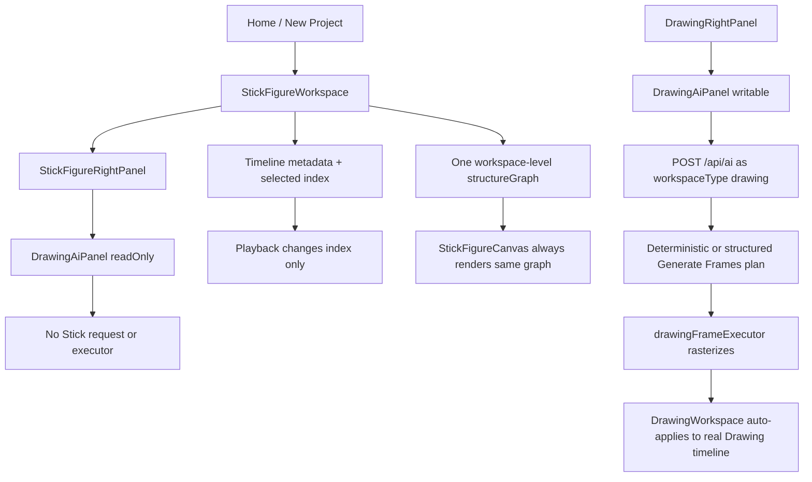
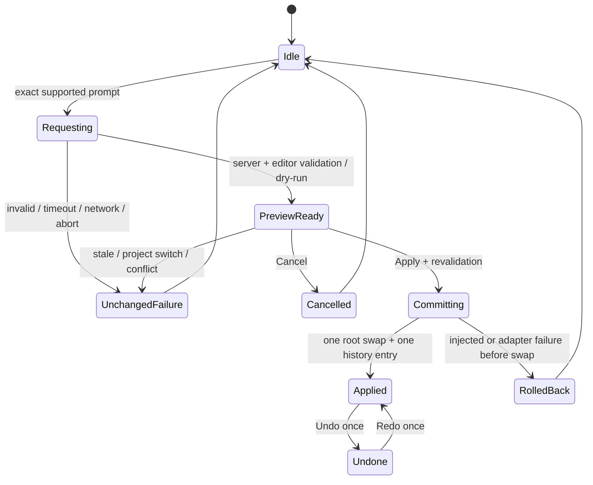
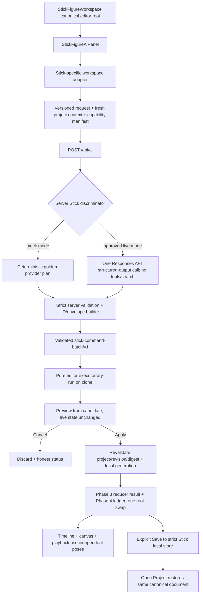

# SPEC-0001 — First Reversible AI-Created Stick Animation from Workspace Chat

Status: Proposed
Owner: Arthur
Implementer: Codex, one independently verified task per phase
Created: 2026-08-10
Last updated: 2026-08-10
Decision links: pending decisions P-0004, P-0005, P-0007, and P-0008 in `../DECISIONS.md`; no recommendation in this spec is accepted yet
TODO IDs: SPEC-001, AI-002, AI-003, AI-004, STICK-001, STICK-002, STICK-004, STICK-005; narrow partial coverage only
Baseline branch/commit: clean `main` at `87a9afb246d4daf33431e7152c03f46a04e166fb`
Last verified branch/commit: research evidence collected on clean `main` at `87a9afb246d4daf33431e7152c03f46a04e166fb`; implementation unverified and not started

This is a proposed design, not implementation authorization. Every recommendation below remains subject to Arthur's review. No phase is active, no application behavior has changed, and no live model request is authorized by this document.

## 1. Exact Goal

Recommend and bound the first AI-first Stick Figure Workspace vertical slice so a beginner can request one simple animation in the workspace chat, inspect the proposed result before anything changes, apply it as one reversible editor transaction, correct one joint by hand on one pose, and explicitly save/reopen the same real Stick project.

The exact candidate outcome to approve is:

> In a fresh Stick Figure Workspace, the user enters: “Create a simple three-pose wave animation with one stick figure at 12 FPS.” The app sends versioned stick-project context through the server-side AI boundary, receives a validated structured command batch, previews the proposed change without mutating the project, applies it only after explicit confirmation as one atomic and undoable transaction, visibly plays the independent poses, allows one joint to be manually corrected on one pose without changing the others, and preserves the result through local save/reopen.

The recommendation is **Preview → Apply**, never auto-apply, for this action. The AI and human tools must read and write one canonical Stick project/timeline/history state. A second demo-only animation state is forbidden.

Success for SPEC-0001 means only this bounded action works. It does not mean that Diamond Animator can yet understand arbitrary animation prompts or control the whole application, and it does not claim professional-grade animation quality.

## 2. Current Behavior and Evidence

### 2.1 Research method and evidence limits

The 2026-08-10 audit started from a clean `main` at the required commit. The canonical control plane, system references, template, frozen baseline, relevant non-authoritative legacy intent, all named source files, persistence paths, verification scripts, `package.json`, and `tsconfig.json` were read before this proposal was completed.

The local development server started successfully without an AI request. A fresh visual recheck in the in-app browser was attempted, but navigation became unavailable after an initial connection race; no workaround or alternate browser surface was used. Current UI claims below are therefore either **code verified on 2026-08-10** or explicitly inherited as **live verified on 2026-08-09** from [`CURRENT_STATE.md`](../CURRENT_STATE.md). Fresh 2026-08-10 visual behavior remains unproven and must be rerun during implementation.

No OpenAI API request, application search, Supabase request, saved-project mutation, deployment, or remote write occurred during this research. After Arthur explicitly said external calls were permitted if needed, only read-only official OpenAI documentation was consulted for current model capability, pricing, structured-output, and retention facts; that lookup did not invoke a model or spend API credits.

### 2.2 Observed / Intended / Gap / Proof

| Area | Observed current behavior | Intended behavior for this slice | Gap | Required proof |
| --- | --- | --- | --- | --- |
| Stick chat | `StickFigureRightPanel` mounts `DrawingAiPanel` with `readOnly`; it receives no Stick context or executor. | A writable panel visibly labeled and scoped to Stick Figure Workspace. | No writable Stick adapter or capability boundary. | Real-app assertion that the Stick input accepts the exact prompt and the request says `workspaceType: "stick-figure"`. |
| Workspace discriminator | `DrawingAiPanel` hardcodes `workspaceType: "drawing"`; `/api/ai` validates `workspaceType` but uses it only in development logging. | Exact discriminated Stick request and isolated Stick server handler. | The field is metadata, not an orchestration boundary. | Mocked route test proves Stick dispatch while Drawing dispatch remains byte-for-byte compatible. |
| Drawing AI | Generate Frames is the sole enabled Drawing task. Generate Plans, Generate Sounds, and Other are disabled; the default preference still selects disabled Generate Plans. | Leave this availability and its known inconsistency unchanged. | The current Drawing path cannot be reused as a safe Stick executor. | Existing control-preference validator plus Drawing Generate Frames mocked regression flow. |
| Drawing apply semantics | A successful generated-frame plan is rendered and sent to `onApplyGeneratedFrame` immediately; no Preview/Apply transaction exists. | Preview does not mutate; only explicit Apply commits. | Auto-apply and no pending transaction/revision binding. | Canonical project/history/storage bytes are identical before and after preview/cancel/failure. |
| Command support | `drawingAiContract.ts` exposes 16 broad action variants; `DrawingWorkspace` implements only save project, export current frame, and attach sound option in the broad executor. Generated frames use a separate callback. | One strict Stick action, fully supported end to end. | Contract breadth exceeds executor truth. | Capability matrix and strict rejection of every other action. |
| Current wave interpretation | The exact candidate prompt resolves through the current Drawing heuristic as a 10-frame `small-animation`, not three explicit poses. | Exactly three owner key poses at timeline indexes 0, 4, and 8, held through 12 positions at 12 FPS. | Drawing plan semantics cannot express or enforce the result. | Pure fixture validator and real playback of three visibly distinct poses. |
| Stick timeline | Timeline cells store IDs, cell metadata, `stateId`, blank state, and tween-endpoint metadata, but no pose/rig snapshot. | Each owner keyframe owns a complete independent pose; holds resolve that owner. | Frame selection/playback changes indexes only. | Select/play each pose and compare resolved pose bytes. |
| Stick canvas | `StickFigureWorkspace` owns one `structureGraph` outside timeline layers; `StickFigureCanvas` always renders that graph. | Canvas resolves the selected/playback cell to its owner pose in the canonical project. | Every frame currently displays the same graph. | Visible playback and resolver assertions. |
| Manual correction | Select-tool dragging changes a joint in the shared graph on every pointer move. | One completed drag on a paused, selected owner keyframe is one history transaction and changes only that pose. | No per-pose isolation or gesture-coalesced history. | Before/after bytes prove the other two poses and topology are unchanged. |
| Stick history | Shallow timeline history scaffolding exists, but top-bar undo/redo handlers are no-ops and always disabled; graph edits, FPS, and selection are absent. | AI batch and manual drag are atomic, exact, undoable, and redoable. | No canonical root transaction or complete snapshot. | One Undo removes the whole AI batch; one Redo reproduces exact candidate bytes. |
| Stick persistence | Only Drawing has local project storage. The Open Project Stick tab always shows an empty state; Stick Top Bar has no save callbacks. | Strict, separate, versioned local Stick save/open. | No Stick store, reader, writer, or page ownership. | Isolated-storage save/reopen preserves IDs, poses, FPS, timing, and selected frame. |
| Chat/memory | Chat is mounted-session React state. Drawing compact AI memory can store natural-language fields and auto-sync saved projects through an unauthenticated service-role Supabase route. | Stick transcript stays session-only; no natural-language Stick memory or Supabase in V1. | Reusing Drawing memory would enlarge privacy and security scope. | Storage/network tripwire proves no transcript, prompt, memory route, or Supabase write. |
| API security | `/api/ai` has no repository-level authentication or rate limiting. | Local/controlled feature flag only; public enablement forbidden. | Production exposure is unsafe and outside this slice. | Server flag defaults off; production-mode test rejects live Stick capability. |
| Provider policy | Current Drawing AI can search, make recovery/escalation calls, has no end-to-end provider timeout, and logs some raw prompt/output text. | No tools/search; one call; hard budgets; `store: false`; no persistent Stick AI logging. | Current defaults are too broad and retention is not approved. | Provider-injected offline test captures exact request options and redaction tripwires. |
| Verification | TypeScript and four focused offline scripts pass; lint has a known baseline of 6 errors/73 warnings; there is no conventional test/E2E framework. | Every phase has a deterministic validator and a focused real-app stop gate; default gates remain offline/mocked. | Several required failure and browser flows have no current proof. | Phase-specific scripts, isolated browser storage, network tripwire, and explicit pass/fail record. |

### 2.3 Traced current execution path



Code anchors:

- AI panel and request: `src/components/workspace/ai/DrawingAiPanel.tsx`, `src/components/workspace/ai/WorkspaceAiPanelShell.tsx`, `src/components/workspace/DrawingRightPanel.tsx`, and `src/components/workspace/stickfigure/StickFigureRightPanel.tsx`.
- Drawing orchestration: `src/lib/ai/drawingAiContract.ts`, `drawingAiTaskAvailability.ts`, `drawingAiTaskPipeline.ts`, `drawingAiTaskExecution.ts`, `drawingAiPrompting.ts`, `generateFramesRuntime.ts`, `src/lib/openai/generateAiText.ts`, and `app/api/ai/route.ts`.
- Drawing mutation: `src/lib/ai/drawingFrameExecutor.ts`, `src/components/workspace/DrawingWorkspace.tsx`, and `DrawingCanvas.tsx`.
- Stick state: `src/components/workspace/stickfigure/StickFigureWorkspace.tsx`, `StickFigureTimelineRow.tsx`, `StickFigureCanvas.tsx`, `types.ts`, `StickFigureCreatorWorkspace.tsx`, and `app/engine/stickRig.ts`.
- Persistence/memory: `src/lib/drawingProjectStorage.ts`, `src/lib/ai/drawingAiProjectMemory.ts`, `drawingProjectAiMemorySync.ts`, and `app/api/drawing-project-ai-memory/route.ts`.

`app/engine/stickRig.ts` is not the Stick Workspace model: its fixed `Pose` is currently imported by the Drawing raster executor. SPEC-0001 must leave it unchanged to protect Drawing Generate Frames.

The material function-level trace is:

| Hop | Verified symbol/path | Current behavior |
| --- | --- | --- |
| Drawing panel state | `DrawingAiPanel.tsx:348-365` | `messages` is mounted-component React state; there is no persisted transcript. |
| Drawing submission | `DrawingAiPanel.tsx:1718-1761` | Builds the request and posts to `/api/ai` with `workspaceType: "drawing"`. |
| Drawing frame apply | `DrawingAiPanel.tsx:1413-1461` | `renderGeneratedFrame` resolves the plan and calls `onApplyGeneratedFrame` before the result reveal; there is no explicit transaction preview. |
| Drawing broad actions | `DrawingAiPanel.tsx:1545-1573` | Successful broad action plans are passed to the workspace executor path. |
| Task availability/default | `drawingAiTaskAvailability.ts:5-12`; `drawingAiControlPreferences.ts:15-18` | Only Generate Frames is enabled, while the default selection remains disabled Generate Plans. |
| Route entry/discriminator | `app/api/ai/route.ts:1161-1171,2044,6134-6150` | `workspaceType` is schema-validated and logged, but does not currently select a workspace-specific planner or executor. |
| Drawing planning branches | `app/api/ai/route.ts:4233-4462,4539-4759,5063-5414` | Search, deterministic/structured generation, and recovery are broader than this Stick slice allows. |
| Drawing mutation | `DrawingWorkspace.tsx:7841-8098` | Broad executor supports a small subset; generated frames use the real Drawing timeline callback. |
| Stick canonical gap | `StickFigureWorkspace.tsx:194-225,378-435`; `StickFigureCanvas.tsx:512-564`; `types.ts:4-21` | Timeline selection/playback changes indexes, while one workspace graph remains the rendered pose. |

Line anchors identify the audited starting commit and are evidence pointers, not durable API contracts.

## 3. Root Cause or Missing Foundation

The primary missing foundation is a canonical, versioned Stick editor state that unifies rig identity, independent key-pose snapshots, timeline timing, history, and persistence. Prompting cannot safely bridge this gap.

Five broken links are code verified:

1. **No per-frame content:** Stick timeline cells carry metadata only while one graph lives outside the timeline.
2. **No atomic editor root:** timeline, graph, FPS, selection, history, and IDs are split across React setters and refs, so an all-or-nothing multi-field transaction cannot be proven.
3. **No Stick project boundary:** there is no strict Stick schema or save/open path.
4. **No Stick AI adapter/executor:** the visible panel is a read-only Drawing panel with Drawing-specific context.
5. **No bounded provider policy:** the shared route has broad search/retry/logging behavior and no auth/rate limit; model output is not tied to a project revision or idempotent transaction.

The correct sequence is therefore contract → independent pose state → history/persistence → deterministic transaction → mocked chat → feature-flagged live provider. Starting with a prompt or writable textarea would create another disconnected demo path and is forbidden.

## 4. Scope

### 4.1 Authorized product capability

SPEC-0001 may introduce only:

- one fresh Stick project;
- one fixed humanoid rig and one figure;
- one allowlisted `stick.pose-sequence.create/v1` action;
- exactly three complete independent key poses;
- 12 FPS and exactly 12 timeline positions: keyframes at 0, 4, and 8, each displayed for four frames;
- a non-mutating preview with explicit Apply and Cancel;
- one atomic AI transaction with exact Undo/Redo;
- one selected-joint drag on one owner keyframe as one manual history transaction;
- explicit local Save and Open with strict V1 parsing;
- a session-only Stick chat transcript;
- an offline mocked server path and, only after separate owner approval, one bounded live provider path behind a disabled-by-default flag.

### 4.2 Recommended minimal V1 project schema

This is a Stick-only schema recommendation. It does not settle the broader Drawing/project coordinate decisions in ARCH-001 or DATA-001.

| Concept | Required V1 fields and invariants | Rationale |
| --- | --- | --- |
| Authored document | `schemaVersion: 1`, `projectType: "stick-figure"`, `documentState`, opaque `projectId`, `documentRevision`, title, coordinate space, FPS, `rigs`, `figures`, and one timeline layer | One strict authored document, separate from view/request state. Initial title is exactly `Untitled Stick Project`. |
| Fresh state | `FreshStickProjectDocumentV1`, discriminant `documentState: "fresh"`: zero rigs, zero figures, one fixed layer, and exactly 12 `empty` cells at indexes 0–11 | Makes “fresh project” and Undo objectively representable. |
| Authored/corrected state | `AuthoredStickProjectDocumentV1`, discriminant `documentState: "authored"`: exactly one rig and one figure; the same 12 frame IDs are three keyframes at 0/4/8 and nine holds | The AI action fills the real timeline without replacing its identity; correction changes pose coordinates only. |
| Revision | Non-negative safe integer `documentRevision`; successful authoring commits increment once. Undo/redo restore their exact document snapshots. A separate session-only `workspaceGeneration` invalidates asynchronous work on every commit, undo, redo, load, or project switch. | Exact undo can restore project bytes while the non-persisted generation prevents an old response becoming current again. |
| Coordinate space | `coordinateSpace: "stick-stage-1920x1080-v1"`, width 1920, height 1080, top-left origin, x right, y down; all pose coordinates are finite integers in bounds; SVG/view rendering letterboxes without changing project coordinates. | Stable, resolution-independent integer authoring coordinates without silently deciding Drawing geometry. |
| Rig | Opaque `rigId`, `templateId: "humanoid-11-v1"`, 11 stable joint records, 10 stable segment records, fixed code-owned style/head marker | Topology and style are editor-owned and cannot be hallucinated by the model. |
| Joint roles | `head`, `neck`, `hip`, `leftElbow`, `leftHand`, `rightElbow`, `rightHand`, `leftKnee`, `leftFoot`, `rightKnee`, `rightFoot` | Matches the proven 11-point vocabulary already used by the Drawing renderer without reusing its state type. |
| Segments | head–neck, neck–hip, neck–leftElbow–leftHand, neck–rightElbow–rightHand, hip–leftKnee–leftFoot, hip–rightKnee–rightFoot | Exactly 10 fixed connections; no model-authored topology. |
| Figure | Opaque `figureId`, `rigId`, label `Stick Figure 1`; no transform stack in V1 | Separates instance identity from rig identity while avoiding multi-figure complexity. |
| Pose | Opaque `poseId`, `figureId`, `rigId`, enumerated beat `ready | inward | outward`, and exactly one `{jointId,x,y}` for every rig joint | Complete snapshots prevent partial-pose inheritance and cross-frame aliasing. |
| Empty cell | Opaque `frameId`, index 0–11, `cellType: "empty"`; no owner or pose field | Defines the exact fresh/undone state rather than overloading a keyframe. |
| Timeline keyframe | Existing opaque `frameId`, index 0/4/8, `cellType: "keyframe"`, one embedded/owned complete `pose`; no redundant cell-level `poseId` | The real owner cell contains independently editable content. |
| Timeline hold | Opaque `frameId`, index in 1–3/5–7/9–11, `cellType: "hold"`, `ownerFrameId`; no pose copy | Holds render the owner keyframe and cannot diverge accidentally. |
| Editor view state | Separate `StickEditorViewStateV1`: `activeLayerId`, `currentFrameIndex`, `selectedTimelineIndex`; not part of the authored-document digest | Selection can move while a preview is open without silently rewriting authored content. |
| Volatile playback state | `isPlaying` and `playbackFrameIndex`, outside authored document/history/persistence | Defines render authority without persisting timer progress. |
| Reopen state | The same three view identifiers are stored beside the document; playback always reopens paused | Meets selected-frame continuity without persisting volatile playback clocks. |

`StickProjectDocumentV1` is the strict discriminated union of those Fresh and Authored/Corrected shapes. Mixed cardinalities—such as a rig without a figure, a figure without three complete key poses, or a partially empty/authored timeline—are invalid. Both variants have exactly one layer and 12 cells. Arrays use schema order: the sole layer; cells by ascending index; joints by the role order above; segments by the connection order above; and pose points by joint-role order. Canonical serialization sorts object keys, rejects unknown fields, and rejects rather than coerces invalid data. Values must never be silently clamped, defaulted, filtered, or repaired at a trust boundary.

Fresh-project IDs are created with an injected UUID source: one project ID, one layer ID, and 12 stable frame IDs. Apply preserves those IDs. AI-created identity is deterministic: `prefix + "_" + first32hex(SHA-256("stick-v1|" + projectId + "|" + transactionId + "|" + slot))`, where slots are `rig`, `figure`, `joint:<role>`, `segment:<ordered-connection>`, and `pose:0|1|2`; prefixes are `rig`, `figure`, `joint`, `segment`, and `pose`. The server emits these values and the editor recomputes and rejects a mismatch. V1 has no next-ID counter. Manual correction creates no ID.

Browser-created project/layer/frame/request/transaction IDs are canonical lowercase RFC 4122 UUID v4 strings. Deterministic AI-created IDs match `^(rig|figure|joint|segment|pose)_[0-9a-f]{32}$`. Every required ID must be unique within its declared scope and every reference must resolve exactly once.

The authored-document digest covers `StickProjectDocumentV1` only. `workspaceGeneration`, view state, request/preview state, history stacks, idempotency ledger, and `lastSavedDocumentDigest` are excluded. `dirty` is derived as `lastSavedDocumentDigest === null || currentDocumentDigest !== lastSavedDocumentDigest`, not stored in the document or history.

The current scaffold exposes structural controls that this one-layer/fixed-rig schema cannot honestly preserve. From Phase 2 onward, Add Limb and timeline add/remove/resize/add-layer/delete-layer controls must remain mounted where needed for layout continuity but be visibly disabled with “Not available in the first three-pose Stick project.” They must not be removed, remain enabled as no-ops, or mutate the V1 document. Supporting those controls requires a later manual-editor schema spec.

#### Coordinate alternatives and tradeoffs

| Alternative | Benefit | Cost/risk | Recommendation |
| --- | --- | --- | --- |
| Fixed 1920×1080 integer Stick space | Stable, familiar aspect, exact canonical bytes, simple bounds | A Stick-local choice that later needs explicit migration if global stage architecture differs | **Recommend for V1**, explicitly namespaced to Stick. |
| Normalized floating point 0–1 | Resolution neutral | Float drift, harder canonical equality, awkward manual coordinates | Reject for V1. |
| Current DOM/stage pixels | Smallest immediate code change | Resize/viewport dependent and unsafe for save/reopen | Reject. |

### 4.3 Exact accepted prompt and output bounds

The only proposed accepted natural-language input is this 74-byte UTF-8 sentence:

```text
Create a simple three-pose wave animation with one stick figure at 12 FPS.
```

Validation applies Unicode NFC and trims leading/trailing whitespace, then requires an exact case- and punctuation-sensitive match. The raw prompt limit is 128 UTF-8 bytes. Any additional instruction, attachment, prior-turn dependency, alternate FPS, figure count, animation request, or prompt longer than the limit returns `unsupported_prompt` without a provider call or mutation.

The sole action also requires the exact Fresh document variant: revision 0, zero rigs/figures, one layer, and 12 empty cells. An authored, partially populated, or otherwise non-fresh project returns `unsupported_project_state` before mock/provider invocation. Undoing the one AI batch restores the exact eligible Fresh snapshot, but the old transaction remains consumed in the mounted-session ledger.

The provider plan and final command are bounded to:

- exactly one action;
- exactly one figure and one `humanoid-11-v1` rig;
- exactly three complete pose snapshots with 11 coordinates each;
- exactly three owner keyframes and nine holds across indexes 0–11;
- exactly 12 FPS and one second of timeline duration;
- no tween, interpolation, extra layer, style, arbitrary name, prose, tool call, or unknown field;
- client request body at most 16 KiB, provider-plan JSON at most 8 KiB, and command-envelope JSON at most 32 KiB.

The provider does not invent a body. It returns only `rightElbow` and `rightHand` for three ordered beats. The server owns and injects these nine fixed points into every complete pose: `head (960,240)`, `neck (960,340)`, `hip (960,620)`, `leftElbow (820,460)`, `leftHand (760,580)`, `leftKnee (900,800)`, `leftFoot (840,980)`, `rightKnee (1020,800)`, and `rightFoot (1080,980)`.

The strict semantic validator requires all right-arm coordinates to be integers within x `100..1820` and y `100..980`; squared neck-to-elbow length within `100²..260²`; squared elbow-to-hand length within `80²..240²`; and every hand y within `200..420`. `ready` hand x is `1080..1240`; `inward` hand x is `980..1100` and y `200..380`; `outward` hand x is at least `inward.x + 120`, no greater than `1280`, and y `200..380`. Every pair of right-hand beats must be at least 80 project units apart. The deterministic golden fixture is the reference for visible quality; all nine fixed points must remain byte-identical across poses. Any semantic miss rejects the plan rather than repairing it.

Those wave/body/segment constraints apply only while validating and materializing `stick.pose-sequence.create/v1`. After Apply, canonical/manual pose validation requires correct IDs/cardinality and finite integer coordinates within the project bounds, but does not reimpose the wave gesture, fixed-body, or arm-length constraints. This permits the one manual correction without retroactively invalidating a previously accepted creation command.

### 4.4 Versioned contracts and ownership

| Artifact | Version discriminator | Required ownership |
| --- | --- | --- |
| Client request | `requestVersion: 1`, kind `stick-ai-request` | Browser creates `requestId` and `transactionId`, includes project ID/revision/digest, manifest, and exact prompt. The adapter separately binds the request to session-only `workspaceGeneration`; it is never serialized. |
| Project context | `contextVersion: 1`, kind `stick-project-context` | Editor derives it from the canonical project; the server validates it but never treats it as authority to mutate. |
| Capability manifest | `manifestVersion: 1`, capability `stick.pose-sequence.create/v1` | Shared code defines the exact allowlist and bounds; client and server manifests must match exactly. |
| Provider plan | `planVersion: 1`, kind `stick-wave-plan` | OpenAI returns only right-elbow/right-hand coordinates for `ready`, `inward`, and `outward`, plus fixed timing. It chooses no IDs, body points, topology, project fields, or commands. |
| Command envelope | `envelopeVersion: 1`, `commandVersion: 1`, kind `stick-command-batch` | Server wraps a validated plan with browser-owned correlation fields and server-generated deterministic IDs. Exactly one command is present. |
| Preview result | `resultVersion: 1`, kind `stick-command-result`, status `previewed` | Editor executor dry-runs the envelope against a clone and owns `preStateDigest`, `candidateDigest`, and the bounded preview summary. |
| Apply result | Same result version; `applied | duplicate | rejected | failed | cancelled` | In the final Phase 4 path, the executor requests one transaction; the Phase 3 reducer creates history/authored state, and Phase 4 publishes it with the ledger as one root. |
| Saved project | root `storageVersion: 1`, document `schemaVersion: 1` | Strict local storage adapter owns encoding/decoding; no provider or chat state enters it. |

The capability manifest is exact; all fields are required and unknown fields reject:

```json
{
  "manifestVersion": 1,
  "capabilities": ["stick.pose-sequence.create/v1"],
  "limits": {
    "maxActions": 1,
    "maxRigs": 1,
    "maxFigures": 1,
    "maxLayers": 1,
    "maxKeyPoses": 3,
    "maxTimelineFrames": 12,
    "jointsPerPose": 11,
    "segmentsPerRig": 10,
    "allowedFps": [12],
    "promptBytes": 128,
    "requestBytes": 16384,
    "providerPlanBytes": 8192,
    "commandBytes": 32768,
    "coordinateSpace": "stick-stage-1920x1080-v1",
    "search": "disabled",
    "tools": "disabled"
  }
}
```

The client request is exact; placeholder IDs/digests below stand for values matching their validators:

```json
{
  "kind": "stick-ai-request",
  "requestVersion": 1,
  "requestId": "request-uuid",
  "transactionId": "transaction-uuid",
  "workspaceType": "stick-figure",
  "prompt": "Create a simple three-pose wave animation with one stick figure at 12 FPS.",
  "capabilityManifest": {
    "manifestVersion": 1,
    "capabilities": ["stick.pose-sequence.create/v1"],
    "limits": {
      "maxActions": 1,
      "maxRigs": 1,
      "maxFigures": 1,
      "maxLayers": 1,
      "maxKeyPoses": 3,
      "maxTimelineFrames": 12,
      "jointsPerPose": 11,
      "segmentsPerRig": 10,
      "allowedFps": [12],
      "promptBytes": 128,
      "requestBytes": 16384,
      "providerPlanBytes": 8192,
      "commandBytes": 32768,
      "coordinateSpace": "stick-stage-1920x1080-v1",
      "search": "disabled",
      "tools": "disabled"
    }
  },
  "projectContext": {
    "kind": "stick-project-context",
    "contextVersion": 1,
    "schemaVersion": 1,
    "projectId": "project-uuid",
    "documentRevision": 0,
    "baseDocumentDigest": "sha256:document-hex",
    "workspaceType": "stick-figure",
    "isFreshProject": true,
    "coordinateSpace": "stick-stage-1920x1080-v1",
    "fps": 12,
    "activeLayerId": "layer-uuid",
    "layerCount": 1,
    "figureCount": 0,
    "authoredPoseCount": 0,
    "timelineFrameCount": 12,
    "emptyCellCount": 12
  }
}
```

`workspaceGeneration` is held only in the adapter binding `{requestId, transactionId, projectId, documentRevision, baseDocumentDigest, workspaceGeneration}`. It is never sent to `/api/ai`, the provider, or returned in an envelope/result.

The deterministic golden provider plan is exactly below. A live plan has the identical strict shape/order and may vary only the four right-arm integers per beat within section 4.3 constraints:

```json
{
  "kind": "stick-wave-plan",
  "planVersion": 1,
  "fps": 12,
  "totalFrames": 12,
  "poses": [
    {"beat": "ready", "rightElbow": {"x": 1080, "y": 360}, "rightHand": {"x": 1160, "y": 260}},
    {"beat": "inward", "rightElbow": {"x": 1080, "y": 300}, "rightHand": {"x": 1020, "y": 220}},
    {"beat": "outward", "rightElbow": {"x": 1120, "y": 300}, "rightHand": {"x": 1280, "y": 220}}
  ]
}
```

After domain validation and deterministic ID/body materialization, the exact envelope fields are:

| Object | Required fields |
| --- | --- |
| Envelope | `kind`, `envelopeVersion`, `commandVersion`, `requestId`, `transactionId`, `workspaceType`, `projectId`, `baseDocumentRevision`, `baseDocumentDigest`, `capabilityManifestVersion`, `payloadDigest`, `commands` |
| Sole command | `type: "stick.pose-sequence.create"`, `actionVersion: 1`, `targetLayerId`, `keyframeIndexes: [0,4,8]`, `holdFramesPerPose: 4`, complete `rig`, complete `figure`, and exactly three complete ordered `poses` |
| Rig | Deterministic `rigId`, `templateId`, 11 ordered `{jointId,role}` records, 10 ordered `{segmentId,fromJointId,toJointId}` records |
| Figure | Deterministic `figureId`, matching `rigId`, `label: "Stick Figure 1"` |
| Pose | Deterministic `poseId`, matching figure/rig IDs, ordered `beat`, and exactly 11 ordered `{jointId,x,y}` points |

`payloadDigest` is `sha256:` plus lowercase SHA-256 of the canonical JSON for the sole command array. The editor computes `envelopeDigest` over the complete canonical envelope including `payloadDigest`. It recomputes every deterministic ID, validates that the target layer and preserved frame IDs belong to the active document, and rejects every mismatch.

Every command result contains all of these fields (nullable where stated):

```json
{
  "kind": "stick-command-result",
  "resultVersion": 1,
  "requestId": "request-uuid",
  "transactionId": "transaction-uuid",
  "projectId": "project-uuid",
  "envelopeDigest": "sha256:envelope-hex",
  "status": "previewed",
  "previousDocumentRevision": 0,
  "resultingDocumentRevision": null,
  "mutationCount": 0,
  "preStateDigest": "sha256:document-hex",
  "candidateDigest": "sha256:candidate-hex",
  "previewSummary": {"figureCount": 1, "keyPoseCount": 3, "fps": 12, "timelineFrameCount": 12, "durationMs": 1000},
  "error": null
}
```

`status` is exactly `previewed | applied | duplicate | rejected | failed | cancelled`, with required nullability:

| Status | `candidateDigest` / `previewSummary` | `resultingDocumentRevision` | `mutationCount` | `error` |
| --- | --- | --- | --- | --- |
| `previewed` | candidate digest / exact bounded summary | `null` | `0` | `null` |
| `applied` | candidate digest / exact bounded summary | applied revision | `1` | `null` |
| `duplicate` | original applied candidate digest / summary | original applied revision | `0` | `null` |
| `rejected | failed | cancelled` | both `null` | `null` | `0` | required `{code,message}` |

`StickAiErrorCodeV1` is the exact enum: `capability_disabled | missing_credentials | unsupported_prompt | unsupported_project_state | invalid_request | request_too_large | unsupported_version | capability_mismatch | invalid_provider_output | provider_refusal | unsupported_command | timeout | network_failure | aborted | preview_cancelled | stale_document | project_switched | idempotency_conflict | concurrency_conflict | transaction_failed`. `preview_cancelled` is used only for the terminal local Preview → Cancel result; it is not a provider or transport failure. Safe static copy is mapped in section 8.7; raw errors never populate `message`.

Failures before a valid command result use the exact transport envelope `{kind: "stick-ai-error", errorVersion: 1, requestId: string | null, transactionId: string | null, code: StickAiTransportErrorCodeV1, message: string, noChangesMade: true}`, where `StickAiTransportErrorCodeV1` is `StickAiErrorCodeV1` excluding `preview_cancelled`. IDs are `null` when they could not be strictly parsed. HTTP mapping is `400` invalid/unsupported prompt/request/version/manifest, `409` stale/switch/idempotency/concurrency, `413` request too large, `422` invalid provider output/unsupported command, `503` disabled/missing-credential/network, and `504` server timeout; local user Stop may end client-side without an HTTP result. Unknown versions, fields, actions, IDs, digests, or capability values fail closed.

### 4.5 Adapter choice

| Option | Tradeoff | Decision recommendation |
| --- | --- | --- |
| Make `DrawingAiPanel` generic and rename Drawing contracts repo-wide | Superficially shared UI, but high regression risk across very large Drawing files and preserves Drawing-specific assumptions | Reject for SPEC-0001. |
| Add a narrow `StickFigureAiPanel` and `stickFigureAiWorkspaceAdapter`, reuse `WorkspaceAiPanelShell` presentation only | Small explicit boundary; some temporary duplication until more capabilities justify abstraction | **Recommend.** |
| Put a demo chat/executor beside the project state | Fastest demo, but violates shared timeline/history/persistence requirement | Forbidden. |

### 4.6 Preview, transaction, stale, cancellation, rollback, and idempotency semantics

Phase 2 first proves a single immutable pose update without history. Phase 3 then introduces `commitStickEditorTransaction` as the sole authored-state/history mutation reducer from that phase onward for both human edits and later AI commits. The Phase 4 AI executor is a pure validation/dry-run boundary that may submit exactly one fully built transaction to that reducer; it is not a second state store or mutation mechanism.

The transaction flow is:

1. Strictly parse the entire envelope and validate project ID, base revision, capability, counts, references, coordinates, timeline, size, and freshness.
2. Compute the envelope digest and consult the active-preview registry and mounted-project ledger **before** current-revision checks. Exact redelivery while its preview is displayed reuses that one `previewed` result/card. A known applied entry returns `duplicate` with the original candidate/resulting revision and mutation count 0. A known cancelled/rejected/failed entry returns that stored terminal result. Same project/transaction ID with a different digest returns `idempotency_conflict`.
3. For an unseen transaction, deep-clone/freeze the authored pre-document and build a complete candidate document without touching live document, view state, history, request UI, or storage.
4. Strictly validate and canonically serialize the candidate; produce a preview and digests only. The preview stores the adapter-local request binding but not a cloned view state.
5. On Apply, re-check active request/transaction/project, base document revision, base document digest, adapter-local `workspaceGeneration`, envelope digest, and capability manifest. Frame selection may have changed; authored content may not.
6. Preserve the **current live** `StickEditorViewStateV1`; use the Phase 3 reducer to build `nextEditorHistoryRoot`; then build the Phase 4 `{nextEditorHistoryRoot,nextLedger}` AI workspace root and swap it once. No incremental React setter sequence is allowed.
7. If any validation, injected failure, abort, or adapter exception occurs before that swap, discard the candidate. If a side effect is ever introduced before the swap, restore the captured pre-snapshot and fail the test; persistence is not such a side effect because Apply never saves.

Transaction rules:

- Preview, rejection, timeout, abort, stale response, project switch, Cancel, conflicting duplicate, and injected failure leave canonical project bytes, history bytes, and localStorage bytes identical to pre-request values.
- Volatile UI/request/preview/ledger state may make its specified lifecycle transition so the app can show an honest message; it is excluded from canonical project/history/storage equality.
- Every local authoring mutation, Undo, Redo, load, or project switch increments session-only `workspaceGeneration` and invalidates outstanding requests/previews.
- Exact redelivery during PreviewReady reuses the existing preview with no new card, history, or ledger entry. After Apply it returns `duplicate` even if the original base revision is now old. Consumed cancelled/rejected/failed entries return their stored result. Same project/transaction ID with a different digest is `idempotency_conflict` and cannot preview or apply.
- The ledger stores `applied`, `cancelled`, `rejected`, and `failed` terminal results, holds at most 128 entries per mounted project, and evicts oldest-first after a new terminal entry. Active requests/previews live in the separate registry and cannot be evicted by ledger pruning. Both structures are volatile, never saved, and cleared on reload/unmount. Cross-session replay protection is a later security spec.
- Cancel marks the volatile request consumed and removes the preview. Repeated delivery cannot reopen it.
- One successful Apply increments `documentRevision` exactly once and produces exactly one undo entry. Undo restores the exact pre-Apply editor snapshot; Redo restores the exact candidate snapshot. Request-generation invalidation prevents revision reuse after Undo from accepting a stale response.
- Submit and Apply require `isPlaying === false`. Playing shows “Pause playback before requesting or applying an AI change” and makes no request/commit. Apply never silently changes the playback flag.
- A frame selection made while preview is open is permitted: it changes view state only, does not invalidate the document-bound preview, and is preserved by Apply. Any authored mutation invalidates the preview.



### 4.7 Explicit undo/rollback state boundary

The Phase 3 `StickEditorHistoryRootV1` contains the current editor snapshot, undo stack, and redo stack. Phase 4 introduces `StickAiWorkspaceRootV1 = {editorHistoryRoot, transactionLedger}` so an AI Apply can atomically publish the Phase 3 reducer result and its ledger entry without making Phase 3 depend on AI. `StickEditorSnapshotV1`, included in history and rollback, has exactly `{document: StickProjectDocumentV1, viewState: StickEditorViewStateV1}`. The complete document includes:

- project/document schema version, project type, project ID, title, and document revision;
- coordinate-space identifier and dimensions;
- FPS;
- complete rig/template identity, joint identities, and segment identities;
- figure identity and rig reference;
- every layer and all 12 cell IDs/types/indexes/owner references;
- all three pose IDs and every joint coordinate.

The one `viewState` field contains active layer ID, current frame index, and selected timeline index; there are no duplicated top-level copies.

There is no next-ID counter. `dirty` and `lastSavedDocumentDigest` are session metadata outside history. The transaction does not touch and history need not include mounted chat messages, preview/request/abort state, right-panel tab, active tool, hovered/active joint, playback clock/playing flag, onion toggle, camera pan/zoom, current canvas background, Drawing state, storage bytes, or Supabase state. Through Apply those fields remain unchanged; the preview is cleared only after the root swap succeeds. The Phase 4 ledger is outside editor history/persistence but changes atomically in the AI workspace root as specified.

Render authority is exact: `renderIndex = isPlaying ? playbackFrameIndex : selectedTimelineIndex`. `playbackFrameIndex` is volatile. Play copies `selectedTimelineIndex` into it before the first tick; each tick advances it modulo 12; Pause copies its last displayed value into both `currentFrameIndex` and `selectedTimelineIndex`, then sets `isPlaying = false`. Direct selection while paused sets the two view indexes together. Reopen restores both persisted indexes, initializes `playbackFrameIndex` from `selectedTimelineIndex`, forces `isPlaying = false`, and renders the selection. Apply preserves the current view indexes. Undo/Redo restore the view snapshot paired with their document snapshot, while session-only `workspaceGeneration` remains monotonic and is never restored.

### 4.8 Minimum manual correction

Only this correction is in scope; the history bullets describe the completed Phase 3+ flow:

- playback is paused;
- the user selects an explicit owner keyframe, not a hold;
- with Select, the user pointer-drags one existing joint and releases;
- coordinates are converted into canonical project space and clamped only by pointer interaction before commit, never by parser repair;
- one completed drag is one history transaction; pointer cancel restores the pre-drag pose;
- the completed drag increments `documentRevision` exactly once; Undo restores the prior snapshot/revision and Redo restores the corrected snapshot/revision;
- only the selected pose coordinates change; its holds naturally render it;
- other poses, rig topology, IDs, timing, FPS, and layer structure remain byte-identical.

Attempting to edit a hold shows “Select the pose keyframe to edit this held pose” and does not mutate. Adding/removing joints, changing topology, inverse kinematics, constraints, and multi-joint transforms are later work.

Phase 2 proves the immutable drag boundary and pose isolation before history exists; its one root update increments revision once but does not yet add an undo entry. Phase 3 routes that already-bounded completed gesture through `commitStickEditorTransaction`, at which point exact history/Undo/Redo become active.

### 4.9 Local persistence, chat, and memory boundaries

Recommended storage key: `da_saved_stick_projects_v1`, separate from `da_saved_drawing_projects`. The exact strict storage envelope is:

```json
{
  "storageVersion": 1,
  "projects": [
    {
      "recordVersion": 1,
      "projectId": "project-uuid",
      "createdAt": "2026-08-10T00:00:00.000Z",
      "updatedAt": "2026-08-10T00:00:00.000Z",
      "document": {"schemaVersion": 1, "projectType": "stick-figure"},
      "reopenState": {"activeLayerId": "layer-uuid", "currentFrameIndex": 4, "selectedTimelineIndex": 4}
    }
  ]
}
```

The abbreviated `document` above stands for the complete strict `StickProjectDocumentV1`; no document field is optional. Each record project ID must match its document. UTC timestamps must be canonical ISO strings, are outside document/history/digests, and come from the injected clock. Records sort by `updatedAt` descending with `projectId` lexicographic as the tie-breaker; duplicate project IDs reject.

- An absent storage key decodes in memory as the valid empty envelope `{storageVersion: 1, projects: []}` but is not written until explicit Save. An existing empty string, invalid JSON, or invalid envelope is corrupt—not equivalent to an absent key.
- Save is explicit; Apply does not autosave.
- First Save inserts one record. Later Save for the same project ID replaces that record, preserves `createdAt`, sets `updatedAt` from the injected clock, and never creates a duplicate. Save As is not in V1 and must be hidden or visibly unavailable, never an enabled no-op.
- Save/reopen preserves canonical document content, IDs, revision, FPS/timing, and reopen selection.
- Session metadata initializes a new unsaved project with `lastSavedDocumentDigest: null` and `dirty: true`. A successful Save sets it to the saved document digest and makes `dirty: false`; a failed Save changes neither it nor editor state. A successful Open strictly parses the complete root/record before `app/page.tsx` replaces the active project/view, then sets `lastSavedDocumentDigest` to the loaded document digest and `dirty: false`.
- History stacks, chat, preview, request state, idempotency ledger, playback-running state, camera, tool, and panel state do not survive reopen.
- Unsupported/corrupt root or project data is reported and its prior raw storage bytes are preserved. It must not be treated as an empty collection and overwritten.
- Quota/write failure preserves both the current editor state and all prior storage bytes and shows an honest message.
- No prompt, transcript, free-form project summary, compact semantic memory, remote memory, or Supabase sync is stored in SPEC-0001.
- No AI provenance is persisted in V1. A future provenance/audit spec may propose structured transaction/version/digest fields.

`StickStorageErrorCodeV1` is exactly `corrupt_storage | unsupported_storage_version | invalid_saved_project | project_not_found | quota_exceeded | storage_write_failed`; storage APIs return a typed `Result` with safe static copy and never reuse an AI/provider error.

### 4.10 Command capability and support matrix

| Capability/action | Current status | SPEC-0001 status | Preview | Apply/undo | Notes |
| --- | --- | --- | --- | --- | --- |
| `stick.pose-sequence.create/v1` | Absent | Sole proposed Stick capability | Required | Required, atomic | One figure, three poses, 12 FPS only. |
| Stick revise pose via AI | Absent | Unsupported | No | No | Manual one-joint correction only. |
| Stick multi-character/props/background/camera/sound/tween/export | Absent | Unsupported | No | No | Later specs. |
| Drawing Generate Frames | Enabled, hybrid, auto-applies | Existing behavior protected and unchanged | Existing behavior unchanged | Existing behavior unchanged | No broad migration in this spec. |
| Drawing Generate Plans | Disabled, default preference selects it | Remains disabled | N/A | No | AI-001 later. |
| Drawing Generate Sounds | Disabled | Remains disabled | N/A | No | Later spec. |
| Drawing Other / broad action union | Disabled; only three broad executor actions implemented | Remains disabled/unmodified | N/A | No new support | AI-002 remains open beyond the narrow row above. |

## 5. Non-Goals

- General-purpose arbitrary AI application control.
- Any Stick AI action other than `stick.pose-sequence.create/v1` for the exact approved prompt.
- Multi-character scenes.
- Props, backgrounds, camera animation, sound, voice, export, or tween generation.
- Long-form continuity or multi-turn planning.
- Full professional manual editor, rigging suite, inverse kinematics, constraints, reusable poses, or topology editing.
- Broad Drawing Workspace redesign or changing Drawing Generate Frames apply semantics.
- Repo-wide renaming/generalization of Drawing AI types, panels, contracts, prompting, runtime, or executor.
- Enabling Generate Plans, Generate Sounds, or Other.
- External search, file search, web grounding, MCP, tools, retrieval, embeddings, or RAG.
- Remote Supabase memory, cloud persistence, cloud sync, collaboration, or autosave/recovery.
- Billing, credits, public deployment, authentication, ownership enforcement, or production rate limiting.
- Custom LLM, fine-tuning, embeddings, RAG, dataset creation, or training pipeline.
- Broad prompt/reference-library rewrite or reuse of the Drawing training/example libraries.
- Incidental cleanup or decomposition of large AI/editor files.
- Creator Save/library integration or claiming the separate Creator and Workspace share a complete model.
- Solving the global Drawing/Stick coordinate, migration, export, or fidelity architecture.
- Claiming professional-grade animation quality from this infrastructure slice.
- Modifying or adopting `app/engine/stickRig.ts` as Stick Workspace state; it remains protected Drawing-renderer input.

## 6. Canonical User Flow

This is the mandatory end-to-end acceptance flow. Steps 4–16 use the deterministic mocked provider in the default gate; Phase 6 may repeat one request live only after explicit cost/privacy authorization.

1. Start the app with a new isolated browser profile or context and empty storage for both `da_saved_stick_projects_v1` and the existing Drawing key. Install a network tripwire that fails any non-loopback request.
2. Choose Home → New Project → Stick Figure Animation.
3. Confirm the right sidebar chat is writable, is visibly labeled “Stick Figure Workspace,” advertises only “Create three-pose wave,” and does not show Drawing task choices.
4. Enter exactly: `Create a simple three-pose wave animation with one stick figure at 12 FPS.`
5. Assert exactly one `POST /api/ai` request with `workspaceType: "stick-figure"`, request/context/manifest version 1, the current project ID/revision, a request ID, a transaction ID, and `search: "disabled"`. Assert no search, Supabase, or other remote request.
6. Return one mocked, strictly valid `stick-command-batch` and show a preview summarizing one figure, three key poses, 12 FPS, 12 frames/1 second, with Apply and Cancel.
7. Before Apply, compare canonical project, history, and storage bytes with their pre-request values; all must be identical. Switching timeline frames must still show the original fresh state.
8. Choose Apply once.
9. Assert the real Stick project/timeline contains one rig, one figure, three independent owner keyframes at 0/4/8, nine valid holds, and revision incremented once. Assert exactly one undo entry.
10. Choose Play and visibly confirm the right arm displays three distinct poses with four-frame holds and wraps at 12 frames. Pause.
11. Choose Undo once and confirm the entire figure/rig/pose/timing batch disappears and the fresh editor snapshot is restored exactly.
12. Choose Redo once and confirm exact candidate digest, IDs, poses, FPS, timeline, and selection are restored.
13. Select the owner keyframe at index 4, drag only `rightHand`, and release once.
14. Switch among indexes 0, 4, and 8. Confirm the corrected joint appears only in pose 2 and its holds; poses 1 and 3 remain byte-identical to their pre-correction values. Confirm the drag created one history entry.
15. Choose File → Save, hard-reload `/` to remount at Home without entering Creator, then choose Open Project → Stick Figure → the saved project.
16. Confirm rig/figure/pose/frame identities, correction, 12 FPS, keyframe/hold timing, selected/current frame behavior, and visible playback survive reopen; playback begins paused and then renders the same distinct poses.
17. In isolated reruns, inject malformed JSON, extra fields, unsupported version, unsupported command, excessive counts/bytes, foreign IDs, invalid coordinates, timeout, network failure, abort, stale revision, duplicate identical response, duplicate conflicting response, project switch, storage corruption/quota failure, and failures after candidate construction and after history construction but before root swap.
18. For every failure, assert an honest scoped message, zero partial content, byte-identical canonical project/history/storage pre-state, and no unhandled browser error. Exact redelivery while preview is open reuses one preview; after successful Apply it returns `duplicate` with the original candidate/revision and adds no mutation/history entry.
19. Protect Home → New → Stick, Stick → Creator → Back, Home → Open Drawing project, and the existing Drawing Generate Frames request/render/apply path. The Creator Save button remains disabled.
20. Run all default gates with OpenAI live mode off, search disabled, Supabase blocked, and every non-loopback request treated as test failure.

## 7. Execution Path

### 7.1 Proposed execution path



In the completed Phase 3+ architecture there is one mutation authority: `commitStickEditorTransaction`, used by manual and AI-authored edits. The Phase 4 executor validates/dry-runs an AI envelope and submits one transaction to that reducer. The UI, route, mock provider, live provider, preview renderer, and persistence adapter cannot directly alter Stick project state.

### 7.2 Request/response lifecycle and stale protection

```mermaid
sequenceDiagram
    participant U as User
    participant P as StickFigureAiPanel
    participant A as Stick adapter
    participant R as POST /api/ai
    participant V as Provider or mock
    participant X as Stick transaction executor
    participant S as Canonical editor state

    U->>P: Submit exact prompt
    P->>A: capture projectId, revision, digest, local generation
    A->>R: request v1 + manifest v1
    R->>V: minimized structured-output input
    V-->>R: untrusted plan v1
    R-->>A: validated command envelope v1
    A->>X: dry-run immutable envelope
    X-->>P: preview + pre/candidate digests
    Note over S: No state/history/storage mutation
    U->>P: Apply
    P->>X: apply same envelope/digest
    X->>X: duplicate-first check; then revision/digest/local generation
    X->>S: swap one AI root containing Phase 3 reducer result
    S-->>P: applied result v1
```

### 7.3 Error/result ownership

| Layer | May decide | Must not do |
| --- | --- | --- |
| Panel | Display state, accept exact prompt, request Apply/Cancel, show honest messages | Parse provider output as trusted, mutate project, persist transcript |
| Workspace adapter | Capture current identifiers/generation, abort/invalidate, call executor | Construct ad hoc project mutations or reuse Drawing context |
| `/api/ai` Stick dispatcher | Validate body/size/version/manifest, choose off/mock/live mode, enforce budget | Let Stick intent fall through to Drawing, enable search, mutate editor |
| Provider planner | Propose three bounded right-arm coordinate pairs under strict schema | Choose body coordinates, IDs, revisions, capabilities, storage, commands, or tools |
| Server command builder | Validate provider plan, deterministically derive command/content IDs, wrap correlation fields | Treat structured-output conformance as domain validation |
| Phase 4 AI executor | Validate all invariants, dry-run, idempotency/stale checks, submit one transaction | Mutate React state directly, own manual history, call OpenAI/search/Supabase, or save |
| Phase 3 editor reducer | Commit all manual/AI authored changes and exact Undo/Redo as one composite root | Interpret prompts, parse provider output, call a remote or persist automatically |
| Storage adapter | Strictly encode/decode explicit saves | Repair unknown data, overwrite corrupt raw data, store chat/provider output |

## 8. Data, AI, Cost, Security, and Privacy Impact

### 8.1 Schema/version/migration impact

- New Stick-only project/document, request/context/manifest, provider-plan, command-envelope, result, history, and storage V1 schemas are required.
- There is no persisted Stick schema to migrate. Existing ephemeral Stick state is not durable and may be initialized into the new V1 editor state at mount.
- Drawing project storage version/key and Drawing AI contracts remain unchanged.
- Unknown future versions return typed `unsupported_version`; no forward-compatible field stripping is allowed.
- A future schema requires an explicit migration function and a later spec. SPEC-0001 authorizes only V1-to-V1 round trips.

### 8.2 Exact client-to-server fields

The browser sends only the request shape in section 4.4: kind/version, request ID, transaction ID, exact workspace discriminator, exact prompt, capability manifest, and the compact fresh-project context fields. It sends no transcript, project title, user identity, email, bitmap, image, audio, asset, free-form memory, Drawing context, camera, browser storage, or prior provider output.

### 8.3 Exact fields sent to OpenAI

The server retains correlation and project identity. The provider receives exactly this Responses API object; `STICK_WAVE_PLAN_V1_SCHEMA` is the strict schema for the exact provider-plan shape in section 4.4, with every property required and `additionalProperties: false` at every object level:

```ts
{
  model: "gpt-5.6-luna",
  input: canonicalJson({
    kind: "stick-wave-input",
    inputVersion: 1,
    prompt: "Create a simple three-pose wave animation with one stick figure at 12 FPS.",
    context: {
      contextVersion: 1,
      workspaceType: "stick-figure",
      isFreshProject: true,
      coordinateSpace: {
        id: "stick-stage-1920x1080-v1",
        width: 1920,
        height: 1080,
        origin: "top-left",
        xAxis: "right",
        yAxis: "down"
      },
      fps: 12,
      timelineFrameCount: 12,
      layerCount: 1,
      figureCount: 0,
      authoredPoseCount: 0
    }
  }),
  instructions: STICK_WAVE_INSTRUCTIONS_V1,
  reasoning: { effort: "none" },
  max_output_tokens: 1500,
  text: {
    verbosity: "low",
    format: {
      type: "json_schema",
      name: "stick_wave_plan_v1",
      schema: STICK_WAVE_PLAN_V1_SCHEMA,
      strict: true
    }
  },
  store: false
}
```

The Stick planner must create its own injected OpenAI client with `{apiKey, maxRetries: 0, timeout: 20000}` rather than reuse the repository singleton, whose SDK retry policy is not bounded for this slice. It calls `responses.create(EXACT_PAYLOAD, {signal: deadlineSignal})` once, where `deadlineSignal` uses only the remaining portion of the same 20-second server deadline. “One call” means one planner invocation and one HTTP transport attempt; the offline fake client counts both and fails if either exceeds 1. No service-tier/profile field is sent, so the provider default applies.

The exact immutable `STICK_WAVE_INSTRUCTIONS_V1` text is checked in as `scripts/fixtures/stick-ai/v1/stick-wave-instructions-v1.txt` in Phase 6 and must equal:

```text
You are Diamond Animator's bounded Stick Wave Planner v1. Return only the strict stick_wave_plan_v1 object. Plan exactly three ordered beats: ready, inward, outward; fps 12; totalFrames 12. Output only integer rightElbow and rightHand coordinates. All coordinates use top-left 1920x1080 space and must stay within x 100..1820 and y 100..980. Neck is fixed at 960,340. Neck-to-elbow length must be 100..260; elbow-to-hand length 80..240; every hand y 200..420. Ready hand x must be 1080..1240. Inward hand x must be 980..1100 and y 200..380. Outward hand x must be at least inward x plus 120, at most 1280, and y 200..380. Every pair of hand positions must be at least 80 units apart. The editor owns all IDs, topology, body coordinates, commands, timing cells, history, and persistence. Do not add prose, fields, tools, search, references, or additional figures. If the request cannot be represented exactly, refuse instead of approximating.
```

The provider request omits `tools`, `previous_response_id`, `background`, conversation identifiers, and every unlisted field. It never receives `projectId`, document revision/digest, request/transaction IDs, `workspaceGeneration`, generated content IDs, layer/frame IDs, title, selected frame, transcript, stored project, local memory, bitmap/audio/assets, browser data, search results, or user identity added by application code. A refusal is handled as an error result and never converted into a command.

Official OpenAI documentation confirms that `gpt-5.6-luna` supports the Responses API and Structured Outputs and is positioned for cost-sensitive workloads ([model page](https://developers.openai.com/api/docs/models/gpt-5.6-luna)). Structured Outputs guarantee JSON-Schema conformance, but this spec still treats the result as untrusted domain data and validates all counts, IDs, geometry, and semantics ([Structured Outputs guide](https://developers.openai.com/api/docs/guides/structured-outputs)).

### 8.4 Proposed live budget

All numbers are recommendations awaiting Arthur's approval:

| Budget | Proposed ceiling |
| --- | --- |
| Provider model | `gpt-5.6-luna`; no silent fallback/escalation; changing model requires approval and fixture evaluation |
| Reasoning/profile | `reasoning.effort: "none"`; service tier/profile field omitted so the API default applies |
| Provider input | Canonical instructions + input + JSON schema ≤3,584 UTF-8 bytes before call; provider-reported input ≤4,096 tokens after the one call |
| Provider output | 1,500 tokens maximum and parsed provider-plan JSON ≤8 KiB; materialized command envelope ≤32 KiB |
| Model calls | 1 per user submission |
| Automatic retries | 0 |
| Search/tool calls | 0; server rejects any request/plan enabling tools/search |
| Timeout | 20 seconds end to end on server; client abort invalidates locally even if provider cancellation is delayed |
| Concurrency | 1 active Stick request per mounted project; a new submit aborts/invalidates the old one |
| Content | 1 action, 1 figure, 3 poses, 11 points/pose, 12 FPS, 12 timeline cells |
| Latency target | Preview target ≤10 seconds for the recorded live sample; hard failure at 20 seconds. No p95 claim from one request. |
| Estimated token cost | ≤$0.003 per request at official 2026-08-10 prices and the 4,096/1,500 token ceilings, including a conservative 25% input-cost contingency |
| Live verification | Maximum 1 request, only after Arthur separately approves the cost, transmitted data, environment, and retention |

No tokenizer dependency exists in the repository, so this spec does not pretend to pre-count exact model tokens. The preflight guard measures the complete canonical instructions/input/schema payload in UTF-8 bytes and rejects above 3,584 bytes, reserving 512 budget units for fixed request/schema framing. The provider-reported usage must be ≤4,096 input tokens; an overage rejects the response, records the discrepancy in the one authorized verification packet, and leaves live mode off. At the current official price of $0.20/M input and $1.20/M output, 4,096 input plus 1,500 output tokens is $0.0026192; applying a conservative 25% contingency to the input portion yields $0.002824, rounded up to the $0.003 estimate. Pricing/model availability are time-sensitive and must be rechecked immediately before implementation and any live call. The official model page currently exposes the alias without a dated snapshot; Arthur must accept that alias behavior or choose another approved model, and every alias/model change requires fixture revalidation. The repository's current cost table does not include this model and must not silently substitute its `gpt-5.2` price.

### 8.5 Provider retention and local logging

`store: false` is necessary but does not mean zero retention. Official OpenAI data controls state that API data is not used to train models unless the customer opts in, but default abuse-monitoring logs can include prompts/responses for up to 30 days; Responses application state is stored for at least 30 days by default or with `store: true`; prompt caching may retain encrypted key/value tensors for up to 24 hours. Approved Zero Data Retention or Modified Abuse Monitoring changes some of these behaviors ([OpenAI data controls](https://developers.openai.com/api/docs/guides/your-data#default-usage-policies-by-endpoint)).

SPEC-0001 recommends **zero application-persistent Stick AI logs**. The early Stick dispatcher must bypass the current Drawing development prompt log and the current raw invalid-structured-output console path. No prompt, instructions, context, output, coordinates, project/correlation IDs, usage, cost, duration, or error record may enter localStorage, IndexedDB, `.local`, another file, Supabase, or analytics. Console output is limited to a stable error code with no content or identifiers.

For the separately authorized one-request verifier only, provider usage/model/cost/duration may be held in process, printed to the invoking terminal, and copied manually into the spec verification record; it is not written by application code and is discarded with the process. This gives the owner auditable one-shot evidence without creating an underspecified telemetry subsystem. Product-wide AI observability and retention belong in a later economics/privacy spec.

Live mode remains off until Arthur accepts either the provider's default retention described above or confirms an eligible project-level retention control. `store: false` and zero application logging reduce app-owned retention but do not override provider abuse-monitoring or prompt-caching policy.

### 8.6 Cost/security/privacy decision table

| Topic | Observed | Proposed SPEC-0001 policy | Tradeoff / unresolved approval |
| --- | --- | --- | --- |
| Model | Repo exposes `gpt-5.2`, `gpt-5.3-chat-latest`, `gpt-5.4`; current Drawing path may escalate. | One `gpt-5.6-luna` call, no fallback. | New model ID is isolated but not yet evaluated on fixture; Arthur approval required. |
| Tokens/cost | No input ceiling or hard per-request cost in current route. | 3,584-byte provider payload preflight, observed input ≤4,096 tokens, output ≤1,500, estimated ≤$0.003. | Exact tokens are known only after the call; price/model must be reapproved when changed. |
| Retry/timeout | Current structured Drawing flow can reach three calls and has no provider deadline. | 0 retries, one call, 20-second deadline. | Lower recovery rate in exchange for deterministic spend and honest retry-by-user. |
| Search | Current route can use DuckDuckGo grounding. | Search and every tool disabled in client, route, provider request, and tests. | No references for this simple motion; later reference-driven animation needs a separate spec. |
| Authentication/rate limits | Absent at repository level. | Flag off by default; mock/dev/local live only. | Public enablement remains blocked on SEC-001. |
| Provider storage | Current helper does not specify an approved slice policy. | `store: false`, stateless request. | Abuse monitoring/cache retention can remain; owner acceptance/ZDR decision required. |
| Local logs | Current dev request log stores full prompts; some errors log raw output. | Stick path bypasses both; no persistent Stick log, transcript, or analytics. | Product-wide observability remains a later decision. |
| Transcript/memory | Drawing transcript session-only; compact Drawing memory can go local/remote. | Stick transcript session-only; no compact memory, Supabase, or raw prompt persistence. | Loses multi-turn continuity intentionally. |
| User data | Drawing can send broad context/history/search. | Exact prompt plus minimal anonymous fresh-project facts and fixed schema only. | No arbitrary requests or existing project revision prompts. |
| Failure UX | Current errors can expose raw messages; abort has no visible status. | Stable, user-facing error codes/messages and “No changes were made.” | Requires focused UI states in Phase 5. |

### 8.7 Honest UI behavior

| Condition | Required message/behavior | Mutation/provider rule |
| --- | --- | --- |
| Capability off | Initial input may be writable because mode is server-only. First local submit returns “Stick AI wave creation is not enabled in this environment,” then disables further submits for that mount. | One local `/api/ai` request, no provider call. |
| Missing credentials | “Stick AI is unavailable because the server is not configured. No changes were made.” | `503`, no provider call. |
| Unsupported prompt | “This first AI capability only supports the three-pose, one-figure, 12 FPS wave prompt.” | Reject before provider. |
| Non-fresh project | “This first AI action only works in a fresh empty Stick project. No changes were made.” | Reject before mock/provider. |
| Invalid/malformed/excessive output | “The AI response was invalid and was not applied.” | No preview, no mutation, no raw output shown/logged. |
| Unsupported command/version | “That AI command is not supported by this editor version.” | No dry-run/commit. |
| Network failure | “The AI request could not be completed. No changes were made.” | No automatic retry. |
| Timeout | “The AI request timed out after 20 seconds. No changes were made.” | Abort/invalidate; late response ignored. |
| Requesting → Stop | A visible Stop control aborts the in-flight local request and shows “Request stopped. No changes were made.” | Request/transaction consumed; late response ignored. |
| Preview → Cancel | `preview_cancelled`: Cancel removes the preview and shows “Preview cancelled. No changes were made.” | No abort semantics; request/transaction consumed, project unchanged. |
| Stale revision | “The project changed while the AI was working. Request a new preview.” | Discard envelope/candidate. |
| Duplicate same digest | During preview, reuse the one preview. After Apply: “This change was already applied.” | Return `previewed` or `duplicate` as defined in section 4.6; no mutation/history. |
| Duplicate conflicting digest | “A conflicting duplicate response was rejected.” | No mutation. |
| Project switch/unmount | Active project shows a non-blocking notice if still mounted; old response is ignored unconditionally. | Abort/invalidate old request. |
| Injected/internal failure | “The change could not be applied and was rolled back. No project data changed.” | Canonical/history/storage bytes unchanged. |
| Save/quota/corrupt store | Specific save/open error; never claim success. | Preserve editor and prior raw storage bytes. |

### 8.8 Narrow relationship to pending decisions

| Pending decision | What this spec recommends for the one slice | What remains unresolved |
| --- | --- | --- |
| P-0004 AI transaction semantics | Preview → explicit Apply, one atomic history transaction, exact rollback/idempotency for `stick.pose-sequence.create/v1`. | Rules for Drawing AI, destructive actions, broad Other commands, and future Stick actions. |
| P-0005 cost and latency | Numeric one-call/model/token/timeout/search/cost ceiling above. | Product-wide budgets, credits, escalation, rate limits, and pricing governance. |
| P-0007 data/search/privacy | Exact minimized fields, no search/memory/Supabase, `store: false`, and zero application-persistent Stick logs. | Legal approval, provider default retention acceptance/ZDR eligibility, public-user identity and all other AI tasks. |
| P-0008 AI-first Stick sequencing | Six stop-gated phases beginning with canonical contracts/state and ending with optional live integration. | Broader usable manual editor, creator/library, advanced rigging, tween, export, and subsequent AI capabilities. |

The entries in [`DECISIONS.md`](../DECISIONS.md) remain pending. This Proposed spec does not convert any recommendation into an accepted decision.

## 9. Touch Matrix

This matrix is the total likely boundary across all future phases. Each phase narrows it further in section 10.

| System/file | Intended change | Why required | Protected behavior |
| --- | --- | --- | --- |
| New `src/lib/stickfigure/stickProjectContract.ts` | Strict V1 project/rig/pose/timeline parser and canonical serializer | Establish canonical state and byte equality | No Drawing schema import/change |
| New `src/lib/stickfigure/stickTimeline.ts` | Resolve keyframe/hold poses and immutable pose edits | Independent playback/manual correction | Existing timeline indexing/wrap behavior |
| New `src/lib/stickfigure/stickProjectHistory.ts` | Sole transaction reducer, atomic editor snapshots, undo/redo, gesture coalescing | Shared manual/AI reversibility | Drawing history untouched |
| New `src/lib/stickProjectStorage.ts` | Separate strict local Stick save/open store | Save/reopen and corruption safety | `drawingProjectStorage.ts` and its key unchanged |
| New `src/lib/ai/stickFigureAiContract.ts` | Versioned request/manifest/plan/envelope/result contracts | Narrow trust boundary | `drawingAiContract.ts` unchanged |
| New `src/lib/ai/stickFigureCommandExecutor.ts` | Pure preview, domain validation, idempotency/stale checks, and Phase 3 transaction construction | Safe AI command boundary | `drawingFrameExecutor.ts` unchanged |
| New `src/lib/ai/stickFigureAiWorkspaceAdapter.ts` | Bind panel request to active canonical project/revision/generation | Prevent disconnected/stale writes | Drawing adapter/panel unchanged |
| New `src/components/workspace/stickfigure/StickFigureAiPanel.tsx` | Writable scoped chat, preview, Apply/Cancel, honest states | User-facing primary interface | No Drawing panel rename/redesign |
| `src/components/workspace/stickfigure/StickFigureWorkspace.tsx` | Own one canonical editor root, expose transaction/history/save adapters | Shared AI/manual/timeline state | Home/Creator mount flows |
| `src/components/workspace/stickfigure/StickFigureTimelineRow.tsx` | Carry/render canonical cell identity and owner pose selection; honestly disable unsupported structural controls | Real key poses/holds within fixed V1 | Existing layout and playback navigation |
| `src/components/workspace/stickfigure/StickFigureCanvas.tsx` | Render resolved pose; emit one canonical joint-drag gesture | Visible independent poses/correction | Pan/zoom and basic selection behavior |
| `src/components/workspace/stickfigure/types.ts` | Align UI-facing Stick types with canonical contracts | Remove shared-graph-only assumption | No Drawing types |
| `src/components/workspace/stickfigure/StickFigureTopBar.tsx` | Wire Undo/Redo and explicit Save; hide the unavailable Save As item | Honest history/persistence UI | Existing menu layout |
| `src/components/workspace/stickfigure/StickFigureRightPanel.tsx` | Mount Stick AI panel with explicit scope | Writable chat | Properties/Tools tabs and Creator entry |
| `src/components/workspace/ai/WorkspaceAiPanelShell.tsx` | Optional title/subtitle/capability labels only if required | Reuse presentation | Drawing defaults remain identical |
| `app/page.tsx` | Own active Stick saved project/open callback | Stick project continuity | Drawing active-project logic and all home flows |
| `src/components/open-project/OpenProjectBrowser.tsx` | List/open strict Stick projects in existing Stick tab | Reopen flow | Drawing list/open/rename/duplicate/delete |
| `app/api/ai/route.ts` | Exact early Stick discriminator; off/mock/live dispatch | Existing server boundary | Legacy Drawing route fallthrough |
| New `src/lib/ai/stickFigureAiServerDispatch.ts` | Pure fail-closed Stick-intent classifier and Stick-only off/mock/live handler | Testable early route boundary without extracting the legacy POST body | Existing Drawing body remains in place |
| New `src/lib/ai/stickFigureAiMockServer.ts` | Deterministic offline route response | Phase 5 real-app proof | No provider/search/Supabase |
| New `src/lib/ai/stickFigureAiServerPlanning.ts` and `stickFigureAiPrompting.ts` | One bounded Responses call and strict plan validation | Phase 6 integration | Drawing prompting/runtime/recovery |
| `.env.example` | Add empty off/mock/live mode key, never a credential/value | Explicit feature configuration | Existing key names/blank values |
| New `scripts/fixtures/stick-ai/v1/*.json` | Golden valid/invalid request/project/command/result fixtures | Deterministic proof | Existing fixtures unchanged |
| New focused `scripts/validateStick*.ts` validators | One offline proof command per phase | Repeatable gates without remote calls | Existing validators unchanged |

Files explicitly outside the total boundary include `src/components/workspace/ai/DrawingAiPanel.tsx`, `src/lib/ai/drawingAiContract.ts`, `drawingAiTaskAvailability.ts`, `drawingAiTaskPipeline.ts`, `drawingAiTaskExecution.ts`, `drawingAiPrompting.ts`, `generateFramesRuntime.ts`, `drawingFrameExecutor.ts`, `DrawingWorkspace.tsx`, `DrawingCanvas.tsx`, `src/lib/openai/generateAiText.ts`, `src/lib/drawingProjectStorage.ts`, every Drawing memory/Supabase file, `app/engine/stickRig.ts`, and `StickFigureCreatorWorkspace.tsx`. If implementation evidence makes one of these necessary, that phase must stop and return to Arthur with the exact blocker rather than expanding silently.

## 10. Implementation Plan

No phase is started or authorized while this spec is Proposed. After approval, each phase is one independently verified Codex task. A later phase may not begin in the same task, even if time remains.

### 10.1 Phase table and stop gates

| Phase | Status | Exact observable outcome | Dependencies | Stop gate |
| --- | --- | --- | --- | --- |
| 1 — Contracts, fixtures, focused proof harness | Not started; forbidden until owner approval | Valid V1 request/context/plan/envelope/result/project fixtures parse → canonical serialize → parse with deep and byte equality; every invalid fixture rejects. | Approved SPEC-0001 | Stop with zero runtime/UI changes when the pure validator passes; any need for UI/API/persistence is a blocker. |
| 2 — Independent per-frame Stick state | Not started | Timeline selection and real playback visibly render three distinct pose snapshots; one joint change affects only its selected pose. | Phase 1 Verified | Stop until deterministic isolation and real-app playback are both proven. |
| 3 — Atomic history and minimal local persistence | Not started | One three-pose batch is one undo entry; exact Undo/Redo and explicit local save/reopen preserve required state. | Phase 2 Verified | Stop until history bytes and isolated save/reopen pass, including corruption/quota safety. |
| 4 — Validated editor command transaction | Not started | Dry-run produces a preview without mutation; Apply is all-or-nothing; stale/duplicate/cancel/failure cases are exact no-ops. | Phase 3 Verified | Stop until every injected failure and idempotency fixture proves canonical/history/storage equality. |
| 5 — Writable Stick chat with mocked server boundary | Not started | Exact prompt in real Stick chat yields a visible mock preview; Apply uses Phase 4; full mocked acceptance flow passes without non-loopback traffic. | Phase 4 Verified; usable local browser proof surface | Stop until Drawing Generate Frames and required shell/creator flows regress cleanly. |
| 6 — Feature-flagged bounded OpenAI integration | Not started | Offline provider-capture proves exact live request policy; if separately authorized, one real request returns a valid preview under budget. | Phase 5 Verified; owner approval of model/budgets/provider retention | Without live authorization, stop at Implemented, never Verified. With authorization, stop only after one-request proof and cost/retention record. |

### 10.2 Phase 1 — Contracts, fixtures, and focused proof harness

**Status:** Not started; no implementation authorization while this spec is Proposed.

**Exact observable outcome:** The V1 valid goldens round-trip exactly and canonical serialization is byte-stable. Unknown, malformed, excessive, non-finite, dangling, duplicated, foreign, stale, or unsupported input returns a typed error and cannot mutate a deep-frozen pre-state.

**Dependencies:** Arthur approves the exact prompt/outcome, fixed V1 rig/coordinate/timing recommendation, contract versions, and this phase.

**Exact authorized systems/files:**

- new `src/lib/stickfigure/stickProjectContract.ts`;
- new `src/lib/ai/stickFigureAiContract.ts`;
- new JSON only under `scripts/fixtures/stick-ai/v1/`;
- new `scripts/validateStickFigureAiContracts.ts`.

No other file is authorized in Phase 1. In particular, no package script/dependency change is needed; use the existing source-direct Node pattern.

**Explicit non-goals:** UI, React state, timeline rendering, history, persistence, API routes, mock server, OpenAI, search, logging, browser automation, and compatibility migrations.

**Implementation steps:**

1. Define strict authored-document/editor-view/rig/figure/pose/empty-keyframe-hold cell types and parse functions with an error code/path, no coercion, no unknown keys, and no defaults.
2. Define canonical serialization and SHA-256 digest helpers over already validated data.
3. Define strict request/context/manifest/provider-plan/command/result types and size/count/ID/reference validation.
4. Separate provider-owned coordinate planning fields from editor/server-owned identity fields.
5. Implement the exact SHA-256 slot-based ID derivation and validate preserved fresh frame IDs; no clock or counter is part of these contracts.
6. Deep-freeze all validator inputs and compare pre-state bytes after every invalid case.

**Deterministic fixtures:**

- `fresh-stick-project.json`;
- `wave-request.json`;
- `wave-provider-plan.json`;
- `wave-command-batch.json`;
- `wave-command-results.json`, with one exact valid result for every status and `preview_cancelled` on the `cancelled` result;
- `wave-applied-project.json`;
- `invalid-contract-cases.json` containing unknown root/nested keys, missing/unsupported versions, wrong workspace/capability/action, wrong prompt, otherwise-valid authored/non-fresh request, oversized body/output, more than one action/rig/figure/layer or three poses, wrong fresh/applied cardinality, wrong FPS/timing, duplicate/missing/dangling/foreign/derived IDs, non-finite/fractional/out-of-bounds coordinates, invalid arm geometry, changed fixed-body point, incomplete pose, invalid hold owner, and digest mismatch.

JSON cannot encode NaN/Infinity, so the validator script must also construct those cases in memory.

**Acceptance criteria:**

- Every valid fixture parse → canonical serialize → parse cycle is deeply equal, and two serializations are byte-identical.
- Every valid project/envelope digest equals the checked-in expected digest.
- Every command-result status fixture round-trips exactly and satisfies the status-specific nullability table; `cancelled` uses `preview_cancelled`, never `aborted`.
- The exact prompt passes; case, punctuation, or semantic additions fail `unsupported_prompt`.
- Every invalid case returns its expected stable error code/path and leaves frozen input/pre-state unchanged.
- No source import from Drawing contracts, Drawing executor, route, storage, OpenAI, or Supabase exists.

**Protected regression flows:** All application behavior is protected because no runtime component/API/persistence file is authorized. Run TypeScript and compare lint with the baseline; no real-app behavior needs modification.

**Exact verification commands and real-app flow:**

```bash
node --experimental-strip-types scripts/validateStickFigureAiContracts.ts
./node_modules/.bin/tsc --noEmit --incremental false
npm run lint
git diff --check
git status --short --branch
```

`npm run lint` currently has a known 6-error/73-warning baseline; Phase 1 passes only if no new finding is attributable to its files. Real-app flow: not applicable by design, and the verification record must say so rather than imply UI proof.

**Stop condition:** Stop after the pure proof passes and record Phase 1 as Verified. If strict contracts cannot be implemented without touching an existing runtime/API/persistence file, stop as blocked and propose a narrower contract follow-up; do not enter Phase 2.

**Handoff requirements:** Record exact files/digests/error matrix/command output in sections 14–15, update only affected control-plane state, confirm all later phases remain not started, and leave a clean explanation of Phase 2's exact start point.

**Future work forbidden during this phase:** Any Phase 2–6 file; UI wiring; pose playback; history; save/open; command execution; route changes; provider calls; dependency/toolchain setup.

**Systems intentionally unchanged:** Every component under `app/` and `src/components/`, all Drawing AI/runtime/storage/memory code, Stick runtime/Creator, package/lock files, environment config, Supabase, and Git history.

### 10.3 Phase 2 — Independent per-frame Stick state

**Status:** Not started; may begin only in a new task after Phase 1 is Verified.

**Exact observable outcome:** Selecting indexes 0, 4, and 8 and playing the 12-frame timeline visibly renders the correct distinct complete pose. Moving one joint on the selected owner pose changes that pose only; switching frames proves the others unchanged.

**Dependencies:** Phase 1 Verified contracts/goldens; current timeline playback behavior freshly reproduced; a safe real-app fixture-seeding probe available for verification. A temporary probe may be used but must be removed before handoff.

**Exact authorized systems/files:**

- `src/components/workspace/stickfigure/types.ts`;
- `src/components/workspace/stickfigure/StickFigureWorkspace.tsx`;
- `src/components/workspace/stickfigure/StickFigureTimelineRow.tsx`;
- `src/components/workspace/stickfigure/StickFigureCanvas.tsx`;
- `src/components/workspace/stickfigure/StickFigureRightPanel.tsx` only to disable Add Limb honestly while preserving Properties/Tools/Creator layout;
- new `src/lib/stickfigure/stickTimeline.ts`;
- Phase 1 `src/lib/stickfigure/stickProjectContract.ts` only for corrections discovered by its tests;
- new `scripts/validateStickPoseTimeline.ts`;
- temporary local-only `app/__dev/stick-v1-phase-2/page.tsx` for fixture proof, which must be deleted before handoff.

**Explicit non-goals:** AI panel/request/API work, command envelopes/execution, history controls, persistence/open project, creator save/model unification, tween generation/interpolation, new drawing tools, arbitrary topology/rig authoring, and provider work.

**Implementation steps:**

1. Replace the split timeline-plus-global-graph content path with one canonical Stick editor root using Phase 1 types; keep volatile camera/tool/panel state outside it.
2. Store a deep independent complete pose on each owner keyframe and a strict owner reference on each hold.
3. Add pure cell-to-owner-to-pose resolution for selection and playback.
4. Render through canonical 1920×1080 project coordinates with letterboxing and pointer conversion independent of DOM dimensions.
5. Make joint updates immutable at every nested boundary and publish the completed gesture through one canonical state update with one revision increment; eliminate shallow pose aliasing from timeline clones. This Phase 2 update has no history entry and is routed through the Phase 3 transaction reducer in the next task.
6. Restrict correction to a paused explicit owner keyframe; hold editing is a no-op with the specified message.
7. Preserve existing playback advance/wrap timing and current timeline/control layout; visibly disable Add Limb and structural timeline controls with the V1 limitation message.

**Deterministic fixtures:** Phase 1 fresh/applied wave projects plus `wave-pose-2-right-hand-corrected.json`; a sequence fixture resolving all 12 cells to expected pose IDs; aliasing fixtures that mutate a returned clone and prove source/other poses unchanged.

**Acceptance criteria:**

- Node proof resolves indexes 0–3/4–7/8–11 to the three expected pose IDs.
- Every pose object and joint-position object has independent identity; modifying pose 2 cannot modify poses 1 or 3.
- Real frame selection and playback visibly show three distinct right-arm beats at 12 FPS.
- One right-hand edit on owner index 4 changes only that pose and its rendered holds and increments revision once; Phase 2 still has no Undo/Redo entry.
- A hold edit attempt and playback-time edit attempt do not mutate.
- Add Limb and add/remove/resize/add-layer/delete-layer controls are visibly disabled, explain the V1 limitation, and make no mutation; selection/play/pause/wrap remain functional.
- Resize/zoom does not alter canonical coordinates or saved fixture digest.

**Protected regression flows:** Home → New → Stick mounting; timeline selection/play/pause/wrap; honest disabled state and layout continuity for structural controls; canvas pan/zoom; Properties/Tools tabs; Stick → Creator → Back; Drawing workspace/timeline/Generate Frames.

**Exact verification commands and real-app flow:**

```bash
node --experimental-strip-types scripts/validateStickPoseTimeline.ts
./node_modules/.bin/tsc --noEmit --incremental false
npm run lint
git diff --check
OPENAI_API_KEY= SUPABASE_SERVICE_ROLE_KEY= NEXT_PUBLIC_SUPABASE_URL= NEXT_PUBLIC_SUPABASE_ANON_KEY= NEXT_TELEMETRY_DISABLED=1 DIAMOND_STICK_AI_V1_MODE=off npm run dev -- --hostname 127.0.0.1
```

In an isolated browser profile, mount the Stick Workspace with the valid wave fixture through the temporary local-only verification probe, select 0/4/8, play through a wrap, pause, drag `rightHand` on index 4, reselect all three, resize/zoom, and capture visible results plus before/after canonical digests and browser console. Remove the temporary probe and repeat the normal Home → New → Stick and Creator/Back flows. No network request is permitted.

**Stop condition:** Do not advance until both the pure validator and real-app playback/pose-isolation flow pass with no new console error. If safe fixture mounting requires a permanent product backdoor or broad test framework, stop and propose `Follow-up — Repository-Owned Offline Browser Harness` rather than ship the backdoor.

**Handoff requirements:** Record fixture load method, proof artifacts/digests, exact behavior preserved, temporary-probe removal, and current remaining limitations. Keep Phase 3 not started.

**Future work forbidden during this phase:** History/Undo/Redo, storage, Open Project wiring, AI/chat/API/provider work, tweening, creator save, multi-figure/layer capability expansion.

**Systems intentionally unchanged:** All Drawing files; `DrawingAiPanel`; route/OpenAI/search; Drawing and remote memory; local project stores; top-bar save/undo wiring; `app/page.tsx`; Open Project; Creator implementation; `app/engine/stickRig.ts`.

### 10.4 Phase 3 — Atomic history and minimal local persistence

**Status:** Not started; may begin only in a new task after Phase 2 is Verified.

**Exact observable outcome:** Applying a deterministic three-pose editor batch creates one history entry; Undo once restores exact fresh bytes and Redo once restores exact applied bytes. An explicit Stick Save followed by real Open Project/reopen preserves all required identities, poses, timing, selection, and correction.

**Dependencies:** Phase 2 Verified canonical editor state/resolver; current Drawing save/open behavior freshly regression-recorded; isolated storage available.

**Exact authorized systems/files:**

- new `src/lib/stickfigure/stickProjectHistory.ts`;
- new `src/lib/stickProjectStorage.ts`;
- `src/components/workspace/stickfigure/StickFigureWorkspace.tsx`;
- `src/components/workspace/stickfigure/StickFigureTopBar.tsx`;
- `src/components/open-project/OpenProjectBrowser.tsx`;
- `app/page.tsx`;
- new `scripts/validateStickHistoryPersistence.ts`;
- new Phase 3 storage fixtures under `scripts/fixtures/stick-ai/v1/`;
- temporary local-only `app/__dev/stick-v1-phase-3/page.tsx` for transaction/storage fixture proof, which must be deleted before handoff.

**Explicit non-goals:** AI/chat/API/OpenAI, Save As/rename/duplicate for Stick projects, autosave/crash recovery, cloud/Supabase, migration beyond strict V1, creator library/save, project export, persistence of history/chat/camera/tool/playing state, or changes to Drawing storage.

**Implementation steps:**

1. Define `commitStickEditorTransaction` as the sole manual/AI mutation reducer with exact before/after editor snapshots; implement bounded undo/redo and one-entry batch commit.
2. Coalesce a completed manual joint drag into one history entry and restore on pointer cancel; do not add one entry per pointer move.
3. Wire top-bar Undo/Redo to real availability and preserve all snapshot fields named in section 4.7.
4. Implement the exact section 4.9 `da_saved_stick_projects_v1` envelope with injected `Storage` and clock, strict ordering/update rules, and typed corrupt/unsupported/quota results.
5. Wire explicit Save and active Stick project ownership in `app/page.tsx`; do not implement Save As, and do not render an enabled no-op Save As menu item.
6. Populate only the existing Open Project Stick tab; preserve every Drawing project operation.
7. Restore canonical editor/reopen state strictly and always restart playback paused.

**Deterministic fixtures:** fresh, applied, undone, redone, manually corrected, and saved Stick projects; unsupported root/project version; corrupt root JSON; unknown nested field; duplicate IDs; quota/write exception; pre-existing raw storage sentinel; two isolated Stick projects plus an existing Drawing-storage sentinel.

**Acceptance criteria:**

- Deterministic three-pose batch adds exactly one undo entry and clears redo.
- Undo/Redo produce exact expected canonical bytes, IDs, selection, FPS, and timeline; no partial state.
- One joint drag increments revision once and adds exactly one entry; Undo restores the prior snapshot/revision, Redo restores the corrected snapshot/revision, and pointer cancel adds none and restores exact bytes.
- Save writes only the Stick key after explicit action. Preview/rejection do not exist yet and no automatic write occurs.
- First Save inserts once; later Save preserves `createdAt`, advances `updatedAt`, replaces by project ID without duplication, and emits deterministic record order under an injected clock.
- Save/reopen preserves project/rig/figure/pose/frame IDs, revision, 12 FPS, cell ownership/timing, corrected point, active layer, current/selected frame, and visible playback.
- Corrupt/unsupported/quota cases show typed failure, do not replace the active project/view, preserve current editor, and preserve all prior raw storage bytes.
- Drawing key bytes and Drawing Open Project behavior remain unchanged.

**Protected regression flows:** Drawing save/open/rename/duplicate/delete; Home/New Drawing; Home/New Stick; Stick/Creator/Back; Stick timeline/playback/manual edit from Phase 2; opening a malformed Stick project must not evict the current project.

**Exact verification commands and real-app flow:**

```bash
node --experimental-strip-types scripts/validateStickHistoryPersistence.ts
./node_modules/.bin/tsc --noEmit --incremental false
npm run lint
git diff --check
OPENAI_API_KEY= SUPABASE_SERVICE_ROLE_KEY= NEXT_PUBLIC_SUPABASE_URL= NEXT_PUBLIC_SUPABASE_ANON_KEY= NEXT_TELEMETRY_DISABLED=1 DIAMOND_STICK_AI_V1_MODE=off npm run dev -- --hostname 127.0.0.1
```

With isolated storage, use the temporary Phase 3 route to seed the deterministic editor batch, Undo, Redo, correct `rightHand` on index 4, Save, hard-reload `/`, navigate Home → Open Project → Stick, reopen, play, and compare canonical digests. Then seed corrupt/unsupported/quota cases and verify messages/raw-byte preservation. In a separate isolated context, open/rename/duplicate/delete a Drawing fixture while fulfilling its memory request in-browser before it reaches the server; credentials are scrubbed and Next telemetry is disabled for defense in depth. Delete the temporary route, rerun normal Home → New → Stick and Drawing Open flows, and record its removal. No remote request is permitted.

**Stop condition:** Stop until exact history and real save/reopen both pass. If adding Stick projects requires refactoring Drawing storage or Open Project behavior beyond an isolated Stick tab adapter, stop and propose `Follow-up — Shared Project Browser Contract`; do not enter Phase 4.

**Handoff requirements:** Record storage key/envelope/digests, every error result, real-app proof, Drawing regression proof, intentionally non-persisted fields, and deletion of the temporary Phase 3 route. Keep Phase 4 not started.

**Future work forbidden during this phase:** Command executor, preview, chat, route/provider, autosave/recovery, Supabase/cloud, creator library, export, schema migrations, broad project-browser redesign.

**Systems intentionally unchanged:** Drawing storage/data/memory/Supabase, Drawing UI/AI/history, API routes, OpenAI utilities, Creator Save/schema, package/dependencies, deployment/security settings.

### 10.5 Phase 4 — Validated editor command transaction

**Status:** Not started; may begin only in a new task after Phase 3 is Verified.

**Exact observable outcome:** The valid command batch dry-runs to the expected preview/candidate digest with zero mutation. Apply uses the Phase 3 reducer result inside one Phase 4 composite-root swap and adds one history entry. Every invalid, partial, stale, cancelled, aborted, project-switched, conflicting-duplicate, or injected-failure case leaves canonical project/history/storage bytes exactly unchanged; exact redelivery reuses the preview before Apply and returns `duplicate` after Apply.

**Dependencies:** Phases 1–3 Verified; accepted transaction/revision/idempotency semantics; deterministic hash/ID inputs.

**Exact authorized systems/files:**

- new `src/lib/ai/stickFigureCommandExecutor.ts`;
- Phase 1 `src/lib/ai/stickFigureAiContract.ts`;
- Phase 1 `src/lib/stickfigure/stickProjectContract.ts`;
- Phase 3 `src/lib/stickfigure/stickProjectHistory.ts`;
- `src/components/workspace/stickfigure/StickFigureWorkspace.tsx` only for the deterministic executor adapter;
- new `scripts/validateStickFigureCommandTransaction.ts`;
- command/failure fixtures under `scripts/fixtures/stick-ai/v1/`;
- temporary local-only `app/__dev/stick-v1-phase-4/page.tsx` for executor proof, which must be deleted before handoff.

**Explicit non-goals:** Chat/UI preview card, API route, mock/live provider, OpenAI/search, persistence changes, new actions, multi-command partial success, generic executor abstraction, or Drawing executor migration.

**Implementation steps:**

1. Implement one pure `previewStickCommandBatch(preState,envelope,context)` returning typed candidate/digests or rejection.
2. Validate the whole envelope before applying the sole allowlisted action to a clone; validate the full candidate again.
3. Implement `applyStickCommandBatch` with duplicate lookup first, then active project/revision/document-digest/adapter-generation/request/transaction/envelope checks, and build one Phase 3 transaction result while preserving current view state.
4. Add the exact 128-terminal-entry, per-mounted-project FIFO ledger semantics for exact duplicate/no-op and conflicting duplicate/rejection.
5. Add explicit Cancel/Abort/project-switch invalidation without canonical mutation.
6. Inject failure points after envelope validation, after action application to clone, after candidate validation, and after history construction but before root swap.
7. Return stable versioned result/error codes; never throw raw provider/editor data to the UI.

**Deterministic fixtures:** valid command; unknown envelope/command/action/capability versions; unknown fields; zero/two commands; excessive payload; malformed/incomplete poses; foreign project/rig/figure/frame references; stale/future revision; document-digest mismatch; wrong adapter-local workspace generation; cancelled/aborted request; same transaction/same digest before and after Apply; same transaction/different digest; 129-entry eviction order; selection change during preview; authored change during preview; project switch; each injected failure point; deep-frozen pre-state/history/storage/ledger inputs.

**Acceptance criteria:**

- Preview result matches the checked-in candidate digest and does not change canonical project/history/storage.
- Exact redelivery while PreviewReady returns the same preview result and creates no second preview card or ledger/history entry.
- Apply returns `applied`, increments revision once, swaps one root, adds one undo entry, and matches Phase 3's applied fixture.
- An identical duplicate after Apply returns `duplicate` with mutation count 0 and no history change.
- A conflicting duplicate rejects.
- Duplicate resolution occurs before stale-revision rejection; selection-only change is preserved by Apply, while authored-document change rejects.
- All-or-nothing validation rejects the entire batch; partial pose/action state is impossible.
- Every stale/cancel/abort/switch/failure fixture has expected error code and byte-identical canonical project/history/storage pre-state.
- Undo/Redo through Phase 3 history remain exact after command Apply.

**Protected regression flows:** Phase 2 manual pose editing/playback; Phase 3 history and save/open; current Stick timeline controls; all Drawing AI contracts/executor/Generate Frames; no request route.

**Exact verification commands and real-app flow:**

```bash
node --experimental-strip-types scripts/validateStickFigureCommandTransaction.ts
node --experimental-strip-types scripts/validateStickHistoryPersistence.ts
node --experimental-strip-types scripts/validateStickPoseTimeline.ts
./node_modules/.bin/tsc --noEmit --incremental false
npm run lint
git diff --check
OPENAI_API_KEY= SUPABASE_SERVICE_ROLE_KEY= NEXT_PUBLIC_SUPABASE_URL= NEXT_PUBLIC_SUPABASE_ANON_KEY= NEXT_TELEMETRY_DISABLED=1 DIAMOND_STICK_AI_V1_MODE=off npm run dev -- --hostname 127.0.0.1
```

In isolated local app state, use the temporary Phase 4 route to invoke the deterministic executor without chat/API: preview the valid envelope and inspect unchanged timeline; apply, play, Undo, Redo; then repeat active-preview redelivery, post-Apply duplicate, stale, conflicting duplicate, cancel, project-switch, and injected-before-swap cases while capturing canonical/history/storage digests and console. Delete the temporary route, rerun normal Home → New → Stick, and record its removal. No network request is permitted.

**Stop condition:** Stop only when every failure table row is an exact project/history/storage no-op and Apply/Undo/Redo are exact. If one root swap cannot cover all canonical/history fields, stop and fix the Phase 3 root boundary; do not add compensating UI setters or enter Phase 5.

**Handoff requirements:** Record fixture/error/digest matrix, root-swap evidence, ledger bounds, real-app proof, zero-storage-write proof, and deletion of the temporary Phase 4 route. Keep Phase 5 not started.

**Future work forbidden during this phase:** Chat panel, route, mock/live provider, OpenAI/search, new commands/capabilities, generic workspace adapter, persistence schema changes, Drawing executor refactor.

**Systems intentionally unchanged:** Every Drawing UI/contract/runtime/executor, AI route/OpenAI utility, Stick right panel/shell, storage format, Open Project, Creator, Supabase, packages/config.

### 10.6 Phase 5 — Writable Stick chat with mocked server boundary

**Status:** Not started; may begin only in a new task after Phase 4 is Verified.

**Exact observable outcome:** In development mock mode, the exact prompt submitted through the visible Stick sidebar sends one versioned Stick request to `/api/ai`, receives the deterministic envelope, shows a non-mutating preview, and applies only through the Phase 4 executor. The full mandatory acceptance flow passes without any non-loopback request.

**Dependencies:** Phase 4 Verified; the current shell/sidebar/route freshly traced; a usable isolated local browser proof surface. If objective browser verification cannot be performed with repository-owned tooling/manual browser evidence, stop and create `Follow-up — Repository-Owned Offline Browser Harness` (the spec that should close QLT-004) rather than adding a broad E2E toolchain inside Phase 5.

**Exact authorized systems/files:**

- new `src/components/workspace/stickfigure/StickFigureAiPanel.tsx`;
- new `src/lib/ai/stickFigureAiWorkspaceAdapter.ts`;
- new `src/lib/ai/stickFigureAiServerDispatch.ts`;
- new `src/lib/ai/stickFigureAiMockServer.ts`;
- `src/components/workspace/stickfigure/StickFigureRightPanel.tsx`;
- `src/components/workspace/stickfigure/StickFigureWorkspace.tsx`;
- `src/components/workspace/ai/WorkspaceAiPanelShell.tsx` only for backward-compatible optional title/subtitle/capability props;
- `app/api/ai/route.ts` only for an exact early Stick discriminator and off/mock dispatch before untouched Drawing logic;
- `.env.example` for blank `DIAMOND_STICK_AI_V1_MODE` documentation;
- new `scripts/validateStickFigureAiMockRoute.ts`;
- Phase 5 browser proof artifacts only under ignored `output/spec-0001/phase-5/`, not watched source directories.

**Explicit non-goals:** OpenAI/model calls, search/tools, retries, remote memory, Supabase, transcript persistence, Drawing panel/task redesign, generic workspace adapter, broad route refactor, new dependencies/test framework, and additional Stick prompts/actions.

**Implementation steps:**

1. Add server-only mode `off | mock`; default and production behavior are `off`, and `mock` is rejected in production. The client does not receive or infer the environment value.
2. Add pure `classifyStickIntent(raw)`. It returns true when any parsed marker declares Stick intent: root `workspaceType === "stick-figure"`; root `kind === "stick-ai-request"`; nested `projectContext.workspaceType === "stick-figure"`; nested `projectContext.kind === "stick-project-context"`; or any capability string beginning `stick.`. At the very start of `POST`, before Drawing request/log scope is initialized, parse a cloned request for this probe. True invokes the isolated Stick handler with that value, which strict-parses/fails closed and bypasses all Drawing raw logging. False leaves the original request unread and continues into the existing Drawing POST body in place—no Drawing-delegate extraction or broad route rewrite. Invalid JSON follows the existing generic JSON-error path because no structured Stick marker can be proven.
3. Return the deterministic golden provider plan/envelope in mock mode after strict server validation; never call provider/search/Supabase.
4. Add a narrow Stick panel using the shared shell presentation, with explicit scope/capability text, exact prompt validation, Requesting/Stop, Preview/Cancel, error states, and mounted-session transcript. In off mode the first local submit may discover the stable `503`; after that response, disable further submits for that mount.
5. Bind request and response to project/revision/generation via the Stick adapter.
6. Render candidate-derived preview summary/thumbnails and Apply/Cancel; disable Apply after any invalidation.
7. Route Apply exclusively to the Phase 4 executor and show versioned result messages.
8. Assert the exact request body and pure classifier directly. `validateStickFigureAiMockRoute.ts` then self-starts a fresh Next development server on an unused loopback port with scrubbed credentials, telemetry off, and mock mode; posts valid and malformed Stick-intent cases plus one harmless invalid non-Stick/Drawing body; checks scoped responses; and always terminates the server. It must not use stale `.next` output or permit a provider/search/Supabase call.
9. For browser proof, start with OpenAI/Supabase credentials scrubbed and Next telemetry disabled, install a client non-loopback tripwire, fulfill the Drawing Generate Frames `/api/ai` regression in the browser before it reaches the server, and intercept any Drawing memory route. Do not treat a browser-only tripwire as proof about server egress.

**Deterministic fixtures:** valid mock envelope plus malformed/unsupported/excessive server responses; valid authored/non-fresh context; delayed response for timeout/Stop/stale/switch; duplicate same/conflicting envelope; server off/missing mode; capability mismatch; malformed bodies carrying each root/nested/capability Stick marker that must never fall through; one marker-free invalid body proving the legacy Drawing validation path remains reachable without remote work; one browser-fulfilled Drawing Generate Frames response.

**Acceptance criteria:**

- Stick chat is writable and explicitly scoped; Drawing task selectors/text are absent.
- Exactly one bounded request is sent with correct workspace/context/manifest/version/IDs and search disabled.
- Preview renders before mutation and Apply/Cancel are visible; pre-Apply canonical/history/storage bytes remain exact.
- Apply/Undo/Redo/manual correction/save/reopen satisfy canonical flow steps 8–16.
- Unsupported prompt is rejected client and server side without invoking mock/provider.
- All required failure messages are honest and all no-mutation assertions pass.
- Every non-loopback URL is test failure; no OpenAI/search/Supabase call occurs.
- Pure classifier and real-route proof show every malformed Stick-intent marker fails closed and a marker-free request alone reaches the existing Drawing validation body.
- Drawing Generate Frames still reaches its existing Drawing path and behavior; other disabled Drawing tasks remain disabled and the current default inconsistency is not changed.

**Protected regression flows:** All canonical flow step 19 cases; Drawing panel writable state/task selection; Drawing Generate Frames mocked request/render/apply; Home/New/Open; Stick Properties/Tools/Creator; Stick history/persistence/playback/manual edit.

**Exact verification commands and real-app flow:**

```bash
OPENAI_API_KEY= SUPABASE_SERVICE_ROLE_KEY= NEXT_PUBLIC_SUPABASE_URL= NEXT_PUBLIC_SUPABASE_ANON_KEY= NEXT_TELEMETRY_DISABLED=1 DIAMOND_STICK_AI_V1_MODE=mock node --experimental-strip-types scripts/validateStickFigureAiMockRoute.ts
node --experimental-strip-types scripts/validateStickFigureCommandTransaction.ts
node --experimental-strip-types scripts/validateStickHistoryPersistence.ts
./node_modules/.bin/tsc --noEmit --incremental false
npm run lint
git diff --check
OPENAI_API_KEY= SUPABASE_SERVICE_ROLE_KEY= NEXT_PUBLIC_SUPABASE_URL= NEXT_PUBLIC_SUPABASE_ANON_KEY= NEXT_TELEMETRY_DISABLED=1 DIAMOND_STICK_AI_V1_MODE=mock npm run dev -- --hostname 127.0.0.1
```

`validateStickFigureAiMockRoute.ts` runs pure assertions and owns the lifecycle of its fresh loopback Next server; cleanup runs on pass, assertion failure, or signal. It never posts a provider-eligible Drawing prompt. Then use a fresh isolated browser context with non-loopback requests blocked and execute all 20 steps in section 6, including every failure as isolated table-driven reruns. Fulfill Drawing `/api/ai` and memory requests in-browser for its regression so the legacy server cannot contact OpenAI/search/Supabase. Capture request JSON, before/preview/applied/undone/redone/corrected/reopened digests, timeline screenshots, console, browser network log, localStorage keys, and the self-started route-test output. If the tool cannot intercept/assert safely, use the named browser-harness follow-up rather than weakening proof.

**Stop condition:** Do not enter Phase 6 until the complete mock flow and Drawing regression pass. Any route fallthrough ambiguity, direct UI mutation, hidden network request, or unavailable browser proof stops the phase.

**Handoff requirements:** Record exact request/response envelopes, proof artifacts/digests, mock mode/config, errors, network tripwire results, Drawing regression, and whether QLT-004 remains open. Keep live mode nonexistent/off and Phase 6 not started.

**Future work forbidden during this phase:** OpenAI client/model code, live mode, search/tools, retries, production enablement, auth/rate limiting, memory/Supabase, new prompts/actions, Drawing behavior changes, E2E framework expansion.

**Systems intentionally unchanged:** `DrawingAiPanel`, all Drawing contracts/prompting/runtime/executor/workspace/canvas, OpenAI helpers/client calls, Drawing memory/storage/Supabase, creator implementation, dependencies/package scripts, deployment.

### 10.7 Phase 6 — Feature-flagged bounded OpenAI integration

**Status:** Not started; may begin only in a new task after Phase 5 is Verified and owner decisions are recorded. With no separately authorized live request, this phase can become Implemented but cannot become Verified.

**Exact observable outcome:** With live mode still off by default, provider-injected offline proof captures one strict Responses request with the exact minimized fields, model/options/budgets and no tools/search. If Arthur separately authorizes one live request and retention/cost, the exact prompt returns a server- and editor-validated preview within the hard ceiling; it still does not mutate before Apply.

**Dependencies:** Phase 5 Verified; Arthur explicitly accepts `gpt-5.6-luna`, byte/token/call/retry/timeout/concurrency/latency/cost ceilings, default provider retention or confirmed ZDR/MAM setting, zero application-persistent Stick logs, and at most one live verification request. Model availability/pricing must be rechecked against official documentation immediately before implementation/live proof.

**Exact authorized systems/files:**

- `app/api/ai/route.ts` only for `live` dispatch through the existing exact Stick discriminator;
- new `src/lib/ai/stickFigureAiServerPlanning.ts`;
- new `src/lib/ai/stickFigureAiPrompting.ts`;
- new `src/lib/ai/stickFigureAiAvailability.ts`;
- Phase 1 `src/lib/ai/stickFigureAiContract.ts` and `src/lib/stickfigure/stickProjectContract.ts`, plus Phase 5 `src/lib/ai/stickFigureAiMockServer.ts`, only for strict shared validation/provider injection;
- Phase 5 `src/lib/ai/stickFigureAiServerDispatch.ts` only to inject the live Stick handler;
- `.env.example` to document blank off/mock/live mode without secrets;
- new exact instructions fixture `scripts/fixtures/stick-ai/v1/stick-wave-instructions-v1.txt`;
- new `scripts/validateStickFigureAiServerPlanningOffline.ts`;
- new separately opt-in `scripts/verifyStickFigureAiLive.ts`.

`src/lib/openai/generateAiText.ts` and `src/lib/openai/client.ts` remain intentionally unchanged because their current retry/raw-output or default-client behavior does not satisfy this slice. The new server planner imports the installed SDK directly and owns its injected `maxRetries: 0` client, one transport attempt, timeout/signal, schema, `store: false`, and zero-persistent-log policy.

**Explicit non-goals:** Enabling live mode by default, public/production exposure, auth/rate limits, retries/fallback/escalation, search/tools, conversation state, prompt caching design, memory/Supabase, new commands/prompts, Drawing model/profile changes, billing/credits, deployment, or quality claims.

**Implementation steps:**

1. Add `live` as a server-only mode that defaults off and is rejected in production until SEC-001 is complete; never accept mode from request data.
2. Build the exact minimized provider projection in section 8.3; exclude all correlation/project identity fields from provider input.
3. Reject the complete canonical instructions/input/schema payload over 3,584 UTF-8 bytes; set strict schema/max output 1,500, reasoning none, `store: false`, omit service tier/background/conversation/tools, and apply the exact client/second-argument policy in section 8.3. After the call, reject reported input usage above 4,096 tokens and keep live mode off.
4. Enforce one planner invocation, one HTTP transport attempt, `maxRetries: 0`, zero fallback, one per-project concurrency slot, and one 20-second abort/deadline shared across server work and transport.
5. Treat refusal, truncation, schema failure, semantic failure, timeout, network failure, and late completion as typed no-preview/no-mutation results.
6. Validate provider plan independently of Structured Outputs, derive/recheck IDs through the exact SHA-256 slot helper in section 4.2, and return the existing V1 envelope.
7. Add no persistent Stick logging or telemetry. Bypass shared raw prompt/output logs and restrict console failures to content-free stable codes.
8. Keep the Phase 5 mock provider as the default regression path and add a pure server-planning validator with an injected fake Responses client that captures the complete outgoing request regardless of environment mode.

**Deterministic fixtures:** successful captured provider response/client config/second argument; a fake transport that would succeed only on attempt 2; refusal; invalid schema/extra field; semantically invalid geometry/count/timing/fixed-body output; truncated/oversized output; thrown network error; timeout/late completion; concurrency conflict; missing key; live mode off; production mode; byte budget exceeded; reported token budget exceeded; redaction canaries placed in prompt/context/output to prove they do not reach console or any persistence sink.

**Acceptance criteria:**

- Captured provider request exactly matches section 8.3 and contains no forbidden field/string/canary, tool, search option, prior response, or storage flag other than `store: false`.
- Captured client config has `maxRetries: 0`/20-second timeout, the call's second argument carries the shared deadline signal, and planner/HTTP-attempt counters both equal 1; the attempt-2 fake fails honestly after attempt 1.
- Only `gpt-5.6-luna` is accepted; configured mismatch fails before a call.
- Input byte/output/planner-call/HTTP-attempt/retry/timeout/concurrency/content bounds are enforced; provider-reported token/cost overage rejects the result and prevents further live use. The estimated cost ceiling is never misrepresented as a pre-call exact tokenizer guarantee.
- Every provider failure yields a stable honest UI result and exact project/history/storage no-op.
- Default/offline gates issue zero live provider/search/Supabase requests.
- No persistent Stick AI log/telemetry record exists; redaction canaries are absent from console, local browser storage, files, memory route, and Supabase traffic.
- Mock and Drawing regression suites remain unchanged/passing.
- If one live request is authorized, actual request count is 1, actual model/usage/cost/duration are recorded, output validates, and preview remains non-mutating. Apply is optional for provider verification because transaction behavior was already proven with the same envelope.

**Protected regression flows:** Entire Phase 5 mock flow; Drawing Generate Frames deterministic/structured mock paths; all disabled Drawing tasks; missing-key Drawing error behavior; local Stick/Drawing storage; no Supabase/search; route non-Stick behavior.

**Exact verification commands and real-app flow:**

```bash
OPENAI_API_KEY= SUPABASE_SERVICE_ROLE_KEY= NEXT_PUBLIC_SUPABASE_URL= NEXT_PUBLIC_SUPABASE_ANON_KEY= NEXT_TELEMETRY_DISABLED=1 node --experimental-strip-types scripts/validateStickFigureAiServerPlanningOffline.ts
OPENAI_API_KEY= SUPABASE_SERVICE_ROLE_KEY= NEXT_PUBLIC_SUPABASE_URL= NEXT_PUBLIC_SUPABASE_ANON_KEY= NEXT_TELEMETRY_DISABLED=1 DIAMOND_STICK_AI_V1_MODE=mock node --experimental-strip-types scripts/validateStickFigureAiMockRoute.ts
node --experimental-strip-types scripts/validateStickFigureCommandTransaction.ts
./node_modules/.bin/tsc --noEmit --incremental false
npm run lint
git diff --check
OPENAI_API_KEY= SUPABASE_SERVICE_ROLE_KEY= NEXT_PUBLIC_SUPABASE_URL= NEXT_PUBLIC_SUPABASE_ANON_KEY= NEXT_TELEMETRY_DISABLED=1 DIAMOND_STICK_AI_V1_MODE=mock npm run dev -- --hostname 127.0.0.1
```

The server-planning validator calls the pure planner with an injected fake Responses client; mock mode must not bypass that unit. Repeat the entire mocked canonical browser flow with the same client/server isolation rules as Phase 5. Only after a new explicit Arthur authorization and a same-day official model/pricing/retention recheck, run exactly:

```bash
SUPABASE_SERVICE_ROLE_KEY= NEXT_PUBLIC_SUPABASE_URL= NEXT_PUBLIC_SUPABASE_ANON_KEY= NEXT_TELEMETRY_DISABLED=1 DIAMOND_STICK_AI_V1_MODE=live node --experimental-strip-types scripts/verifyStickFigureAiLive.ts --model=gpt-5.6-luna --max-requests=1 --max-cost-usd=0.003
```

Then run the exact real-app prompt once in an isolated unsaved Stick project only if that UI request is included in the one-request authorization; otherwise the script is the sole live request and browser live flow remains unproven. Never run both accidentally.

**Stop condition:** With no live authorization, record offline gates and set Phase 6 at most Implemented, explicitly not Verified. With authorization, stop and do not retry if the one request fails; record the honest failure and return to Arthur. Verified requires the one allowed request to satisfy model, usage, cost, single-sample latency, validation, preview-no-mutation, zero-app-log, and retention evidence. A p95/product SLO remains unverified and belongs to a later spec.

**Handoff requirements:** Record the owner's accepted decisions, official-doc/pricing verification timestamp, environment/mode, exact request count/model/tokens/cost/duration, provider retention setting, zero-app-log/redaction proof, all failures/skips, and final feature-flag state. Live mode must finish off unless Arthur separately authorizes enabling it.

**Future work forbidden during this phase:** A second live call, retry/fallback/model escalation, search/tools, public enablement, authentication/rate limiting, billing, deployment, memory/Supabase, additional prompts/actions, Drawing migration/refactor, custom model work.

**Systems intentionally unchanged:** Drawing task availability/UI/contracts/prompting/runtime/executor/model routing; Drawing local/remote memory and storage; Supabase; Stick Creator; exports/sounds/tweens; deployment/GitHub settings; production feature state.

## 11. Acceptance Criteria

SPEC-0001 may be marked Verified only when all criteria applicable to the approved implementation have evidence. Phase 6 additionally requires the separately authorized live request; without it, the maximum status is Implemented.

| ID | Pass/fail criterion |
| --- | --- |
| AC-01 Contract | Every V1 valid project/request/context/manifest/plan/envelope/result fixture round-trips with deep and canonical-byte equality; all unknown/malformed/excessive/unsupported cases fail closed. |
| AC-02 Scope | The exact 74-byte prompt is the only accepted prompt after NFC+trim; any variation returns `unsupported_prompt` before provider/mock invocation. |
| AC-03 UI scope | The Stick sidebar is writable, explicitly labeled Stick Figure Workspace, shows only the bounded wave capability, and exposes no Drawing task selector. |
| AC-04 Request | One submit sends exactly one versioned request with `workspaceType: "stick-figure"`, current project/revision/document digest, request/transaction IDs, exact manifest, and search/tools disabled; `workspaceGeneration` remains adapter-local. |
| AC-05 Preview | A validated candidate preview shows one figure/three poses/12 FPS/12 frames and Apply/Cancel; project, history, and storage bytes are unchanged until Apply. |
| AC-06 Apply | Apply revalidates and commits one rig, one figure, three complete independent key poses at 0/4/8, nine holds, one revision increment, and one undo entry in the real canonical Stick state. |
| AC-07 Playback | Selection and 12 FPS playback visibly render the correct distinct pose for every timeline cell and wrap after index 11. |
| AC-08 Undo/Redo | One Undo restores the exact fresh editor digest; one Redo restores the exact applied digest, including IDs, FPS, timing, selection, and revision. |
| AC-09 Manual correction | One completed drag of one existing joint on owner pose 2 increments revision once, creates one history entry, and changes only that pose; other pose/topology/timing bytes remain identical. Undo/Redo restore the prior/corrected revisions; hold/playback editing attempts do nothing and explain why. |
| AC-10 Persistence | Explicit Save then Home/Open Project/Stick/reopen preserves project/rig/figure/pose/frame IDs, revision, joint correction, FPS, timing, current/selected frame behavior, and visual playback; it reopens paused. |
| AC-11 Storage safety | Corrupt/unsupported/quota/write failures preserve current editor and all prior raw localStorage bytes; no failure is reported as saved/opened. |
| AC-12 Atomic failure | Malformed, unsupported, excessive, stale, conflicting duplicate, cancelled, aborted, switched-project, timeout, network, and injected-before-swap failures leave canonical project/history/storage bytes exactly equal to pre-state. |
| AC-13 Idempotency | Same project/transaction/envelope digest is resolved before stale checks: it reuses one active preview, returns `duplicate` for a prior Apply, or returns the stored cancelled/rejected/failed result; same transaction/different digest rejects. No case adds history/persistence, and the 128-entry FIFO bound is deterministic. |
| AC-14 Honest errors | Every condition in section 8.7 shows the specified scoped message or equivalent approved copy, never raw exception/provider output, and explicitly says no changes were made when true. |
| AC-15 Data minimization | Captured provider request contains only section 8.3 fields; no transcript/title/project ID/revision/request ID/transaction ID/generated ID/memory/media/search/tool content is sent. |
| AC-16 Budgets | Model/mode, 3,584-byte input preflight, reported 4,096-input-token ceiling, 1,500 output, one planner invocation/HTTP attempt, zero SDK retry/search/tools, 20-second timeout, one concurrency slot, content bounds, and estimated $0.003 ceiling are enforced or reported with the exact safeguards in section 8.4. One sample does not claim p95. |
| AC-17 Logging | No application-persistent Stick AI log or telemetry sink exists; prompt/context/output/coordinate/ID canaries are absent from console, storage, files, memory-route, and Supabase traffic. |
| AC-18 Offline default | Every default validator and browser flow completes with live mode off and zero OpenAI/search/Supabase/non-loopback calls. |
| AC-19 Regression | Home/New/Stick/Creator, Stick manual/timeline/history/save, Drawing project flows, and Drawing Generate Frames pass their required protected proofs. |
| AC-20 Live proof | If and only if separately authorized, one live request uses the approved model/options, remains within count/cost/deadline, validates to preview, and does not mutate before Apply. No authorization means explicitly unverified, not waived. |

## 12. Regression Matrix

| ID | Protected flow | Why at risk | Required proof |
| --- | --- | --- | --- |
| REG-01 | Home → New Project → Stick Figure Animation | `app/page.tsx` gains active Stick project ownership | Isolated real-app mount with no console error and fresh canonical project. |
| REG-02 | Stick → Tools → Creator → Back | Workspace/right-panel wiring changes; Creator remains separate | Creator mounts, Save remains disabled, Back returns safely; no state is falsely claimed preserved. |
| REG-03 | Stick timeline select/play/pause/wrap and existing structural-control layout | Canonical cell/pose integration changes timeline types | Focused validator plus real selection/playback; add/remove/resize/layer controls remain visibly present as applicable but honestly disabled for fixed V1. |
| REG-04 | Stick pan/zoom/joint select/drag | Coordinate conversion and immutable pose updates touch canvas gestures | Real pointer flow at two zoom/viewport sizes; canonical coordinates/digests remain correct. |
| REG-05 | Stick Undo/Redo | No-op controls become real whole-state history | AI batch and manual-drag exact history tests; invalid actions add no entries. |
| REG-06 | Drawing local project list/open/rename/duplicate/delete | Shared Open Project/page changes | Isolated Drawing fixtures and exact Drawing storage-key preservation. |
| REG-07 | Drawing Generate Frames | `/api/ai` gains early Stick discriminator and shared shell gains optional labels | Mocked Drawing request reaches legacy path; existing render/apply callback behavior remains unchanged. |
| REG-08 | Drawing task availability/default | Shared AI shell/route touched near Drawing panel | Existing `validateDrawingAiControlPreferences.ts`; Generate Frames remains only enabled task and fresh default remains the known disabled Generate Plans until AI-001. |
| REG-09 | Drawing AI memory/local+remote code | Temptation to reuse memory for Stick chat | Import/network/storage tripwire proves no Stick reference to Drawing memory/Supabase; existing Drawing validators pass. |
| REG-10 | Drawing storage key/data | New Stick persistence beside current store | Raw `da_saved_drawing_projects` sentinel byte equality across every Stick save/open/failure. |
| REG-11 | `/api/ai` unsupported/disabled Drawing behavior | Stick request discriminator could capture broad requests or let malformed Stick intent fall into Drawing | Pure classifier plus self-started real-route tests prove every root/nested/capability Stick marker fails closed and a marker-free invalid request reaches the existing Drawing validation body; Drawing Generate Frames is fulfilled safely in-browser. |
| REG-12 | Missing provider key | New live handler shares server client | Stick returns scoped 503/no mutation; Drawing's existing behavior is not rewritten. |
| REG-13 | Default offline verification | Route scripts or legacy Drawing flows can accidentally use configured credentials/search/Supabase | Scrubbed credentials, Next telemetry disabled, injected pure-planner dependencies, self-started mock route proof, browser-fulfilled Drawing responses, and client non-loopback tripwire. |
| REG-14 | Browser console/runtime stability | New canonical reducer, preview, persistence, and route states | No new unhandled error/warning through all 20 flow steps and failures. |

Systems intentionally not broadly retested by this spec: Drawing brush/eraser/fill/text/knife/lasso/tween fidelity; sounds; export; credits; production deployment; remote Supabase behavior; creator drawing gestures beyond mount/back. They do not enter the proposed execution path, are not modified, and remain governed by their own backlog/specs. Any incidental diff in those systems invalidates this boundary and must be removed or separately approved.

## 13. Verification Plan

### 13.1 Environment and isolation

- Branch basis for implementation: clean current `main`; never use or merge `codex/pre-baseline-staged-page-2026-08-09`.
- Local server: credentials scrubbed and `NEXT_TELEMETRY_DISABLED=1`, then `npm run dev -- --hostname 127.0.0.1`.
- Browser: fresh isolated profile/context; desktop viewport 1440×900 and one smaller 1024×768 regression viewport; no real user storage.
- Storage: seed only known fixture keys; preserve and assert Drawing sentinel; never clear a broad user profile.
- Network: default deny for non-loopback; OpenAI, DuckDuckGo/search, Supabase, analytics, and arbitrary remote hosts are test failures.
- AI mode: `off` unless an exact test explicitly sets `mock`; `live` only for the separately authorized one-request command.
- IDs/time: injected deterministic UUID/clock in fixtures; real-app IDs captured and checked for stable round-trip rather than hardcoded.
- Evidence: canonical JSON/digests, history depth, storage bytes, request/response capture, network/console logs, and screenshots of preview/three poses/reopen.

### 13.2 Fast deterministic gates

The phase validators below are planned artifacts and do not exist at proposal time:

```bash
node --experimental-strip-types scripts/validateStickFigureAiContracts.ts
node --experimental-strip-types scripts/validateStickPoseTimeline.ts
node --experimental-strip-types scripts/validateStickHistoryPersistence.ts
node --experimental-strip-types scripts/validateStickFigureCommandTransaction.ts
OPENAI_API_KEY= SUPABASE_SERVICE_ROLE_KEY= NEXT_PUBLIC_SUPABASE_URL= NEXT_PUBLIC_SUPABASE_ANON_KEY= NEXT_TELEMETRY_DISABLED=1 DIAMOND_STICK_AI_V1_MODE=mock node --experimental-strip-types scripts/validateStickFigureAiMockRoute.ts
OPENAI_API_KEY= SUPABASE_SERVICE_ROLE_KEY= NEXT_PUBLIC_SUPABASE_URL= NEXT_PUBLIC_SUPABASE_ANON_KEY= NEXT_TELEMETRY_DISABLED=1 node --experimental-strip-types scripts/validateStickFigureAiServerPlanningOffline.ts
./node_modules/.bin/tsc --noEmit --incremental false
npm run lint
git diff --check
```

Lint is a known baseline failure, not a pass gate yet: 6 errors and 73 warnings on the audited commit. Every phase must show no new touched-file finding and must not claim lint passes until QLT-001 is resolved.

Existing safe focused regressions:

```bash
node --experimental-strip-types scripts/validateDrawingAiControlPreferences.ts
node --experimental-strip-types scripts/validateDrawingProjectAiMemory.ts
node --experimental-strip-types scripts/validateDrawingProjectAiMemoryRouteSafety.ts
node --experimental-strip-types scripts/validateTimelinePlaybackSmoothing.ts
```

Do not put current route-based Generate Frames scripts, the Supabase seed, or the contradictory compile-based sound/shutdown validators into the default gate. They can contact a running route/remote system or fail before relevant assertions, as documented in [`testing_workflow.md`](../testing_workflow.md).

### 13.3 Focused real-app gate

Run section 6 exactly in mock mode. Each injected failure is a fresh isolated rerun, not a continuation of a contaminated project. Record:

- request count/body and all blocked network attempts;
- pre-request, preview, applied, undone, redone, corrected, saved, and reopened digests;
- undo/redo depth and revision/generation transitions;
- screenshots at owner keyframes 0/4/8 and after reopen;
- localStorage keys/raw bytes and absence of transcript/prompt;
- console warnings/errors;
- protected Home/New/Creator/Drawing flows.

### 13.4 Full offline release gate

Before a Verified product milestone, also run:

```bash
OPENAI_API_KEY= SUPABASE_SERVICE_ROLE_KEY= NEXT_PUBLIC_SUPABASE_URL= NEXT_PUBLIC_SUPABASE_ANON_KEY= NEXT_TELEMETRY_DISABLED=1 DIAMOND_STICK_AI_V1_MODE=off npm run build
```

The current production build is unproven. A repeatable automated browser suite is QLT-004. If it is still absent when Phase 5 begins and manual evidence cannot objectively assert/intercept the request, the named offline-browser-harness follow-up is a hard dependency, not a reason to weaken this spec.

### 13.5 Opt-in live external integration

Default gates never run this command. Immediately before it, record Arthur's authorization, official model/pricing/retention evidence, environment, configured provider project/retention mode, maximum one request, and zero-application-log policy.

```bash
SUPABASE_SERVICE_ROLE_KEY= NEXT_PUBLIC_SUPABASE_URL= NEXT_PUBLIC_SUPABASE_ANON_KEY= NEXT_TELEMETRY_DISABLED=1 DIAMOND_STICK_AI_V1_MODE=live node --experimental-strip-types scripts/verifyStickFigureAiLive.ts --model=gpt-5.6-luna --max-requests=1 --max-cost-usd=0.003
```

No retry is allowed. A failure is recorded as failure/unverified, not permission for a second request.

## 14. Implementation Record

Implementation has not begun.

- Runtime files changed: none.
- Application behavior changed: none.
- Contracts/fixtures/scripts implemented: none.
- Dependencies/migrations/config implemented: none.
- Temporary logs/probes left behind: none.
- OpenAI API/model calls: none.
- Application search/Supabase/paid remote calls: none.
- Database/deployment/Git index/history/remotes/GitHub settings changes: none.

During future work, each phase must append its exact files, deviations, temporary-probe cleanup, external side effects/cost, and phase status here. Recommendations may not be silently treated as accepted decisions.

## 15. Verification Record

This table records proposal research only, not implementation proof.

| Gate/flow | Pass/fail/skipped/unproven | Evidence |
| --- | --- | --- |
| Required Git start | Pass | Clean `main`, HEAD `87a9afb246d4daf33431e7152c03f46a04e166fb`; prohibited recovery branch untouched. |
| Canonical boot sequence | Pass | All required control-plane/system/template/baseline files read fully in required order; no active implementation spec found. |
| Named source audit | Pass | All user-named AI/UI/Drawing/Stick/persistence/memory/config paths and relevant scripts traced; three independent read-only audit tracks reconciled. |
| Legacy reconciliation | Pass | Relevant legacy files read only as non-authoritative intent; conflicts with live code recorded. |
| Exact prompt through current Drawing heuristic | Pass (negative evidence) | Local pure-function execution returned `{"kind":"small-animation","count":10}`; it cannot satisfy three explicit Stick poses. |
| TypeScript at research commit | Pass | `./node_modules/.bin/tsc --noEmit --incremental false`. |
| Four current offline validators | Pass | Control preferences, Drawing project memory, mocked memory-route client, and timeline playback smoothing. |
| ESLint baseline | Fail as expected | 6 errors and 73 warnings, pre-existing and documented; no runtime edits made in this task. |
| Local app start | Pass | Next development server reached ready state at loopback; no AI request submitted. |
| Fresh 2026-08-10 visual browser recheck | Unproven | Browser navigation became unavailable after an initial loopback connection race; no workaround/alternate browser surface used. Prior 2026-08-09 mount flows remain documented evidence only. |
| Official OpenAI read-only verification | Pass | Current model page, Structured Outputs guide, and data-control policy opened; no API/model call or paid usage. |
| Live OpenAI/Supabase/search | Skipped by design | No application external request or remote mutation. |
| SPEC-0001 implementation/acceptance | Not started | This file is Proposed design only after final review. |

## 16. Final State and Handoff

### 16.1 Owner decisions awaiting approval

| ID | Recommendation awaiting Arthur | Alternatives/tradeoff |
| --- | --- | --- |
| OD-01 | Approve the exact 74-byte prompt and one-figure/three-pose/12 FPS/12-frame outcome as SPEC-0001's sole capability. | Narrower deterministic-only demo would not prove provider boundary; broader prompt support breaks the slice. |
| OD-02 | Approve `stick-stage-1920x1080-v1`, fixed integer top-left coordinates, and `humanoid-11-v1`. | Normalized floats risk canonical drift; DOM pixels are not persistent; a different fixed size is possible but must be explicit. |
| OD-03 | Approve fresh `0`/applied `1` rig+figure cardinality, one fixed 12-cell layer, embedded complete key poses, deterministic IDs, and honest disabling of incompatible structural controls. | Preserving Add Limb/layer/span editing requires a broader manual-editor schema and should block rather than silently expand this slice. |
| OD-04 | Approve the versioned request/context/manifest/plan/envelope/result ownership split, exact bounds/capability manifest, server-owned body, provider-authored right arm only, and strict rejection/no repair. | Reusing Drawing contracts reduces files but imports unsafe breadth and semantics; provider-authored full bodies add quality/validation risk. |
| OD-05 | Approve narrow Stick adapter plus Preview → Apply, the shared Phase 3 mutation reducer, and exact rollback/stale/digest/idempotency rules. | Auto-apply is faster but unsafe; generic adapter/refactor is higher risk. |
| OD-06 | Approve minimum manual correction: one paused owner-keyframe joint drag, one history entry, no topology/tween tools. | More editor capability belongs to P-0006/later specs. |
| OD-07 | Approve separate strict `da_saved_stick_projects_v1`, explicit Save, no Save As/autosave/cloud/Supabase, and exact insert/update/corruption semantics. | Shared Drawing store would couple formats; autosave/recovery needs broader policy. |
| OD-08 | Approve session-only transcript and no compact/natural-language Stick project memory or persisted AI provenance. | Persisting memory improves continuity but enlarges privacy/schema/security scope. |
| OD-09 | Approve the exact minimized provider projection and exclusion list in section 8.3. | Sending the full project/transcript may improve flexibility but violates V1 data minimization and is unnecessary for a fresh fixed action. |
| OD-10 | Approve the unsnapshotted `gpt-5.6-luna` alias, reasoning none, 3,584-byte preflight/reported 4,096 input tokens, 1,500 output, one planner/HTTP attempt, zero retries/search/tools, 20-second cutoff, one concurrency slot, ≤10-second single-sample target, and estimated $0.003 ceiling. | Repo-wired `gpt-5.2` avoids a new model ID but has a higher repository-configured cost profile; any model/alias needs same-day availability/pricing and fixture revalidation. |
| OD-11 | Accept the provider's current default retention with `store: false`, or confirm an eligible ZDR/MAM project before live proof. | Default may retain abuse-monitoring content up to 30 days and cache state up to 24h; no live mode until resolved. |
| OD-12 | Approve zero application-persistent Stick AI logs; permit only transient terminal evidence for the separately authorized one-request verifier. | Persistent metadata could aid aggregate diagnostics but requires a separate bounded sink/retention/privacy design. |
| OD-13 | Approve server-only `off | mock | live`, default off, fail-closed Stick-intent dispatch, submit-then-honest-off UX, and at most one separately authorized live verification request. | Capability discovery would need another endpoint/contract; public enablement is forbidden until SEC-001. |
| OD-14 | Approve six sequential phases, each one independently verified Codex task, with no future-phase work mixed in. | Larger phase batches reduce handoffs but make regressions and proof harder to isolate. |

No row is an accepted decision until Arthur says so. [`DECISIONS.md`](../DECISIONS.md) must not change merely because this spec is Proposed.

### 16.2 Later-spec boundaries

The following work must become separately reviewed specs rather than expanding SPEC-0001:

- **Repository-Owned Offline Browser Harness** if QLT-004 is not available before Phase 5.
- **Stick Rig Authoring and Creator Library** for Creator Save, names, duplicate/update, arbitrary topology, and reusable figures.
- **Stick Tween and Motion Interpolation** for tween states, easing, onion skin, and generated in-betweens.
- **General Stick AI Commands** for other prompts, revisions, multiple actions, multiple figures, props, scenes, and iterative chat.
- **Stick Manual Editor Minimum** to resolve the rest of P-0006 and professional corrective controls.
- **Stick Project Migration, Autosave, Recovery, and Cloud** for V2 schemas, migrations, quota recovery, crash recovery, sync, and collaboration.
- **AI Memory and Conversation Privacy** for persisted transcript/semantic project memory, deletion, retention, and consent.
- **AI Endpoint Production Security** for authentication, ownership, rate limiting, abuse controls, safety identifiers, and public deployment.
- **Product-Wide AI Economics** for credits, model routing/escalation, spend caps, latency SLOs, and pricing updates.
- **Drawing AI Transactions** for preview/apply/undo on the existing Drawing Generate Frames/action paths and AI-001/AI-002 consistency.
- **Animation Sound, Export, and Professional Quality** for audio, video/native export, fidelity, and measurable quality acceptance.

### 16.3 Handoff

Final spec status after the documentation review is **Proposed**, awaiting Arthur. No active Approved/In-progress spec exists, and implementation work has not begun.

Exact next step: Arthur reviews this file and accepts, changes, or rejects the owner-decision rows. If approved, update status/decision links and start **Phase 1 only** in a new focused Codex task from a freshly verified `main` basis while preserving all existing work. Do not activate Phase 2–6 in that task.

Control-plane files updated by this proposal are:

- `docs/specs/0001-first-reversible-ai-stick-animation.md`;
- `docs/specs/README.md`;
- `docs/TODO.md`;
- `docs/SESSION_HANDOFF.md`;
- `docs/changelog.md`;
- `docs/CURRENT_STATE.md`;
- `docs/PROJECT_MANAGER_CONTEXT.md` only to preserve the explicitly requested one-phase-per-task preference;
- generated `project/project_structure.txt` through the required memory helper.

`docs/DECISIONS.md` remains unchanged because Arthur has not accepted these product/architecture recommendations. Final Git status and documentation validation are recorded in the PM Review Packet; no file is staged, committed, or pushed.
